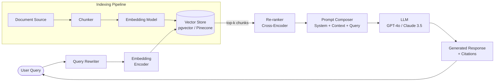

# Retrieval-Augmented Generation (RAG)

## Category

AI / LLM Integration — Knowledge Grounding

## Context

RAG extends an LLM's knowledge by retrieving relevant documents from an external store at query time and injecting them into the prompt context window. It bridges the gap between a model's static training cut-off and live, proprietary, or high-precision data—without the cost of fine-tuning.

### RAG Variants

| Variant | Retrieval Stage | Best For |
|---------|----------------|----------|
| **Naive RAG** | Single vector-search pass | Quick prototypes |
| **Advanced RAG** | Pre-retrieval query rewrite + post-retrieval re-ranking | Production Q&A systems |
| **Modular RAG** | Pluggable routing, fusion, iterative retrieval | Complex multi-source pipelines |
| **Graph RAG** | Knowledge graph traversal + vector search | Relational / entity-heavy domains |
| **Agentic RAG** | Agent decides when/what to retrieve | Multi-step reasoning tasks |

### When to Use RAG vs Fine-tuning

| Criteria | RAG | Fine-tuning |
|----------|-----|-------------|
| Data freshness | Real-time | Static (re-train required) |
| Cost | Low (inference only) | High (GPU training) |
| Private data injection | Excellent | Risk of leakage |
| Style / tone adaptation | Weak | Strong |
| Interpretability | High (citations) | Low |

## Pros

- Grounds responses in verifiable, citable sources — reduces hallucination
- No model retraining required; knowledge updates are instant
- Incremental indexing scales to millions of documents
- Provider-agnostic — works with any LLM (OpenAI, Anthropic, local models)
- Supports access-control at retrieval layer (filter by user permissions)

## Cons

- Retrieval quality is the ceiling of answer quality — GIGO applies
- Increases latency by one round-trip (embeddings + vector search)
- Chunk size and overlap sensitivity require careful tuning
- Long-context windows reduce but do not eliminate the need for re-ranking
- Costs accumulate: embedding calls + vector DB storage + LLM tokens

## Design Diagram



## Code Sample

### TypeScript — RAG pipeline with OpenAI + pgvector

```typescript
import OpenAI from 'openai';
import { Pool } from 'pg';

const openai = new OpenAI(); // uses OPENAI_API_KEY env var
const pool = new Pool({ connectionString: process.env.DATABASE_URL });

interface Chunk {
  id: string;
  content: string;
  similarity: number;
}

async function embed(text: string): Promise<number[]> {
  const response = await openai.embeddings.create({
    model: 'text-embedding-3-small',
    input: text,
  });
  return response.data[0].embedding;
}

async function retrieveChunks(query: string, topK = 5): Promise<Chunk[]> {
  const vector = await embed(query);
  const vectorLiteral = `[${vector.join(',')}]`;

  const { rows } = await pool.query<Chunk>(
    `SELECT id, content,
            1 - (embedding <=> $1::vector) AS similarity
     FROM document_chunks
     WHERE 1 - (embedding <=> $1::vector) > 0.75
     ORDER BY embedding <=> $1::vector
     LIMIT $2`,
    [vectorLiteral, topK],
  );
  return rows;
}

async function rewriteQuery(original: string): Promise<string> {
  const res = await openai.chat.completions.create({
    model: 'gpt-4o-mini',
    messages: [
      {
        role: 'system',
        content:
          'You are a query optimiser. Rewrite the user query to maximise semantic-search recall. Output only the rewritten query.',
      },
      { role: 'user', content: original },
    ],
    max_tokens: 128,
  });
  return res.choices[0].message.content ?? original;
}

export async function ragQuery(userQuery: string): Promise<string> {
  // 1. Rewrite for better recall
  const rewritten = await rewriteQuery(userQuery);

  // 2. Retrieve grounding chunks
  const chunks = await retrieveChunks(rewritten);
  if (chunks.length === 0) {
    return 'I could not find relevant information to answer your question.';
  }

  // 3. Compose prompt with retrieved context
  const context = chunks
    .map((c, i) => `[${i + 1}] ${c.content}`)
    .join('\n\n');

  const response = await openai.chat.completions.create({
    model: 'gpt-4o',
    messages: [
      {
        role: 'system',
        content: `You are a helpful assistant. Answer using ONLY the provided context.
Always cite sources using [1], [2] notation.
If the context is insufficient, say so.

CONTEXT:
${context}`,
      },
      { role: 'user', content: userQuery },
    ],
    temperature: 0.2,
    max_tokens: 1024,
  });

  return response.choices[0].message.content ?? '';
}
```

### TypeScript — Document indexing pipeline

```typescript
import OpenAI from 'openai';
import { Pool } from 'pg';

const openai = new OpenAI();
const pool = new Pool({ connectionString: process.env.DATABASE_URL });

interface Document {
  id: string;
  title: string;
  content: string;
  sourceUrl: string;
}

function chunkText(text: string, chunkSize = 512, overlap = 64): string[] {
  const words = text.split(/\s+/);
  const chunks: string[] = [];
  let i = 0;
  while (i < words.length) {
    chunks.push(words.slice(i, i + chunkSize).join(' '));
    i += chunkSize - overlap;
  }
  return chunks;
}

export async function indexDocument(doc: Document): Promise<void> {
  const chunks = chunkText(doc.content);

  // Batch embed (max 2048 input items per request)
  const embedResponse = await openai.embeddings.create({
    model: 'text-embedding-3-small',
    input: chunks,
  });

  const client = await pool.connect();
  try {
    await client.query('BEGIN');

    // Delete existing chunks for this document (idempotent re-index)
    await client.query('DELETE FROM document_chunks WHERE document_id = $1', [doc.id]);

    for (let idx = 0; idx < chunks.length; idx++) {
      const embedding = embedResponse.data[idx].embedding;
      const vectorLiteral = `[${embedding.join(',')}]`;

      await client.query(
        `INSERT INTO document_chunks (document_id, chunk_index, content, source_url, embedding)
         VALUES ($1, $2, $3, $4, $5::vector)`,
        [doc.id, idx, chunks[idx], doc.sourceUrl, vectorLiteral],
      );
    }

    await client.query('COMMIT');
  } catch (err) {
    await client.query('ROLLBACK');
    throw err;
  } finally {
    client.release();
  }
}
```

### SQL — pgvector schema

```sql
CREATE EXTENSION IF NOT EXISTS vector;

CREATE TABLE document_chunks (
  id           UUID PRIMARY KEY DEFAULT gen_random_uuid(),
  document_id  TEXT NOT NULL,
  chunk_index  INTEGER NOT NULL,
  content      TEXT NOT NULL,
  source_url   TEXT,
  embedding    VECTOR(1536),           -- text-embedding-3-small dimension
  created_at   TIMESTAMPTZ DEFAULT NOW()
);

-- HNSW index for fast ANN search
CREATE INDEX idx_chunks_embedding_hnsw
  ON document_chunks
  USING hnsw (embedding vector_cosine_ops)
  WITH (m = 16, ef_construction = 64);

CREATE INDEX idx_chunks_document_id ON document_chunks (document_id);
```
