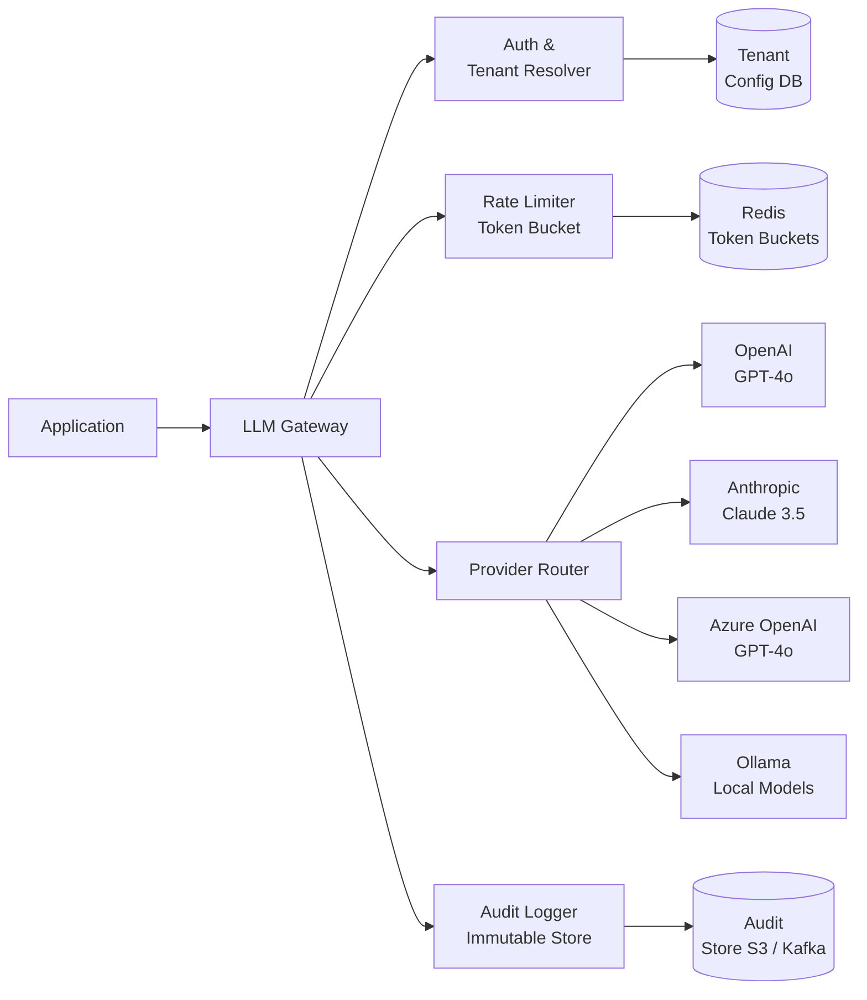

# LLM Gateway & Provider Abstraction

## Category

AI / LLM Integration — Infrastructure & Resilience

## Context

An LLM Gateway sits between your application and one or more AI provider APIs (OpenAI, Anthropic, Azure OpenAI, Cohere, local Ollama). It centralises cross-cutting concerns—authentication, rate-limit management, provider failover, cost tracking, and audit logging—so application code remains provider-agnostic.

### Gateway Responsibilities

| Concern | Without Gateway | With Gateway |
|---------|----------------|-------------|
| Provider failover | Manual per-service logic | Automatic fallback chain |
| Cost attribution | Scattered SDK calls | Centralised token metering |
| Rate limit handling | Ad-hoc retry logic | Shared token-bucket per tenant |
| Audit & compliance | None | Immutable request/response log |
| A/B provider testing | Requires code deploy | Config-driven routing rules |
| PII redaction | Per-team responsibility | Gateway middleware enforces |

### Routing Strategies

| Strategy | Use Case |
|----------|----------|
| **Primary + Fallback** | High availability — failover on error or latency spike |
| **Least-cost routing** | Route cheap prompts to cheaper model tier |
| **Latency-based** | Pin low-latency SLA to fastest provider |
| **Model-specific** | Route code tasks to Codex, chat to GPT-4o |
| **A/B weighted** | Gradually shift traffic between providers |

## Pros

- Application code is model-agnostic — swap providers with zero code changes
- Single control plane for billing, rate limits, and quota enforcement
- Automatic retries with exponential back-off reduce provider 429 errors
- Centralised PII scrubbing and audit trail simplify compliance
- Supports hybrid routing: cloud + on-premises (Ollama) for data-residency

## Cons

- Adds one extra network hop (increase latency by 2–10 ms)
- Gateway becomes a critical dependency — must be highly available
- Complex to implement streaming (SSE pass-through) correctly
- Operational overhead: gateway itself needs monitoring and rate-limit tuning

## Design Diagram



## Code Sample

### TypeScript — LLM Gateway with provider failover

```typescript
import OpenAI from 'openai';
import Anthropic from '@anthropic-ai/sdk';

interface CompletionRequest {
  messages: Array<{ role: 'user' | 'assistant' | 'system'; content: string }>;
  maxTokens?: number;
  temperature?: number;
  tenantId: string;
}

interface CompletionResponse {
  content: string;
  provider: string;
  inputTokens: number;
  outputTokens: number;
  latencyMs: number;
}

interface ProviderAdapter {
  name: string;
  complete(req: CompletionRequest): Promise<CompletionResponse>;
}

// ── OpenAI Adapter ──────────────────────────────────────────────────────────
class OpenAIAdapter implements ProviderAdapter {
  name = 'openai';
  private client = new OpenAI({ apiKey: process.env.OPENAI_API_KEY });

  async complete(req: CompletionRequest): Promise<CompletionResponse> {
    const start = Date.now();
    const res = await this.client.chat.completions.create({
      model: 'gpt-4o',
      messages: req.messages,
      max_tokens: req.maxTokens ?? 1024,
      temperature: req.temperature ?? 0.7,
    });
    return {
      content: res.choices[0].message.content ?? '',
      provider: this.name,
      inputTokens: res.usage?.prompt_tokens ?? 0,
      outputTokens: res.usage?.completion_tokens ?? 0,
      latencyMs: Date.now() - start,
    };
  }
}

// ── Anthropic Adapter ───────────────────────────────────────────────────────
class AnthropicAdapter implements ProviderAdapter {
  name = 'anthropic';
  private client = new Anthropic({ apiKey: process.env.ANTHROPIC_API_KEY });

  async complete(req: CompletionRequest): Promise<CompletionResponse> {
    const start = Date.now();
    const systemMsg = req.messages.find((m) => m.role === 'system')?.content;
    const userMessages = req.messages.filter((m) => m.role !== 'system');

    const res = await this.client.messages.create({
      model: 'claude-3-5-sonnet-20241022',
      max_tokens: req.maxTokens ?? 1024,
      system: systemMsg,
      messages: userMessages as Anthropic.MessageParam[],
    });

    const textBlock = res.content.find((b) => b.type === 'text');
    return {
      content: textBlock?.type === 'text' ? textBlock.text : '',
      provider: this.name,
      inputTokens: res.usage.input_tokens,
      outputTokens: res.usage.output_tokens,
      latencyMs: Date.now() - start,
    };
  }
}

// ── Gateway ─────────────────────────────────────────────────────────────────
interface GatewayOptions {
  providers: ProviderAdapter[];
  maxRetries?: number;
  auditLog?: (entry: AuditEntry) => Promise<void>;
}

interface AuditEntry {
  tenantId: string;
  provider: string;
  inputTokens: number;
  outputTokens: number;
  latencyMs: number;
  error?: string;
  timestamp: string;
}

export class LLMGateway {
  private providers: ProviderAdapter[];
  private maxRetries: number;
  private auditLog: (entry: AuditEntry) => Promise<void>;

  constructor({ providers, maxRetries = 2, auditLog = async () => {} }: GatewayOptions) {
    this.providers = providers;
    this.maxRetries = maxRetries;
    this.auditLog = auditLog;
  }

  async complete(req: CompletionRequest): Promise<CompletionResponse> {
    let lastError: Error | undefined;

    for (const provider of this.providers) {
      for (let attempt = 0; attempt <= this.maxRetries; attempt++) {
        try {
          const result = await provider.complete(req);

          await this.auditLog({
            tenantId: req.tenantId,
            provider: result.provider,
            inputTokens: result.inputTokens,
            outputTokens: result.outputTokens,
            latencyMs: result.latencyMs,
            timestamp: new Date().toISOString(),
          });

          return result;
        } catch (err) {
          lastError = err as Error;
          const isRateLimit = lastError.message.includes('429') || lastError.message.includes('rate');

          if (isRateLimit && attempt < this.maxRetries) {
            // Exponential back-off: 1s, 2s, 4s
            await sleep(1000 * 2 ** attempt);
            continue;
          }

          // Non-rate-limit error → try next provider
          await this.auditLog({
            tenantId: req.tenantId,
            provider: provider.name,
            inputTokens: 0,
            outputTokens: 0,
            latencyMs: 0,
            error: lastError.message,
            timestamp: new Date().toISOString(),
          });
          break;
        }
      }
    }

    throw new Error(`All providers exhausted. Last error: ${lastError?.message}`);
  }
}

function sleep(ms: number): Promise<void> {
  return new Promise((resolve) => setTimeout(resolve, ms));
}

// ── Usage ───────────────────────────────────────────────────────────────────
export const gateway = new LLMGateway({
  providers: [new OpenAIAdapter(), new AnthropicAdapter()],
  maxRetries: 2,
  auditLog: async (entry) => {
    // Persist to your audit store (Kafka, S3, DB)
    console.log('[audit]', JSON.stringify(entry));
  },
});
```

### TypeScript — Token-bucket rate limiter per tenant (Redis)

```typescript
import { createClient } from 'redis';

const redis = createClient({ url: process.env.REDIS_URL });
await redis.connect();

interface RateLimitConfig {
  tokensPerMinute: number; // max tokens allowed per tenant per minute
}

const TENANT_CONFIG: Record<string, RateLimitConfig> = {
  'tenant-free': { tokensPerMinute: 40_000 },
  'tenant-pro': { tokensPerMinute: 200_000 },
};

export async function checkTokenBudget(
  tenantId: string,
  tokensNeeded: number,
): Promise<void> {
  const config = TENANT_CONFIG[tenantId] ?? { tokensPerMinute: 10_000 };
  const key = `llm:budget:${tenantId}:${minuteBucket()}`;

  const used = await redis.incrBy(key, tokensNeeded);
  if (used === tokensNeeded) {
    // First call in this window — set TTL
    await redis.expire(key, 60);
  }

  if (used > config.tokensPerMinute) {
    throw new Error(`Rate limit exceeded for tenant ${tenantId}. Retry after next minute.`);
  }
}

function minuteBucket(): string {
  return new Date().toISOString().slice(0, 16); // "2026-03-24T14:05"
}
```

### YAML — LiteLLM proxy configuration (open-source gateway)

```yaml
# litellm_config.yaml
model_list:
  - model_name: gpt-4o
    litellm_params:
      model: openai/gpt-4o
      api_key: os.environ/OPENAI_API_KEY

  - model_name: claude-3-5-sonnet
    litellm_params:
      model: anthropic/claude-3-5-sonnet-20241022
      api_key: os.environ/ANTHROPIC_API_KEY

  - model_name: azure-gpt-4o
    litellm_params:
      model: azure/gpt-4o
      api_base: os.environ/AZURE_OPENAI_ENDPOINT
      api_key: os.environ/AZURE_OPENAI_API_KEY
      api_version: "2024-10-21"

router_settings:
  routing_strategy: least-busy
  num_retries: 2
  allowed_fails: 1
  cooldown_time: 30       # seconds a provider is cooled down after failure
  retry_after: 5

general_settings:
  master_key: os.environ/LITELLM_MASTER_KEY
  database_url: os.environ/DATABASE_URL  # Postgres for usage tracking
```
