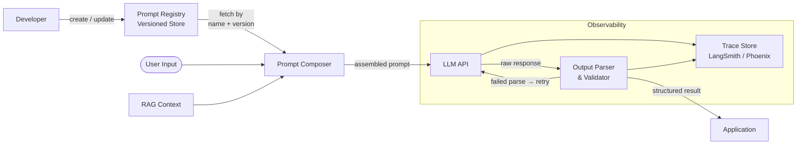

# Prompt Engineering & Management

## Category

AI / LLM Integration — Quality & Reliability

## Context

Prompt engineering is the practice of structuring inputs to LLMs to achieve reliable, high-quality outputs. At scale, ad-hoc prompt strings embedded in code become unmanageable—prompt management adds versioning, templating, A/B testing and centralised storage so prompts can evolve independently of application deployments.

### Core Prompting Techniques

| Technique | Description | Best For |
|-----------|-------------|----------|
| **Zero-shot** | Instruction only, no examples | Simple classification / Q&A |
| **Few-shot** | 2–8 input/output examples in prompt | Format adherence, tone matching |
| **Chain-of-Thought (CoT)** | "Think step by step" instruction | Multi-step reasoning, maths |
| **Self-consistency** | Sample multiple CoT paths, majority vote | High-accuracy tasks |
| **ReAct** | Interleaved Reasoning + Acting (tool calls) | Agents with external tools |
| **Tree of Thoughts** | Explore multiple reasoning branches | Complex planning |
| **Meta-prompting** | LLM writes its own prompt | Dynamic task generation |

### Prompt Composition Layers

| Layer | Responsibility | Owner |
|-------|---------------|-------|
| **System prompt** | Persona, constraints, output format | Product / AI team |
| **Context injection** | RAG chunks, user history | Pipeline code |
| **Few-shot block** | Gold-standard examples | Data / QA team |
| **User turn** | Actual user message | End user |
| **Output parser** | Parse and validate LLM response | Application code |

## Pros

- Structured prompts dramatically improve output consistency and format adherence
- Versioned templates allow rollback when a model update breaks behaviour
- A/B testing prompts without code deploys speeds up iteration cycles
- Centralised registry enables reuse across multiple services or teams
- Few-shot examples can match fine-tuned model quality for many tasks

## Cons

- Prompts consume tokens — elaborate few-shot blocks increase cost and latency
- Prompt sensitivity: small wording changes produce outsized output differences
- Template injection risk if user input is not safely interpolated
- Model-specific prompts may not transfer across providers
- Managing hundreds of versioned prompts adds governance overhead

## Design Diagram



## Code Sample

### TypeScript — Prompt template engine with variable injection

```typescript
interface PromptVariable {
  [key: string]: string | number | boolean;
}

interface PromptTemplate {
  id: string;
  version: string;
  systemPrompt: string;
  userPromptTemplate: string;
  fewShotExamples?: Array<{ input: string; output: string }>;
}

export class PromptComposer {
  private templates = new Map<string, PromptTemplate>();

  register(template: PromptTemplate): void {
    this.templates.set(`${template.id}@${template.version}`, template);
  }

  compose(
    templateId: string,
    version: string,
    variables: PromptVariable,
    ragContext?: string,
  ): Array<{ role: 'system' | 'user' | 'assistant'; content: string }> {
    const key = `${templateId}@${version}`;
    const template = this.templates.get(key);
    if (!template) throw new Error(`Prompt template not found: ${key}`);

    // Safely interpolate — reject any variable containing {{ or }} to prevent injection
    for (const [k, v] of Object.entries(variables)) {
      if (typeof v === 'string' && /\{\{|\}\}/.test(v)) {
        throw new Error(`Potential prompt injection in variable: ${k}`);
      }
    }

    const userContent = template.userPromptTemplate.replace(
      /\{\{(\w+)\}\}/g,
      (_, key: string) => String(variables[key] ?? ''),
    );

    const systemWithContext = ragContext
      ? `${template.systemPrompt}\n\nCONTEXT:\n${ragContext}`
      : template.systemPrompt;

    const messages: Array<{ role: 'system' | 'user' | 'assistant'; content: string }> = [
      { role: 'system', content: systemWithContext },
    ];

    // Inject few-shot examples
    for (const example of template.fewShotExamples ?? []) {
      messages.push({ role: 'user', content: example.input });
      messages.push({ role: 'assistant', content: example.output });
    }

    messages.push({ role: 'user', content: userContent });

    return messages;
  }
}

// ── Prompt registry (example templates) ────────────────────────────────────

export const composer = new PromptComposer();

composer.register({
  id: 'payment-classifier',
  version: '1.2.0',
  systemPrompt: `You are a financial transaction classifier.
Classify transactions into exactly one of: [SALARY, RENT, GROCERIES, UTILITIES, ENTERTAINMENT, TRANSFER, OTHER].
Respond with JSON: {"category": "<category>", "confidence": <0-1>, "reason": "<one sentence>"}.`,
  userPromptTemplate: `Classify this transaction:
Amount: {{amount}} {{currency}}
Merchant: {{merchant}}
Description: {{description}}`,
  fewShotExamples: [
    {
      input: 'Amount: 2500 EUR\nMerchant: EMPLOYER_XYZ\nDescription: Monthly salary',
      output: '{"category":"SALARY","confidence":0.99,"reason":"Regular monthly payment from employer."}',
    },
    {
      input: 'Amount: 850 EUR\nMerchant: LANDLORD_PROP\nDescription: RENT APRIL',
      output: '{"category":"RENT","confidence":0.97,"reason":"Monthly rent payment to landlord."}',
    },
  ],
});
```

### TypeScript — Output parser with retry on malformed JSON

```typescript
import OpenAI from 'openai';
import { z } from 'zod';

const openai = new OpenAI();

const ClassificationSchema = z.object({
  category: z.enum(['SALARY', 'RENT', 'GROCERIES', 'UTILITIES', 'ENTERTAINMENT', 'TRANSFER', 'OTHER']),
  confidence: z.number().min(0).max(1),
  reason: z.string().max(200),
});

type Classification = z.infer<typeof ClassificationSchema>;

export async function classifyTransaction(
  messages: Array<{ role: 'system' | 'user' | 'assistant'; content: string }>,
  maxRetries = 2,
): Promise<Classification> {
  for (let attempt = 0; attempt <= maxRetries; attempt++) {
    const response = await openai.chat.completions.create({
      model: 'gpt-4o-mini',
      messages,
      temperature: 0.1,
      response_format: { type: 'json_object' },
    });

    const raw = response.choices[0].message.content ?? '';

    const parsed = ClassificationSchema.safeParse(JSON.parse(raw));
    if (parsed.success) return parsed.data;

    if (attempt < maxRetries) {
      // Append error feedback for self-correction
      messages = [
        ...messages,
        { role: 'assistant', content: raw },
        {
          role: 'user',
          content: `Your response failed validation: ${JSON.stringify(parsed.error.errors)}. Please correct and return valid JSON.`,
        },
      ];
    }
  }

  throw new Error('Failed to parse LLM output after retries');
}
```

### YAML — Prompt registry schema (PromptLayer / LangSmith compatible)

```yaml
# prompts/payment-classifier/v1.2.0.yaml
id: payment-classifier
version: "1.2.0"
description: "Classify financial transactions into standard categories"
model_hint: gpt-4o-mini
temperature: 0.1
response_format: json_object

system_prompt: |
  You are a financial transaction classifier.
  Classify transactions into exactly one of:
  [SALARY, RENT, GROCERIES, UTILITIES, ENTERTAINMENT, TRANSFER, OTHER].
  Respond with JSON: {"category": "<category>", "confidence": <0-1>, "reason": "<one sentence>"}.

user_prompt_template: |
  Classify this transaction:
  Amount: {{amount}} {{currency}}
  Merchant: {{merchant}}
  Description: {{description}}

few_shot_examples:
  - input: "Amount: 2500 EUR\nMerchant: EMPLOYER_XYZ\nDescription: Monthly salary"
    output: '{"category":"SALARY","confidence":0.99,"reason":"Regular monthly payment from employer."}'
  - input: "Amount: 850 EUR\nMerchant: LANDLORD_PROP\nDescription: RENT APRIL"
    output: '{"category":"RENT","confidence":0.97,"reason":"Monthly rent payment to landlord."}'

metadata:
  owner: ai-platform-team
  reviewed_by: compliance@example.com
  last_tested: "2026-03-01"
  eval_score: 0.94
```
