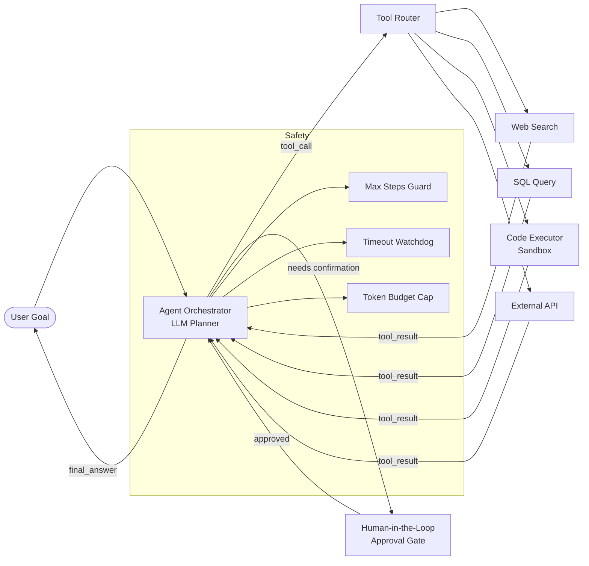

# AI Agents & Tool Use

## Category

AI / LLM Integration — Agentic Systems

## Context

AI Agents extend LLMs beyond single-turn question-answering by enabling them to reason across multiple steps, call external tools (APIs, databases, code executors), and plan towards a goal autonomously. The LLM acts as a decision engine while tools provide grounding in the real world.

### Agent Architectures

| Architecture | Loop Style | Best For |
|-------------|------------|----------|
| **ReAct** | Reason → Act → Observe loop | Simple tool-use tasks |
| **Plan & Execute** | Plan full steps, then execute | Long-horizon deterministic workflows |
| **Reflexion** | Self-critique and retry | High-accuracy tasks with feedback |
| **LangGraph** | Stateful DAG of nodes | Complex multi-agent workflows |
| **Multi-agent (supervisor)** | Orchestrator + specialist agents | Parallelisable sub-tasks |
| **AutoGen** | Conversational multi-agent | Iterative code generation |

### Tool Categories

| Category | Examples |
|----------|---------|
| **Search & retrieval** | Web search, vector DB query, SQL |
| **Code execution** | Python REPL, JS sandbox |
| **External APIs** | Payment processing, CRM, calendars |
| **File I/O** | Read/write files, parse PDFs |
| **Computation** | Calculator, date maths, unit conversion |
| **Communication** | Send email, Slack, webhook |

## Pros

- Enables LLMs to handle tasks requiring real-time data, computation, and actions
- Modular toolset — add tools without retraining the model
- Multi-agent parallelism speeds up complex workflows like report generation
- Human-in-the-loop checkpoints provide safety before irreversible actions
- Agents naturally decompose complex goals into auditable sub-steps

## Cons

- Non-deterministic — identical inputs can produce different tool-call sequences
- Difficult to test and debug due to emergent multi-step behaviour
- Runaway loops possible without max-step guards and timeouts
- Tool errors can cascade — agents may hallucinate recovery strategies
- Cost can spike on long-running agent loops with many LLM calls

## Design Diagram



## Code Sample

### TypeScript — ReAct agent with tool-use (OpenAI function calling)

```typescript
import OpenAI from 'openai';

const openai = new OpenAI();

// ── Tool Definitions ────────────────────────────────────────────────────────
const tools: OpenAI.Chat.ChatCompletionTool[] = [
  {
    type: 'function',
    function: {
      name: 'search_knowledge_base',
      description: 'Search internal knowledge base for information on a topic',
      parameters: {
        type: 'object',
        properties: {
          query: { type: 'string', description: 'Search query' },
          limit: { type: 'number', description: 'Max results (default 5)', default: 5 },
        },
        required: ['query'],
      },
    },
  },
  {
    type: 'function',
    function: {
      name: 'execute_sql',
      description: 'Execute a read-only SQL query against the payments database',
      parameters: {
        type: 'object',
        properties: {
          query: { type: 'string', description: 'Valid read-only SQL SELECT query' },
        },
        required: ['query'],
      },
    },
  },
  {
    type: 'function',
    function: {
      name: 'send_notification',
      description: 'Send a notification to a user by email or Slack',
      parameters: {
        type: 'object',
        properties: {
          recipient: { type: 'string' },
          message: { type: 'string' },
          channel: { type: 'string', enum: ['email', 'slack'] },
        },
        required: ['recipient', 'message', 'channel'],
      },
    },
  },
];

// ── Tool Executor ────────────────────────────────────────────────────────────
async function executeTool(name: string, args: Record<string, unknown>): Promise<string> {
  switch (name) {
    case 'search_knowledge_base': {
      // Stub — replace with real vector search
      return JSON.stringify([{ id: '1', snippet: `Results for: ${args.query}` }]);
    }
    case 'execute_sql': {
      const query = String(args.query);
      // Safety: block non-SELECT queries
      if (!/^\s*SELECT/i.test(query)) {
        return JSON.stringify({ error: 'Only SELECT queries are permitted.' });
      }
      // Stub — replace with real DB call
      return JSON.stringify({ rows: [], rowCount: 0 });
    }
    case 'send_notification': {
      // Stub — replace with real notification service
      console.log(`[notify] ${args.channel} → ${args.recipient}: ${args.message}`);
      return JSON.stringify({ sent: true });
    }
    default:
      return JSON.stringify({ error: `Unknown tool: ${name}` });
  }
}

// ── Agent Loop ───────────────────────────────────────────────────────────────
export async function runAgent(goal: string, maxSteps = 10): Promise<string> {
  const messages: OpenAI.Chat.ChatCompletionMessageParam[] = [
    {
      role: 'system',
      content: `You are a helpful financial assistant with access to tools.
Think step by step. Use tools to gather information before answering.
Never guess data that should come from tools. Always verify with a tool call first.`,
    },
    { role: 'user', content: goal },
  ];

  for (let step = 0; step < maxSteps; step++) {
    const response = await openai.chat.completions.create({
      model: 'gpt-4o',
      messages,
      tools,
      tool_choice: 'auto',
    });

    const choice = response.choices[0];
    messages.push(choice.message);

    // Agent decided it has enough information
    if (choice.finish_reason === 'stop') {
      return choice.message.content ?? '';
    }

    // Process tool calls
    if (choice.finish_reason === 'tool_calls' && choice.message.tool_calls) {
      for (const toolCall of choice.message.tool_calls) {
        const args = JSON.parse(toolCall.function.arguments) as Record<string, unknown>;
        const result = await executeTool(toolCall.function.name, args);

        messages.push({
          role: 'tool',
          tool_call_id: toolCall.id,
          content: result,
        });
      }
      continue;
    }

    break;
  }

  throw new Error(`Agent did not converge within ${maxSteps} steps`);
}
```

### TypeScript — Multi-agent supervisor with LangGraph-style state machine

```typescript
import OpenAI from 'openai';

const openai = new OpenAI();

interface AgentState {
  goal: string;
  subTasks: string[];
  results: Record<string, string>;
  finalAnswer: string | null;
}

// Specialist agents (simplified — each has a focused system prompt + toolset)
async function researchAgent(query: string): Promise<string> {
  const res = await openai.chat.completions.create({
    model: 'gpt-4o-mini',
    messages: [
      { role: 'system', content: 'You are a research specialist. Summarise findings concisely.' },
      { role: 'user', content: query },
    ],
  });
  return res.choices[0].message.content ?? '';
}

async function analyzerAgent(data: string): Promise<string> {
  const res = await openai.chat.completions.create({
    model: 'gpt-4o-mini',
    messages: [
      { role: 'system', content: 'You are a data analyst. Identify key insights and anomalies.' },
      { role: 'user', content: data },
    ],
  });
  return res.choices[0].message.content ?? '';
}

async function writerAgent(analysis: string, goal: string): Promise<string> {
  const res = await openai.chat.completions.create({
    model: 'gpt-4o',
    messages: [
      { role: 'system', content: 'You are a professional writer. Produce clear, concise reports.' },
      { role: 'user', content: `Goal: ${goal}\n\nAnalysis:\n${analysis}\n\nWrite the final report.` },
    ],
  });
  return res.choices[0].message.content ?? '';
}

export async function supervisorAgent(goal: string): Promise<string> {
  const state: AgentState = { goal, subTasks: [], results: {}, finalAnswer: null };

  // Step 1: Research
  state.results.research = await researchAgent(goal);

  // Step 2: Analyse (parallel or sequential based on dependency)
  state.results.analysis = await analyzerAgent(state.results.research);

  // Step 3: Write report
  state.finalAnswer = await writerAgent(state.results.analysis, goal);

  return state.finalAnswer;
}
```
