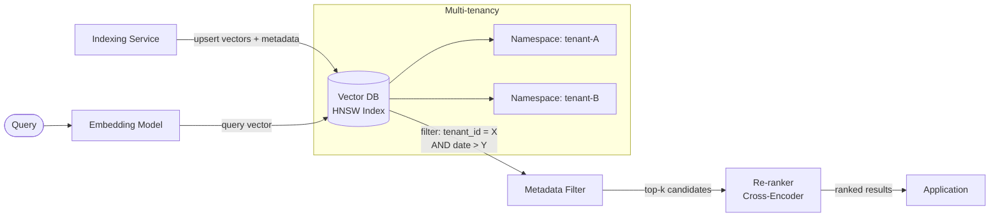

# Vector Databases

## Category

AI / LLM Integration — Storage & Retrieval

## Context

Vector databases store high-dimensional numeric embeddings and support approximate nearest-neighbour (ANN) search. They are the storage backbone of RAG systems, semantic search, recommendation engines, and duplicate detection at scale.

### Vector DB Comparison

| Database | Hosting | Index Type | Filtering | Strengths |
|----------|---------|-----------|-----------|-----------|
| **pgvector** | Self-hosted (Postgres) | HNSW / IVFFlat | Full SQL predicates | Existing Postgres stack, ACID, joins |
| **Pinecone** | Managed cloud | Proprietary ANN | Metadata filters | Serverless, zero ops, real-time upsert |
| **Weaviate** | Self-hosted / cloud | HNSW | GraphQL filter | Multi-tenancy, hybrid BM25+vector |
| **Qdrant** | Self-hosted / cloud | HNSW | Rich payload filter | Rust performance, on-disk indexing |
| **Chroma** | Self-hosted | HNSW (hnswlib) | Metadata filter | Local dev, embedded mode |
| **Milvus** | Self-hosted / cloud | IVF, HNSW, DiskANN | Attribute filter | Billion-scale, GPU acceleration |

### Index Algorithm Trade-offs

| Algorithm | Build Speed | Query Speed | Memory | Accuracy |
|-----------|------------|------------|--------|----------|
| **HNSW** | Slow | Fast | High | Very high |
| **IVF_FLAT** | Fast | Medium | Medium | High |
| **IVF_PQ** | Medium | Fast | Low | Medium |
| **DiskANN** | Medium | Fast | Very low (disk) | High |

## Pros

- ANN search returns nearest neighbours in milliseconds even at million-vector scale
- Metadata filtering + vector search enables precise, contextually accurate retrieval
- Namespaces / collections provide logical multi-tenancy isolation
- Supports real-time upsert for live knowledge base updates
- HNSW graph indexes deliver >99% recall at sub-10ms query latency

## Cons

- Embedding dimension mismatch: switching models requires full re-indexing
- Memory-intensive — HNSW requires ~4 bytes × D × N RAM (D = dims, N = vectors)
- Approximate search: recall is never guaranteed to be 100% without exact search
- No native JOIN across vector and relational data (except pgvector)
- Operational complexity: tuning ef_construction, M, and ef_search parameters

## Design Diagram



## Code Sample

### TypeScript — Pinecone upsert and query

```typescript
import { Pinecone } from '@pinecone-database/pinecone';
import OpenAI from 'openai';

const pinecone = new Pinecone({ apiKey: process.env.PINECONE_API_KEY! });
const openai = new OpenAI();

const INDEX_NAME = 'knowledge-base';
const NAMESPACE = 'tenant-a';

interface DocumentChunk {
  id: string;
  content: string;
  sourceUrl: string;
  tenantId: string;
  createdAt: string;
}

async function embedText(text: string): Promise<number[]> {
  const res = await openai.embeddings.create({
    model: 'text-embedding-3-small',
    input: text,
  });
  return res.data[0].embedding;
}

// Upsert document chunks into Pinecone
export async function upsertChunks(chunks: DocumentChunk[]): Promise<void> {
  const index = pinecone.index(INDEX_NAME).namespace(NAMESPACE);

  // Batch embed (max 100 at a time for Pinecone)
  const batchSize = 100;
  for (let i = 0; i < chunks.length; i += batchSize) {
    const batch = chunks.slice(i, i + batchSize);

    const embeddings = await Promise.all(batch.map((c) => embedText(c.content)));

    const vectors = batch.map((chunk, idx) => ({
      id: chunk.id,
      values: embeddings[idx],
      metadata: {
        content: chunk.content.slice(0, 1000), // Pinecone metadata limit
        sourceUrl: chunk.sourceUrl,
        tenantId: chunk.tenantId,
        createdAt: chunk.createdAt,
      },
    }));

    await index.upsert(vectors);
  }
}

// Query with metadata filtering
export async function queryChunks(
  query: string,
  tenantId: string,
  topK = 5,
): Promise<Array<{ id: string; content: string; score: number }>> {
  const index = pinecone.index(INDEX_NAME).namespace(NAMESPACE);
  const queryVector = await embedText(query);

  const result = await index.query({
    vector: queryVector,
    topK,
    filter: { tenantId: { $eq: tenantId } },  // Metadata pre-filter
    includeMetadata: true,
  });

  return (result.matches ?? []).map((m) => ({
    id: m.id,
    content: String(m.metadata?.content ?? ''),
    score: m.score ?? 0,
  }));
}
```

### TypeScript — Weaviate hybrid search (BM25 + vector)

```typescript
import weaviate, { WeaviateClient } from 'weaviate-ts-client';

const client: WeaviateClient = weaviate.client({
  scheme: 'https',
  host: process.env.WEAVIATE_HOST!,
  apiKey: new weaviate.ApiKey(process.env.WEAVIATE_API_KEY!),
  headers: { 'X-OpenAI-Api-Key': process.env.OPENAI_API_KEY! },
});

interface SearchResult {
  id: string;
  content: string;
  sourceUrl: string;
  score: number;
}

export async function hybridSearch(
  query: string,
  tenantId: string,
  limit = 5,
  alpha = 0.5,  // 0 = BM25 only, 1 = vector only, 0.5 = balanced
): Promise<SearchResult[]> {
  const result = await client.graphql
    .get()
    .withClassName('DocumentChunk')
    .withHybrid({
      query,
      alpha,             // balance between keyword and semantic
      properties: ['content', 'title'],  // BM25 target fields
    })
    .withWhere({
      path: ['tenantId'],
      operator: 'Equal',
      valueText: tenantId,
    })
    .withLimit(limit)
    .withFields('content sourceUrl _additional { id score }')
    .do();

  const items = result.data?.Get?.DocumentChunk ?? [];
  return items.map((item: Record<string, unknown>) => ({
    id: String((item['_additional'] as Record<string, unknown>)?.['id'] ?? ''),
    content: String(item['content'] ?? ''),
    sourceUrl: String(item['sourceUrl'] ?? ''),
    score: Number((item['_additional'] as Record<string, unknown>)?.['score'] ?? 0),
  }));
}
```

### SQL — pgvector HNSW index and hybrid search

```sql
-- Enable vector extension
CREATE EXTENSION IF NOT EXISTS vector;

-- Schema
CREATE TABLE document_chunks (
  id          UUID PRIMARY KEY DEFAULT gen_random_uuid(),
  tenant_id   TEXT NOT NULL,
  content     TEXT NOT NULL,
  source_url  TEXT,
  embedding   VECTOR(1536),
  fts_vector  TSVECTOR GENERATED ALWAYS AS (to_tsvector('english', content)) STORED,
  created_at  TIMESTAMPTZ DEFAULT NOW()
);

-- HNSW vector index (high recall, fast query)
CREATE INDEX idx_chunks_hnsw
  ON document_chunks
  USING hnsw (embedding vector_cosine_ops)
  WITH (m = 16, ef_construction = 128);

-- Full-text search index
CREATE INDEX idx_chunks_fts ON document_chunks USING gin (fts_vector);

-- Tenant filter index
CREATE INDEX idx_chunks_tenant ON document_chunks (tenant_id);

-- Hybrid search query: combine vector similarity + BM25 rank
WITH vector_results AS (
  SELECT id,
         1 - (embedding <=> '[0.1,0.2,...]'::vector) AS vector_score
  FROM document_chunks
  WHERE tenant_id = 'tenant-a'
  ORDER BY embedding <=> '[0.1,0.2,...]'::vector
  LIMIT 20
),
bm25_results AS (
  SELECT id,
         ts_rank(fts_vector, plainto_tsquery('english', 'payment fraud detection')) AS bm25_score
  FROM document_chunks
  WHERE tenant_id = 'tenant-a'
    AND fts_vector @@ plainto_tsquery('english', 'payment fraud detection')
  LIMIT 20
)
SELECT dc.id, dc.content, dc.source_url,
       COALESCE(v.vector_score, 0) * 0.6 + COALESCE(b.bm25_score, 0) * 0.4 AS hybrid_score
FROM document_chunks dc
LEFT JOIN vector_results v USING (id)
LEFT JOIN bm25_results b USING (id)
WHERE v.id IS NOT NULL OR b.id IS NOT NULL
ORDER BY hybrid_score DESC
LIMIT 5;
```
