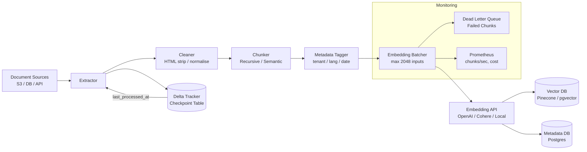

# Embedding Pipelines

## Category

AI / LLM Integration — Data Engineering for AI

## Context

Embedding pipelines convert raw text, images, or structured data into high-dimensional vector representations at scale. They are the essential pre-processing step for any vector-based system: RAG knowledge bases, semantic search indexes, recommendation engines, and clustering workloads.

### Pipeline Stages

| Stage | Purpose | Common Tools |
|-------|---------|-------------|
| **Extract** | Pull raw content from sources | S3, Postgres, web crawlers, Kafka |
| **Chunk** | Split documents into model-context-window-sized pieces | LangChain splitters, custom tokenizers |
| **Clean** | Remove boilerplate, normalise whitespace, strip HTML | BeautifulSoup, regex, pandoc |
| **Embed** | Call embedding model to get vectors | OpenAI, Cohere, HuggingFace (local) |
| **Enrich** | Add metadata (source, date, tenant, language) | Custom tagging |
| **Store** | Upsert into vector DB + metadata DB | pgvector, Pinecone, Weaviate |
| **Validate** | Verify embedding shape, non-zero norm | Unit tests + monitoring |

### Chunking Strategies

| Strategy | Description | Best For |
|----------|-------------|---------|
| **Fixed-size** | Split every N tokens | Quick prototypes |
| **Sentence** | Split on sentence boundaries | Q&A, summaries |
| **Recursive** | Try paragraph → sentence → word | General documents |
| **Semantic** | Group semantically similar sentences | High-recall RAG |
| **Hierarchical** | Parent + child chunks | Multi-hop reasoning |

## Pros

- Batch embedding is dramatically cheaper than re-embedding at query time
- Incremental pipelines re-embed only changed documents (delta processing)
- Local models (sentence-transformers) eliminate per-call embedding API costs
- Pipeline idempotency ensures safe re-runs on failures without duplication
- Metadata enrichment at index time enables powerful filter-then-retrieve patterns

## Cons

- Model version changes require full re-embedding of the entire corpus
- Token counting is model-specific — off-by-one chunking wastes context window
- Scalability challenges: embedding 1M documents with API calls requires rate-limit management
- Quality degradation with overly long or overly short chunks
- Storage costs multiply with high-dimensional embeddings across large corpora

## Design Diagram



## Code Sample

### TypeScript — Incremental embedding pipeline with checkpoint

```typescript
import OpenAI from 'openai';
import { Pool } from 'pg';

const openai = new OpenAI();
const pool = new Pool({ connectionString: process.env.DATABASE_URL });

interface RawDocument {
  id: string;
  content: string;
  sourceUrl: string;
  tenantId: string;
  updatedAt: Date;
}

// ── Chunking ─────────────────────────────────────────────────────────────────
function chunkByTokenEstimate(
  text: string,
  maxTokens = 400,
  overlapTokens = 50,
): string[] {
  // Approximate: 1 token ≈ 4 characters for English
  const chunkSize = maxTokens * 4;
  const overlapSize = overlapTokens * 4;
  const chunks: string[] = [];
  let start = 0;

  while (start < text.length) {
    // Try to break at a sentence boundary
    let end = Math.min(start + chunkSize, text.length);
    if (end < text.length) {
      const sentenceEnd = text.lastIndexOf('. ', end);
      if (sentenceEnd > start + chunkSize / 2) end = sentenceEnd + 2;
    }
    chunks.push(text.slice(start, end).trim());
    start = end - overlapSize;
  }

  return chunks.filter((c) => c.length > 20);
}

// ── Batch embedder (rate-aware) ───────────────────────────────────────────────
const EMBED_BATCH_SIZE = 512; // OpenAI max input items
const RATE_LIMIT_PAUSE_MS = 200; // pause between batches

async function batchEmbed(texts: string[]): Promise<number[][]> {
  const vectors: number[][] = [];

  for (let i = 0; i < texts.length; i += EMBED_BATCH_SIZE) {
    const batch = texts.slice(i, i + EMBED_BATCH_SIZE);
    const res = await openai.embeddings.create({
      model: 'text-embedding-3-small',
      input: batch,
    });
    vectors.push(...res.data.map((d) => d.embedding));

    if (i + EMBED_BATCH_SIZE < texts.length) {
      await new Promise((r) => setTimeout(r, RATE_LIMIT_PAUSE_MS));
    }
  }

  return vectors;
}

// ── Checkpoint management ────────────────────────────────────────────────────
async function getCheckpoint(pipelineId: string): Promise<Date> {
  const { rows } = await pool.query<{ last_processed_at: Date }>(
    `SELECT last_processed_at FROM embedding_checkpoints WHERE pipeline_id = $1`,
    [pipelineId],
  );
  return rows[0]?.last_processed_at ?? new Date(0);
}

async function saveCheckpoint(pipelineId: string, processedAt: Date): Promise<void> {
  await pool.query(
    `INSERT INTO embedding_checkpoints (pipeline_id, last_processed_at)
     VALUES ($1, $2)
     ON CONFLICT (pipeline_id) DO UPDATE SET last_processed_at = EXCLUDED.last_processed_at`,
    [pipelineId, processedAt],
  );
}

// ── Main pipeline ─────────────────────────────────────────────────────────────
export async function runEmbeddingPipeline(pipelineId = 'default'): Promise<void> {
  const since = await getCheckpoint(pipelineId);
  console.log(`[pipeline] Processing documents since ${since.toISOString()}`);

  const { rows: docs } = await pool.query<RawDocument>(
    `SELECT id, content, source_url, tenant_id, updated_at
     FROM raw_documents
     WHERE updated_at > $1
     ORDER BY updated_at ASC
     LIMIT 1000`,
    [since],
  );

  if (docs.length === 0) {
    console.log('[pipeline] No new documents to process');
    return;
  }

  let latestDate = since;
  const client = await pool.connect();

  try {
    for (const doc of docs) {
      const chunks = chunkByTokenEstimate(doc.content);
      const vectors = await batchEmbed(chunks);

      await client.query('BEGIN');

      // Delete old chunks for this document (idempotent)
      await client.query('DELETE FROM document_chunks WHERE document_id = $1', [doc.id]);

      for (let i = 0; i < chunks.length; i++) {
        const vectorLiteral = `[${vectors[i].join(',')}]`;
        await client.query(
          `INSERT INTO document_chunks
             (document_id, chunk_index, content, source_url, tenant_id, embedding)
           VALUES ($1, $2, $3, $4, $5, $6::vector)`,
          [doc.id, i, chunks[i], doc.sourceUrl, doc.tenantId, vectorLiteral],
        );
      }

      await client.query('COMMIT');

      if (doc.updatedAt > latestDate) latestDate = doc.updatedAt;
    }

    await saveCheckpoint(pipelineId, latestDate);
    console.log(`[pipeline] Embedded ${docs.length} documents, ${latestDate.toISOString()}`);
  } catch (err) {
    await client.query('ROLLBACK');
    throw err;
  } finally {
    client.release();
  }
}
```

### Python — Sentence-transformer local embedding pipeline (zero API cost)

```python
from sentence_transformers import SentenceTransformer
import psycopg2
import numpy as np
from datetime import datetime

model = SentenceTransformer("BAAI/bge-small-en-v1.5")  # 33M params, runs on CPU


def chunk_text(text: str, max_chars: int = 1600, overlap: int = 200) -> list[str]:
    chunks = []
    start = 0
    while start < len(text):
        end = min(start + max_chars, len(text))
        # Break at sentence boundary
        if end < len(text):
            boundary = text.rfind(". ", start, end)
            if boundary > start + max_chars // 2:
                end = boundary + 2
        chunks.append(text[start:end].strip())
        start = end - overlap
    return [c for c in chunks if len(c) > 30]


def embed_and_store(doc_id: str, content: str, source_url: str, conn_str: str) -> None:
    chunks = chunk_text(content)

    # Local embedding — no API call, no cost, no rate limits
    embeddings: np.ndarray = model.encode(chunks, batch_size=64, normalize_embeddings=True)

    with psycopg2.connect(conn_str) as conn, conn.cursor() as cur:
        cur.execute("DELETE FROM document_chunks WHERE document_id = %s", (doc_id,))

        for idx, (chunk, vec) in enumerate(zip(chunks, embeddings)):
            cur.execute(
                """
                INSERT INTO document_chunks
                  (document_id, chunk_index, content, source_url, embedding)
                VALUES (%s, %s, %s, %s, %s::vector)
                """,
                (doc_id, idx, chunk, source_url, f"[{','.join(str(v) for v in vec.tolist())}]"),
            )
        conn.commit()
```

### YAML — Airflow DAG for scheduled embedding pipeline

```yaml
# dags/embedding_pipeline.yaml  (used with dag-factory or Astronomer)
embedding_pipeline:
  schedule_interval: "*/30 * * * *"   # every 30 minutes
  default_args:
    owner: ai-platform
    retries: 2
    retry_delay_sec: 60

  tasks:
    run_embedding:
      operator: PythonOperator
      python_callable: embedding_pipeline.run
      env:
        DATABASE_URL: "{{ var.value.DATABASE_URL }}"
        OPENAI_API_KEY: "{{ var.value.OPENAI_API_KEY }}"
      resources:
        cpu: "500m"
        memory: "1Gi"

    notify_on_failure:
      operator: SlackAPIPostOperator
      trigger_rule: one_failed
      channel: "#ai-platform-alerts"
      text: "Embedding pipeline failed: {{ task_instance.log_url }}"
```
