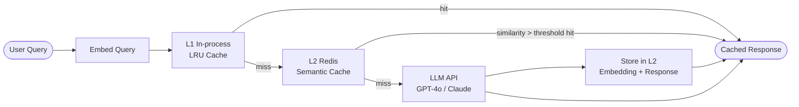

# Semantic Caching

## Category

AI / LLM Integration — Performance & Cost Optimisation

## Context

Semantic caching stores LLM responses and reuses them when a semantically similar (not necessarily identical) query arrives. Unlike exact-match caching, semantic caching understands that "What is the capital of France?" and "Tell me the capital city of France" should return the same cached answer.

### Caching Levels

| Level | Mechanism | Hit Rate | Staleness Risk |
|-------|-----------|---------|----------------|
| **Exact-match** | Hash of prompt string | Low | None |
| **Semantic** | Nearest-neighbour vector search | High | Medium |
| **Response CDN** | Edge cache for identical API URLs | Very low | None |
| **Prompt prefix** | Shared prefix KV cache (OpenAI Prompt Caching) | Medium | None |

### Where to Cache

| Cache Layer | What is Cached | TTL Strategy |
|-------------|---------------|--------------|
| **L1 — In-process** | Recent embeddings (hot) | LRU, 100–1000 entries |
| **L2 — Redis** | Semantic cache entries + LLM responses | TTL by category (1h–7d) |
| **L3 — Vector DB** | All historical query-response pairs | Soft-delete on staleness |

### Similarity Threshold Guidelines

| Threshold | Behaviour | Use Case |
|-----------|-----------|---------|
| > 0.98 | Near-identical queries only | Customer support FAQs |
| > 0.92 | Paraphrases of same question | General Q&A |
| > 0.85 | Loose semantic match | Product recommendations |
| < 0.85 | Too broad — cache misses are safer | Legal / medical accuracy |

## Pros

- Eliminates redundant LLM API calls — direct 60–80% cost reduction on FAQ workloads
- Reduces p99 latency from 2–5s (LLM) to < 20ms (Redis) for cache hits
- Alleviates rate-limit pressure during traffic spikes
- Fully transparent to application callers (drop-in wrapper)
- Hit rate improves over time as query space converges

## Cons

- False positives: semantically similar queries may warrant different answers (time-sensitive data)
- Cache invalidation complexity — stale LLM responses can mislead users
- Cold start: cache is empty on first deployment; takes time to warm
- Embedding cost is still incurred on every request (though much cheaper than LLM)
- Privacy: cached responses may contain user-specific data — namespace by tenant/user

## Design Diagram



## Code Sample

### TypeScript — Semantic cache with Redis + pgvector lookup

```typescript
import OpenAI from 'openai';
import { createClient, RedisClientType } from 'redis';
import { Pool } from 'pg';

const openai = new OpenAI();
const redis: RedisClientType = createClient({ url: process.env.REDIS_URL }) as RedisClientType;
const pool = new Pool({ connectionString: process.env.DATABASE_URL });

await redis.connect();

const SIMILARITY_THRESHOLD = 0.92;
const CACHE_TTL_SECONDS = 3600; // 1 hour

interface CacheEntry {
  queryEmbedding: number[];
  query: string;
  response: string;
  cachedAt: string;
}

async function embedQuery(text: string): Promise<number[]> {
  const res = await openai.embeddings.create({
    model: 'text-embedding-3-small',
    input: text,
  });
  return res.data[0].embedding;
}

// ── L2 Redis exact-key cache ─────────────────────────────────────────────────
function queryKey(queryHash: string): string {
  return `llm:cache:${queryHash}`;
}

function hashQuery(query: string): string {
  // Simple deterministic hash for exact-match fast path
  let h = 0;
  for (let i = 0; i < query.length; i++) {
    h = (Math.imul(31, h) + query.charCodeAt(i)) | 0;
  }
  return Math.abs(h).toString(36);
}

// ── Semantic similarity search (pgvector) ────────────────────────────────────
async function findSimilarCachedResponse(
  embedding: number[],
  tenantId: string,
): Promise<string | null> {
  const vectorLiteral = `[${embedding.join(',')}]`;

  const { rows } = await pool.query<{ response: string; similarity: number }>(
    `SELECT response,
            1 - (query_embedding <=> $1::vector) AS similarity
     FROM llm_cache
     WHERE tenant_id = $2
       AND 1 - (query_embedding <=> $1::vector) > $3
       AND expires_at > NOW()
     ORDER BY query_embedding <=> $1::vector
     LIMIT 1`,
    [vectorLiteral, tenantId, SIMILARITY_THRESHOLD],
  );

  return rows[0]?.response ?? null;
}

async function storeInCache(
  query: string,
  embedding: number[],
  response: string,
  tenantId: string,
): Promise<void> {
  const vectorLiteral = `[${embedding.join(',')}]`;
  const expiresAt = new Date(Date.now() + CACHE_TTL_SECONDS * 1000);

  await pool.query(
    `INSERT INTO llm_cache (query_text, query_embedding, response, tenant_id, expires_at)
     VALUES ($1, $2::vector, $3, $4, $5)
     ON CONFLICT DO NOTHING`,
    [query, vectorLiteral, response, tenantId, expiresAt],
  );

  // Also store in Redis for fast exact-match lookup
  const key = queryKey(hashQuery(query));
  await redis.setEx(key, CACHE_TTL_SECONDS, response);
}

// ── Main cached-query wrapper ─────────────────────────────────────────────────
export async function cachedLLMQuery(
  query: string,
  tenantId: string,
  systemPrompt: string,
): Promise<{ response: string; cacheHit: boolean }> {
  // L1: Exact Redis check (< 1ms)
  const exactKey = queryKey(hashQuery(`${tenantId}:${query}`));
  const exactHit = await redis.get(exactKey);
  if (exactHit) return { response: exactHit, cacheHit: true };

  // Embed query (needed for both semantic lookup and potential storage)
  const embedding = await embedQuery(query);

  // L2: Semantic similarity search
  const semanticHit = await findSimilarCachedResponse(embedding, tenantId);
  if (semanticHit) {
    // Warm L1 with this result
    await redis.setEx(exactKey, CACHE_TTL_SECONDS, semanticHit);
    return { response: semanticHit, cacheHit: true };
  }

  // L3: Call LLM
  const llmResponse = await openai.chat.completions.create({
    model: 'gpt-4o',
    messages: [
      { role: 'system', content: systemPrompt },
      { role: 'user', content: query },
    ],
    temperature: 0.3,
  });

  const responseText = llmResponse.choices[0].message.content ?? '';

  // Store asynchronously (don't block response)
  storeInCache(query, embedding, responseText, tenantId).catch((err) =>
    console.error('[cache] Store error:', err),
  );

  return { response: responseText, cacheHit: false };
}
```

### SQL — Semantic cache table schema

```sql
CREATE EXTENSION IF NOT EXISTS vector;

CREATE TABLE llm_cache (
  id             UUID PRIMARY KEY DEFAULT gen_random_uuid(),
  tenant_id      TEXT NOT NULL,
  query_text     TEXT NOT NULL,
  query_embedding VECTOR(1536) NOT NULL,
  response       TEXT NOT NULL,
  hit_count      INTEGER DEFAULT 0,
  expires_at     TIMESTAMPTZ NOT NULL,
  created_at     TIMESTAMPTZ DEFAULT NOW()
);

-- HNSW index for semantic similarity search
CREATE INDEX idx_llm_cache_embedding
  ON llm_cache
  USING hnsw (query_embedding vector_cosine_ops)
  WITH (m = 16, ef_construction = 64);

CREATE INDEX idx_llm_cache_tenant_expires
  ON llm_cache (tenant_id, expires_at);

-- Cleanup job: remove expired entries
DELETE FROM llm_cache WHERE expires_at < NOW();
```

### TypeScript — Cache metrics middleware

```typescript
interface CacheMetrics {
  hits: number;
  misses: number;
  hitRate: number;
  estimatedSavings: { calls: number; usdCents: number };
}

class SemanticCacheMetrics {
  private hits = 0;
  private misses = 0;
  private readonly costPerCallCents = 3; // ~$0.03 per GPT-4o call

  record(hit: boolean): void {
    if (hit) this.hits++;
    else this.misses++;
  }

  report(): CacheMetrics {
    const total = this.hits + this.misses;
    return {
      hits: this.hits,
      misses: this.misses,
      hitRate: total > 0 ? this.hits / total : 0,
      estimatedSavings: {
        calls: this.hits,
        usdCents: this.hits * this.costPerCallCents,
      },
    };
  }
}

export const cacheMetrics = new SemanticCacheMetrics();
```
