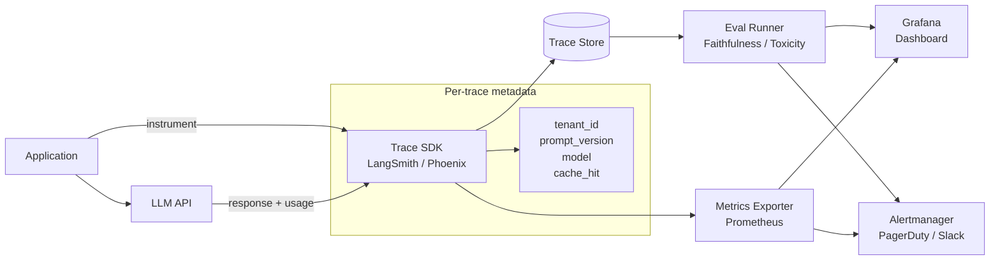

# AI Observability

## Category

AI / LLM Integration — Monitoring & Reliability

## Context

AI Observability extends traditional APM to the unique characteristics of LLM systems: non-deterministic outputs, semantic quality degradation, token cost explosions, and complex multi-step agent traces. It provides the feedback loop needed to detect regressions, control costs, and maintain quality over time.

### Observability Pillars for LLM Systems

| Pillar | What to Measure | Tools |
|--------|----------------|-------|
| **Traces** | Full prompt + response + tool calls + latency | LangSmith, Phoenix, Langfuse |
| **Metrics** | Token usage, cost, latency, cache hit rate, error rate | Prometheus, Grafana, CloudWatch |
| **Logs** | Structured request/response with correlation IDs | ELK, Datadog |
| **Evals** | Automated quality scores on sampled outputs | LangSmith Evals, custom judges |
| **Alerts** | Cost spike, quality drop, hallucination rate | PagerDuty, Slack webhooks |

### Key LLM-Specific Metrics

| Metric | Alert Threshold | Why It Matters |
|--------|----------------|----------------|
| `llm.tokens.input_per_call` | > 8,000 | Prompt bloat / context stuffing |
| `llm.tokens.cost_usd_per_hour` | > $10 | Cost runaway |
| `llm.latency_p99_ms` | > 10,000 | SLA breach |
| `llm.error_rate` | > 5% | Provider issue / prompt regression |
| `llm.cache_hit_rate` | < 20% | Caching misconfigured |
| `llm.eval.faithfulness` | < 0.7 | RAG quality degradation |
| `llm.agent.steps_per_run` | > 15 | Runaway agent loop |

## Pros

- Trace-level visibility exposes which prompt version caused a quality drop
- Token cost attribution per tenant, feature, or user enables precise FinOps
- Automated quality evals catch hallucination regressions before users report them
- A/B prompt experiment data drives evidence-based prompt iteration
- Real-time dashboards give on-call engineers actionable signals

## Cons

- Logging full prompts and responses raises PII compliance concerns — needs redaction
- Tracing overhead: structured logging adds ~2–5ms per call
- Storage cost for full traces at high volume — sample at 10–20% in production
- Eval quality depends on judge model quality — circular dependency risk
- Alert tuning needed to avoid fatigue from noisy LLM error variability

## Design Diagram



## Code Sample

### TypeScript — Structured LLM trace logger

```typescript
import OpenAI from 'openai';
import { randomUUID } from 'crypto';

const openai = new OpenAI();

interface TraceEntry {
  traceId: string;
  tenantId: string;
  promptVersion: string;
  model: string;
  inputTokens: number;
  outputTokens: number;
  latencyMs: number;
  costUsd: number;
  cacheHit: boolean;
  errorCode?: string;
  timestamp: string;
}

// Cost per 1M tokens (April 2026 pricing)
const MODEL_COSTS: Record<string, { input: number; output: number }> = {
  'gpt-4o': { input: 2.5, output: 10.0 },
  'gpt-4o-mini': { input: 0.15, output: 0.6 },
  'o3-mini': { input: 1.1, output: 4.4 },
  'claude-3-7-sonnet-20250219': { input: 3.0, output: 15.0 },
  'claude-3-5-haiku-20241022': { input: 0.8, output: 4.0 },
  'gemini-2.0-flash': { input: 0.1, output: 0.4 },
};

function calculateCost(model: string, inputTokens: number, outputTokens: number): number {
  const costs = MODEL_COSTS[model];
  if (!costs) return 0;
  return (inputTokens / 1_000_000) * costs.input + (outputTokens / 1_000_000) * costs.output;
}

async function emitTrace(entry: TraceEntry): Promise<void> {
  // Emit to your observability backend (stdout for log aggregators, or direct API)
  process.stdout.write(JSON.stringify({ level: 'info', type: 'llm_trace', ...entry }) + '\n');
}

export async function tracedLLMCall(
  messages: OpenAI.Chat.ChatCompletionMessageParam[],
  options: {
    model?: string;
    tenantId: string;
    promptVersion: string;
    cacheHit?: boolean;
  },
): Promise<string> {
  const model = options.model ?? 'gpt-4o';
  const traceId = randomUUID();
  const start = Date.now();

  try {
    const response = await openai.chat.completions.create({
      model,
      messages,
      temperature: 0.3,
    });

    const inputTokens = response.usage?.prompt_tokens ?? 0;
    const outputTokens = response.usage?.completion_tokens ?? 0;
    const latencyMs = Date.now() - start;

    await emitTrace({
      traceId,
      tenantId: options.tenantId,
      promptVersion: options.promptVersion,
      model,
      inputTokens,
      outputTokens,
      latencyMs,
      costUsd: calculateCost(model, inputTokens, outputTokens),
      cacheHit: options.cacheHit ?? false,
      timestamp: new Date().toISOString(),
    });

    return response.choices[0].message.content ?? '';
  } catch (err) {
    const errorCode = err instanceof Error ? err.message.slice(0, 50) : 'unknown';
    await emitTrace({
      traceId,
      tenantId: options.tenantId,
      promptVersion: options.promptVersion,
      model,
      inputTokens: 0,
      outputTokens: 0,
      latencyMs: Date.now() - start,
      costUsd: 0,
      cacheHit: false,
      errorCode,
      timestamp: new Date().toISOString(),
    });
    throw err;
  }
}
```

### TypeScript — Prometheus metrics for LLM systems

```typescript
import { Registry, Counter, Histogram, Gauge } from 'prom-client';

export const registry = new Registry();

export const llmTokensTotal = new Counter({
  name: 'llm_tokens_total',
  help: 'Total tokens consumed',
  labelNames: ['model', 'tenant_id', 'type', 'prompt_version'],
  registers: [registry],
});

export const llmCostUsdTotal = new Counter({
  name: 'llm_cost_usd_total',
  help: 'Cumulative LLM cost in USD',
  labelNames: ['model', 'tenant_id'],
  registers: [registry],
});

export const llmLatencyMs = new Histogram({
  name: 'llm_latency_milliseconds',
  help: 'LLM API call latency',
  labelNames: ['model', 'cache_hit'],
  buckets: [100, 500, 1000, 2000, 5000, 10000],
  registers: [registry],
});

export const llmErrorsTotal = new Counter({
  name: 'llm_errors_total',
  help: 'LLM API errors',
  labelNames: ['model', 'error_type'],
  registers: [registry],
});

export const llmCacheHitRate = new Gauge({
  name: 'llm_cache_hit_rate',
  help: 'Semantic cache hit rate (rolling 5-minute window)',
  registers: [registry],
});

// Usage in tracedLLMCall:
export function recordMetrics(trace: {
  model: string;
  tenantId: string;
  promptVersion: string;
  inputTokens: number;
  outputTokens: number;
  costUsd: number;
  latencyMs: number;
  cacheHit: boolean;
  error?: boolean;
}): void {
  llmTokensTotal
    .labels(trace.model, trace.tenantId, 'input', trace.promptVersion)
    .inc(trace.inputTokens);
  llmTokensTotal
    .labels(trace.model, trace.tenantId, 'output', trace.promptVersion)
    .inc(trace.outputTokens);

  llmCostUsdTotal.labels(trace.model, trace.tenantId).inc(trace.costUsd);

  llmLatencyMs.labels(trace.model, String(trace.cacheHit)).observe(trace.latencyMs);

  if (trace.error) {
    llmErrorsTotal.labels(trace.model, 'api_error').inc();
  }
}
```

### YAML — Grafana alert rules for LLM cost and quality

```yaml
# grafana/alerts/llm-alerts.yaml
groups:
  - name: llm-cost-alerts
    interval: 1m
    rules:
      - alert: LLMCostSpike
        expr: |
          rate(llm_cost_usd_total[5m]) * 3600 > 10
        for: 5m
        labels:
          severity: warning
        annotations:
          summary: "LLM cost exceeding $10/hour"
          description: "Model {{ $labels.model }} for tenant {{ $labels.tenant_id }} is costing ${{ $value | printf \"%.2f\" }}/hr"

      - alert: LLMHighLatency
        expr: |
          histogram_quantile(0.99, rate(llm_latency_milliseconds_bucket[5m])) > 10000
        for: 3m
        labels:
          severity: critical
        annotations:
          summary: "LLM p99 latency > 10s"

      - alert: LLMHighErrorRate
        expr: |
          rate(llm_errors_total[5m]) / (rate(llm_tokens_total[5m]) + 0.001) > 0.05
        for: 2m
        labels:
          severity: critical
        annotations:
          summary: "LLM error rate > 5%"

      - alert: LLMLowCacheHitRate
        expr: llm_cache_hit_rate < 0.15
        for: 10m
        labels:
          severity: warning
        annotations:
          summary: "Semantic cache hit rate < 15% — review cache thresholds"
```
