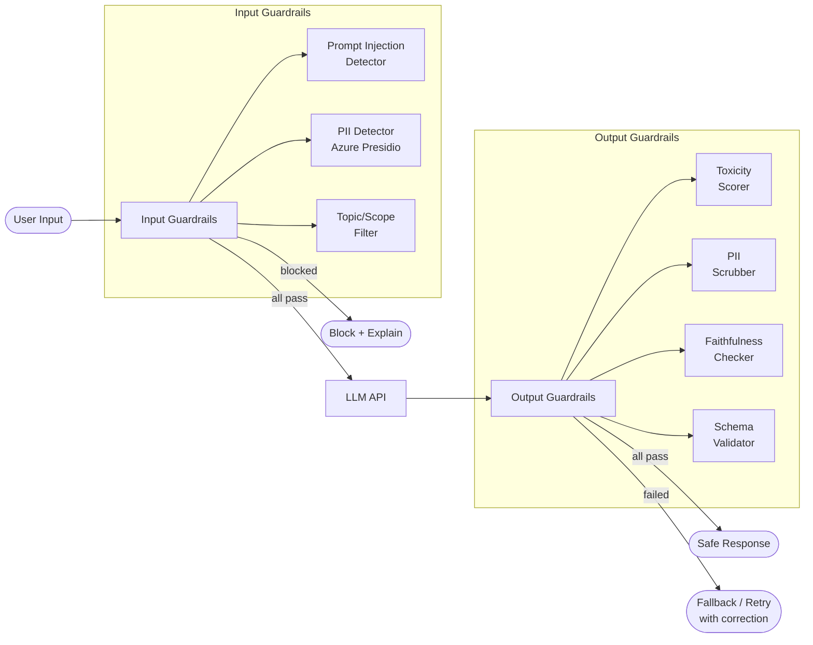

# Guardrails & Content Safety

## Category

AI / LLM Integration — Safety & Compliance

## Context

Guardrails are enforcement layers that sit before and/or after LLM calls to prevent harmful inputs from reaching the model and to validate or sanitise outputs before they reach users. They are non-negotiable in regulated industries (finance, healthcare) and in any application exposed to untrusted user input.

### Guardrail Placement

| Position | Guards Against | Examples |
|----------|---------------|---------|
| **Input (pre-LLM)** | Prompt injection, jailbreaks, PII leakage, off-topic requests | Content classifier, PII detector, topic filter |
| **Output (post-LLM)** | Hallucinations, toxic content, PII in responses, off-brand tone | Toxicity scorer, fact checker, PII scrubber |
| **Agentic (action)** | Irreversible tool use, data exfiltration, SSRF | Action whitelist, human-in-the-loop gate |

### Common Guardrail Types

| Guardrail | Method | Latency |
|-----------|--------|---------|
| **Prompt injection detection** | Classifier or regex | < 5ms |
| **PII detection** | NER model (spaCy, Presidio) | 10–50ms |
| **Topic / scope filter** | Embedding similarity to allowed topics | 20ms |
| **Toxicity filter** | Classifier (Perspective API, OpenAI Moderation) | 50ms |
| **Fact grounding check** | LLM-as-judge vs retrieved context | 500ms–2s |
| **Schema validation** | JSON Schema / Zod parse | < 1ms |
| **Sensitive data in output** | Regex + NER scrub | 10ms |

## Pros

- Prevents prompt injection attacks from malicious users corrupting agent behaviour
- PII scrubbing at gateway layer ensures customer data never enters third-party LLM APIs
- Output validation surfaces hallucinations before they reach end users
- Action guardrails prevent agents from performing irreversible or dangerous operations
- Centralised guardrail layer is auditable and consistently enforced across all LLM features

## Cons

- Every guardrail adds latency — stacking multiple classifiers can add 200–500ms
- Over-restrictive filters frustrate legitimate users (false positives)
- Adversarial users iterate on jailbreaks faster than classifier updates
- LLM-as-judge guardrails are expensive and introduce circular dependency
- Guardrail maintenance is ongoing — new attack vectors require constant updates

## Design Diagram



## Code Sample

### TypeScript — Input guardrail pipeline

```typescript
import OpenAI from 'openai';

const openai = new OpenAI();

interface GuardrailResult {
  allowed: boolean;
  reason?: string;
  sanitisedInput?: string;
}

// ── Prompt injection detector ─────────────────────────────────────────────────
const INJECTION_PATTERNS = [
  /ignore\s+(all\s+)?(previous|prior|above)\s+(instructions?|prompts?)/i,
  /you\s+are\s+now\s+(a\s+)?(?!a\s+helpful)/i,
  /system\s*:\s*(?!you\s+are\s+a\s+helpful)/i,
  /\bDAN\b|\bjailbreak\b|\bpretend\s+you\s+are\b/i,
  /<\/?system>|<\/?instruction>/i,
];

function detectPromptInjection(input: string): boolean {
  return INJECTION_PATTERNS.some((pattern) => pattern.test(input));
}

// ── PII detector (simple regex — use Presidio/GLiNER for production) ─────────
const PII_PATTERNS: Record<string, RegExp> = {
  creditCard: /\b(?:\d[ -]?){13,16}\b/,
  ssn: /\b\d{3}[-\s]?\d{2}[-\s]?\d{4}\b/,
  email: /\b[a-zA-Z0-9._%+-]+@[a-zA-Z0-9.-]+\.[a-zA-Z]{2,}\b/,
  iban: /\b[A-Z]{2}\d{2}[A-Z0-9]{4}\d{7,19}\b/,
};

function detectAndScrubPII(input: string): { hasPII: boolean; scrubbed: string } {
  let scrubbed = input;
  let hasPII = false;
  for (const [type, pattern] of Object.entries(PII_PATTERNS)) {
    if (pattern.test(scrubbed)) {
      hasPII = true;
      scrubbed = scrubbed.replace(pattern, `[REDACTED_${type.toUpperCase()}]`);
    }
  }
  return { hasPII, scrubbed };
}

// ── Topic scope filter ────────────────────────────────────────────────────────
async function isOnTopic(input: string, allowedTopics: string[]): Promise<boolean> {
  const res = await openai.chat.completions.create({
    model: 'gpt-4o-mini',
    messages: [
      {
        role: 'system',
        content: `You are a topic classifier. Allowed topics: ${allowedTopics.join(', ')}.
Reply with JSON {"on_topic": true} or {"on_topic": false}.`,
      },
      { role: 'user', content: input },
    ],
    response_format: { type: 'json_object' },
    max_tokens: 20,
    temperature: 0,
  });
  try {
    const parsed = JSON.parse(res.choices[0].message.content ?? '{}') as { on_topic?: boolean };
    return parsed.on_topic === true;
  } catch {
    return true; // Fail open for topic filter (edge case)
  }
}

// ── OpenAI Moderation API ──────────────────────────────────────────────────────
async function checkModeration(input: string): Promise<{ flagged: boolean; categories: string[] }> {
  const result = await openai.moderations.create({ input });
  const flagged = result.results[0].flagged;
  const categories = Object.entries(result.results[0].categories)
    .filter(([, v]) => v)
    .map(([k]) => k);
  return { flagged, categories };
}

// ── Composite input guardrail ─────────────────────────────────────────────────
export async function inputGuardrail(
  rawInput: string,
  allowedTopics: string[],
): Promise<GuardrailResult> {
  // 1. Prompt injection (fast, synchronous)
  if (detectPromptInjection(rawInput)) {
    return { allowed: false, reason: 'Potential prompt injection detected.' };
  }

  // 2. PII scrub (synchronous)
  const { hasPII, scrubbed } = detectAndScrubPII(rawInput);
  const sanitisedInput = scrubbed;
  if (hasPII) {
    console.warn('[guardrail] PII detected and scrubbed from input');
  }

  // 3. Parallel async checks
  const [moderation, onTopic] = await Promise.all([
    checkModeration(sanitisedInput),
    isOnTopic(sanitisedInput, allowedTopics),
  ]);

  if (moderation.flagged) {
    return {
      allowed: false,
      reason: `Content policy violation: ${moderation.categories.join(', ')}`,
    };
  }

  if (!onTopic) {
    return {
      allowed: false,
      reason: `Request is outside the scope of this assistant. Allowed topics: ${allowedTopics.join(', ')}.`,
    };
  }

  return { allowed: true, sanitisedInput };
}
```

### TypeScript — Output guardrail: PII scrub + faithfulness check

```typescript
import OpenAI from 'openai';

const openai = new OpenAI();

function scrubOutputPII(response: string): string {
  const PII_PATTERNS: Record<string, RegExp> = {
    creditCard: /\b(?:\d[ -]?){13,16}\b/g,
    ssn: /\b\d{3}[-\s]?\d{2}[-\s]?\d{4}\b/g,
    email: /\b[a-zA-Z0-9._%+-]+@[a-zA-Z0-9.-]+\.[a-zA-Z]{2,}\b/g,
    iban: /\b[A-Z]{2}\d{2}[A-Z0-9]{4}\d{7,19}\b/g,
  };
  let scrubbed = response;
  for (const [type, pattern] of Object.entries(PII_PATTERNS)) {
    scrubbed = scrubbed.replace(pattern, `[REDACTED_${type.toUpperCase()}]`);
  }
  return scrubbed;
}

async function checkFaithfulness(
  response: string,
  context: string,
): Promise<{ faithful: boolean; score: number }> {
  const res = await openai.chat.completions.create({
    model: 'gpt-4o-mini',
    messages: [
      {
        role: 'system',
        content: `You evaluate whether an AI response is faithful to the provided context.
Score from 0 (complete hallucination) to 1 (fully grounded).
Reply with JSON: {"faithful": true/false, "score": 0.0-1.0}`,
      },
      {
        role: 'user',
        content: `CONTEXT:\n${context}\n\nRESPONSE:\n${response}`,
      },
    ],
    response_format: { type: 'json_object' },
    temperature: 0,
    max_tokens: 50,
  });

  try {
    return JSON.parse(res.choices[0].message.content ?? '{}') as {
      faithful: boolean;
      score: number;
    };
  } catch {
    return { faithful: true, score: 1.0 }; // Fail open
  }
}

export async function outputGuardrail(
  response: string,
  retrievedContext: string,
  faithfulnessThreshold = 0.7,
): Promise<{ safe: boolean; safeResponse?: string; reason?: string }> {
  // 1. PII scrub
  const scrubbed = scrubOutputPII(response);

  // 2. Faithfulness check
  const { faithful, score } = await checkFaithfulness(scrubbed, retrievedContext);

  if (!faithful || score < faithfulnessThreshold) {
    return {
      safe: false,
      reason: `Response faithfulness score ${score.toFixed(2)} below threshold ${faithfulnessThreshold}`,
    };
  }

  return { safe: true, safeResponse: scrubbed };
}
```
