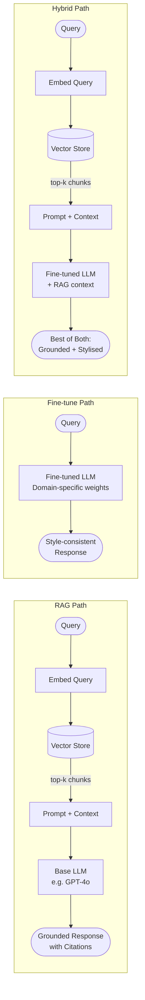

# Fine-tuning vs RAG Trade-offs

## Category

AI / LLM Integration — Architecture Decision

## Context

When an LLM needs specialised knowledge or a specific output style, engineers choose between two primary adaptation strategies: **Retrieval-Augmented Generation (RAG)** which injects context at inference time, and **Fine-tuning** which modifies the model's weights during training. Each has distinct cost, latency, data-freshness, and capability profiles.

### Decision Matrix

| Criterion | RAG | Fine-tuning | Hybrid |
|-----------|-----|-------------|--------|
| **Data freshness** | Real-time | Stale (re-train needed) | Real-time (RAG layer) |
| **Training cost** | None | $500–$50,000+ (GPU hours) | $500–$50,000+ |
| **Inference cost** | Higher (retrieval + LLM) | Lower (no retrieval) | Highest |
| **Latency** | +200–500ms (retrieval) | Baseline | +200–500ms |
| **Knowledge scope** | Unlimited (index grows) | Fixed at training time | Unlimited |
| **Factual accuracy** | High (citations) | Medium (hallucination risk) | Highest |
| **Style/format adaptation** | Weak | Strong | Strong |
| **Data volume needed** | 10+ documents | 50–10,000+ examples | Both |
| **Privacy risk** | Low (no data baked in) | High (data in weights) | Medium |
| **Implementation complexity** | Low | High | Very High |

### When to Use Each

| Scenario | Recommended |
|----------|-------------|
| Dynamic knowledge base (docs, policies, FAQs) | RAG |
| Consistent specialised tone / style | Fine-tuning |
| Domain-specific structured output format | Fine-tuning |
| Classified / highly confidential data | RAG (data never leaves your store) |
| Reduce hallucinations with citations | RAG |
| Reduce retrieval latency in high-QPS systems | Fine-tuning |
| Blend knowledge + style | Hybrid (RAG + fine-tuned base) |

## Pros (RAG)

- No GPU training infrastructure required
- Knowledge updates are instantaneous — just re-index documents
- Supports access-control at retrieval layer (per-tenant filtering)
- Responses are traceable to source documents (citations)
- Works with off-the-shelf model APIs — no model hosting required

## Pros (Fine-tuning)

- Eliminates retrieval latency and token overhead from injected context
- Model learns specialised output format, jargon, and tone natively
- Better performance on narrow, well-defined tasks with curated data
- Lower per-token cost at high throughput (smaller context = fewer tokens)
- Can be combined with RAG for maximum capability (Hybrid)

## Cons (RAG)

- Retrieval quality is the ceiling — bad chunks produce bad answers
- Long context injection increases per-call token cost
- Complex to implement and tune (chunk size, overlap, re-ranking)

## Cons (Fine-tuning)

- Expensive and slow to iterate — each experiment costs compute budget
- Risk of catastrophic forgetting — model may lose general reasoning
- Data privacy risk: training data may be memorised in model weights
- Requires careful data curation — noisy examples degrade performance
- Model requires hosting infrastructure (can't use serverless API)

## Design Diagram



## Code Sample

### TypeScript — OpenAI fine-tune job creation and monitoring

```typescript
import OpenAI from 'openai';
import * as fs from 'fs';

const openai = new OpenAI();

interface TrainingExample {
  messages: Array<{
    role: 'system' | 'user' | 'assistant';
    content: string;
  }>;
}

// ── Prepare training data (JSONL format) ──────────────────────────────────────
export function prepareTrainingFile(
  examples: TrainingExample[],
  outputPath: string,
): void {
  const lines = examples.map((ex) => JSON.stringify(ex));
  fs.writeFileSync(outputPath, lines.join('\n'), 'utf-8');
  console.log(`[finetune] Wrote ${examples.length} examples to ${outputPath}`);
}

// ── Upload training file and create fine-tune job ─────────────────────────────
export async function createFineTuneJob(
  trainingFilePath: string,
  baseModel = 'gpt-4o-mini-2024-07-18',
  suffix = 'payments-classifier',
): Promise<string> {
  // Upload file
  const fileUpload = await openai.files.create({
    file: fs.createReadStream(trainingFilePath),
    purpose: 'fine-tune',
  });

  console.log(`[finetune] Uploaded file: ${fileUpload.id}`);

  // Create job
  const job = await openai.fineTuning.jobs.create({
    training_file: fileUpload.id,
    model: baseModel,
    suffix,
    hyperparameters: {
      n_epochs: 3,
      batch_size: 'auto',
      learning_rate_multiplier: 'auto',
    },
  });

  console.log(`[finetune] Job created: ${job.id}, status: ${job.status}`);
  return job.id;
}

// ── Poll job status until completion ─────────────────────────────────────────
export async function waitForFineTuneJob(jobId: string): Promise<string> {
  const POLL_INTERVAL_MS = 30_000;

  while (true) {
    const job = await openai.fineTuning.jobs.retrieve(jobId);

    console.log(`[finetune] Job ${jobId}: ${job.status}`);

    if (job.status === 'succeeded') {
      console.log(`[finetune] Completed! Model: ${job.fine_tuned_model}`);
      return job.fine_tuned_model ?? '';
    }

    if (job.status === 'failed' || job.status === 'cancelled') {
      throw new Error(`Fine-tune job ${jobId} failed with status: ${job.status}`);
    }

    await new Promise((r) => setTimeout(r, POLL_INTERVAL_MS));
  }
}
```

### Python — Training data quality checks before fine-tuning

```python
import json
from pathlib import Path


def validate_training_data(jsonl_path: str) -> dict:
    """Validate JSONL training file before submitting to OpenAI fine-tune."""
    path = Path(jsonl_path)
    errors = []
    warnings = []
    token_counts = []

    with path.open() as f:
        lines = f.readlines()

    if len(lines) < 10:
        errors.append(f"Too few examples: {len(lines)} (minimum 10)")

    for i, line in enumerate(lines):
        try:
            example = json.loads(line)
        except json.JSONDecodeError as e:
            errors.append(f"Line {i+1}: Invalid JSON — {e}")
            continue

        messages = example.get("messages", [])

        # Check required roles
        roles = [m.get("role") for m in messages]
        if "user" not in roles:
            errors.append(f"Line {i+1}: Missing 'user' role")
        if "assistant" not in roles:
            errors.append(f"Line {i+1}: Missing 'assistant' role")

        # Estimate token count (4 chars ≈ 1 token)
        total_chars = sum(len(m.get("content", "")) for m in messages)
        estimated_tokens = total_chars // 4
        token_counts.append(estimated_tokens)

        if estimated_tokens > 4096:
            warnings.append(f"Line {i+1}: Estimated {estimated_tokens} tokens — may truncate")

        # Check for empty content
        for msg in messages:
            if not msg.get("content", "").strip():
                errors.append(f"Line {i+1}: Empty content in {msg.get('role')} message")

    return {
        "total_examples": len(lines),
        "errors": errors,
        "warnings": warnings,
        "avg_tokens": sum(token_counts) / max(len(token_counts), 1),
        "max_tokens": max(token_counts, default=0),
        "estimated_training_cost_usd": len(lines) * (sum(token_counts) / max(len(token_counts), 1)) * 3 * 8e-6,
    }
```

### YAML — MLflow experiment tracking for fine-tune comparison

```yaml
# mlflow-config.yaml — track RAG vs fine-tune vs hybrid experiments
experiment:
  name: "payment-classification-strategy"
  tracking_uri: "${MLFLOW_TRACKING_URI}"

runs:
  - name: rag-baseline
    params:
      strategy: rag
      embedding_model: text-embedding-3-small
      top_k: 5
      similarity_threshold: 0.75
      llm_model: gpt-4o-mini
    metrics_to_track:
      - accuracy
      - f1_weighted
      - avg_latency_ms
      - cost_per_1k_queries_usd

  - name: finetuned-gpt4o-mini
    params:
      strategy: fine-tune
      base_model: gpt-4o-mini-2024-07-18
      training_examples: 500
      epochs: 3
    metrics_to_track:
      - accuracy
      - f1_weighted
      - avg_latency_ms
      - cost_per_1k_queries_usd

  - name: hybrid-rag-plus-finetune
    params:
      strategy: hybrid
      fine_tuned_model: ft:gpt-4o-mini:org:payments-classifier:abc123
      embedding_model: text-embedding-3-small
      top_k: 3
    metrics_to_track:
      - accuracy
      - f1_weighted
      - avg_latency_ms
      - cost_per_1k_queries_usd
```
