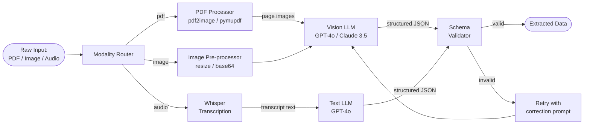

# Multimodal Pipelines

## Category

AI / LLM Integration — Advanced AI Patterns

## Context

Multimodal AI pipelines process and reason across multiple data modalities simultaneously — text, images, audio, video, and structured data. Modern models like GPT-4o and Claude 3.5 Sonnet accept images natively, enabling applications such as document intelligence, visual Q&A, receipt parsing, and video analysis.

### Modality Support Matrix

| Model | Text | Image | Audio | Video | PDF |
|-------|------|-------|-------|-------|-----|
| GPT-4o | ✅ | ✅ | ✅ | ❌ | Via image conversion |
| Claude 3.5 Sonnet | ✅ | ✅ | ❌ | ❌ | Via image conversion |
| Gemini 1.5 Pro | ✅ | ✅ | ✅ | ✅ | ✅ native |
| LLaVA (local) | ✅ | ✅ | ❌ | ❌ | Via image conversion |
| Whisper | ❌ | ❌ | ✅ | ❌ | ❌ |

### Pipeline Patterns

| Pattern | Description | Use Case |
|---------|-------------|---------|
| **Document Intelligence** | PDF → image pages → GPT-4o vision extraction | Invoice parsing, KYC document extraction |
| **Visual Q&A** | User uploads image + question → structured answer | Product catalogues, medical imaging |
| **Audio Transcription + Analysis** | Audio → Whisper transcript → LLM analysis | Call centre sentiment, meeting notes |
| **Image + Text Search** | CLIP embeddings → multimodal vector search | E-commerce visual search |
| **Chart & Dashboard Reading** | Screenshot → LLM → JSON metrics | Automated reporting |

## Pros

- Eliminates pre-processing code for OCR, transcription, and format conversion
- End-to-end pipelines reduce integration complexity vs chaining specialised models
- Vision models handle poor scan quality, handwriting, and mixed layouts
- Multimodal embeddings enable cross-modal search (text query → image result)
- GPT-4o audio enables real-time voice interfaces with a single model

## Cons

- Image tokens are expensive — a full-page image can cost 800–1,600 tokens
- Vision models may hallucinate text content in images under low contrast
- Large file pre-processing (PDF → PNG pages) adds pipeline latency
- Audio processing requires server-side file handling with storage concerns
- GDPR compliance is complex when images contain faces or ID documents

## Design Diagram



## Code Sample

### TypeScript — Invoice extraction from PDF pages

```typescript
import OpenAI from 'openai';
import { execSync } from 'child_process';
import * as fs from 'fs';
import * as path from 'path';
import { z } from 'zod';

const openai = new OpenAI();

// ── Schema for extracted invoice data ────────────────────────────────────────
const InvoiceSchema = z.object({
  invoiceNumber: z.string(),
  issueDate: z.string(),
  dueDate: z.string().optional(),
  vendor: z.object({
    name: z.string(),
    address: z.string().optional(),
    vatNumber: z.string().optional(),
  }),
  lineItems: z.array(
    z.object({
      description: z.string(),
      quantity: z.number(),
      unitPrice: z.number(),
      total: z.number(),
    }),
  ),
  subtotal: z.number(),
  taxAmount: z.number().optional(),
  totalAmount: z.number(),
  currency: z.string(),
});

type Invoice = z.infer<typeof InvoiceSchema>;

// ── PDF → PNG page conversion (requires poppler: brew install poppler) ────────
function pdfToPageImages(pdfPath: string, outputDir: string): string[] {
  fs.mkdirSync(outputDir, { recursive: true });
  // pdftoppm converts each page to a PNG
  execSync(`pdftoppm -png -r 150 "${pdfPath}" "${path.join(outputDir, 'page')}"`, {
    stdio: 'ignore',
  });

  return fs
    .readdirSync(outputDir)
    .filter((f) => f.endsWith('.png'))
    .sort()
    .map((f) => path.join(outputDir, f));
}

function imageToBase64(imagePath: string): string {
  return fs.readFileSync(imagePath).toString('base64');
}

// ── Vision extraction ────────────────────────────────────────────────────────
async function extractInvoiceFromImage(base64Image: string): Promise<Invoice | null> {
  const response = await openai.chat.completions.create({
    model: 'gpt-4o',
    messages: [
      {
        role: 'system',
        content: `You are an invoice data extraction specialist.
Extract all invoice fields and return them as JSON matching the schema.
If a field is not visible or not applicable, omit it.
For numeric values, return numbers not strings.`,
      },
      {
        role: 'user',
        content: [
          {
            type: 'image_url',
            image_url: {
              url: `data:image/png;base64,${base64Image}`,
              detail: 'high',  // Use high detail for document extraction
            },
          },
          {
            type: 'text',
            text: 'Extract all invoice data from this image. Return only valid JSON.',
          },
        ],
      },
    ],
    response_format: { type: 'json_object' },
    max_tokens: 2048,
    temperature: 0,
  });

  const raw = response.choices[0].message.content ?? '{}';
  const parsed = InvoiceSchema.safeParse(JSON.parse(raw));
  return parsed.success ? parsed.data : null;
}

export async function extractInvoiceFromPDF(pdfPath: string): Promise<Invoice | null> {
  const outputDir = `/tmp/invoice-pages-${Date.now()}`;

  try {
    const pages = pdfToPageImages(pdfPath, outputDir);
    if (pages.length === 0) throw new Error('No pages extracted from PDF');

    // Process first page (invoices are typically single-page)
    const base64 = imageToBase64(pages[0]);
    return await extractInvoiceFromImage(base64);
  } finally {
    // Clean up temporary files
    fs.rmSync(outputDir, { recursive: true, force: true });
  }
}
```

### TypeScript — Audio transcription + sentiment analysis

```typescript
import OpenAI from 'openai';
import * as fs from 'fs';
import { z } from 'zod';

const openai = new OpenAI();

const CallAnalysisSchema = z.object({
  transcript: z.string(),
  summary: z.string(),
  sentiment: z.enum(['positive', 'neutral', 'negative']),
  sentimentScore: z.number().min(-1).max(1),
  keyTopics: z.array(z.string()),
  actionItems: z.array(z.string()),
  escalationRequired: z.boolean(),
});

type CallAnalysis = z.infer<typeof CallAnalysisSchema>;

export async function analyseCallRecording(audioFilePath: string): Promise<CallAnalysis> {
  // Step 1: Transcribe with Whisper
  const transcription = await openai.audio.transcriptions.create({
    file: fs.createReadStream(audioFilePath),
    model: 'whisper-1',
    language: 'en',
    response_format: 'text',
  });

  const transcript = String(transcription);

  // Step 2: Analyse transcript with LLM
  const analysisResponse = await openai.chat.completions.create({
    model: 'gpt-4o-mini',
    messages: [
      {
        role: 'system',
        content: `You are a call centre quality analyst.
Analyse the provided call transcript and return a JSON object with:
- summary: one paragraph summary
- sentiment: positive/neutral/negative
- sentimentScore: -1.0 to 1.0
- keyTopics: array of main topics discussed
- actionItems: array of follow-up actions required
- escalationRequired: boolean (true if customer was angry or unresolved)`,
      },
      {
        role: 'user',
        content: `TRANSCRIPT:\n${transcript}`,
      },
    ],
    response_format: { type: 'json_object' },
    temperature: 0.1,
  });

  const raw = JSON.parse(analysisResponse.choices[0].message.content ?? '{}') as Record<string, unknown>;
  const parsed = CallAnalysisSchema.safeParse({ transcript, ...raw });

  if (!parsed.success) {
    throw new Error(`Call analysis schema validation failed: ${JSON.stringify(parsed.error.errors)}`);
  }

  return parsed.data;
}
```
