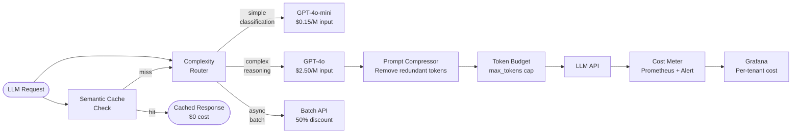

# AI Cost Optimisation

## Category

AI / LLM Integration — FinOps for AI

## Context

LLM API costs scale non-linearly with usage: token count, model tier, and request volume all compound. Without deliberate cost controls, an AI feature can generate thousands of dollars in unexpected spend overnight. AI cost optimisation applies FinOps principles to the unique economics of token-based billing.

### Cost Levers

| Lever | Savings Potential | Implementation Effort |
|-------|------------------|----------------------|
| **Model tier selection** | 50–95% | Low (swap model name) |
| **Prompt compression** | 10–40% | Medium |
| **Semantic caching** | 40–80% on repetitive workloads | Medium |
| **Output token budgeting** | 10–30% | Low (max_tokens) |
| **Streaming early termination** | 5–20% | Medium |
| **Batching** | 15–50% (Batch API discount) | Medium |
| **RAG context tuning** | 15–30% (fewer chunks) | Medium |
| **Fine-tuning smaller model** | 60–90% at scale | High |

### Model Cost Comparison (Per 1M Tokens, March 2026)

| Model | Input | Output | Use Case |
|-------|-------|--------|---------|
| GPT-4o | $2.50 | $10.00 | Complex reasoning, vision |
| GPT-4o-mini | $0.15 | $0.60 | Simple tasks, high volume |
| Claude 3.5 Haiku | $0.80 | $4.00 | Balanced speed/cost |
| Claude 3.5 Sonnet | $3.00 | $15.00 | Complex analysis |
| Gemini 1.5 Flash | $0.075 | $0.30 | Ultra-cheap, high volume |
| Mistral Small (local) | $0 | $0 | Max savings, fixed infra cost |

## Pros

- Model routing alone can cut costs by 80%+ with minimal quality trade-off on simple tasks
- Semantic caching delivers near-zero LLM spend on FAQ-heavy workloads
- Token budgeting prevents runaway cost from verbose model outputs
- Batching with the OpenAI Batch API delivers 50% discount for async workloads
- Real-time cost dashboards alert before monthly budgets are exhausted

## Cons

- Cheaper models produce lower quality outputs — requires eval to validate trade-offs
- Aggressive token limits can truncate reasoning chains and reduce accuracy
- Prompt compression can lose nuance, especially for complex structured data
- Caching staleness requires TTL management and invalidation strategies
- Over-optimisation adds engineering complexity that can outweigh savings at low volume

## Design Diagram



## Code Sample

### TypeScript — Complexity-based model router

```typescript
import OpenAI from 'openai';

const openai = new OpenAI();

type TaskComplexity = 'simple' | 'moderate' | 'complex';

interface RoutedCompletion {
  response: string;
  model: string;
  inputTokens: number;
  outputTokens: number;
  estimatedCostUsd: number;
}

// Cost per 1M tokens (update as pricing changes)
const MODEL_PRICING = {
  'gpt-4o-mini': { input: 0.00015, output: 0.0006 },    // per 1k tokens
  'gpt-4o': { input: 0.0025, output: 0.01 },
} as const;

type ModelName = keyof typeof MODEL_PRICING;

function selectModel(complexity: TaskComplexity): ModelName {
  switch (complexity) {
    case 'simple':   return 'gpt-4o-mini';
    case 'moderate': return 'gpt-4o-mini';
    case 'complex':  return 'gpt-4o';
  }
}

async function classifyComplexity(
  messages: OpenAI.Chat.ChatCompletionMessageParam[],
): Promise<TaskComplexity> {
  // Use a tiny cheap model to classify complexity
  const res = await openai.chat.completions.create({
    model: 'gpt-4o-mini',
    messages: [
      {
        role: 'system',
        content: `Classify this task as "simple", "moderate", or "complex".
Simple: single-fact lookup, classification, yes/no.
Moderate: multi-step reasoning, short summaries.
Complex: code generation, legal analysis, multi-doc synthesis.
Reply with one word only.`,
      },
      {
        role: 'user',
        content: messages[messages.length - 1].content as string,
      },
    ],
    max_tokens: 5,
    temperature: 0,
  });

  const label = res.choices[0].message.content?.toLowerCase().trim();
  if (label === 'simple' || label === 'moderate' || label === 'complex') return label;
  return 'moderate'; // safe default
}

function computeCost(model: ModelName, inputTokens: number, outputTokens: number): number {
  const pricing = MODEL_PRICING[model];
  return (inputTokens / 1000) * pricing.input + (outputTokens / 1000) * pricing.output;
}

export async function routedCompletion(
  messages: OpenAI.Chat.ChatCompletionMessageParam[],
  maxOutputTokens = 1024,
): Promise<RoutedCompletion> {
  const complexity = await classifyComplexity(messages);
  const model = selectModel(complexity);

  const response = await openai.chat.completions.create({
    model,
    messages,
    max_tokens: maxOutputTokens,
    temperature: 0.3,
  });

  const inputTokens = response.usage?.prompt_tokens ?? 0;
  const outputTokens = response.usage?.completion_tokens ?? 0;

  return {
    response: response.choices[0].message.content ?? '',
    model,
    inputTokens,
    outputTokens,
    estimatedCostUsd: computeCost(model, inputTokens, outputTokens),
  };
}
```

### TypeScript — Prompt compressor (remove whitespace, comments, verbose examples)

```typescript
export function compressPrompt(prompt: string, targetTokenEstimate: number): string {
  let compressed = prompt;

  // Remove markdown formatting that wastes tokens
  compressed = compressed.replace(/#+\s+/g, '');           // headers
  compressed = compressed.replace(/\*\*([^*]+)\*\*/g, '$1'); // bold
  compressed = compressed.replace(/\*([^*]+)\*/g, '$1');    // italic
  compressed = compressed.replace(/```[a-z]*\n?/g, '');     // code fences
  compressed = compressed.replace(/^\s*[-*]\s+/gm, '- ');   // normalise bullets

  // Collapse whitespace
  compressed = compressed.replace(/\n{3,}/g, '\n\n');
  compressed = compressed.replace(/[ \t]{2,}/g, ' ');
  compressed = compressed.trim();

  // Estimate tokens (4 chars ≈ 1 token for English)
  const estimatedTokens = Math.ceil(compressed.length / 4);

  if (estimatedTokens <= targetTokenEstimate) return compressed;

  // Truncate to target (preserve beginning — most important context)
  const targetChars = targetTokenEstimate * 4;
  return compressed.slice(0, targetChars) + '\n[context truncated for cost optimisation]';
}
```

### TypeScript — OpenAI Batch API for async 50%-cheaper processing

```typescript
import OpenAI from 'openai';
import * as fs from 'fs';

const openai = new OpenAI();

interface BatchRequest {
  customId: string;
  messages: OpenAI.Chat.ChatCompletionMessageParam[];
}

// ── Create batch job ─────────────────────────────────────────────────────────
export async function createBatchJob(requests: BatchRequest[]): Promise<string> {
  const lines = requests.map((req) =>
    JSON.stringify({
      custom_id: req.customId,
      method: 'POST',
      url: '/v1/chat/completions',
      body: {
        model: 'gpt-4o-mini',
        messages: req.messages,
        max_tokens: 512,
      },
    }),
  );

  const jsonlContent = lines.join('\n');
  const tmpPath = `/tmp/batch-${Date.now()}.jsonl`;
  fs.writeFileSync(tmpPath, jsonlContent);

  const file = await openai.files.create({
    file: fs.createReadStream(tmpPath),
    purpose: 'batch',
  });

  fs.unlinkSync(tmpPath);

  const batch = await openai.batches.create({
    input_file_id: file.id,
    endpoint: '/v1/chat/completions',
    completion_window: '24h',
  });

  console.log(`[batch] Created batch job: ${batch.id}`);
  return batch.id;
}

// ── Poll and retrieve results ─────────────────────────────────────────────────
export async function retrieveBatchResults(
  batchId: string,
): Promise<Map<string, string>> {
  const POLL_INTERVAL_MS = 60_000; // 1 minute

  while (true) {
    const batch = await openai.batches.retrieve(batchId);

    if (batch.status === 'completed' && batch.output_file_id) {
      const content = await openai.files.content(batch.output_file_id);
      const text = await content.text();
      const results = new Map<string, string>();

      for (const line of text.trim().split('\n')) {
        const result = JSON.parse(line) as {
          custom_id: string;
          response: { body: { choices: Array<{ message: { content: string } }> } };
        };
        results.set(
          result.custom_id,
          result.response.body.choices[0]?.message.content ?? '',
        );
      }

      return results;
    }

    if (batch.status === 'failed' || batch.status === 'cancelled') {
      throw new Error(`Batch job ${batchId} failed with status: ${batch.status}`);
    }

    await new Promise((r) => setTimeout(r, POLL_INTERVAL_MS));
  }
}
```
