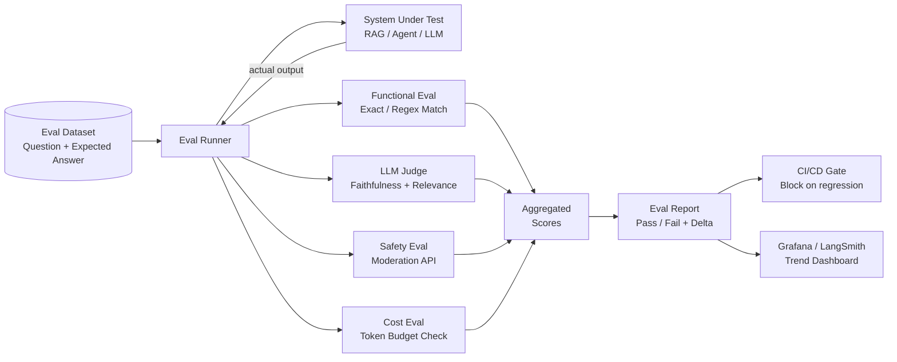

# LLM Evaluation & Evals

## Category

AI / LLM Integration — Quality Engineering

## Context

LLM Evals are automated test suites that measure the quality, correctness, safety, and consistency of LLM-powered systems. Unlike deterministic software tests, evals must handle non-deterministic outputs using statistical comparison, LLM-as-judge scoring, and human baselines.

### Eval Taxonomy

| Category | What It Measures | Method |
|----------|-----------------|--------|
| **Functional** | Correct answer / expected output | Exact match, substring, regex |
| **Semantic** | Meaning preserved (paraphrase OK) | Embedding cosine similarity |
| **Faithfulness** | Response grounded in retrieved context | LLM judge |
| **Relevance** | Response answers the actual question | LLM judge |
| **Toxicity / Safety** | Harmful content absent | Classifier (Perspective API, OpenAI Moderation) |
| **Format** | JSON schema, required fields present | Zod / JSON Schema |
| **Consistency** | Same input → same answer across N runs | Variance of outputs |
| **Latency** | Response time meets SLA | Time measurement |
| **Cost** | Token spend within budget | Token counting |

### Eval Frameworks

| Framework | Language | Strengths |
|-----------|---------|-----------|
| **LangSmith Evals** | Python / TypeScript | Native LangChain integration, hosted UI |
| **Phoenix (Arize)** | Python | Open-source, OTEL traces, LLM-as-judge |
| **RAGAS** | Python | RAG-specific: faithfulness, answer relevancy, context precision |
| **PromptFoo** | Node.js / YAML | YAML-driven multi-model comparison |
| **Braintrust** | Python / TypeScript | Hosted evals, datasets, experiments |
| **Custom** | Any | Full control, integrate with CI/CD |

## Pros

- Evals catch quality regressions when updating prompts, models, or retrieval logic
- Automated evals run in CI/CD preventing production deployments with degraded quality
- LLM-as-judge enables scalable, nuanced evaluation without human annotation at every run
- Dataset-driven eval maintains reproducibility and enables A/B comparison across versions
- RAGAS metrics provide standardised RAG quality benchmarks

## Cons

- LLM-as-judge has its own biases — prefer ensemble of multiple judge models
- Ground-truth dataset curation is expensive and requires domain expertise
- Non-determinism means single-run eval scores have variance — run multiple trials
- Eval infrastructure adds CI/CD cost (LLM API calls for judge model)
- Goodhart's Law risk: optimising for eval metrics may not improve real-world quality

## Design Diagram



## Code Sample

### TypeScript — Custom eval runner with LLM judge

```typescript
import OpenAI from 'openai';
import { z } from 'zod';

const openai = new OpenAI();

interface EvalCase {
  id: string;
  input: string;
  expectedOutput?: string;   // For exact/semantic match
  context?: string;          // For faithfulness eval (RAG)
  tags?: string[];
}

interface EvalResult {
  caseId: string;
  actualOutput: string;
  scores: {
    exactMatch?: boolean;
    semanticSimilarity?: number;
    faithfulness?: number;
    relevance?: number;
    toxicity?: boolean;
  };
  passed: boolean;
  latencyMs: number;
}

// ── LLM Judge ─────────────────────────────────────────────────────────────────
const JudgeResponseSchema = z.object({
  faithfulness: z.number().min(0).max(1),
  relevance: z.number().min(0).max(1),
  reasoning: z.string(),
});

async function llmJudge(
  input: string,
  output: string,
  context: string,
): Promise<{ faithfulness: number; relevance: number }> {
  const res = await openai.chat.completions.create({
    model: 'gpt-4o-mini',
    messages: [
      {
        role: 'system',
        content: `You are an impartial evaluator for AI responses.
Score the response on two dimensions (0.0 to 1.0):
1. faithfulness: Is every claim in the response supported by the provided context? (0 = not at all, 1 = fully supported)
2. relevance: Does the response actually answer the question? (0 = off-topic, 1 = directly answers)
Return JSON: {"faithfulness": 0.0-1.0, "relevance": 0.0-1.0, "reasoning": "one sentence"}`,
      },
      {
        role: 'user',
        content: `QUESTION: ${input}\n\nCONTEXT: ${context}\n\nRESPONSE: ${output}`,
      },
    ],
    response_format: { type: 'json_object' },
    temperature: 0,
    max_tokens: 200,
  });

  const parsed = JudgeResponseSchema.safeParse(JSON.parse(res.choices[0].message.content ?? '{}'));
  if (!parsed.success) return { faithfulness: 0.5, relevance: 0.5 };
  return parsed.data;
}

// ── Embedding similarity ───────────────────────────────────────────────────────
async function cosineSimilarity(a: string, b: string): Promise<number> {
  const res = await openai.embeddings.create({
    model: 'text-embedding-3-small',
    input: [a, b],
  });
  const va = res.data[0].embedding;
  const vb = res.data[1].embedding;
  const dot = va.reduce((sum, val, i) => sum + val * vb[i], 0);
  const normA = Math.sqrt(va.reduce((sum, v) => sum + v * v, 0));
  const normB = Math.sqrt(vb.reduce((sum, v) => sum + v * v, 0));
  return dot / (normA * normB);
}

// ── Main eval runner ───────────────────────────────────────────────────────────
export async function runEval(
  sut: (input: string) => Promise<string>,  // System Under Test
  cases: EvalCase[],
  thresholds = { faithfulness: 0.7, relevance: 0.7, semSimilarity: 0.8 },
): Promise<{ results: EvalResult[]; summary: Record<string, number> }> {
  const results: EvalResult[] = [];

  for (const evalCase of cases) {
    const start = Date.now();
    const actualOutput = await sut(evalCase.input);
    const latencyMs = Date.now() - start;

    const scores: EvalResult['scores'] = {};

    // Exact match
    if (evalCase.expectedOutput) {
      scores.exactMatch = actualOutput.trim() === evalCase.expectedOutput.trim();
    }

    // Semantic similarity
    if (evalCase.expectedOutput) {
      scores.semanticSimilarity = await cosineSimilarity(actualOutput, evalCase.expectedOutput);
    }

    // LLM judge (faithfulness + relevance)
    if (evalCase.context) {
      const judgeScores = await llmJudge(evalCase.input, actualOutput, evalCase.context);
      scores.faithfulness = judgeScores.faithfulness;
      scores.relevance = judgeScores.relevance;
    }

    // Toxicity check via moderation API
    const moderation = await openai.moderations.create({ input: actualOutput });
    scores.toxicity = moderation.results[0].flagged;

    const passed =
      !scores.toxicity &&
      (scores.faithfulness === undefined || scores.faithfulness >= thresholds.faithfulness) &&
      (scores.relevance === undefined || scores.relevance >= thresholds.relevance) &&
      (scores.semanticSimilarity === undefined || scores.semanticSimilarity >= thresholds.semSimilarity);

    results.push({ caseId: evalCase.id, actualOutput, scores, passed, latencyMs });
  }

  // Aggregate summary
  const passed = results.filter((r) => r.passed).length;
  const summary = {
    totalCases: results.length,
    passRate: passed / results.length,
    avgFaithfulness: avg(results.map((r) => r.scores.faithfulness ?? 1)),
    avgRelevance: avg(results.map((r) => r.scores.relevance ?? 1)),
    avgSemanticSimilarity: avg(results.map((r) => r.scores.semanticSimilarity ?? 1)),
    avgLatencyMs: avg(results.map((r) => r.latencyMs)),
    toxicityRate: results.filter((r) => r.scores.toxicity).length / results.length,
  };

  return { results, summary };
}

function avg(values: number[]): number {
  return values.length > 0 ? values.reduce((a, b) => a + b, 0) / values.length : 0;
}
```

### YAML — PromptFoo multi-model eval configuration

```yaml
# promptfoo.yaml — compare GPT-4o-mini vs GPT-4o on payment classification
description: "Payment classifier prompt eval"

prompts:
  - id: v1
    file: prompts/payment-classifier/v1.2.0.yaml
  - id: v2
    file: prompts/payment-classifier/v2.0.0.yaml

providers:
  - openai:gpt-4o-mini
  - openai:gpt-4o

tests:
  - description: Salary payment
    vars:
      amount: "2500"
      currency: EUR
      merchant: EMPLOYER_XYZ
      description: Monthly salary
    assert:
      - type: contains-json
      - type: javascript
        value: |
          JSON.parse(output).category === 'SALARY'
      - type: javascript
        value: |
          JSON.parse(output).confidence > 0.9

  - description: Grocery purchase
    vars:
      amount: "45.20"
      currency: EUR
      merchant: ALBERT_HEIJN
      description: Supermarket
    assert:
      - type: javascript
        value: |
          JSON.parse(output).category === 'GROCERIES'

  - description: Ambiguous transfer
    vars:
      amount: "100"
      currency: EUR
      merchant: JOHN DOE
      description: Money
    assert:
      - type: contains-json
      - type: javascript
        value: |
          ['TRANSFER', 'OTHER'].includes(JSON.parse(output).category)

evaluateOptions:
  maxConcurrency: 4
  showProgressBar: true

outputPath: eval-results/latest.json
```

### TypeScript — RAGAS-style faithfulness metric

```typescript
import OpenAI from 'openai';

const openai = new OpenAI();

interface Statement {
  text: string;
}

async function decomposeIntoStatements(response: string): Promise<Statement[]> {
  const res = await openai.chat.completions.create({
    model: 'gpt-4o-mini',
    messages: [
      {
        role: 'system',
        content: `Break the following response into atomic, self-contained factual statements.
Return JSON array: [{"text": "statement 1"}, {"text": "statement 2"}, ...]`,
      },
      { role: 'user', content: response },
    ],
    response_format: { type: 'json_object' },
    temperature: 0,
  });

  const parsed = JSON.parse(res.choices[0].message.content ?? '{"statements":[]}') as {
    statements?: Statement[];
  };
  return parsed.statements ?? [];
}

async function verifyStatementAgainstContext(
  statement: string,
  context: string,
): Promise<boolean> {
  const res = await openai.chat.completions.create({
    model: 'gpt-4o-mini',
    messages: [
      {
        role: 'system',
        content: 'Can this statement be directly inferred from the context? Reply "yes" or "no" only.',
      },
      { role: 'user', content: `CONTEXT: ${context}\n\nSTATEMENT: ${statement}` },
    ],
    max_tokens: 5,
    temperature: 0,
  });

  return (res.choices[0].message.content ?? '').toLowerCase().includes('yes');
}

export async function ragasFaithfulness(response: string, context: string): Promise<number> {
  const statements = await decomposeIntoStatements(response);
  if (statements.length === 0) return 1.0;

  const verdicts = await Promise.all(
    statements.map((s) => verifyStatementAgainstContext(s.text, context)),
  );

  return verdicts.filter(Boolean).length / verdicts.length;
}
```
