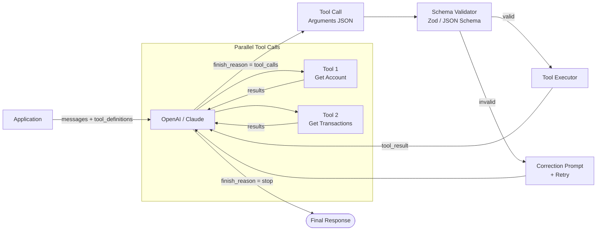

# Function Calling & Structured Outputs

## Category

AI / LLM Integration — Integration Patterns

## Context

Function calling (also called tool use) enables LLMs to produce structured JSON outputs that invoke predefined functions rather than returning free-form text. Structured outputs build on this to guarantee valid JSON matching a schema on every call. Together they are the foundation for reliable LLM integration with production systems.

### Evolution of Structured Output Support

| Method | Reliability | Format Guarantee |
|--------|------------|-----------------|
| **"Return JSON" in prompt** | Low (40–70%) | None |
| **`response_format: json_object`** | High (95%+) | Valid JSON, but no schema |
| **`response_format: json_schema`** | Near-100% | Valid JSON matching exact schema |
| **Function calling** | Near-100% for tool invocation | Arguments match function schema |
| **Zod + `zodResponseFormat`** | Near-100% | TypeScript-typed structured output |

### Function Calling Modes

| Mode | Behaviour | Use Case |
|------|-----------|---------|
| `tool_choice: auto` | Model decides when to call tools | General agents |
| `tool_choice: required` | Model must call at least one tool | Guaranteed tool use |
| `tool_choice: {name}` | Model must call specific tool | Forced structured extraction |
| `parallel_tool_calls: true` | Multiple tools simultaneously | Performance optimisation |

## Pros

- Eliminates JSON parsing failures and regex scraping from LLM outputs
- Schema enforcement at the model level reduces downstream validation errors
- Enables type-safe TypeScript integration with library helpers (Zod, instructor)
- Parallel function calls reduce latency in multi-tool agent workflows
- Structured outputs make LLM responses predictable enough for database inserts

## Cons

- Schema complexity affects latency — deeply nested schemas add token overhead
- Some model providers have schema limitations (max properties, no `$ref`)
- Function definitions consume prompt tokens — limit to 10–15 functions max
- Models may fabricate plausible-seeming arguments that fail business validation
- `json_schema` response format requires `strict: true` mode — limits optional fields

## Design Diagram



## Code Sample

### TypeScript — Structured output with Zod schema (OpenAI SDK)

```typescript
import OpenAI from 'openai';
import { zodResponseFormat } from 'openai/helpers/zod';
import { z } from 'zod';

const openai = new OpenAI();

// ── Define output schema with Zod ─────────────────────────────────────────────
const PaymentIntentSchema = z.object({
  intent: z.enum(['payment', 'refund', 'dispute', 'inquiry', 'other']),
  amount: z.number().optional(),
  currency: z.string().length(3).optional(),
  beneficiary: z.string().optional(),
  urgency: z.enum(['low', 'normal', 'high']),
  extractedEntities: z.array(
    z.object({
      type: z.enum(['account', 'amount', 'date', 'reference', 'name']),
      value: z.string(),
    }),
  ),
  confidence: z.number().min(0).max(1),
});

type PaymentIntent = z.infer<typeof PaymentIntentSchema>;

export async function classifyPaymentIntent(userMessage: string): Promise<PaymentIntent> {
  const response = await openai.beta.chat.completions.parse({
    model: 'gpt-4o-2024-08-06',
    messages: [
      {
        role: 'system',
        content: `You are a banking assistant. Extract payment intent and entities from the user message.
Classify the primary intent and extract all financial entities mentioned.
Confidence should reflect how certain you are (0=guess, 1=certain).`,
      },
      { role: 'user', content: userMessage },
    ],
    response_format: zodResponseFormat(PaymentIntentSchema, 'payment_intent'),
  });

  const result = response.choices[0].message.parsed;
  if (!result) throw new Error('Model returned null for structured output');
  return result;
}
```

### TypeScript — Parallel function calling for account summary

```typescript
import OpenAI from 'openai';

const openai = new OpenAI();

// ── Tool definitions ──────────────────────────────────────────────────────────
const tools: OpenAI.Chat.ChatCompletionTool[] = [
  {
    type: 'function',
    function: {
      name: 'get_account_balance',
      description: 'Retrieve the current balance for a bank account',
      strict: true,
      parameters: {
        type: 'object',
        properties: {
          accountId: { type: 'string', description: 'Account identifier (IBAN or internal ID)' },
          currency: { type: 'string', description: 'ISO 4217 currency code', default: 'EUR' },
        },
        required: ['accountId'],
        additionalProperties: false,
      },
    },
  },
  {
    type: 'function',
    function: {
      name: 'get_recent_transactions',
      description: 'Get the most recent transactions for an account',
      strict: true,
      parameters: {
        type: 'object',
        properties: {
          accountId: { type: 'string' },
          limit: { type: 'number', description: 'Number of transactions (max 50)' },
        },
        required: ['accountId', 'limit'],
        additionalProperties: false,
      },
    },
  },
];

// ── Tool executor (replace stubs with real DB/API calls) ─────────────────────
async function executeToolCall(
  name: string,
  args: Record<string, unknown>,
): Promise<string> {
  switch (name) {
    case 'get_account_balance':
      // Stub
      return JSON.stringify({ accountId: args.accountId, balance: 5423.18, currency: 'EUR' });
    case 'get_recent_transactions':
      // Stub
      return JSON.stringify({
        transactions: [
          { date: '2026-03-24', description: 'Grocery Store', amount: -45.20 },
          { date: '2026-03-23', description: 'Salary Deposit', amount: 2500.00 },
        ],
      });
    default:
      return JSON.stringify({ error: `Unknown tool: ${name}` });
  }
}

// ── Agentic loop with parallel tool calls ──────────────────────────────────────
export async function getAccountSummary(
  accountId: string,
  userQuestion: string,
): Promise<string> {
  const messages: OpenAI.Chat.ChatCompletionMessageParam[] = [
    {
      role: 'system',
      content: 'You are a helpful banking assistant. Use tools to retrieve accurate account data.',
    },
    { role: 'user', content: `Account: ${accountId}. ${userQuestion}` },
  ];

  const response = await openai.chat.completions.create({
    model: 'gpt-4o',
    messages,
    tools,
    tool_choice: 'auto',
    parallel_tool_calls: true, // Allow multiple tools simultaneously
  });

  const choice = response.choices[0];

  if (choice.finish_reason !== 'tool_calls' || !choice.message.tool_calls) {
    return choice.message.content ?? '';
  }

  // Execute all tool calls in parallel
  messages.push(choice.message);

  const toolResults = await Promise.all(
    choice.message.tool_calls.map(async (toolCall) => {
      const args = JSON.parse(toolCall.function.arguments) as Record<string, unknown>;
      const result = await executeToolCall(toolCall.function.name, args);
      return { toolCallId: toolCall.id, result };
    }),
  );

  // Append all tool results
  for (const { toolCallId, result } of toolResults) {
    messages.push({ role: 'tool', tool_call_id: toolCallId, content: result });
  }

  // Final response with all tool data
  const finalResponse = await openai.chat.completions.create({
    model: 'gpt-4o',
    messages,
  });

  return finalResponse.choices[0].message.content ?? '';
}
```

### TypeScript — JSON schema extraction without Zod (strict mode)

```typescript
import OpenAI from 'openai';

const openai = new OpenAI();

interface KYCExtraction {
  fullName: string;
  dateOfBirth: string;
  nationality: string;
  documentType: 'passport' | 'national_id' | 'drivers_licence';
  documentNumber: string;
  documentExpiry: string;
  addressLine1?: string;
  city?: string;
  postcode?: string;
  country?: string;
}

export async function extractKYCFromText(documentText: string): Promise<KYCExtraction> {
  const response = await openai.chat.completions.create({
    model: 'gpt-4o-2024-08-06',
    messages: [
      {
        role: 'system',
        content: 'Extract KYC data from the provided identity document text.',
      },
      { role: 'user', content: documentText },
    ],
    response_format: {
      type: 'json_schema',
      json_schema: {
        name: 'kyc_extraction',
        strict: true,
        schema: {
          type: 'object',
          properties: {
            fullName: { type: 'string' },
            dateOfBirth: { type: 'string', description: 'ISO 8601 format: YYYY-MM-DD' },
            nationality: { type: 'string', description: 'ISO 3166-1 alpha-2 country code' },
            documentType: { type: 'string', enum: ['passport', 'national_id', 'drivers_licence'] },
            documentNumber: { type: 'string' },
            documentExpiry: { type: 'string', description: 'ISO 8601 format: YYYY-MM-DD' },
            addressLine1: { type: ['string', 'null'] },
            city: { type: ['string', 'null'] },
            postcode: { type: ['string', 'null'] },
            country: { type: ['string', 'null'] },
          },
          required: [
            'fullName', 'dateOfBirth', 'nationality',
            'documentType', 'documentNumber', 'documentExpiry',
            'addressLine1', 'city', 'postcode', 'country',
          ],
          additionalProperties: false,
        },
      },
    },
  });

  return JSON.parse(response.choices[0].message.content ?? '{}') as KYCExtraction;
}
```
