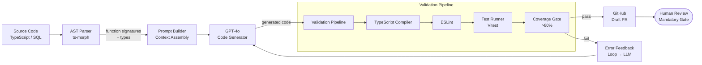

# AI-Assisted Code Generation Pipelines

## Category

AI / LLM Integration — Developer Productivity

## Context

AI-assisted code generation pipelines automate repetitive or pattern-heavy development tasks: scaffolding, test generation, code review, documentation, and migration. When integrated into CI/CD workflows they act as an automated pair programmer that runs consistently on every commit.

### Code Generation Use Cases

| Use Case | Automation Level | Quality Gate |
|----------|----------------|-------------|
| **Test generation** | Full auto-generate from source | Compiled + test runner passes |
| **API client SDK generation** | Full auto from OpenAPI spec | Type-check + contract test |
| **Documentation generation** | Full auto from code + comments | Human review before publish |
| **Code review assistant** | Flag issues, suggest fixes | Human accepts/rejects |
| **Migration assistant** | Draft PR, human approves | Human review mandatory |
| **Scaffold generator** | Generate boilerplate from template | Lint + type-check |
| **SQL query generation** | Draft from natural language | Dry-run on dev DB |

### Pipeline Stages

| Stage | Tool | Output |
|-------|------|--------|
| Analyse source code | AST parser (ts-morph, tree-sitter) | Function signatures, types |
| Generate with LLM | GPT-4o with structured output | Test / doc / code draft |
| Validate syntax | TypeScript compiler, ESLint | Compile errors |
| Run quality checks | Test runner, coverage | Pass/fail |
| Create PR | GitHub CLI / Octokit | Draft PR with diff |
| Human review gate | GitHub PR review | Merge or reject |

## Pros

- Dramatically reduces time for boilerplate tasks (unit tests, CRUD, converters)
- Consistent code style when combined with project-specific prompt templates
- Enables rapid scaffolding for new services from architectural blueprints
- AI code review catches common security patterns (injection, unhandled errors)
- Generates documentation that stays in sync with code on every commit

## Cons

- Generated code requires mandatory human review — models hallucinate APIs
- Context window limits mean large codebases need chunking strategies
- Generated tests may be tautological (testing mocks rather than logic)
- Security risk: blindly accepting generated code without review opens vulnerabilities
- Maintenance burden if generated files are not clearly marked as generated

## Design Diagram



## Code Sample

### TypeScript — Automated unit test generator using ts-morph

```typescript
import { Project, SourceFile, FunctionDeclaration } from 'ts-morph';
import OpenAI from 'openai';
import * as fs from 'fs';
import * as path from 'path';

const openai = new OpenAI();

interface FunctionInfo {
  name: string;
  signature: string;
  body: string;
  parameters: Array<{ name: string; type: string }>;
  returnType: string;
}

// ── Extract function metadata from TypeScript source ──────────────────────────
function extractFunctions(sourceFilePath: string): FunctionInfo[] {
  const project = new Project({ compilerOptions: { strict: true } });
  const sourceFile: SourceFile = project.addSourceFileAtPath(sourceFilePath);

  return sourceFile
    .getFunctions()
    .filter((fn): fn is FunctionDeclaration => fn.isExported())
    .map((fn) => ({
      name: fn.getName() ?? 'anonymous',
      signature: fn.getText().split('{')[0].trim(),
      body: fn.getText(),
      parameters: fn.getParameters().map((p) => ({
        name: p.getName(),
        type: p.getType().getText(),
      })),
      returnType: fn.getReturnType().getText(),
    }));
}

// ── Generate unit tests for a function ────────────────────────────────────────
async function generateTestsForFunction(
  fn: FunctionInfo,
  importPath: string,
): Promise<string> {
  const response = await openai.chat.completions.create({
    model: 'gpt-4o',
    messages: [
      {
        role: 'system',
        content: `You are an expert TypeScript test engineer.
Generate comprehensive Vitest unit tests for the provided function.

Rules:
- Use describe/it blocks
- Test happy path, edge cases, and error cases
- Use vi.mock() for external dependencies
- No any types
- Tests must import from '${importPath}'
- Return ONLY the test file content — no explanation`,
      },
      {
        role: 'user',
        content: `Generate tests for this function:\n\n\`\`\`typescript\n${fn.body}\n\`\`\``,
      },
    ],
    temperature: 0.2,
    max_tokens: 2048,
  });

  return response.choices[0].message.content ?? '';
}

// ── Validation: try to compile generated tests ────────────────────────────────
async function validateGeneratedCode(code: string, tmpFilePath: string): Promise<boolean> {
  const { execSync } = await import('child_process');
  fs.writeFileSync(tmpFilePath, code, 'utf-8');
  try {
    execSync(`npx tsc --noEmit --strict "${tmpFilePath}"`, { stdio: 'ignore' });
    return true;
  } catch {
    return false;
  } finally {
    if (fs.existsSync(tmpFilePath)) fs.unlinkSync(tmpFilePath);
  }
}

// ── Main pipeline ──────────────────────────────────────────────────────────────
export async function generateTestFile(
  sourceFilePath: string,
  outputDir: string,
): Promise<void> {
  const functions = extractFunctions(sourceFilePath);
  if (functions.length === 0) {
    console.log(`[codegen] No exported functions found in ${sourceFilePath}`);
    return;
  }

  const basename = path.basename(sourceFilePath, '.ts');
  const importPath = `../${basename}`;
  const testFilePath = path.join(outputDir, `${basename}.generated.test.ts`);

  const allTests: string[] = [
    `// AUTO-GENERATED — do not edit manually. Re-run codegen to update.`,
    `// Generated: ${new Date().toISOString()}`,
    `import { describe, it, expect, vi } from 'vitest';`,
    `import * as subject from '${importPath}';`,
    '',
  ];

  for (const fn of functions) {
    console.log(`[codegen] Generating tests for: ${fn.name}`);
    const tests = await generateTestsForFunction(fn, importPath);
    allTests.push(tests);
  }

  const combined = allTests.join('\n');
  const tmpPath = `/tmp/validate-${Date.now()}.ts`;
  const valid = await validateGeneratedCode(combined, tmpPath);

  if (!valid) {
    console.warn(`[codegen] Generated tests did not pass type-check for ${basename}`);
  }

  fs.writeFileSync(testFilePath, combined, 'utf-8');
  console.log(`[codegen] Written: ${testFilePath} (type-check: ${valid ? 'pass' : 'WARN'})`);
}
```

### TypeScript — AI code review pipeline (GitHub Actions integration)

```typescript
import OpenAI from 'openai';
import { execSync } from 'child_process';

const openai = new OpenAI();

interface ReviewComment {
  file: string;
  line: number;
  severity: 'info' | 'warning' | 'error';
  category: string;
  message: string;
  suggestion?: string;
}

interface ReviewResult {
  summary: string;
  comments: ReviewComment[];
  approved: boolean;
}

async function reviewDiff(diff: string, prDescription: string): Promise<ReviewResult> {
  const response = await openai.chat.completions.create({
    model: 'gpt-4o',
    messages: [
      {
        role: 'system',
        content: `You are an expert code reviewer focusing on:
1. Security vulnerabilities (OWASP Top 10)
2. TypeScript type safety (no 'any', proper nullability)
3. Error handling completeness
4. Performance anti-patterns
5. Test coverage gaps

Return JSON: {
  "summary": "overall assessment",
  "approved": true/false,
  "comments": [{"file", "line", "severity", "category", "message", "suggestion"}]
}

Only flag real issues. Do not nitpick style that ESLint handles.`,
      },
      {
        role: 'user',
        content: `PR DESCRIPTION:\n${prDescription}\n\nDIFF:\n${diff}`,
      },
    ],
    response_format: { type: 'json_object' },
    temperature: 0.1,
    max_tokens: 4096,
  });

  return JSON.parse(response.choices[0].message.content ?? '{}') as ReviewResult;
}

export async function runCodeReview(): Promise<ReviewResult> {
  // Get diff from git (typically run in CI against base branch)
  const diff = execSync('git diff origin/main...HEAD -- "*.ts" "*.tsx"', {
    encoding: 'utf-8',
    maxBuffer: 100 * 1024, // 100KB diff limit
  });

  if (!diff.trim()) {
    return { summary: 'No TypeScript changes to review.', comments: [], approved: true };
  }

  // Truncate if extremely large diff
  const truncatedDiff = diff.length > 80_000 ? diff.slice(0, 80_000) + '\n[diff truncated]' : diff;

  const prDescription = process.env.PR_DESCRIPTION ?? 'No description provided';
  return reviewDiff(truncatedDiff, prDescription);
}
```

### YAML — GitHub Actions CI for AI code generation

```yaml
# .github/workflows/ai-test-generation.yml
name: AI Test Generation

on:
  pull_request:
    paths:
      - "src/**/*.ts"
      - "!src/**/*.test.ts"
      - "!src/**/*.spec.ts"

permissions:
  contents: write
  pull-requests: write

jobs:
  generate-tests:
    runs-on: ubuntu-latest
    steps:
      - uses: actions/checkout@v4
        with:
          fetch-depth: 0

      - uses: actions/setup-node@v4
        with:
          node-version: "22"
          cache: npm

      - run: npm ci

      - name: Detect changed source files
        id: changed
        run: |
          CHANGED=$(git diff --name-only origin/main...HEAD -- 'src/**/*.ts' \
            | grep -v '\.test\.' | grep -v '\.spec\.' | head -10)
          echo "files<<EOF" >> $GITHUB_OUTPUT
          echo "$CHANGED" >> $GITHUB_OUTPUT
          echo "EOF" >> $GITHUB_OUTPUT

      - name: Run AI test generator
        env:
          OPENAI_API_KEY: ${{ secrets.OPENAI_API_KEY }}
        run: |
          while IFS= read -r file; do
            [ -z "$file" ] && continue
            node scripts/generate-tests.js "$file" "src/__generated_tests__"
          done <<< "${{ steps.changed.outputs.files }}"

      - name: Validate generated tests
        run: npx vitest run src/__generated_tests__/ --reporter=verbose

      - name: Commit generated tests
        uses: stefanzweifel/git-auto-commit-action@v5
        with:
          commit_message: "test: AI-generated tests for changed source files [skip ci]"
          file_pattern: "src/__generated_tests__/*.generated.test.ts"
```
