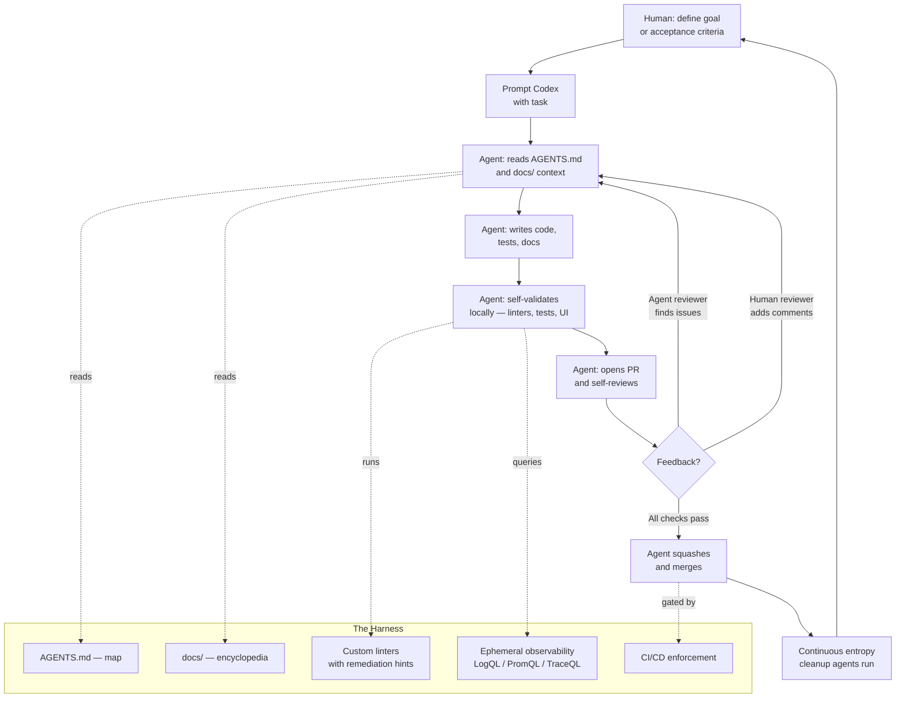

# Harness Engineering

## Category

AI / LLM Integration — Agent-First Development

## Context

Harness engineering is the discipline of building and maintaining the environment, tooling, scaffolding, and feedback loops that allow AI coding agents to do reliable, high-quality software development work at scale.

The term comes from OpenAI's experiment (published February 2026) where a team of **3–7 engineers** built a million-line production codebase in ~5 months using **Codex agents exclusively** — with zero manually written code. The "harness" is everything that enables agents to execute: the repo structure, knowledge base, linting rules, observability wiring, CI/CD, and agent guidance.

> **Core philosophy:** Humans steer. Agents execute.

The primary job of a harness engineer is **not** to write code, but to design the conditions under which agents can write good code autonomously.

### Traditional vs Harness Engineering

| Traditional Engineering | Harness Engineering |
|------------------------|---------------------|
| Human writes every line | Agent writes every line |
| Bottleneck: developer throughput | Bottleneck: human time & attention |
| Reviews happen before merge | Agents self-review; humans review selectively |
| ~10 PRs/engineer/week | ~3.5 PRs/engineer/day (25× improvement) |
| Documentation is secondary | Documentation is a first-class system input |
| Taste enforced via PR review | Taste enforced via linters and CI rules |
| Debug implementation details | Debug agent failure modes |
| Onboard new engineers | Onboard the agent via docs and tooling |

### The Five Pillars

| Pillar | Principle | Key Mechanism |
|--------|-----------|--------------|
| **1 — Repo as System of Record** | If the agent cannot see it in-context, it does not exist | `AGENTS.md` as map; `docs/` as encyclopedia |
| **2 — Agent Legibility** | Optimise the codebase for the agent's ability to reason | Ephemeral local app per git worktree; telemetry accessible to agent |
| **3 — Architecture Enforcement** | Enforce invariants, not implementations | Layered domain linters; taste rules with remediation hints in error messages |
| **4 — Feedback Loops** | When the agent fails, fix the harness, not the prompt | Self-review loop; agent-to-agent review before human review |
| **5 — Entropy Management** | Pay technical debt continuously, not in sprints | Background cleanup agents; `QUALITY_SCORE.md` updated automatically |

### Pillar 1 — Repository as System of Record

Everything the agent needs to make good decisions must live in the repository as versioned, structured artifacts. Knowledge in Slack, Google Docs, or people's heads is invisible to the agent.

| Artifact | Purpose |
|----------|---------|
| `AGENTS.md` | Short (~100 lines) table of contents; entry point for all agent context |
| `ARCHITECTURE.md` | Top-level map of domains, package layering, dependency rules |
| `docs/design-docs/` | Design decisions with verification status and core beliefs |
| `docs/exec-plans/` | Active, completed, and tech-debt plans — versioned |
| `docs/product-specs/` | Product requirements as agent-readable specs |
| `docs/references/` | Vendor docs converted to `llms.txt` format |
| `QUALITY_SCORE.md` | Per-domain quality grades; updated by background agents |
| `SECURITY.md`, `RELIABILITY.md` | Enforced non-functional standards |

**Map, not manual.** `AGENTS.md` is the table of contents, not the encyclopedia. It rots if it tries to be both. Agents follow pointers to deeper context as needed — progressive disclosure.

### Pillar 3 — Architecture Enforcement

Layered domain architecture with mechanically enforced dependency directions:

```
Types → Config → Repo → Service → Runtime → UI
                                 ↑
             Providers (cross-cutting: auth, telemetry, feature flags)
```

Code may only depend **forward** through the layers. Violations are caught by custom linters whose error messages carry remediation instructions the agent can read and act on directly.

| Rule | Enforcement |
|------|------------|
| Parse data at the boundary (parse-don't-validate) | Linter |
| Structured logging (no `console.log`) | Custom lint |
| File size limits | CI check |
| Naming conventions for schemas and types | Linter |
| Platform reliability requirements | Structural tests |
| Human-readable error messages with remediation hints | Lint error messages |

### Common Failure Modes

| Failure Mode | Root Cause | Fix |
|-------------|-----------|-----|
| Agent produces inconsistent output | Underspecified environment | Add tools, docs, and linting rules |
| Codebase drifts architecturally | No mechanical enforcement | Add custom linter with remediation hints |
| Agent "forgets" conventions | Context overflow from monolithic AGENTS.md | Split into progressive, indexed docs |
| Agent makes wrong assumptions about a library | Library too opaque | Re-implement the necessary subset in-repo |
| Stale documentation | No verification mechanism | Add CI linters checking doc freshness |
| Human review becomes bottleneck | All PRs gated on human approval | Build agent reviewer pipeline |
| "AI slop" accumulates | No entropy management process | Encode golden principles + run background cleanup agents |

## Pros

- 25× throughput improvement over traditional engineering in demonstrated real-world use
- Human effort shifts to highest-value work: priorities, acceptance criteria, taste encoding
- Every rule mechanically enforced — reliability exceeds PR-review-only enforcement
- Any capability added to the harness benefits all future agent runs immediately
- Background entropy agents prevent technical debt from degrading agent output quality over time

## Cons

- Initial harness investment is high — takes weeks before agents are productive
- All knowledge must be externalised to the repo; tribal knowledge renders agents blind
- Custom linting infrastructure requires ongoing maintenance as the codebase evolves
- Teams must accept that humans review outcomes, not every change — cultural shift required
- Agent failure modes are unfamiliar: context overflow, stale docs, missing tools vs logic bugs

## Design Diagram



## Code Sample

### TypeScript — Architecture fitness function: enforce layer dependency rules

```typescript
import * as fs from 'fs';
import * as path from 'path';

// Encode the layered domain architecture as a CI fitness function.
// Error messages include remediation instructions that agents can read and act on.

type Layer = 'types' | 'config' | 'repo' | 'service' | 'runtime' | 'ui' | 'providers';

const LAYER_ORDER: Layer[] = ['types', 'config', 'repo', 'service', 'runtime', 'ui'];
const CROSS_CUTTING: Layer[] = ['providers'];

function inferLayer(filePath: string): Layer | null {
  const parts = filePath.split('/');
  for (const layer of [...LAYER_ORDER, ...CROSS_CUTTING]) {
    if (parts.includes(layer)) return layer as Layer;
  }
  return null;
}

function isAllowedImport(from: Layer, to: Layer): boolean {
  if (CROSS_CUTTING.includes(to)) return true;   // cross-cutting always importable
  if (CROSS_CUTTING.includes(from)) return true; // providers may import anything
  return LAYER_ORDER.indexOf(to) <= LAYER_ORDER.indexOf(from); // only import same or earlier
}

interface ArchViolation {
  file: string;
  importedFile: string;
  fromLayer: Layer;
  toLayer: Layer;
  remediation: string; // machine-readable fix instruction for the agent
}

function extractImports(filePath: string): string[] {
  const content = fs.readFileSync(filePath, 'utf-8');
  const importRegex = /from\s+['"]([^'"]+)['"]/g;
  const imports: string[] = [];
  let match: RegExpExecArray | null;
  while ((match = importRegex.exec(content)) !== null) imports.push(match[1]);
  return imports;
}

export function checkLayering(srcDir: string): ArchViolation[] {
  const violations: ArchViolation[] = [];

  function walk(dir: string): void {
    for (const entry of fs.readdirSync(dir, { withFileTypes: true })) {
      const fullPath = path.join(dir, entry.name);
      if (entry.isDirectory()) { walk(fullPath); continue; }
      if (!entry.name.endsWith('.ts') && !entry.name.endsWith('.tsx')) continue;

      const relPath = path.relative(srcDir, fullPath);
      const fromLayer = inferLayer(relPath);
      if (!fromLayer) continue;

      for (const imported of extractImports(fullPath)) {
        if (!imported.startsWith('.') && !imported.startsWith('@/')) continue;
        const toLayer = inferLayer(imported);
        if (!toLayer || isAllowedImport(fromLayer, toLayer)) continue;

        const allowedTargets = LAYER_ORDER.slice(0, LAYER_ORDER.indexOf(fromLayer));
        violations.push({
          file: relPath,
          importedFile: imported,
          fromLayer,
          toLayer,
          remediation:
            `Layer '${fromLayer}' must not import from '${toLayer}'. ` +
            `Move shared logic to one of: [${allowedTargets.join(', ')}], ` +
            `or extract it into 'providers/' if it is a cross-cutting concern ` +
            `(auth, telemetry, feature flags, connectors).`
        });
      }
    }
  }

  walk(srcDir);
  return violations;
}

// CI entry point — exit code 1 so the agent can read errors and self-correct
async function main(): Promise<void> {
  const srcDir = process.argv[2] ?? './src';
  const violations = checkLayering(srcDir);

  if (violations.length === 0) {
    console.log('✅ Architecture layer check passed');
    process.exit(0);
  }

  for (const v of violations) {
    // Structured output: agent reads this and knows exactly what to do
    console.error(`ARCH_VIOLATION ${v.file}: imports ${v.importedFile}`);
    console.error(`  [${v.fromLayer}] → [${v.toLayer}] is not allowed`);
    console.error(`  FIX: ${v.remediation}`);
    console.error('');
  }
  process.exit(1);
}

main().catch(console.error);
```

### TypeScript — Quality scorer: generate QUALITY_SCORE.md automatically

```typescript
import * as fs from 'fs';
import * as path from 'path';

// Background agent: runs on a schedule; writes QUALITY_SCORE.md so
// humans and future agents see codebase health at a glance.

interface DomainQuality {
  domain: string;
  lintErrors: number;
  testCoverage: number;      // 0–100
  docFreshnessDays: number;  // days since docs were updated relative to code changes
  archViolations: number;
  grade: 'A' | 'B' | 'C' | 'D' | 'F';
}

function computeGrade(q: Omit<DomainQuality, 'grade'>): DomainQuality['grade'] {
  let score = 100;
  score -= q.lintErrors * 2;
  score -= Math.max(0, 80 - q.testCoverage) * 0.5;
  score -= q.docFreshnessDays > 30 ? 10 : 0;
  score -= q.archViolations * 5;
  if (score >= 90) return 'A';
  if (score >= 75) return 'B';
  if (score >= 60) return 'C';
  if (score >= 40) return 'D';
  return 'F';
}

function generateReport(domains: DomainQuality[]): string {
  const lines = [
    '# QUALITY_SCORE.md',
    '',
    `> Auto-generated ${new Date().toISOString().slice(0, 10)} by quality-scorer agent`,
    '',
    '| Domain | Grade | Lint Errors | Coverage | Doc Freshness | Arch Violations |',
    '|--------|-------|-------------|----------|---------------|-----------------|',
  ];
  for (const d of domains) {
    const freshness = d.docFreshnessDays <= 7  ? '✅ current'
                    : d.docFreshnessDays <= 30 ? '⚠️ aging'
                    : '🔴 stale';
    lines.push(`| ${d.domain} | **${d.grade}** | ${d.lintErrors} | ${d.testCoverage}% | ${freshness} | ${d.archViolations} |`);
  }
  const passing = domains.filter(d => d.grade === 'A' || d.grade === 'B').length;
  lines.push('', `Domains at A/B: ${passing}/${domains.length}`);
  return lines.join('\n');
}

export async function runQualityScorer(srcDirs: string[]): Promise<void> {
  // In production: run `eslint --format json`, parse `vitest coverage-summary.json`,
  // compare `git log` dates for docs/ vs src/, run checkLayering()
  const results: DomainQuality[] = srcDirs.map(domainPath => {
    const q: Omit<DomainQuality, 'grade'> = {
      domain: path.basename(domainPath),
      lintErrors: 0,
      testCoverage: 85,
      docFreshnessDays: 5,
      archViolations: 0,
    };
    return { ...q, grade: computeGrade(q) };
  });
  fs.writeFileSync('QUALITY_SCORE.md', generateReport(results));
  console.log('QUALITY_SCORE.md updated');
}
```

## Key Patterns

### Harness Engineering Principles

| Principle | One-liner |
|-----------|-----------|
| **Map, not manual** | `AGENTS.md` is the table of contents, not the encyclopedia |
| **Repo is the system of record** | If it's not in the repo, it does not exist for the agent |
| **Enforce invariants, not implementations** | Linters multiply taste; don't micromanage style |
| **Legibility over aesthetics** | Optimise for the agent's ability to reason, not human aesthetics |
| **Feedback loops over retries** | When the agent fails, fix the harness — don't re-prompt |
| **Small, frequent, reversible changes** | High throughput + cheap correction = no blocking gates |
| **Continuous entropy management** | Garbage-collect debt via background agents, not Friday sprints |
| **Boring technology wins** | Stable, well-documented, composable = agent-legible |

### Harness Maturity Stages

| Stage | What is in place | Agent capability |
|-------|-----------------|-----------------|
| **0 — Ad hoc** | No harness; freeform prompts | One-off generation; high inconsistency |
| **1 — Documented** | `AGENTS.md` + `ARCHITECTURE.md` | Consistent patterns; occasional drift |
| **2 — Enforced** | Custom linters with remediation messages; CI gates | Architectural rules upheld without human review |
| **3 — Observable** | Ephemeral local app; LogQL/PromQL accessible to agent | Agent validates correctness with real telemetry |
| **4 — Self-reviewing** | Agent-to-agent review pipeline; humans review outcomes | Near-autonomous delivery |
| **5 — Self-maintaining** | Background entropy agents; `QUALITY_SCORE.md` auto-updated | Codebase stays legible for agents indefinitely |

### Human Responsibilities

| Activity | Frequency | Nature |
|----------|-----------|--------|
| Translate user feedback → acceptance criteria | Daily | High-judgment |
| Identify missing harness capabilities when agents fail | Weekly | Root cause analysis |
| Encode taste into linters, docs, and golden principles | Weekly | One-time multiplier |
| Validate agent outcomes; escalate edge cases | Continuous | Audit / oversight |
| Review architectural decisions (ADRs) | Per feature | High-judgment |

## Related Patterns

- [04 — AI Agents & Tool Use](./04-ai-agents-tool-use.md) — Agent architectures that run inside the harness
- [15 — AI-Assisted Code Generation](./15-ai-code-generation-pipelines.md) — Code generation pipelines the harness drives
- [08 — AI Observability](./08-ai-observability.md) — Telemetry the harness exposes to the agent
- [03 — Prompt Engineering](./03-prompt-engineering.md) — Prompt templates stored in the repo as harness artifacts
- [06 — Embedding Pipelines](./06-embedding-pipelines.md) — RAG over the codebase itself (docs as embeddings)

---

## References

- [Harness engineering: leveraging Codex in an agent-first world — OpenAI (Feb 2026)](https://openai.com/index/harness-engineering/)
- [Unlocking the Codex harness — OpenAI (Feb 2026)](https://openai.com/index/unlocking-the-codex-harness/)
- [AGENTS.md community standard](https://agents.md/)
- [Architecture.md — matklad](https://matklad.github.io/2021/02/06/ARCHITECTURE.md.html)
- [Parse, don't validate — Alexis King](https://lexi-lambda.github.io/blog/2019/11/05/parse-don-t-validate/)
- [Codex Execution Plans cookbook](https://cookbook.openai.com/articles/codex_exec_plans)
