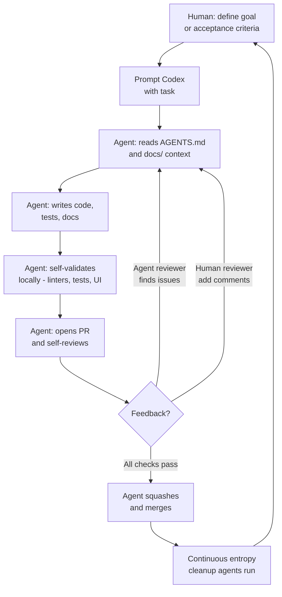
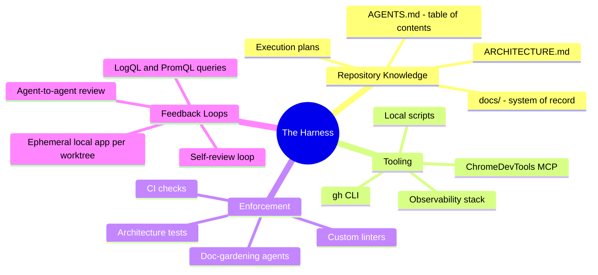
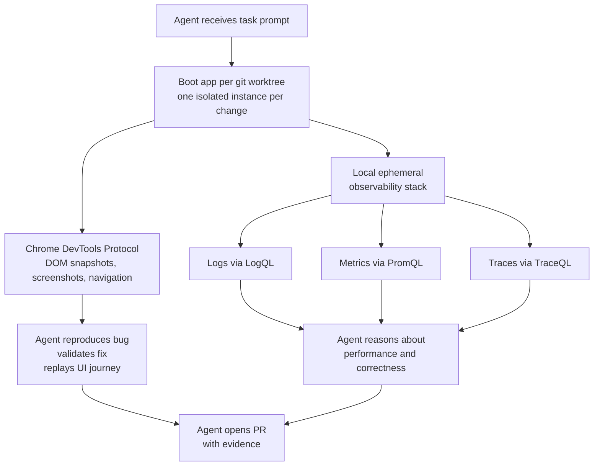
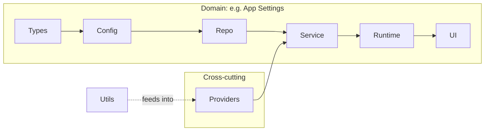
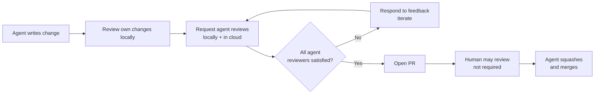
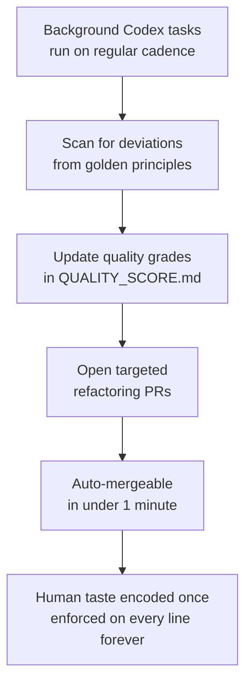
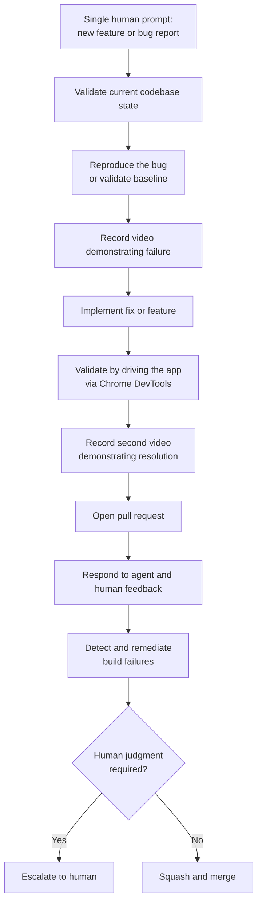

# Harness Engineering

## Category
AI Engineering, Agent-First Development, Coding Agents, Software Development Methodology

---

## What Is It?

**Harness engineering** is the discipline of building and maintaining the environment, tooling, scaffolding, and feedback loops that allow AI coding agents to do reliable, high-quality software development work at scale.

The term comes from OpenAI's experiment (published February 2026) where a team of **3–7 engineers** built a million-line production codebase in ~5 months using **Codex agents exclusively** — with zero manually written code. The "harness" is everything that enables agents to execute: the repo structure, knowledge base, linting rules, observability wiring, CI/CD, and agent guidance.

> **Core philosophy:** Humans steer. Agents execute.

The primary job of a harness engineer is **not** to write code, but to design the conditions under which agents can write good code autonomously.

---

## Why It Matters

Traditional engineering is bottlenecked by how fast humans can write and review code. Harness engineering shifts the constraint:

| Traditional Engineering | Harness Engineering |
|------------------------|---------------------|
| Human writes every line | Agent writes every line |
| Bottleneck: developer throughput | Bottleneck: human time & attention |
| Reviews happen before merge | Agents self-review; humans review selectively |
| ~10 PRs/engineer/week | ~3.5 PRs/engineer/day (25× improvement) |
| Documentation is secondary | Documentation is a first-class system input |
| Taste enforced via PR review | Taste enforced via linters and CI rules |

---

## The Agent-First Development Loop

---

## Key Concept: The Harness

The **harness** is the complete environment the agent runs in. It includes:

Without a well-designed harness, agents produce inconsistent, low-quality output. The harness is what converts a capable model into a reliable engineering teammate.

---

## Pillar 1 — Repository as System of Record

> *If the agent can't see it in-context, it doesn't exist.*

Everything the agent needs to make good decisions must live in the repository as **versioned, structured artifacts**. Knowledge in Slack, Google Docs, or people's heads is invisible to the agent.

### What Goes in the Repo

| Artifact | Purpose |
|----------|---------|
| `AGENTS.md` | Short (≈100 lines) table of contents; entry point for all agent context |
| `ARCHITECTURE.md` | Top-level map of domains, package layering, dependency rules |
| `docs/design-docs/` | Design decisions with verification status and core beliefs |
| `docs/exec-plans/` | Active, completed, and tech-debt plans — versioned |
| `docs/product-specs/` | Product requirements as agent-readable specs |
| `docs/references/` | Vendor docs converted to `llms.txt` format |
| `QUALITY_SCORE.md` | Per-domain quality grades; updated by background agents |
| `SECURITY.md`, `RELIABILITY.md` | Enforced non-functional standards |

### The "Map, Not Manual" Principle

**Wrong:** One giant `AGENTS.md` with every rule.

**Problems with the monolithic approach:**
- Context is a scarce resource — large files crowd out task-relevant code.
- Too much guidance becomes non-guidance; agents pattern-match locally instead of navigating.
- It rots instantly; humans stop maintaining a single massive file.
- Hard to verify freshness or cross-link mechanically.

**Right:** `AGENTS.md` is the map. `docs/` is the encyclopedia. Agents start with the entry point and follow pointers to deeper context as needed — **progressive disclosure**.

---

## Pillar 2 — Agent Legibility

> *Optimise the codebase for the agent's ability to reason about it, not for human aesthetics.*

The codebase should be as understandable to the agent as it would be to a well-onboarded new engineer:

- **Favour "boring" technology** — stable APIs, well-represented in training data, composable.
- **Internalise dependencies** — sometimes reimplementing a small utility beats wrapping a black-box library the agent cannot reason about.
- **Expose everything the agent needs** — logs, metrics, UI state, test output — all accessible to the agent, not just humans.

### Making the Application Legible to Agents

Prompts like *"ensure service startup under 800 ms"* or *"no span in these four critical user journeys exceeds 2 s"* become tractable because agents can query real telemetry.

---

## Pillar 3 — Architecture Enforcement

> *Enforce invariants, not implementations. Constraints are multipliers, not constraints.*

In a human team, strict architecture rules can feel pedantic. With agents, they are prerequisites — the structure is what allows speed without drift.

### Layered Domain Architecture

Each business domain follows a fixed layer ordering with mechanically enforced dependency directions:

- Code may only depend **forward** through the layers.
- Cross-cutting concerns (auth, telemetry, feature flags, connectors) enter **only** via `Providers`.
- Violations are caught by custom linters (themselves Codex-generated).

### Taste Invariants — What Gets Mechanically Enforced

| Rule | Enforcement |
|------|------------|
| Parse data at the boundary (parse-don't-validate) | Linter |
| Structured logging (no `console.log`) | Custom lint |
| File size limits | CI check |
| Naming conventions for schemas and types | Linter |
| Platform-specific reliability requirements | Structural tests |
| Human-readable error messages with remediation hints | Lint error messages |

**Key insight:** Lint error messages are written to inject remediation instructions into agent context — the agent reads the error and knows exactly how to fix it.

---

## Pillar 4 — Feedback Loops and Self-Validation

> *The fix is almost never "try harder." Ask: what capability is missing?*

When the agent fails, human engineers don't retry the same prompt. They identify what is absent — a tool, a guardrail, a piece of documentation — and feed it back into the repository, **always via Codex itself**.

### The Self-Review Loop (Ralph Wiggum Loop)

Over time, nearly all review effort is pushed to **agent-to-agent** review. Humans audit outcomes, not every change.

### Merge Philosophy

In a high-throughput agent system, conventional blocking merge gates become counterproductive:

- PRs are **short-lived**; small and frequent.
- Test flakes: addressed with follow-up rather than blocking indefinitely.
- Corrections are cheap; waiting is expensive.

---

## Pillar 5 — Entropy Management (Garbage Collection)

> *Technical debt is a high-interest loan. Pay it continuously in small increments.*

Agent-generated codebases naturally drift. Agents replicate existing patterns — including uneven or suboptimal ones. Without active management, this compounds.

### Golden Principles

Opinionated, mechanical rules that keep the codebase legible for future agent runs:

- Prefer **shared utility packages** over hand-rolled helpers (centralise invariants).
- Never probe data "YOLO-style" — always validate at the boundary or use typed SDKs.
- No guessing shapes; if the agent can't verify it statically, it doesn't build on it.

### Continuous Cleanup Process

This replaces the manual "slop cleanup Fridays" that don't scale.

---

## What Changes for the Engineer

| Old Engineering World | Harness Engineering World |
|----------------------|--------------------------|
| Write code line-by-line | Design the conditions for good code |
| Debug implementation details | Debug agent failure modes |
| Review every PR | Review outcomes and architectural decisions |
| Document after building | Documentation is a primary system input |
| Enforce patterns via code review | Enforce patterns via linters and CI |
| Onboard new engineers | Onboard the agent via docs and tooling |
| Friday cleanup sprints | Continuous background cleanup agents |

**What humans do:**
- Prioritise work; translate user feedback into acceptance criteria.
- Identify what capability is missing when the agent struggles.
- Encode human taste once into tooling, docs, or linting rules.
- Validate outcomes; escalate when genuine judgment is required.

---

## What Agents Produce

In a full harness engineering setup, agents are responsible for **everything** in the repository:

- Product code and tests
- CI configuration and release tooling
- Internal developer tools and scripts
- Documentation and design history
- Evaluation harnesses
- Review comments and inline responses
- Production dashboard definitions
- Repository management scripts

---

## Full Autonomous Feature Delivery

Once the harness matures, agents can end-to-end drive a feature from a single prompt:

---

## Common Failure Modes and Fixes

| Failure Mode | Root Cause | Fix |
|-------------|-----------|-----|
| Agent produces inconsistent output | Underspecified environment | Add tools, docs, and linting rules |
| Codebase drifts architecturally | No mechanical enforcement | Add custom linter with remediation hints in error messages |
| Agent "forgets" conventions | Context overflow from monolithic AGENTS.md | Split into progressive, indexed docs |
| Agent makes incorrect assumptions about library behaviour | Library too complex/opaque | Reimplement the necessary subset in-repo |
| Stale documentation | No verification mechanism | Add CI linters that check doc freshness; run doc-gardening agents |
| Human review becomes bottleneck | All PRs gated on human approval | Build agent reviewer pipeline; humans review selectively |
| "AI slop" accumulates | No entropy management process | Encode golden principles + run background cleanup agents |

---

## Key Principles Summary

| Principle | One-liner |
|-----------|-----------|
| **Map, not manual** | AGENTS.md is the table of contents, not the encyclopedia |
| **Repo is the system of record** | If it's not in the repo, it doesn't exist for the agent |
| **Enforce invariants, not implementations** | Linters multiply taste; don't micromanage code style |
| **Legibility over aesthetics** | Optimise for the agent's ability to reason, not human preferences |
| **Feedback loops over retries** | When the agent fails, fix the harness, don't re-prompt |
| **Small, frequent, reversible changes** | High throughput + cheap correction = no need for blocking gates |
| **Continuous entropy management** | Garbage-collect debt continuously via background agents |
| **Boring technology wins** | Stable, well-documented, composable = agent-legible |

---

## Study Checklist

- [ ] Explain what "harness engineering" means and why it emerged
- [ ] Describe the core feedback loop in an agent-first workflow
- [ ] Explain the "map, not manual" principle for AGENTS.md
- [ ] List the five types of artifacts that belong in the repo's knowledge base
- [ ] Describe the layered domain architecture pattern and why it matters for agents
- [ ] Explain what "taste invariants" are and how they're enforced
- [ ] Describe the entropy management problem and the garbage collection approach
- [ ] Articulate what the human engineer's job becomes in a harness engineering model
- [ ] Explain what makes a codebase "agent-legible"
- [ ] Describe the self-review loop and its purpose

---

## References

- [Harness engineering: leveraging Codex in an agent-first world — OpenAI (Feb 2026)](https://openai.com/index/harness-engineering/)
- [Unlocking the Codex harness: how we built the App Server — OpenAI (Feb 2026)](https://openai.com/index/unlocking-the-codex-harness/)
- [AGENTS.md community standard](https://agents.md/)
- [Architecture.md pattern — matklad](https://matklad.github.io/2021/02/06/ARCHITECTURE.md.html)
- [Parse, don't validate — Alexis King](https://lexi-lambda.github.io/blog/2019/11/05/parse-don-t-validate/)
- [Strict boundaries and predictable structure for AI — bits.logic.inc](https://bits.logic.inc/p/ai-is-forcing-us-to-write-good-code)
- [Codex Execution Plans cookbook](https://cookbook.openai.com/articles/codex_exec_plans)
