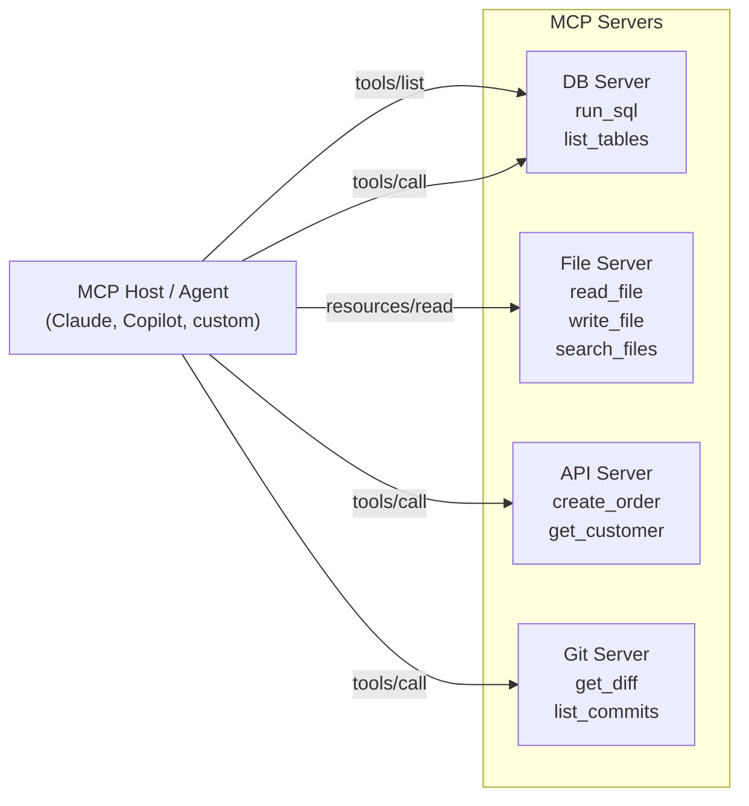

# Model Context Protocol (MCP)

## Category

AI / LLM Integration — Agent Infrastructure, Tool Connectivity, Interoperability

## Context

**Model Context Protocol (MCP)** is an open standard (originally from Anthropic, now widely adopted) that defines how AI agents and LLM applications connect to external tools, data sources, and services. It separates **what a tool does** (MCP Server) from **who calls it** (MCP Client / host), enabling a plug-and-play ecosystem of AI-native integrations.

Before MCP, every agent framework had its own tool-calling convention — LangChain tools, OpenAI functions, Semantic Kernel plugins. MCP replaces this fragmentation with a single transport-agnostic protocol.

### Core Concepts

| Concept | Description |
|---------|-------------|
| **MCP Server** | Exposes tools, resources, and prompts over the protocol |
| **MCP Client** | Agent host that discovers and calls MCP servers |
| **Tools** | Executable actions the LLM can invoke (e.g., `run_sql`, `search_files`) |
| **Resources** | Read-only data the LLM can access (e.g., file contents, DB rows) |
| **Prompts** | Reusable prompt templates registered on the server |
| **Sampling** | Server-initiated LLM calls back through the client |

### Transport Options

| Transport | Use Case |
|-----------|---------|
| **stdio** | Local process (CLI tools, IDE plugins) |
| **HTTP + SSE** | Remote servers, cloud deployments |
| **WebSocket** | Low-latency bidirectional (planned) |

### MCP vs Function Calling

| Dimension | OpenAI Function Calling | MCP |
|-----------|------------------------|-----|
| Portability | Tied to OpenAI API shape | Model-agnostic |
| Discovery | Static schema in request | Dynamic listing at runtime |
| Lifecycle | Per-request | Persistent server connection |
| Multi-tool server | One schema blob | Structured server registry |
| Ecosystem | Provider-specific | Cross-framework (Claude, GPT, Gemini, local) |

---

## Pros

- Tool definitions live in the MCP server — no code changes to the agent when tools evolve.
- Any MCP-compatible client (Claude Desktop, GitHub Copilot, custom agents) can use the same server immediately.
- Resources allow agents to read live data (files, DB rows) without bespoke retrieval code per integration.
- Official SDKs in TypeScript and Python reduce boilerplate to a few dozen lines.
- Composable: run many MCP servers simultaneously, each encapsulating one domain.

---

## Cons

- Relatively young standard (2024–2025) — some edge cases and versioning semantics still evolving.
- stdio transport unsuitable for production multi-tenant deployments — requires HTTP/SSE for scale.
- No built-in auth standard yet — authentication must be layered on at the transport level.
- Server-initiated sampling (reverse LLM calls) adds latency and architectural complexity.
- Debugging MCP interactions requires protocol-level tooling (MCP Inspector) rather than normal unit tests.

---

## Design Diagram



---

## Code Sample

### TypeScript — MCP server exposing database tools

```typescript
import { McpServer } from '@modelcontextprotocol/sdk/server/mcp.js';
import { StdioServerTransport } from '@modelcontextprotocol/sdk/server/stdio.js';
import { z } from 'zod';
import { Pool } from 'pg';

const pool = new Pool({ connectionString: process.env.DATABASE_URL });

const server = new McpServer({
  name: 'orders-db-server',
  version: '1.0.0',
});

// ── Tool: run_sql ─────────────────────────────────────────────────────────
server.tool(
  'run_sql',
  'Run a read-only SQL SELECT against the orders database',
  {
    query: z.string().describe('A valid read-only SQL SELECT statement'),
    limit: z.number().min(1).max(100).default(20).describe('Row limit'),
  },
  async ({ query, limit }) => {
    // Safety: reject non-SELECT statements
    if (!/^\s*SELECT\b/i.test(query)) {
      return { content: [{ type: 'text', text: 'Error: only SELECT queries are allowed' }], isError: true };
    }

    const result = await pool.query(`${query} LIMIT $1`, [limit]);
    return {
      content: [
        {
          type: 'text',
          text: JSON.stringify({ rows: result.rows, rowCount: result.rowCount }, null, 2),
        },
      ],
    };
  }
);

// ── Tool: get_order ───────────────────────────────────────────────────────
server.tool(
  'get_order',
  'Fetch a single order by ID with full details',
  { orderId: z.string().uuid() },
  async ({ orderId }) => {
    const { rows } = await pool.query(
      'SELECT o.*, c.name AS customer_name FROM orders o JOIN customers c ON c.id = o.customer_id WHERE o.id = $1',
      [orderId]
    );

    if (rows.length === 0) {
      return { content: [{ type: 'text', text: `Order ${orderId} not found` }], isError: true };
    }

    return { content: [{ type: 'text', text: JSON.stringify(rows[0], null, 2) }] };
  }
);

// ── Resource: schema ──────────────────────────────────────────────────────
server.resource(
  'db-schema',
  'postgres://schema',
  async (uri) => {
    const { rows } = await pool.query(`
      SELECT table_name, column_name, data_type
      FROM information_schema.columns
      WHERE table_schema = 'public'
      ORDER BY table_name, ordinal_position
    `);
    return { contents: [{ uri: uri.href, text: JSON.stringify(rows, null, 2), mimeType: 'application/json' }] };
  }
);

// ── Start server ──────────────────────────────────────────────────────────
const transport = new StdioServerTransport();
await server.connect(transport);
```

### TypeScript — MCP client connecting to a server

```typescript
import { Client } from '@modelcontextprotocol/sdk/client/index.js';
import { StdioClientTransport } from '@modelcontextprotocol/sdk/client/stdio.js';
import OpenAI from 'openai';

// Connect to the MCP server via stdio
const transport = new StdioClientTransport({
  command: 'npx',
  args: ['tsx', 'src/orders-db-server.ts'],
});

const mcpClient = new Client({ name: 'orders-agent', version: '1.0.0' });
await mcpClient.connect(transport);

// Discover available tools dynamically
const { tools } = await mcpClient.listTools();

// Convert MCP tool definitions to OpenAI function format
const openaiTools = tools.map(tool => ({
  type: 'function' as const,
  function: {
    name: tool.name,
    description: tool.description,
    parameters: tool.inputSchema,
  },
}));

const openai = new OpenAI();
const messages: OpenAI.Chat.ChatCompletionMessageParam[] = [
  { role: 'user', content: 'Show me all orders over $1000 from last week' },
];

// Agentic loop
while (true) {
  const response = await openai.chat.completions.create({
    model: 'gpt-4o',
    messages,
    tools: openaiTools,
    tool_choice: 'auto',
  });

  const choice = response.choices[0];
  messages.push(choice.message);

  if (choice.finish_reason === 'stop') {
    console.log('Answer:', choice.message.content);
    break;
  }

  if (choice.finish_reason === 'tool_calls' && choice.message.tool_calls) {
    for (const toolCall of choice.message.tool_calls) {
      const result = await mcpClient.callTool({
        name: toolCall.function.name,
        arguments: JSON.parse(toolCall.function.arguments),
      });

      messages.push({
        role: 'tool',
        tool_call_id: toolCall.id,
        content: result.content[0].type === 'text' ? result.content[0].text : '',
      });
    }
  }
}

await mcpClient.close();
```

### HTTP/SSE transport — production MCP server

```typescript
import { McpServer } from '@modelcontextprotocol/sdk/server/mcp.js';
import { SSEServerTransport } from '@modelcontextprotocol/sdk/server/sse.js';
import express from 'express';

const app = express();
const server = new McpServer({ name: 'orders-api-server', version: '1.0.0' });

// Register tools...
server.tool('ping', 'Health check', {}, async () => ({
  content: [{ type: 'text', text: 'pong' }],
}));

// SSE endpoint — one session per connection
const sessions = new Map<string, SSEServerTransport>();

app.get('/mcp/sse', async (req, res) => {
  const sessionId = crypto.randomUUID();
  res.setHeader('Content-Type', 'text/event-stream');
  res.setHeader('Cache-Control', 'no-cache');

  const transport = new SSEServerTransport(`/mcp/message/${sessionId}`, res);
  sessions.set(sessionId, transport);
  await server.connect(transport);

  req.on('close', () => sessions.delete(sessionId));
});

app.post('/mcp/message/:sessionId', express.json(), async (req, res) => {
  const transport = sessions.get(req.params.sessionId);
  if (!transport) return res.status(404).json({ error: 'Session not found' });
  await transport.handlePostMessage(req, res);
});

app.listen(3000, () => console.log('MCP server on http://localhost:3000'));
```

### mcp.json — Claude Desktop / VS Code configuration

```json
{
  "mcpServers": {
    "orders-db": {
      "command": "npx",
      "args": ["tsx", "/path/to/orders-db-server.ts"],
      "env": {
        "DATABASE_URL": "postgresql://localhost:5432/orders"
      }
    },
    "filesystem": {
      "command": "npx",
      "args": ["-y", "@modelcontextprotocol/server-filesystem", "/workspace"]
    }
  }
}
```

---

## Related

- [04 — AI Agents & Tool Use](./04-ai-agents-tool-use.md) — MCP replaces ad-hoc function definitions in agent loops
- [14 — Function Calling & Structured Outputs](./14-function-calling-structured-outputs.md) — MCP tools use the same JSON Schema format
- [18 — Multi-Agent Orchestration](./18-multi-agent-orchestration.md) — MCP servers shared across multiple specialised agents
