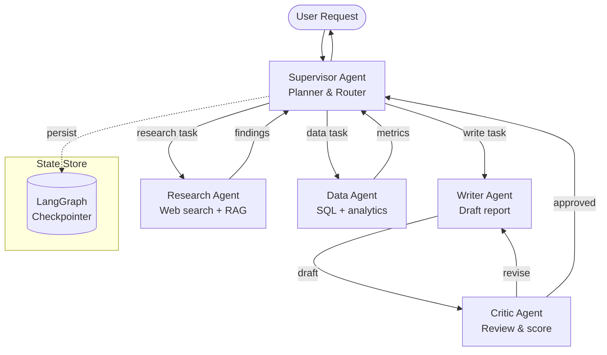

# Multi-Agent Orchestration

## Category

AI / LLM Integration — Agentic Systems, Orchestration, LangGraph, CrewAI

## Context

Multi-agent systems decompose complex goals across **specialised agents** that each own a narrow domain. An **orchestrator** (supervisor) delegates work to worker agents, collects results, and decides next steps — enabling parallelism, specialisation, and separation of concerns beyond what a single ReAct loop can handle.

### Orchestration Patterns

| Pattern | Description | Best For |
|---------|-------------|---------|
| **Supervisor / Worker** | Single orchestrator routes tasks to specialist agents | Diverse skill sets, unpredictable task flow |
| **Hierarchical** | Orchestrators of orchestrators — nested delegation | Very large, complex goals |
| **Sequential Pipeline** | Agents run as a fixed chain (A → B → C) | ETL-style predictable workflows |
| **Parallel Fan-Out** | Orchestrator splits work, merges results | Independent sub-tasks (research, data gathering) |
| **Debate / Critique** | Agents challenge each other's outputs | High-accuracy decisions |
| **Swarm / Handoff** | Agents hand off mid-task when specialisation changes | Fluid task routing |

### Frameworks

| Framework | Language | Paradigm |
|-----------|---------|---------|
| **LangGraph** | Python / JS | Stateful graph (nodes & edges) |
| **CrewAI** | Python | Role-based crew definition |
| **AutoGen** | Python | Conversational multi-agent |
| **Mastra** | TypeScript | Typed workflow + agent SDK |
| **Amazon Bedrock Agents** | Managed | Serverless multi-agent |

---

## Pros

- Specialised agents with focused system prompts outperform a single generalist on complex tasks.
- Parallel fan-out dramatically reduces wall-clock time for independent subtasks.
- Supervisor can retry failed sub-agents with different strategies without user involvement.
- LangGraph's persistent state enables long-running workflows that survive restarts.
- Human-in-the-loop gates can be inserted at any edge in the graph.

---

## Cons

- Debugging emergent multi-agent behaviour is much harder than a single agent loop.
- Token cost multiplies with the number of agents — each agent call is billed separately.
- Orchestrator can become a bottleneck if it has to process all inter-agent messages.
- Circular delegation loops possible without explicit cycle detection / step limits.
- State synchronisation across agents is non-trivial; shared state can cause race conditions.

---

## Design Diagram



---

## Code Sample

### LangGraph — supervisor + specialist agents (Python)

```python
from langgraph.graph import StateGraph, END
from langgraph.prebuilt import create_react_agent
from langchain_openai import ChatOpenAI
from typing import TypedDict, Literal
import operator

llm = ChatOpenAI(model="gpt-4o", temperature=0)

# ── Agent State ────────────────────────────────────────────────────────────
class AgentState(TypedDict):
    messages: list
    next_agent: str
    final_answer: str | None

# ── Specialist Agents ──────────────────────────────────────────────────────
research_agent = create_react_agent(
    llm,
    tools=[web_search_tool, rag_retrieval_tool],
    state_modifier="You are a research specialist. Find accurate, cited information."
)

data_agent = create_react_agent(
    llm,
    tools=[run_sql_tool, compute_metrics_tool],
    state_modifier="You are a data analyst. Return precise numbers and trends."
)

writer_agent = create_react_agent(
    llm,
    tools=[],
    state_modifier="You are a technical writer. Synthesise research and data into a clear report."
)

# ── Supervisor ─────────────────────────────────────────────────────────────
SUPERVISOR_PROMPT = """
You are an orchestrator managing: research_agent, data_agent, writer_agent.
Given the conversation, decide who acts next or output FINISH.
Reply with JSON: {"next": "research_agent" | "data_agent" | "writer_agent" | "FINISH"}
"""

def supervisor_node(state: AgentState) -> AgentState:
    response = llm.invoke([
        {"role": "system", "content": SUPERVISOR_PROMPT},
        *state["messages"],
    ])
    import json
    decision = json.loads(response.content)
    return {**state, "next_agent": decision["next"]}

def route(state: AgentState) -> Literal["research_agent", "data_agent", "writer_agent", "__end__"]:
    if state["next_agent"] == "FINISH":
        return END
    return state["next_agent"]

# ── Graph ──────────────────────────────────────────────────────────────────
graph = StateGraph(AgentState)
graph.add_node("supervisor", supervisor_node)
graph.add_node("research_agent", research_agent)
graph.add_node("data_agent", data_agent)
graph.add_node("writer_agent", writer_agent)

graph.set_entry_point("supervisor")
graph.add_conditional_edges("supervisor", route)

# All worker agents report back to supervisor
for agent in ["research_agent", "data_agent", "writer_agent"]:
    graph.add_edge(agent, "supervisor")

# Compile with SQLite checkpointer for persistence across restarts
from langgraph.checkpoint.sqlite import SqliteSaver
checkpointer = SqliteSaver.from_conn_string("agents.db")
app = graph.compile(checkpointer=checkpointer)

# ── Run ────────────────────────────────────────────────────────────────────
result = app.invoke(
    {"messages": [{"role": "user", "content": "Analyse Q1 revenue and write a board summary"}], "next_agent": "", "final_answer": None},
    config={"configurable": {"thread_id": "report-001"}},
)
```

### TypeScript — Mastra multi-agent workflow

```typescript
import { Agent, createWorkflow, createStep } from '@mastra/core';
import { openai } from '@mastra/openai';

// ── Specialist agents ──────────────────────────────────────────────────────
const researchAgent = new Agent({
  name: 'Research Agent',
  model: openai('gpt-4o'),
  instructions: 'Research the topic thoroughly. Cite sources.',
  tools: { webSearch, ragRetrieval },
});

const analystAgent = new Agent({
  name: 'Analyst Agent',
  model: openai('gpt-4o'),
  instructions: 'Analyse data. Return structured metrics.',
  tools: { runSql, computeStats },
});

const writerAgent = new Agent({
  name: 'Writer Agent',
  model: openai('gpt-4o'),
  instructions: 'Write concise executive summaries from structured inputs.',
});

// ── Workflow ───────────────────────────────────────────────────────────────
const reportWorkflow = createWorkflow({ name: 'quarterly-report' })
  .step(
    createStep({
      id: 'gather',
      execute: async ({ context }) => {
        // Run research and analysis in parallel
        const [research, analysis] = await Promise.all([
          researchAgent.generate(`Research: ${context.triggerData.topic}`),
          analystAgent.generate(`Analyse Q1 data for: ${context.triggerData.topic}`),
        ]);
        return { research: research.text, analysis: analysis.text };
      },
    })
  )
  .then(
    createStep({
      id: 'write',
      execute: async ({ context }) => {
        const prev = context.steps.gather.output;
        const report = await writerAgent.generate(
          `Write a board summary using:\nResearch: ${prev.research}\nData: ${prev.analysis}`
        );
        return { report: report.text };
      },
    })
  );

reportWorkflow.commit();

// Execute
const run = reportWorkflow.createRun();
const result = await run.start({ triggerData: { topic: 'EMEA payment volumes' } });
console.log(result.steps.write.output.report);
```

### CrewAI — role-based crew

```python
from crewai import Agent, Task, Crew, Process

researcher = Agent(
    role="Senior Researcher",
    goal="Find accurate information about the topic with citations",
    backstory="You are an expert researcher with access to web and internal knowledge bases",
    tools=[web_search_tool, rag_tool],
    llm="gpt-4o",
    max_iter=5,
)

analyst = Agent(
    role="Data Analyst",
    goal="Extract key metrics and trends from data sources",
    backstory="You are a data scientist specialising in financial analytics",
    tools=[sql_tool],
    llm="gpt-4o",
)

writer = Agent(
    role="Technical Writer",
    goal="Produce clear, structured reports from research and analysis",
    backstory="You write board-level summaries that are concise and data-driven",
    llm="gpt-4o",
)

tasks = [
    Task(description="Research Q1 payment trends", agent=researcher, expected_output="Bullet points with citations"),
    Task(description="Analyse revenue database for Q1", agent=analyst, expected_output="Metrics table"),
    Task(description="Write executive summary integrating research and data", agent=writer, expected_output="500-word summary"),
]

crew = Crew(agents=[researcher, analyst, writer], tasks=tasks, process=Process.sequential, verbose=True)
result = crew.kickoff(inputs={"quarter": "Q1 2026"})
```

---

## Related

- [04 — AI Agents & Tool Use](./04-ai-agents-tool-use.md) — single-agent ReAct patterns that multi-agent extends
- [17 — Model Context Protocol](./17-model-context-protocol.md) — MCP servers as shared tool layer across agents
- [20 — AI Memory Systems](./20-ai-memory-systems.md) — shared persistent memory across agent sessions
- [08 — AI Observability](./08-ai-observability.md) — tracing multi-agent workflows with LangSmith / Arize
