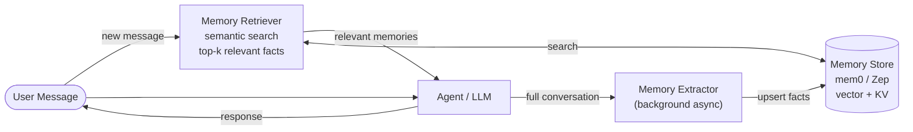

# AI Memory Systems

## Category

AI / LLM Integration — Agentic Systems, Memory, Personalisation, Long-Term Context

## Context

LLMs are stateless — every API call starts from scratch. **AI Memory Systems** add persistence so agents can recall past interactions, user preferences, learned facts, and intermediate work across sessions and across different conversations.

### Memory Types

| Type | Scope | Description | Storage |
|------|-------|-------------|---------|
| **In-context** | Single session | Conversation history in the prompt window | None (volatile) |
| **External (episodic)** | Cross-session | Raw past conversation summaries | Vector DB + KV store |
| **Semantic** | Cross-session | Extracted facts, preferences, entities | Vector DB |
| **Procedural** | Persistent | Learned workflows and behaviour patterns | DB + prompts |
| **Working memory** | Task-scoped | Scratchpad during multi-step task | In-context / Redis |

### Memory Frameworks

| Framework | Language | Approach |
|-----------|---------|----------|
| **mem0** | Python / JS | Intelligent extraction + semantic dedup |
| **Zep** | Python / JS | Session memory + entity graph |
| **MemGPT** | Python | Virtual context (paging in/out memories) |
| **LangMem** | Python | LangGraph-native memory store |
| **Custom** | Any | Vector search on summarised history |

The most production-ready pattern: **extract structured facts** from conversations, store them with embeddings, and retrieve relevant memories at the start of each new session via semantic search.

---

## Pros

- Agents feel personalised and context-aware across sessions without token overhead.
- Semantic deduplication prevents memory bloat — mem0 merges conflicting facts automatically.
- Procedural memory allows agents to improve over time (e.g., learn user's preferred output format).
- Episodic recall enables agents to reference past decisions — critical for long-running projects.
- User-scoped memory enables privacy controls — delete one user's memories without affecting others.

---

## Cons

- Memory retrieval adds latency (vector search + re-ranking) before every agent call.
- Stale or conflicting memories can confuse the model — requires TTL or explicit invalidation.
- Privacy implications: memories may contain PII and must be handled under GDPR/CCPA.
- Without careful extraction, episodic memory grows unboundedly — costs spike with history size.
- Cross-user memory leakage is a serious security risk — strict user scoping is mandatory.

---

## Design Diagram



---

## Code Sample

### mem0 — automatic memory extraction and retrieval

```python
from mem0 import MemoryClient
from openai import OpenAI

memory = MemoryClient(api_key="your-mem0-api-key")
openai_client = OpenAI()

def chat_with_memory(user_id: str, message: str) -> str:
    # 1. Retrieve relevant memories for this user
    memories = memory.search(message, user_id=user_id, limit=5)
    memory_context = "\n".join(
        f"- {m['memory']}" for m in memories
    )

    # 2. Build prompt with injected memories
    system_prompt = f"""You are a helpful assistant with memory of past interactions.

Relevant memories about this user:
{memory_context if memory_context else "No previous interactions yet."}

Always personalise responses based on what you know about the user."""

    response = openai_client.chat.completions.create(
        model="gpt-4o",
        messages=[
            {"role": "system", "content": system_prompt},
            {"role": "user", "content": message},
        ],
    )

    answer = response.choices[0].message.content

    # 3. Store new information extracted from this exchange (async in production)
    memory.add(
        [
            {"role": "user", "content": message},
            {"role": "assistant", "content": answer},
        ],
        user_id=user_id,
    )

    return answer


# Example
response = chat_with_memory("user-123", "I prefer TypeScript over Python for backend work")
print(response)
# Later session:
response = chat_with_memory("user-123", "What language should I use for this new API?")
# Agent recalls the preference automatically
```

### Custom memory — extract + store + retrieve pattern

```typescript
import OpenAI from 'openai';
import { QdrantClient } from '@qdrant/js-client-rest';
import { Redis } from 'ioredis';

const openai = new OpenAI();
const qdrant = new QdrantClient({ url: process.env.QDRANT_URL });
const redis = new Redis(process.env.REDIS_URL!);

const COLLECTION = 'agent_memories';

async function embed(text: string): Promise<number[]> {
  const res = await openai.embeddings.create({ model: 'text-embedding-3-small', input: text });
  return res.data[0].embedding;
}

// Extract structured facts from a conversation turn
async function extractFacts(conversation: string, userId: string): Promise<void> {
  const res = await openai.chat.completions.create({
    model: 'gpt-4o-mini',
    messages: [
      {
        role: 'system',
        content: `Extract factual statements about the user from the conversation.
Return a JSON array of strings. Only include facts worth remembering long-term.
Example: ["User prefers REST over GraphQL", "User works on a banking platform"]
If nothing worth remembering, return [].`,
      },
      { role: 'user', content: conversation },
    ],
    response_format: { type: 'json_object' },
  });

  const { facts } = JSON.parse(res.choices[0].message.content ?? '{"facts":[]}') as { facts: string[] };

  for (const fact of facts) {
    const vector = await embed(fact);
    await qdrant.upsert(COLLECTION, {
      points: [{
        id: crypto.randomUUID(),
        vector,
        payload: { userId, fact, timestamp: Date.now() },
      }],
    });
  }
}

// Retrieve relevant memories for a user
async function retrieveMemories(userId: string, query: string, topK = 5): Promise<string[]> {
  const vector = await embed(query);
  const results = await qdrant.search(COLLECTION, {
    vector,
    filter: { must: [{ key: 'userId', match: { value: userId } }] },
    limit: topK,
    score_threshold: 0.75,
  });
  return results.map(r => r.payload!.fact as string);
}

// Agent with memory
async function agentWithMemory(userId: string, userMessage: string): Promise<string> {
  const memories = await retrieveMemories(userId, userMessage);

  const systemPrompt = memories.length > 0
    ? `You are a helpful assistant. You know the following about this user:\n${memories.map(m => `- ${m}`).join('\n')}`
    : 'You are a helpful assistant.';

  const response = await openai.chat.completions.create({
    model: 'gpt-4o',
    messages: [
      { role: 'system', content: systemPrompt },
      { role: 'user', content: userMessage },
    ],
  });

  const answer = response.choices[0].message.content ?? '';

  // Extract and store facts from this turn (background)
  extractFacts(`User: ${userMessage}\nAssistant: ${answer}`, userId).catch(console.error);

  return answer;
}
```

### LangGraph — stateful memory with checkpointer

```python
from langgraph.graph import StateGraph, MessagesState, END
from langgraph.checkpoint.postgres import PostgresSaver
from langchain_openai import ChatOpenAI
from langchain_core.messages import SystemMessage
import psycopg

llm = ChatOpenAI(model="gpt-4o", temperature=0)

def assistant_node(state: MessagesState) -> dict:
    # LangGraph checkpointer automatically persists messages
    # Retrieve past messages via thread_id — no manual memory management needed
    response = llm.invoke(state["messages"])
    return {"messages": [response]}

graph = StateGraph(MessagesState)
graph.add_node("assistant", assistant_node)
graph.set_entry_point("assistant")
graph.add_edge("assistant", END)

# PostgreSQL checkpointer — persistent across restarts
conn = psycopg.connect(conninfo=os.environ["DATABASE_URL"], autocommit=True)
checkpointer = PostgresSaver(conn)
checkpointer.setup()

app = graph.compile(checkpointer=checkpointer)

# Same thread_id = same conversation memory restored from DB
config = {"configurable": {"thread_id": "user-123-session-A"}}

result = app.invoke({"messages": [{"role": "user", "content": "My name is Alice"}]}, config=config)
result = app.invoke({"messages": [{"role": "user", "content": "What is my name?"}]}, config=config)
# → "Your name is Alice."
```

### Memory privacy — delete user memories (GDPR right to erasure)

```typescript
async function deleteUserMemories(userId: string): Promise<void> {
  // Delete from vector store
  await qdrant.delete(COLLECTION, {
    filter: { must: [{ key: 'userId', match: { value: userId } }] },
  });

  // Delete from session cache
  const keys = await redis.keys(`session:${userId}:*`);
  if (keys.length > 0) await redis.del(...keys);

  console.log(`All memories deleted for user ${userId}`);
}
```

---

## Related

- [01 — RAG](./01-rag.md) — RAG retrieves documents; memory retrieves user-specific facts
- [04 — AI Agents & Tool Use](./04-ai-agents-tool-use.md) — agents that accumulate knowledge across runs
- [18 — Multi-Agent Orchestration](./18-multi-agent-orchestration.md) — shared memory across specialised agents in a crew
- [05 — Vector Databases](./05-vector-databases.md) — storage backend for semantic memory retrieval

---

## References

- [The Evolution from RAG to Agentic RAG to Agent Memory](https://www.leoniemonigatti.com/blog/from-rag-to-agent-memory.html)