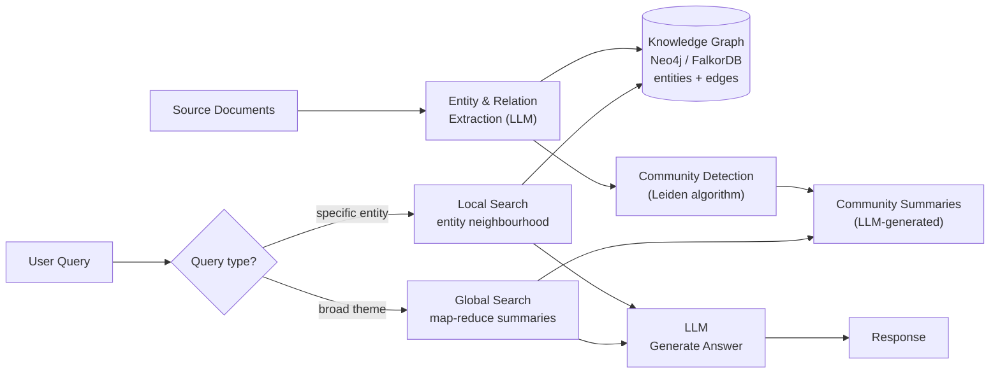

# GraphRAG & Knowledge Graphs

## Category

AI / LLM Integration — Knowledge Grounding, GraphRAG, Knowledge Graph, Neo4j, Entity Extraction

## Context

**GraphRAG** augments retrieval by building a **knowledge graph** (entities and their relationships) from source documents, then traversing the graph at query time to surface connected facts that pure vector search misses. Developed by Microsoft Research (2024), it dramatically outperforms standard RAG on questions that require **reasoning across multiple documents**.

### Vector RAG vs GraphRAG

| Dimension | Standard Vector RAG | GraphRAG |
|-----------|--------------------|---------| 
| Retrieval unit | Chunks (fixed-size text) | Entities + relationships + communities |
| Cross-document reasoning | ❌ Misses indirect connections | ✅ Traverses the graph |
| Global summaries | ❌ No corpus-wide view | ✅ Community summaries |
| Build cost | Low (embed chunks) | High (entity extraction LLM calls) |
| Query latency | Low | Medium–high (graph traversal) |
| Best for | Factual lookup, Q&A | Multi-hop reasoning, thematic analysis |

### GraphRAG Query Modes

| Mode | How it works | Best For |
|------|-------------|---------|
| **Local search** | Find relevant entities → expand neighbourhood → generate | Specific entity questions |
| **Global search** | Map-reduce over community summaries | Broad thematic questions |
| **Hybrid** | Global summary + local entity expansion | General-purpose |

### Alternatives / Complements

| Tool | Description |
|------|-------------|
| **Microsoft GraphRAG** | Reference open-source implementation (Python) |
| **LlamaIndex PropertyGraph** | Graph index within LlamaIndex pipeline |
| **Neo4j + LangChain** | Graph DB as retrieval backend |
| **FalkorDB** | Redis-compatible graph DB optimised for RAG |
| **Graphiti** | Temporal knowledge graph for agents (Zep) |

---

## Pros

- Multi-hop questions ("Which customers share suppliers with the top fraud risk merchant?") work natively.
- Community summaries provide global context that vector search over chunks cannot produce.
- Knowledge graph is inspectable and auditable — you can see what the system knows.
- Entity disambiguation handles synonyms and aliases that confuse vector search.
- Temporal graphs (Graphiti) track how facts change over time — facts have a `valid_from` / `valid_to`.

---

## Cons

- Graph construction requires LLM calls for entity and relationship extraction — 10–50× more expensive to build than standard vector index.
- Global search (map-reduce over communities) is expensive at query time — 100s of LLM calls for large corpora.
- Graph schema design is domain-specific — poor entity extraction degrades the entire pipeline.
- Not beneficial for simple single-document lookups — overhead is unjustified.
- Neo4j Cypher queries require expertise; incorrect traversal patterns return empty results silently.

---

## Design Diagram



---

## Code Sample

### Microsoft GraphRAG — index and query

```bash
# Install
pip install graphrag

# Initialise workspace
mkdir -p ./input
cp your-documents/*.txt ./input/
graphrag init --root .

# Configure (edit settings.yaml)
# Set:  llm.model: gpt-4o
#       embeddings.model: text-embedding-3-small
```

```yaml
# settings.yaml (key sections)
llm:
  api_key: ${GRAPHRAG_API_KEY}
  model: gpt-4o-mini          # entity extraction model
  max_retries: 10

embeddings:
  async_mode: threaded
  llm:
    api_key: ${GRAPHRAG_API_KEY}
    model: text-embedding-3-small

chunks:
  size: 1200
  overlap: 100

entity_extraction:
  entity_types: [organization, person, product, location, event]
  max_gleanings: 2

community_reports:
  max_length: 2000
```

```bash
# Build the graph (runs LLM-based entity extraction over all documents)
graphrag index --root .

# Query — local (entity-specific)
graphrag query --root . --method local --query "Which payment providers does Acme Corp use?"

# Query — global (thematic)
graphrag query --root . --method global --query "What are the main fraud patterns in the dataset?"
```

### Neo4j + LangChain — knowledge graph as retriever

```python
from langchain_community.graphs import Neo4jGraph
from langchain_community.vectorstores import Neo4jVector
from langchain_openai import ChatOpenAI, OpenAIEmbeddings
from langchain.chains import GraphCypherQAChain

graph = Neo4jGraph(
    url=os.environ["NEO4J_URI"],
    username="neo4j",
    password=os.environ["NEO4J_PASSWORD"],
)

llm = ChatOpenAI(model="gpt-4o", temperature=0)

# 1. Natural language → Cypher → graph → answer
cypher_chain = GraphCypherQAChain.from_llm(
    llm,
    graph=graph,
    verbose=True,
    allow_dangerous_requests=False,  # Validates generated Cypher
    validate_cypher=True,
)

result = cypher_chain.invoke(
    "Which customers have made transactions with merchants flagged for fraud?"
)
print(result["result"])
```

### Custom entity extraction + graph construction

```typescript
import OpenAI from 'openai';
import neo4j from 'neo4j-driver';

const openai = new OpenAI();
const driver = neo4j.driver(process.env.NEO4J_URI!, neo4j.auth.basic('neo4j', process.env.NEO4J_PASSWORD!));

interface Entity { name: string; type: string; }
interface Relation { from: string; to: string; relationship: string; }
interface ExtractionResult { entities: Entity[]; relations: Relation[]; }

async function extractEntitiesAndRelations(text: string): Promise<ExtractionResult> {
  const res = await openai.chat.completions.create({
    model: 'gpt-4o-mini',
    messages: [
      {
        role: 'system',
        content: `Extract entities and relationships from the text.
Return JSON: {"entities": [{"name": "...", "type": "Organization|Person|Product|Location"}], 
              "relations": [{"from": "...", "to": "...", "relationship": "USES|OWNS|WORKS_FOR|LOCATED_IN"}]}`,
      },
      { role: 'user', content: text },
    ],
    response_format: { type: 'json_object' },
  });

  return JSON.parse(res.choices[0].message.content!) as ExtractionResult;
}

async function ingestDocument(text: string, docId: string): Promise<void> {
  const { entities, relations } = await extractEntitiesAndRelations(text);

  const session = driver.session();
  try {
    // Upsert entities
    for (const entity of entities) {
      await session.run(
        `MERGE (e:${entity.type} {name: $name})
         ON CREATE SET e.createdAt = datetime()
         SET e.docIds = coalesce(e.docIds, []) + [$docId]`,
        { name: entity.name, docId }
      );
    }

    // Upsert relationships
    for (const rel of relations) {
      await session.run(
        `MATCH (a {name: $from}), (b {name: $to})
         MERGE (a)-[r:${rel.relationship}]->(b)
         ON CREATE SET r.firstSeen = datetime(), r.docIds = [$docId]`,
        { from: rel.from, to: rel.to, docId }
      );
    }
  } finally {
    await session.close();
  }
}

// Multi-hop query: follow graph edges to answer cross-document questions
async function graphRagQuery(question: string): Promise<string> {
  const session = driver.session();

  // 1. Extract entities from question
  const { entities } = await extractEntitiesAndRelations(question);
  const seedEntityName = entities[0]?.name;

  // 2. Fetch 2-hop neighbourhood
  const result = await session.run(
    `MATCH path = (seed {name: $name})-[*1..2]-(neighbour)
     RETURN path LIMIT 50`,
    { name: seedEntityName }
  );

  const graphContext = result.records
    .map(r => r.get('path').segments.map((s: any) => `${s.start.properties.name} -[${s.relationship.type}]-> ${s.end.properties.name}`).join(', '))
    .join('\n');

  await session.close();

  // 3. Generate answer with graph context
  const response = await openai.chat.completions.create({
    model: 'gpt-4o',
    messages: [
      {
        role: 'system',
        content: `Answer the question using the knowledge graph context below.\n\nGraph context:\n${graphContext}`,
      },
      { role: 'user', content: question },
    ],
  });

  return response.choices[0].message.content ?? '';
}
```

---

## Related

- [01 — RAG](./01-rag.md) — standard vector RAG; GraphRAG extends it for multi-hop reasoning
- [05 — Vector Databases](./05-vector-databases.md) — vector similarity still used inside GraphRAG local search
- [06 — Embedding Pipelines](./06-embedding-pipelines.md) — embeddings assigned to graph entities, not just chunks
- [18 — Multi-Agent Orchestration](./18-multi-agent-orchestration.md) — specialist graph traversal agent as part of a crew
