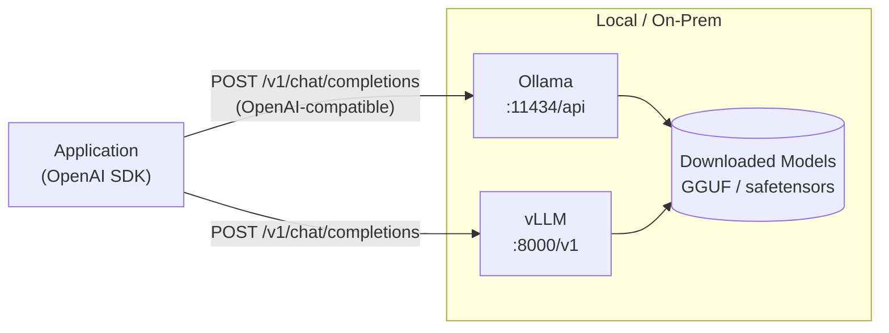

# Local & Edge LLM Deployment

## Category

AI / LLM Integration — Self-Hosted, On-Premise, Edge AI, Ollama, vLLM, llama.cpp, Quantisation

## Context

**Local LLM deployment** runs models on your own infrastructure — laptops, on-premise servers, or edge devices — without sending data to a cloud API. This is required when dealing with air-gapped environments, data residency regulations, or when cloud API cost at scale exceeds self-hosting.

### Deployment Options

| Tool | Target | Paradigm | Best For |
|------|--------|---------|---------|
| **Ollama** | Developer machine / small server | Simple model runner + REST API | Local dev, prototyping |
| **vLLM** | GPU server / Kubernetes | High-throughput serving (PagedAttention) | Production GPU inference |
| **llama.cpp** | CPU / Apple Silicon | GGUF quantised inference | Laptop / edge / no GPU |
| **Hugging Face TGI** | GPU server | Text Generation Inference | Enterprise on-prem |
| **LM Studio** | Developer laptop | GUI + server | Experimentation |
| **Llamafile** | Any platform | Single executable | Ultra-portable edge |

### Quantisation Formats

| Format | Size reduction | Quality loss | Use Case |
|--------|---------------|-------------|---------|
| **FP16** | Baseline | None | Full precision GPU |
| **Q8_0** | ~50% | Minimal | High-quality local |
| **Q4_K_M** | ~75% | Small | Best CPU/laptop balance |
| **Q3_K_S** | ~80%+ | Moderate | Very low RAM |
| **GGUF** | Platform | — | llama.cpp native format |

### Model Selection for Self-Hosting

| Use Case | Recommended Models |
|---------|-------------------|
| General assistant (7B) | Llama 3.1 8B, Mistral 7B |
| Code generation | Qwen2.5-Coder 7B, Deepseek-Coder 6.7B |
| General (larger, high quality) | Llama 3.3 70B, Qwen2.5 72B |
| Embedding | nomic-embed-text, mxbai-embed-large |
| Vision | LLaVA, Llama 3.2 Vision |

---

## Pros

- Data never leaves your infrastructure — mandatory for GDPR, HIPAA, air-gapped environments.
- Zero per-token cost after hardware — economical at high volume.
- No rate limits — run as many parallel requests as hardware supports.
- OpenAI-compatible API in Ollama and vLLM — drop-in replacement, same SDK code.
- Sub-second latency on Apple Silicon with Q4 quantised models.

---

## Cons

- GPU hardware cost: A100/H100 cards are expensive; consumer GPUs (RTX 4090) have VRAM limits.
- Smaller local models (7B–13B) underperform frontier models (GPT-4o, Claude) on complex tasks.
- Model updates require manual download and redeployment — no automatic improvements.
- vLLM requires Linux + CUDA — no macOS GPU support for production serving.
- Serving large models (70B+) requires multi-GPU setup or CPU offloading with degraded speed.

---

## Design Diagram



---

## Code Sample

### Ollama — run locally, call with OpenAI SDK

```bash
# Install Ollama (macOS)
brew install ollama
ollama serve &

# Pull models
ollama pull llama3.1:8b
ollama pull nomic-embed-text
ollama pull qwen2.5-coder:7b
```

```typescript
// OpenAI SDK pointing to local Ollama — identical code to cloud API
import OpenAI from 'openai';

const client = new OpenAI({
  baseURL: 'http://localhost:11434/v1',
  apiKey: 'ollama',  // required by SDK, value ignored by Ollama
});

const response = await client.chat.completions.create({
  model: 'llama3.1:8b',
  messages: [{ role: 'user', content: 'Explain CQRS in two sentences.' }],
  temperature: 0,
});

console.log(response.choices[0].message.content);
```

```typescript
// Embeddings via Ollama
const embeddingResponse = await client.embeddings.create({
  model: 'nomic-embed-text',
  input: 'semantic search query',
});
const vector = embeddingResponse.data[0].embedding; // 768 dimensions
```

### Ollama Modelfile — custom system prompt and parameters

```dockerfile
# Modelfile
FROM llama3.1:8b

SYSTEM """
You are an expert financial services assistant for Backbase platform.
You only answer questions related to banking, payments, and financial technology.
Always respond in clear, structured markdown.
"""

PARAMETER temperature 0.1
PARAMETER num_ctx 8192
PARAMETER top_p 0.9
```

```bash
ollama create orders-assistant -f ./Modelfile
ollama run orders-assistant
```

### vLLM — production GPU serving

```bash
# Install
pip install vllm

# Serve Llama 3.1 8B on GPU
python -m vllm.entrypoints.openai.api_server \
  --model meta-llama/Llama-3.1-8B-Instruct \
  --host 0.0.0.0 \
  --port 8000 \
  --max-model-len 8192 \
  --tensor-parallel-size 1 \      # increase for multi-GPU
  --gpu-memory-utilization 0.90
```

```typescript
// Same OpenAI SDK, different baseURL
const vllmClient = new OpenAI({
  baseURL: 'http://gpu-server:8000/v1',
  apiKey: 'vllm',
});

// Batch completions — vLLM handles them efficiently with PagedAttention
const responses = await Promise.all(
  prompts.map(prompt =>
    vllmClient.chat.completions.create({
      model: 'meta-llama/Llama-3.1-8B-Instruct',
      messages: [{ role: 'user', content: prompt }],
      max_tokens: 512,
    })
  )
);
```

### vLLM — Kubernetes deployment

```yaml
# k8s/vllm-deployment.yaml
apiVersion: apps/v1
kind: Deployment
metadata:
  name: vllm-llama
spec:
  replicas: 1
  selector:
    matchLabels:
      app: vllm
  template:
    metadata:
      labels:
        app: vllm
    spec:
      containers:
        - name: vllm
          image: vllm/vllm-openai:latest
          args:
            - --model
            - meta-llama/Llama-3.1-8B-Instruct
            - --max-model-len
            - "8192"
          resources:
            limits:
              nvidia.com/gpu: "1"
              memory: "24Gi"
          env:
            - name: HF_TOKEN
              valueFrom:
                secretKeyRef:
                  name: hf-token
                  key: token
          ports:
            - containerPort: 8000
```

### llama.cpp — CPU inference (no GPU)

```bash
# Build llama.cpp
git clone https://github.com/ggerganov/llama.cpp && cd llama.cpp
cmake -B build && cmake --build build -j $(nproc)

# Download quantised model (Q4_K_M is the best quality/size balance)
huggingface-cli download bartowski/Llama-3.1-8B-Instruct-GGUF \
  --include "Llama-3.1-8B-Instruct-Q4_K_M.gguf" \
  --local-dir ./models

# Run HTTP server (OpenAI-compatible)
./build/bin/llama-server \
  -m ./models/Llama-3.1-8B-Instruct-Q4_K_M.gguf \
  --port 8080 \
  --n-gpu-layers 0 \     # 0 = pure CPU; increase to offload layers to GPU
  --ctx-size 4096
```

### Provider abstraction — switch between cloud and local

```typescript
import OpenAI from 'openai';

type ModelEnvironment = 'cloud' | 'local';

function createLLMClient(env: ModelEnvironment = 'cloud'): { client: OpenAI; model: string } {
  if (env === 'local') {
    return {
      client: new OpenAI({ baseURL: 'http://localhost:11434/v1', apiKey: 'ollama' }),
      model: 'llama3.1:8b',
    };
  }
  return {
    client: new OpenAI({ apiKey: process.env.OPENAI_API_KEY }),
    model: 'gpt-4o-mini',
  };
}

const { client, model } = createLLMClient(
  process.env.LLM_ENV as ModelEnvironment ?? 'cloud'
);

// Code below is identical regardless of environment
const response = await client.chat.completions.create({
  model,
  messages: [{ role: 'user', content: 'Hello' }],
});
```

---

## Related

- [02 — LLM Gateway](./02-llm-gateway.md) — LiteLLM supports local Ollama as a provider in the same gateway
- [10 — Fine-tuning vs RAG](./10-finetuning-vs-rag.md) — fine-tuned local models vs RAG on self-hosted infra
- [12 — AI Cost Optimisation](./12-ai-cost-optimisation.md) — total cost of ownership: self-hosted vs cloud break-even analysis
- [06 — Embedding Pipelines](./06-embedding-pipelines.md) — use local embedding models (nomic-embed-text) for air-gapped indexing
