# Synthetic Data Generation

## Category

AI / LLM Integration — Data Engineering, Synthetic Data, Fine-tuning, Test Data, Distillation

## Context

**Synthetic data generation** uses LLMs to create labelled datasets, test fixtures, distillation corpora, and evaluation benchmarks — without requiring expensive human annotation or exposing real customer data. It is a foundational technique for fine-tuning smaller models, building eval suites, and populating test environments.

### Use Cases

| Use Case | Description |
|----------|-------------|
| **Fine-tuning datasets** | Generate instruction+response pairs to fine-tune a smaller model |
| **Knowledge distillation** | Use a large model (teacher) to generate training data for a small model (student) |
| **Evaluation benchmarks** | Generate domain-specific Q&A pairs with known correct answers |
| **Test fixtures** | Generate realistic PII-free test data for APIs and databases |
| **Augmentation** | Expand small labelled datasets by paraphrasing or adding edge cases |
| **Adversarial examples** | Generate edge cases and failure modes for testing (see 23-llm-red-teaming) |

### Quality Pipeline

```
Seed examples → LLM generation → Deduplication → Quality filter (LLM judge) → Human review sample → Dataset
```

### Key Tools

| Tool | Purpose |
|------|---------|
| **Distilabel** | Argilla's pipeline framework for synthetic dataset generation |
| **Faker** | Realistic fake PII — names, addresses, IBANs, credit cards |
| **SDXL / imagen** | Synthetic image data for multimodal models |
| **Lilac** | Dataset curation, deduplication, quality scoring |
| **Argilla** | Human annotation UI for reviewing synthetic data |

---

## Pros

- Eliminates dependency on scarce labelled data — generate thousands of examples in hours.
- Privacy-safe: no real customer data in training sets.
- Fine-tuned small models (8B) on domain-specific synthetic data can match GPT-4o on narrow tasks at 100× lower cost.
- Synthetic eval sets can be generated on demand for new features before real traffic exists.
- Augmentation with paraphrases and edge cases improves model robustness.

---

## Cons

- Synthetic data inherits the teacher model's biases and blind spots — "hallucinated facts" propagate.
- Without quality filtering, model collapse occurs — fine-tuning on bad synthetic data degrades performance.
- Diversity is hard: LLMs tend to generate similar phrasing; seed diversity matters greatly.
- Human review sampling is still necessary for high-stakes use cases.
- Dataset contamination: if synthetic data uses public benchmarks as seeds, eval results are inflated.

---

## Design Diagram

```mermaid
flowchart LR
    SEEDS["Seed Examples\n(10–100 human)"]
    TEACHER["Teacher LLM\nGPT-4o / Claude"]
    RAW["Raw Synthetic Dataset\n(thousands of examples)"]
    DEDUP["Deduplication\n(MinHash / embedding)"]
    JUDGE["Quality Filter\nLLM judge scoring"]
    REVIEW["Human Review\n(sample 5–10%)"]
    DATASET["Final Dataset\nfor fine-tuning / eval"]
    STUDENT["Student Model\nfine-tuned on dataset"]

    SEEDS --> TEACHER --> RAW --> DEDUP --> JUDGE --> REVIEW --> DATASET --> STUDENT
```



---

## Code Sample

### Generate instruction-following dataset for fine-tuning

```python
import openai
import json
import asyncio
from typing import AsyncGenerator

client = openai.AsyncOpenAI()

SYSTEM_PROMPT = """You are a synthetic data generator for a banking AI assistant.
Generate diverse, realistic customer service interactions for the following scenario.
Return a JSON object: {"instruction": "customer message", "response": "ideal assistant response"}
The response should be helpful, accurate, and professional."""

SCENARIO_SEEDS = [
    "checking account balance enquiry",
    "international wire transfer help",
    "card fraud dispute process",
    "mortgage rate questions",
    "overdraft fee appeal",
    "setting up standing orders",
    "suspicious transaction alerts",
]

async def generate_example(scenario: str, variation: int) -> dict | None:
    try:
        res = await client.chat.completions.create(
            model="gpt-4o",
            messages=[
                {"role": "system", "content": SYSTEM_PROMPT},
                {"role": "user", "content": f"Scenario: {scenario}\nVariation #{variation} — use a different customer tone/complexity than typical examples."},
            ],
            response_format={"type": "json_object"},
            temperature=0.9,  # Higher temperature for diversity
        )
        return json.loads(res.choices[0].message.content)
    except Exception as e:
        print(f"Generation failed for {scenario} v{variation}: {e}")
        return None

async def generate_dataset(examples_per_scenario: int = 50) -> list[dict]:
    tasks = [
        generate_example(scenario, i)
        for scenario in SCENARIO_SEEDS
        for i in range(examples_per_scenario)
    ]

    results = await asyncio.gather(*tasks)
    return [r for r in results if r is not None]

# Generate
dataset = asyncio.run(generate_dataset(50))
print(f"Generated {len(dataset)} examples")

# Save as JSONL for fine-tuning
with open("banking-finetune.jsonl", "w") as f:
    for example in dataset:
        f.write(json.dumps({
            "messages": [
                {"role": "system", "content": "You are a helpful banking assistant."},
                {"role": "user", "content": example["instruction"]},
                {"role": "assistant", "content": example["response"]},
            ]
        }) + "\n")
```

### Quality filtering — LLM judge pipeline

```python
import openai
import json

client = openai.OpenAI()

def score_example(example: dict) -> dict:
    """Score a synthetic example on quality dimensions."""
    res = client.chat.completions.create(
        model="gpt-4o-mini",
        messages=[
            {
                "role": "system",
                "content": """Score this training example on:
1. Accuracy (1-5): Is the response factually correct?
2. Helpfulness (1-5): Does the response fully address the question?
3. Naturalness (1-5): Does the conversation sound realistic?
4. Safety (1-5): Is the response appropriate and safe?

Return JSON: {"accuracy": int, "helpfulness": int, "naturalness": int, "safety": int, "overall": float, "reject": boolean}
Set reject=true if any score <= 2.""",
            },
            {
                "role": "user",
                "content": f"Instruction: {example['instruction']}\nResponse: {example['response']}",
            },
        ],
        response_format={"type": "json_object"},
    )
    return {**example, **json.loads(res.choices[0].message.content)}

def filter_dataset(dataset: list[dict], min_overall: float = 3.5) -> list[dict]:
    scored = [score_example(ex) for ex in dataset]
    filtered = [ex for ex in scored if not ex.get("reject") and ex.get("overall", 0) >= min_overall]
    print(f"Kept {len(filtered)}/{len(dataset)} examples (threshold: {min_overall})")
    return filtered
```

### Distilabel — structured pipeline (Argilla)

```python
from distilabel.pipeline import Pipeline
from distilabel.steps import LoadDataFromHub, KeepColumns
from distilabel.steps.tasks import TextGeneration, UltraFeedback
from distilabel.llms import OpenAILLM

with Pipeline(name="banking-synthetic-data") as pipeline:
    # 1. Load seed instructions
    load = LoadDataFromHub(
        repo_id="your-org/banking-seed-instructions",
        split="train",
        batch_size=32,
    )

    # 2. Generate responses with GPT-4o (teacher)
    generate = TextGeneration(
        llm=OpenAILLM(model="gpt-4o"),
        system_prompt="You are an expert banking assistant. Provide accurate, helpful responses.",
        num_generations=4,  # Generate 4 candidates per instruction
    )

    # 3. Score quality with UltraFeedback
    score = UltraFeedback(
        llm=OpenAILLM(model="gpt-4o"),
        aspect="overall-rating",
    )

    # 4. Keep only required columns
    keep = KeepColumns(columns=["instruction", "generation", "rating"])

    load >> generate >> score >> keep

# Run
distiset = pipeline.run(use_cache=True)
distiset.push_to_hub("your-org/banking-synthetic-final")
```

### Fake test data — Faker for database seeding

```typescript
import { faker } from '@faker-js/faker';

interface Order {
  id: string;
  customerId: string;
  customerName: string;
  iban: string;
  amount: number;
  currency: string;
  status: 'pending' | 'completed' | 'failed';
  createdAt: Date;
}

function generateOrder(): Order {
  return {
    id: faker.string.uuid(),
    customerId: faker.string.uuid(),
    customerName: faker.person.fullName(),
    iban: faker.finance.iban(),
    amount: faker.number.float({ min: 10, max: 50000, fractionDigits: 2 }),
    currency: faker.helpers.arrayElement(['EUR', 'GBP', 'USD']),
    status: faker.helpers.weightedArrayElement([
      { value: 'completed', weight: 7 },
      { value: 'pending', weight: 2 },
      { value: 'failed', weight: 1 },
    ]),
    createdAt: faker.date.recent({ days: 90 }),
  };
}

// Seed database with 10,000 realistic test orders
const orders = Array.from({ length: 10_000 }, generateOrder);
await db.order.createMany({ data: orders });
```

### Eval benchmark generation — domain Q&A with verified answers

```python
import openai, json

client = openai.OpenAI()

def generate_eval_pairs(context: str, n: int = 20) -> list[dict]:
    """Generate Q&A pairs from a document with verifiable answers."""
    res = client.chat.completions.create(
        model="gpt-4o",
        messages=[
            {
                "role": "system",
                "content": f"""Generate {n} diverse question-answer pairs from the provided document.
Include factual, inferential, and edge-case questions.
Return JSON: {{"pairs": [{{"question": "...", "answer": "...", "difficulty": "easy|medium|hard"}}]}}
Answers must be directly verifiable from the document.""",
            },
            {"role": "user", "content": f"Document:\n{context}"},
        ],
        response_format={"type": "json_object"},
    )
    return json.loads(res.choices[0].message.content)["pairs"]

# Use with RAGAS or PromptFoo for automated evaluation (see 13-llm-evaluation.md)
```

---

## Related

- [10 — Fine-tuning vs RAG](./10-finetuning-vs-rag.md) — synthetic datasets enable fine-tuning without real labelled data
- [13 — LLM Evaluation](./13-llm-evaluation.md) — synthetic Q&A pairs serve as eval benchmarks (RAGAS dataset input)
- [23 — LLM Red Teaming](./23-llm-red-teaming.md) — synthetic adversarial examples for safety testing
- [09 — Guardrails & Content Safety](./09-guardrails-content-safety.md) — generate synthetic toxic/safe pairs to calibrate guardrails
