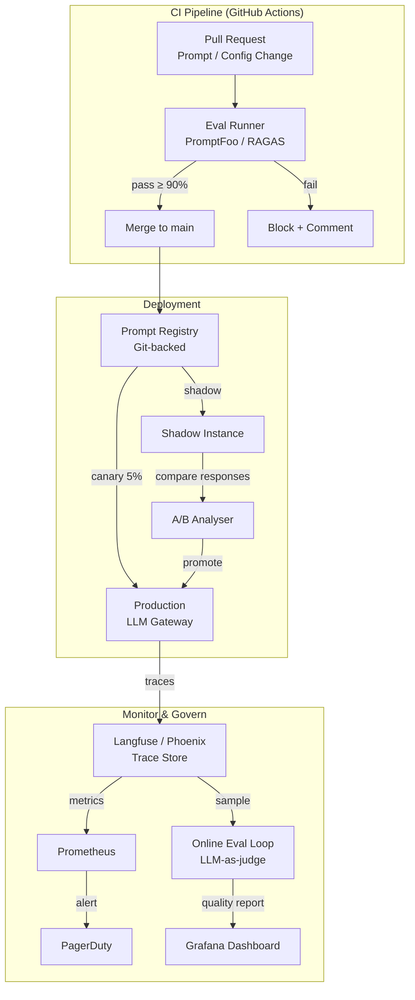

# LLMOps — Operationalising LLMs in Production

## Category

AI / LLM Integration — MLOps, Deployment & Lifecycle Management

## Context

**LLMOps** is the discipline of taking an LLM-powered feature from prototype to production and keeping it reliable, safe, and cost-controlled over its entire lifecycle. It extends traditional MLOps with concerns unique to large language models: non-deterministic output, prompt drift, model version changes, retrieval pipeline freshness, eval-gating CI/CD, and cost governance at token granularity.

### LLMOps Lifecycle

```
Experiment → Evaluate → Deploy → Monitor → Re-evaluate → Version / Rollback
```

| Phase | Key Practice | Tools |
|-------|-------------|-------|
| **Experiment** | Prompt versioning, model selection, RAG chunking experiments | LangSmith, PromptFoo, Jupyter |
| **Evaluate** | Automated evals against gold dataset before any deployment | RAGAS, LLM-as-judge, PromptFoo |
| **Deploy** | Blue-green or canary model rollout; shadow mode A/B | Kubernetes, Istio, LaunchDarkly |
| **Monitor** | Trace every call; alert on quality drop, cost spike, latency | Langfuse, Phoenix, Prometheus |
| **Govern** | Token budget per feature; PII masking; rate limiting | LiteLLM, AWS Bedrock, Vault |
| **Retire / Upgrade** | Model sunset checklist; prompt migration; eval comparison | MLflow, DVC, git |

### LLMOps vs Classic MLOps

| Dimension | Classic MLOps | LLMOps |
|-----------|-------------|-------|
| Artefact | Trained model weights | Prompt template + model version + retrieval config |
| Deployment unit | Docker image + model file | Prompt registry version + model alias |
| Regression signal | Accuracy / F1 on held-out set | Eval suite: faithfulness, groundedness, task success |
| Drift detection | Feature distribution shift | Prompt sensitivity, retrieval recall, output length drift |
| Cost unit | GPU hours | Tokens per request × model price per 1M tokens |
| Rollback | Re-deploy previous container | Switch model alias + revert prompt version |
| Versioning | Git + DVC | Git (prompts) + model aliases (OpenAI, Bedrock) + vector snapshot |

### Prompt Lifecycle

```
Draft → Peer review → Eval gate (pass > 90%) → Staging → Canary (5%) → Production
                           │
                     Fail → Back to draft (auto-comment on PR)
```

### Key LLMOps Metrics

| Metric | Description | Alert When |
|--------|-------------|-----------|
| `eval.task_success_rate` | % responses meeting quality criteria | < 85% |
| `eval.groundedness` | Responses supported by retrieved context | < 0.75 |
| `eval.faithfulness` | No hallucinated facts | < 0.80 |
| `llm.cost_usd_per_1k_requests` | Token cost per 1,000 calls | > budget × 1.2 |
| `llm.p99_latency_ms` | 99th percentile end-to-end latency | > 8,000 ms |
| `retrieval.recall_at_5` | Top-5 retrieval recall on golden queries | < 0.70 |
| `prompt.version_skew` | % calls using non-current prompt version | > 5% |

## Pros

- Eval-gated CI prevents regressions from reaching production silently
- Prompt versioning enables instant rollback without redeploying code
- Shadow mode A/B lets you compare model versions with zero user risk
- Token budgets per feature prevent runaway cost from a single bad prompt change
- Centralised model gateway provides a single enforcement point for policy, rate limiting, and audit

## Cons

- Eval coverage is never 100% — LLMs can fail on inputs not in the test set
- Non-determinism means reproducibility is probabilistic, not guaranteed
- Prompt registry adds a deployment dependency — registry downtime blocks releases
- Shadow mode doubles token cost during the comparison window
- Building and maintaining a high-quality golden eval dataset is expensive

## Architecture Diagram



## Code Sample

### TypeScript — Prompt registry with versioning + eval gate

```typescript
// llmops/prompt-registry.ts
// Git-backed prompt store: prompts are .md files committed to the repo.
// CI runs evals on any changed prompt file before merge.

import { readFileSync } from 'fs';
import path from 'path';
import Handlebars from 'handlebars';

export interface PromptTemplate {
  id: string;
  version: string;         // semver: "1.2.0"
  model: string;           // "gpt-4o-mini" | "claude-3-5-haiku" | ...
  systemPrompt: string;
  userTemplate: string;    // Handlebars template
  maxTokens: number;
  temperature: number;
}

// ── Load prompt from repo (prompts/payment-summary.json) ─────────────────────
export function loadPrompt(promptId: string): PromptTemplate {
  const filePath = path.resolve(__dirname, `../../prompts/${promptId}.json`);
  const raw = readFileSync(filePath, 'utf-8');
  return JSON.parse(raw) as PromptTemplate;
}

// ── Render a prompt template with variables ───────────────────────────────────
export function renderPrompt(
  template: PromptTemplate,
  variables: Record<string, unknown>,
): { system: string; user: string } {
  const userFn = Handlebars.compile(template.userTemplate);
  return {
    system: template.systemPrompt,
    user:   userFn(variables),
  };
}

// ── Example prompt file: prompts/payment-summary.json ────────────────────────
/*
{
  "id": "payment-summary",
  "version": "1.3.0",
  "model": "gpt-4o-mini",
  "systemPrompt": "You are a concise financial assistant. Summarise payment data accurately. Never invent amounts or dates.",
  "userTemplate": "Summarise the following {{count}} payments for account {{accountId}}:\n\n{{#each payments}}- {{this.date}}: {{this.amount}} {{this.currency}} to {{this.recipient}}\n{{/each}}\n\nProvide a 2-sentence summary.",
  "maxTokens": 200,
  "temperature": 0.2
}
*/
```

### TypeScript — CI eval runner (PromptFoo integration)

```typescript
// llmops/ci-eval-runner.ts
// Run as a CI step: npx ts-node ci-eval-runner.ts
// Fails the build if any eval score falls below threshold.

import { runEvals, EvalConfig } from 'promptfoo';

const PASS_THRESHOLD = 0.90;      // 90% of assertions must pass

const evalConfig: EvalConfig = {
  prompts: ['./prompts/payment-summary.json'],

  providers: [
    { id: 'openai:gpt-4o-mini', config: { temperature: 0.2, max_tokens: 200 } },
  ],

  tests: [
    {
      vars: {
        accountId: 'acc_001',
        count: 3,
        payments: [
          { date: '2026-04-10', amount: '150.00', currency: 'GBP', recipient: 'ACME Ltd' },
          { date: '2026-04-11', amount: '75.00',  currency: 'GBP', recipient: 'BT Group' },
          { date: '2026-04-12', amount: '200.00', currency: 'GBP', recipient: 'HMRC' },
        ],
      },
      assert: [
        { type: 'contains',    value: 'ACME' },
        { type: 'contains',    value: '425' },                    // total
        { type: 'not-contains', value: 'I cannot' },              // no refusals
        { type: 'llm-rubric',  value: 'Is the summary factually accurate and free of invented data?' },
        { type: 'javascript',  value: 'output.length < 600' },    // conciseness check
      ],
    },
    {
      // Edge case: empty payment list
      vars: { accountId: 'acc_002', count: 0, payments: [] },
      assert: [
        { type: 'not-contains', value: 'undefined' },
        { type: 'llm-rubric',   value: 'Does the response gracefully handle zero payments?' },
      ],
    },
  ],
};

async function main(): Promise<void> {
  console.log('[eval] Running prompt evals...');
  const results = await runEvals(evalConfig);

  const passed = results.results.filter(r => r.success).length;
  const total  = results.results.length;
  const score  = passed / total;

  console.log(`[eval] ${passed}/${total} assertions passed (${(score * 100).toFixed(1)}%)`);

  if (score < PASS_THRESHOLD) {
    console.error(`[eval] FAIL — score ${(score * 100).toFixed(1)}% below threshold ${PASS_THRESHOLD * 100}%`);
    process.exit(1);
  }

  console.log('[eval] PASS — proceeding with deployment');
}

main().catch((err) => { console.error(err); process.exit(1); });
```

### TypeScript — LLM call with token budget enforcement + cost tracking

```typescript
// llmops/governed-llm-client.ts
import OpenAI from 'openai';
import { metrics } from '@opentelemetry/api';

const openai = new OpenAI({ apiKey: process.env.OPENAI_API_KEY });
const meter  = metrics.getMeter('llmops');

const tokenCostCounter = meter.createCounter('llm.tokens.cost_usd', {
  description: 'Cumulative LLM token cost in USD',
});
const latencyHistogram = meter.createHistogram('llm.latency_ms', {
  description: 'LLM call latency',
  unit: 'ms',
});
const errorCounter = meter.createCounter('llm.errors.total');

// Model pricing per 1M tokens (update as pricing changes)
const PRICING: Record<string, { input: number; output: number }> = {
  'gpt-4o':        { input: 2.50,  output: 10.00 },
  'gpt-4o-mini':   { input: 0.15,  output: 0.60  },
  'o4-mini':       { input: 1.10,  output: 4.40  },
};

export interface LLMCallOptions {
  feature: string;         // "payment-summary", "fraud-explanation" — for cost attribution
  maxInputTokens?: number; // hard budget — reject if estimated input > this
  maxOutputTokens: number;
}

export async function governedChat(
  model: string,
  messages: OpenAI.ChatCompletionMessageParam[],
  opts: LLMCallOptions,
): Promise<string> {
  // Rough input token estimate (4 chars ≈ 1 token)
  const estimatedInputTokens = JSON.stringify(messages).length / 4;
  if (opts.maxInputTokens && estimatedInputTokens > opts.maxInputTokens) {
    throw new Error(
      `[llmops] input token budget exceeded: ~${Math.round(estimatedInputTokens)} > ${opts.maxInputTokens}`,
    );
  }

  const start = Date.now();
  const labels = { model, feature: opts.feature };

  try {
    const response = await openai.chat.completions.create({
      model,
      messages,
      max_tokens: opts.maxOutputTokens,
    });

    const usage = response.usage!;
    const pricing = PRICING[model] ?? { input: 0, output: 0 };
    const costUsd =
      (usage.prompt_tokens     / 1_000_000) * pricing.input +
      (usage.completion_tokens / 1_000_000) * pricing.output;

    // Emit to Prometheus / OTEL
    tokenCostCounter.add(costUsd, labels);
    latencyHistogram.record(Date.now() - start, labels);

    console.log('[llmops] call complete', {
      feature:          opts.feature,
      model,
      inputTokens:      usage.prompt_tokens,
      outputTokens:     usage.completion_tokens,
      costUsd:          costUsd.toFixed(6),
      latencyMs:        Date.now() - start,
    });

    return response.choices[0].message.content ?? '';

  } catch (err) {
    errorCounter.add(1, { ...labels, error: (err as Error).constructor.name });
    throw err;
  }
}
```

### TypeScript — Online eval loop (LLM-as-judge on sampled production calls)

```typescript
// llmops/online-eval-sampler.ts
// Runs in the background: samples 5% of production LLM calls and scores them.
// Scores are emitted as Prometheus metrics and stored in Langfuse.

import OpenAI from 'openai';

const openai = new OpenAI({ apiKey: process.env.OPENAI_API_KEY });

interface ProductionCall {
  id: string;
  feature: string;
  prompt: string;
  response: string;
  context?: string;     // retrieved chunks (for RAG faithfulness check)
}

interface EvalScore {
  callId: string;
  faithfulness: number;   // 0–1: is response supported by context?
  groundedness: number;   // 0–1: no hallucinated facts?
  taskSuccess:  number;   // 0–1: did it achieve the task?
}

const JUDGE_MODEL = 'gpt-4o';
const SAMPLE_RATE = 0.05;   // 5% of calls

export async function maybeSampleAndEval(call: ProductionCall): Promise<void> {
  if (Math.random() > SAMPLE_RATE) return;   // sample 5%
  await evaluateCall(call);
}

async function evaluateCall(call: ProductionCall): Promise<EvalScore> {
  const judgePrompt = `
You are an impartial evaluator for an AI assistant. Score the response on three dimensions.
Return ONLY valid JSON: { "faithfulness": 0.0-1.0, "groundedness": 0.0-1.0, "taskSuccess": 0.0-1.0 }

## Task
${call.feature}

## User Prompt
${call.prompt}

${call.context ? `## Retrieved Context\n${call.context}\n` : ''}

## AI Response
${call.response}

## Scoring Criteria
- faithfulness (0–1): Is every claim in the response supported by the retrieved context? (1 = fully supported)
- groundedness (0–1): Are there any hallucinated facts or invented data? (1 = no hallucinations)
- taskSuccess (0–1): Did the response accomplish what was asked? (1 = fully successful)
`.trim();

  const result = await openai.chat.completions.create({
    model: JUDGE_MODEL,
    messages: [{ role: 'user', content: judgePrompt }],
    response_format: { type: 'json_object' },
    temperature: 0,
    max_tokens: 100,
  });

  const scores = JSON.parse(result.choices[0].message.content ?? '{}') as {
    faithfulness: number;
    groundedness: number;
    taskSuccess:  number;
  };

  const evalScore: EvalScore = { callId: call.id, ...scores };

  // Emit to Prometheus (already instrumented via OTel in governed-llm-client.ts)
  console.log('[online-eval]', evalScore);

  // In production: write to Langfuse trace for human review
  return evalScore;
}
```

### YAML — GitHub Actions CI pipeline with eval gate

```yaml
# .github/workflows/llmops-ci.yml
name: LLMOps CI — Eval Gate

on:
  pull_request:
    paths:
      - 'prompts/**'
      - 'src/llm/**'

jobs:
  eval-gate:
    name: Prompt Eval Gate
    runs-on: ubuntu-latest

    steps:
      - uses: actions/checkout@v4

      - uses: actions/setup-node@v4
        with:
          node-version: '22'
          cache: npm

      - run: npm ci

      - name: Run prompt evals
        run: npx ts-node src/llmops/ci-eval-runner.ts
        env:
          OPENAI_API_KEY: ${{ secrets.OPENAI_API_KEY }}
          # Never log this — add to CI secret masking
        timeout-minutes: 10

      - name: Upload eval report
        if: always()
        uses: actions/upload-artifact@v4
        with:
          name: eval-results
          path: eval-results/

      - name: Comment PR with eval summary
        if: failure()
        uses: actions/github-script@v7
        with:
          script: |
            const fs = require('fs');
            const summary = fs.existsSync('eval-results/summary.json')
              ? JSON.parse(fs.readFileSync('eval-results/summary.json', 'utf8'))
              : { score: 0 };

            github.rest.issues.createComment({
              issue_number: context.issue.number,
              owner: context.repo.owner,
              repo: context.repo.repo,
              body: `## ❌ Eval Gate Failed\n\nScore: **${(summary.score * 100).toFixed(1)}%** (threshold: 90%)\n\nSee eval-results artifact for details.`,
            });

  deploy-canary:
    name: Deploy Canary (5%)
    needs: eval-gate
    if: github.ref == 'refs/heads/main'
    runs-on: ubuntu-latest
    steps:
      - uses: actions/checkout@v4
      - name: Update prompt version in registry
        run: |
          # Bump version in prompt registry and deploy
          npm run deploy:prompts -- --env canary --weight 5
        env:
          REGISTRY_TOKEN: ${{ secrets.PROMPT_REGISTRY_TOKEN }}
```

### YAML — Grafana dashboard panels (LLMOps overview)

```yaml
# grafana/llmops-dashboard.yaml (Grafonnet / JSON model excerpt)
panels:
  - title: "Token cost / hour by feature"
    type: timeseries
    targets:
      - expr: |
          sum by (feature) (
            rate(llm_tokens_cost_usd_total[1h]) * 3600
          )
    fieldConfig:
      defaults: { unit: currencyUSD }
    thresholds:
      - value: 5    # $5/hr warning
        color: yellow
      - value: 20   # $20/hr critical
        color: red

  - title: "Eval scores (online sampling)"
    type: gauge
    targets:
      - expr: |
          avg_over_time(llm_eval_faithfulness[24h])
    fieldConfig:
      defaults:
        min: 0
        max: 1
        thresholds:
          - value: 0.8
            color: green
          - value: 0.6
            color: yellow
          - value: 0
            color: red

  - title: "p99 LLM latency (ms)"
    type: timeseries
    targets:
      - expr: |
          histogram_quantile(0.99,
            sum by (model, le) (rate(llm_latency_ms_bucket[5m]))
          )
    thresholds:
      - value: 8000
        color: red
```

## References

- [Google Cloud — MLOps Maturity Model](https://cloud.google.com/architecture/mlops-continuous-delivery-and-automation-pipelines-in-machine-learning)
- [PromptFoo — LLM Testing & Eval](https://promptfoo.dev/)
- [Langfuse — LLM Observability](https://langfuse.com/docs)
- [RAGAS — RAG Evaluation Framework](https://docs.ragas.io/)
- [LiteLLM — Model Gateway](https://docs.litellm.ai/)
- [OpenAI — Model Aliases & Version Pinning](https://platform.openai.com/docs/models)
- [MLflow — LLM Tracking](https://mlflow.org/docs/latest/llms/index.html)
- [Chip Huyen — Designing Machine Learning Systems](https://www.oreilly.com/library/view/designing-machine-learning/9781098107956/)
