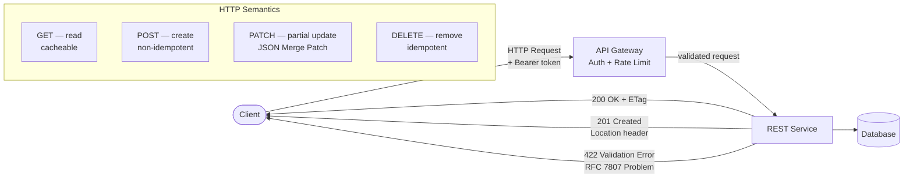

# REST API Design

## Category

API Design — REST & HTTP

## Context

REST (Representational State Transfer) remains the dominant API style for synchronous HTTP integrations. Well-designed REST APIs are intuitive, evolvable, and safe to consume by third-party clients. An OpenAPI 3.1 specification provides the contract that drives code generation, documentation, and contract testing.

### Richardson Maturity Model

| Level | Description | Example |
|-------|-------------|---------|
| **0** | RPC-over-HTTP, single endpoint | `POST /api` with action in body |
| **1** | Resources as separate URLs | `GET /payments/123` |
| **2** | HTTP verbs used correctly | `PATCH /payments/123`, 404 vs 200 |
| **3** | Hypermedia controls (HATEOAS) | Response contains `_links` |

Target Level 2 for most APIs; Level 3 for high-complexity client ecosystems.

### HTTP Method Semantics

| Method | Safe | Idempotent | Typical Use |
|--------|------|-----------|-------------|
| `GET` | ✅ | ✅ | Read resource |
| `HEAD` | ✅ | ✅ | Check existence / headers |
| `OPTIONS` | ✅ | ✅ | CORS preflight |
| `PUT` | ❌ | ✅ | Full replace of resource |
| `PATCH` | ❌ | ❌ | Partial update (JSON Patch / Merge Patch) |
| `POST` | ❌ | ❌ | Create resource or trigger action |
| `DELETE` | ❌ | ✅ | Remove resource |

### Status Code Guidance

| Range | Meaning | Common Codes |
|-------|---------|-------------|
| 2xx | Success | 200 OK, 201 Created, 202 Accepted, 204 No Content |
| 3xx | Redirect | 301 Moved Permanently, 304 Not Modified |
| 4xx | Client error | 400 Bad Request, 401 Unauthorized, 403 Forbidden, 404 Not Found, 409 Conflict, 422 Unprocessable, 429 Too Many Requests |
| 5xx | Server error | 500 Internal Server Error, 502 Bad Gateway, 503 Unavailable |

## Pros

- Widely understood — tooling, client libraries, and documentation generators are mature
- HTTP caching (ETags, `Cache-Control`) is built into the protocol
- Stateless design scales horizontally with no session affinity required
- OpenAPI spec enables auto-generated SDKs, mock servers, and interactive docs
- Excellent browser support — no additional libraries needed for simple clients

## Cons

- Over-fetching / under-fetching common in resource-centric designs (vs GraphQL)
- Versioning strategies are contentious and easy to get wrong
- No built-in subscription / streaming model (vs WebSocket, SSE, or gRPC)
- Nested resource paths create coupling between URL structure and data model
- PATCH semantics (JSON Patch vs Merge Patch) are inconsistently implemented

## Design Diagram



## Code Sample

### YAML — OpenAPI 3.1 specification (payments resource)

```yaml
openapi: "3.1.0"
info:
  title: Payments API
  version: "1.0.0"
  description: RESTful API for managing payment transactions

servers:
  - url: https://api.example.com/v1

security:
  - BearerAuth: []

components:
  securitySchemes:
    BearerAuth:
      type: http
      scheme: bearer
      bearerFormat: JWT

  schemas:
    Payment:
      type: object
      required: [id, amount, currency, status, createdAt]
      properties:
        id:          { type: string, format: uuid, readOnly: true }
        amount:      { type: number, minimum: 0.01 }
        currency:    { type: string, pattern: '^[A-Z]{3}$' }
        status:      { type: string, enum: [pending, completed, failed, refunded] }
        description: { type: string, maxLength: 255 }
        createdAt:   { type: string, format: date-time, readOnly: true }

    CreatePaymentRequest:
      type: object
      required: [amount, currency]
      properties:
        amount:      { type: number, minimum: 0.01 }
        currency:    { type: string, pattern: '^[A-Z]{3}$' }
        description: { type: string, maxLength: 255 }
        idempotencyKey: { type: string, description: "Client-generated UUID for deduplication" }

    PatchPaymentRequest:
      type: object
      properties:
        description: { type: string, maxLength: 255 }

    ProblemDetail:                      # RFC 7807
      type: object
      properties:
        type:     { type: string, format: uri }
        title:    { type: string }
        status:   { type: integer }
        detail:   { type: string }
        instance: { type: string, format: uri }

    PagedPayments:
      type: object
      required: [data, meta]
      properties:
        data: { type: array, items: { $ref: '#/components/schemas/Payment' } }
        meta:
          type: object
          properties:
            total:   { type: integer }
            page:    { type: integer }
            perPage: { type: integer }
            cursor:  { type: string, description: "Opaque cursor for next page" }

paths:
  /payments:
    get:
      operationId: listPayments
      summary: List payments (cursor-paginated)
      parameters:
        - name: cursor
          in: query
          schema: { type: string }
        - name: limit
          in: query
          schema: { type: integer, minimum: 1, maximum: 100, default: 20 }
        - name: status
          in: query
          schema: { type: string, enum: [pending, completed, failed, refunded] }
      responses:
        "200":
          description: OK
          headers:
            ETag: { schema: { type: string } }
          content:
            application/json:
              schema: { $ref: '#/components/schemas/PagedPayments' }
        "401": { description: Unauthorized, content: { application/json: { schema: { $ref: '#/components/schemas/ProblemDetail' } } } }

    post:
      operationId: createPayment
      summary: Create a new payment
      parameters:
        - name: Idempotency-Key
          in: header
          required: false
          schema: { type: string, format: uuid }
      requestBody:
        required: true
        content:
          application/json:
            schema: { $ref: '#/components/schemas/CreatePaymentRequest' }
      responses:
        "201":
          description: Created
          headers:
            Location: { schema: { type: string, format: uri } }
          content:
            application/json:
              schema: { $ref: '#/components/schemas/Payment' }
        "409":
          description: Conflict (duplicate idempotency key)
          content: { application/json: { schema: { $ref: '#/components/schemas/ProblemDetail' } } }
        "422":
          description: Validation error
          content: { application/json: { schema: { $ref: '#/components/schemas/ProblemDetail' } } }

  /payments/{id}:
    parameters:
      - name: id
        in: path
        required: true
        schema: { type: string, format: uuid }

    get:
      operationId: getPayment
      summary: Get a payment by ID
      parameters:
        - name: If-None-Match
          in: header
          schema: { type: string }
      responses:
        "200":
          description: OK
          headers:
            ETag: { schema: { type: string } }
          content:
            application/json:
              schema: { $ref: '#/components/schemas/Payment' }
        "304": { description: Not Modified }
        "404":
          description: Not Found
          content: { application/json: { schema: { $ref: '#/components/schemas/ProblemDetail' } } }

    patch:
      operationId: updatePayment
      summary: Partially update a payment (JSON Merge Patch)
      requestBody:
        required: true
        content:
          application/merge-patch+json:
            schema: { $ref: '#/components/schemas/PatchPaymentRequest' }
      responses:
        "200":
          description: OK
          content:
            application/json:
              schema: { $ref: '#/components/schemas/Payment' }
        "409": { description: Conflict (optimistic lock), content: { application/json: { schema: { $ref: '#/components/schemas/ProblemDetail' } } } }

    delete:
      operationId: deletePayment
      summary: Delete a payment (idempotent)
      responses:
        "204": { description: No Content }
        "404":
          description: Not Found
          content: { application/json: { schema: { $ref: '#/components/schemas/ProblemDetail' } } }
```

### TypeScript — REST controller with idempotency, ETags, and RFC 7807 errors

```typescript
import { Router, Request, Response } from 'express';
import { createHash } from 'crypto';
import { z } from 'zod';

const router = Router();

// ── Schemas ───────────────────────────────────────────────────────────────────
const CreatePaymentSchema = z.object({
  amount: z.number().positive(),
  currency: z.string().regex(/^[A-Z]{3}$/),
  description: z.string().max(255).optional(),
});

// ── RFC 7807 Problem Detail helper ────────────────────────────────────────────
function problem(
  res: Response,
  status: number,
  title: string,
  detail: string,
  extra?: Record<string, unknown>,
): void {
  res.status(status).type('application/problem+json').json({
    type: `https://api.example.com/problems/${title.toLowerCase().replace(/\s+/g, '-')}`,
    title,
    status,
    detail,
    ...extra,
  });
}

// ── ETag helpers ──────────────────────────────────────────────────────────────
function computeETag(entity: unknown): string {
  return `"${createHash('sha256').update(JSON.stringify(entity)).digest('hex').slice(0, 16)}"`;
}

// ── GET /payments/:id ────────────────────────────────────────────────────────
router.get('/:id', async (req: Request, res: Response) => {
  const payment = await getPaymentFromDB(req.params.id);
  if (!payment) return problem(res, 404, 'Not Found', `Payment ${req.params.id} not found`);

  const etag = computeETag(payment);

  // Conditional GET — return 304 if client has current version
  if (req.headers['if-none-match'] === etag) {
    return res.status(304).end();
  }

  res.setHeader('ETag', etag);
  res.setHeader('Cache-Control', 'private, max-age=30');
  return res.json(payment);
});

// ── POST /payments ────────────────────────────────────────────────────────────
router.post('/', async (req: Request, res: Response) => {
  const parsed = CreatePaymentSchema.safeParse(req.body);
  if (!parsed.success) {
    return problem(res, 422, 'Validation Error', 'Request body is invalid', {
      errors: parsed.error.flatten().fieldErrors,
    });
  }

  // Idempotency — check for duplicate key
  const idempotencyKey = req.headers['idempotency-key'] as string | undefined;
  if (idempotencyKey) {
    const existing = await findByIdempotencyKey(idempotencyKey);
    if (existing) {
      // Return original response — idempotent replay
      res.setHeader('Location', `/v1/payments/${existing.id}`);
      return res.status(201).json(existing);
    }
  }

  const payment = await createPaymentInDB(parsed.data, idempotencyKey);
  res.setHeader('Location', `/v1/payments/${payment.id}`);
  return res.status(201).json(payment);
});

// ── Stubs ─────────────────────────────────────────────────────────────────────
async function getPaymentFromDB(id: string): Promise<Record<string, unknown> | null> {
  void id;
  return null; // Replace with real DB query
}

async function findByIdempotencyKey(key: string): Promise<Record<string, unknown> | null> {
  void key;
  return null;
}

async function createPaymentInDB(
  data: z.infer<typeof CreatePaymentSchema>,
  idempotencyKey: string | undefined,
): Promise<Record<string, unknown>> {
  void idempotencyKey;
  return { id: crypto.randomUUID(), ...data, status: 'pending', createdAt: new Date().toISOString() };
}

export default router;
```

### TypeScript — Cursor-based pagination helper

```typescript
import { createHash } from 'crypto';

interface PaginationResult<T> {
  data: T[];
  meta: {
    total: number;
    page: number;
    perPage: number;
    cursor: string | null;
    hasMore: boolean;
  };
}

interface CursorPayload {
  id: string;
  createdAt: string;
}

export function encodeCursor(payload: CursorPayload): string {
  return Buffer.from(JSON.stringify(payload)).toString('base64url');
}

export function decodeCursor(cursor: string): CursorPayload {
  return JSON.parse(Buffer.from(cursor, 'base64url').toString()) as CursorPayload;
}

export function buildPagedResponse<T extends { id: string; createdAt: string }>(
  items: T[],
  requestedLimit: number,
  total: number,
  page: number,
): PaginationResult<T> {
  const hasMore = items.length === requestedLimit;
  const lastItem = items[items.length - 1];

  return {
    data: items,
    meta: {
      total,
      page,
      perPage: requestedLimit,
      cursor: hasMore && lastItem ? encodeCursor({ id: lastItem.id, createdAt: lastItem.createdAt }) : null,
      hasMore,
    },
  };
}
```
