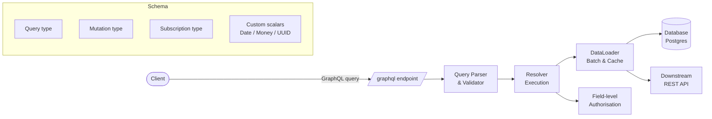

# GraphQL Schema Design

## Category

API Design — GraphQL

## Context

GraphQL gives clients precise control over the data they fetch — eliminating over-fetching and under-fetching that plague REST APIs. A well-designed schema is the foundation: it acts as the contract between backend and frontend teams and determines long-term evolvability.

### Schema Design Principles

| Principle | Description |
|-----------|-------------|
| **API-first, not DB-first** | Schema reflects product domain, not database tables |
| **Nullability by intent** | Non-null only when the field can never be absent |
| **Relay connections** | Standardised cursor pagination via `Connection` / `Edge` types |
| **Operation naming** | Queries read, mutations write, subscriptions stream |
| **Input types** | Separate input types for mutations (not reuse object types) |
| **Error union** | Return `MutationResult = SuccessPayload \| ErrorPayload` |

### Query Type Taxonomy

| Operation | Type | Example |
|-----------|------|---------|
| `payment(id)` | Query — single resource | by primary key |
| `payments(filter, first, after)` | Query — paginated list | cursor pagination |
| `createPayment(input)` | Mutation — create | returns new entity or error |
| `updatePayment(id, input)` | Mutation — update | returns updated entity or error |
| `paymentStatusChanged` | Subscription — real-time | SSE / WebSocket push |

## Pros

- Clients request exactly the fields they need — zero over-fetching
- Single endpoint replaces dozens of REST endpoints for complex domains
- Strong type system enables auto-generated TypeScript types for clients
- Introspection makes schema self-documenting with tools like GraphiQL
- Federation enables distributed ownership of a unified schema across teams

## Cons

- N+1 query problem requires DataLoader (batching) discipline
- File uploads require multipart encoding or pre-signed URL workaround
- HTTP GET caching is non-trivial — requires persisted queries or query hashing
- Introspection should be disabled in production (schema exposure risk)
- Schema design errors are painful to correct once clients depend on them

## Design Diagram



## Code Sample

### TypeScript — GraphQL schema with codegen (schema-first)

```typescript
// schema.graphql (SDL)
// ── Custom scalars ────────────────────────────────────────────────────────────
// scalar UUID
// scalar DateTime
// scalar Money

// ── Domain types ──────────────────────────────────────────────────────────────
// type Payment {
//   id: UUID!
//   amount: Money!
//   currency: String!
//   status: PaymentStatus!
//   description: String
//   createdAt: DateTime!
//   account: Account!        # resolved via DataLoader
// }

// enum PaymentStatus { PENDING COMPLETED FAILED REFUNDED }

// ── Relay-style connection ────────────────────────────────────────────────────
// type PaymentConnection {
//   edges: [PaymentEdge!]!
//   pageInfo: PageInfo!
//   totalCount: Int!
// }
// type PaymentEdge { cursor: String! node: Payment! }
// type PageInfo { hasNextPage: Boolean! hasPreviousPage: Boolean! startCursor: String endCursor: String }

// ── Mutation result union (error-as-data pattern) ───────────────────────────
// union CreatePaymentResult = Payment | ValidationError | InsufficientFundsError
// type ValidationError { message: String! fields: [FieldError!]! }
// type FieldError { field: String! message: String! }
// type InsufficientFundsError { message: String! requiredAmount: Money! availableAmount: Money! }

// ── Root types ────────────────────────────────────────────────────────────────
// type Query {
//   payment(id: UUID!): Payment
//   payments(
//     first: Int = 20
//     after: String
//     status: PaymentStatus
//   ): PaymentConnection!
// }
// type Mutation {
//   createPayment(input: CreatePaymentInput!): CreatePaymentResult!
//   cancelPayment(id: UUID!): Payment!
// }
// type Subscription {
//   paymentStatusChanged(id: UUID!): Payment!
// }
// input CreatePaymentInput {
//   amount: Float!
//   currency: String!
//   description: String
// }

export {}; // module placeholder
```

### TypeScript — Resolvers with DataLoader (N+1 protection)

```typescript
import DataLoader from 'dataloader';
import { Pool } from 'pg';

const pool = new Pool({ connectionString: process.env.DATABASE_URL });

// ── DataLoader factory (one per request to avoid cross-request caching) ───────
export function createLoaders() {
  return {
    accountLoader: new DataLoader<string, Account | null>(async (ids) => {
      const { rows } = await pool.query<Account>(
        `SELECT * FROM accounts WHERE id = ANY($1::uuid[])`,
        [ids as string[]],
      );
      const byId = new Map(rows.map((r) => [r.id, r]));
      return ids.map((id) => byId.get(id) ?? null);
    }),

    paymentsByAccountLoader: new DataLoader<string, Payment[]>(async (accountIds) => {
      const { rows } = await pool.query<Payment>(
        `SELECT * FROM payments WHERE account_id = ANY($1::uuid[]) ORDER BY created_at DESC`,
        [accountIds as string[]],
      );
      const byAccount = new Map<string, Payment[]>();
      for (const row of rows) {
        const list = byAccount.get(row.accountId) ?? [];
        list.push(row);
        byAccount.set(row.accountId, list);
      }
      return accountIds.map((id) => byAccount.get(id) ?? []);
    }),
  };
}

// ── Types ─────────────────────────────────────────────────────────────────────
interface Account { id: string; name: string; balance: number }
interface Payment { id: string; amount: number; currency: string; accountId: string; status: string; createdAt: Date }
interface Context { loaders: ReturnType<typeof createLoaders>; userId: string }

// ── Resolvers ─────────────────────────────────────────────────────────────────
export const resolvers = {
  Query: {
    payment: async (_: unknown, { id }: { id: string }, ctx: Context) => {
      const { rows } = await pool.query(
        `SELECT * FROM payments WHERE id = $1 AND user_id = $2`,
        [id, ctx.userId],
      );
      return rows[0] ?? null;
    },

    payments: async (
      _: unknown,
      { first = 20, after, status }: { first: number; after?: string; status?: string },
      ctx: Context,
    ) => {
      const params: unknown[] = [ctx.userId, first + 1]; // +1 to detect hasNextPage
      let where = 'WHERE user_id = $1';

      if (status) {
        params.push(status);
        where += ` AND status = $${params.length}`;
      }

      if (after) {
        const cursor = JSON.parse(Buffer.from(after, 'base64url').toString()) as { id: string };
        params.push(cursor.id);
        where += ` AND id < $${params.length}`;
      }

      const { rows } = await pool.query(
        `SELECT * FROM payments ${where} ORDER BY created_at DESC LIMIT $2`,
        params,
      );

      const hasNextPage = rows.length > first;
      const edges = rows.slice(0, first).map((node) => ({
        cursor: Buffer.from(JSON.stringify({ id: node.id })).toString('base64url'),
        node,
      }));

      return {
        edges,
        totalCount: 0, // fetch separately if needed
        pageInfo: {
          hasNextPage,
          hasPreviousPage: !!after,
          startCursor: edges[0]?.cursor ?? null,
          endCursor: edges[edges.length - 1]?.cursor ?? null,
        },
      };
    },
  },

  Payment: {
    // DataLoader resolves N accounts in 1 SQL call for a list of payments
    account: (payment: Payment, _: unknown, ctx: Context) =>
      ctx.loaders.accountLoader.load(payment.accountId),
  },

  Mutation: {
    createPayment: async (
      _: unknown,
      { input }: { input: { amount: number; currency: string; description?: string } },
      ctx: Context,
    ) => {
      if (input.amount <= 0) {
        return {
          __typename: 'ValidationError',
          message: 'Amount must be positive',
          fields: [{ field: 'amount', message: 'Must be greater than 0' }],
        };
      }

      const { rows } = await pool.query(
        `INSERT INTO payments (amount, currency, description, user_id, status)
         VALUES ($1, $2, $3, $4, 'pending')
         RETURNING *`,
        [input.amount, input.currency, input.description ?? null, ctx.userId],
      );

      return { __typename: 'Payment', ...rows[0] };
    },
  },
};
```

### TypeScript — Field-level authorisation with GraphQL Shield

```typescript
import { shield, rule, allow, deny } from 'graphql-shield';

interface Context { role: string; userId: string }

const isAuthenticated = rule({ cache: 'contextual' })((_parent, _args, ctx: Context) =>
  ctx.userId != null,
);

const isAdmin = rule({ cache: 'contextual' })((_parent, _args, ctx: Context) =>
  ctx.role === 'admin',
);

const isOwner = rule({ cache: 'strict' })(
  async (payment: { userId: string }, _args, ctx: Context) =>
    payment.userId === ctx.userId,
);

export const permissions = shield(
  {
    Query: {
      payment: isAuthenticated,
      payments: isAuthenticated,
    },
    Mutation: {
      createPayment: isAuthenticated,
      cancelPayment: isAuthenticated,
    },
    Payment: {
      '*': isAuthenticated,
      // Restrict sensitive fields to owner or admin
      amount: isOwner,
    },
  },
  {
    fallbackRule: deny, // Deny by default — explicit allow required
    allowExternalErrors: false,
  },
);
```
