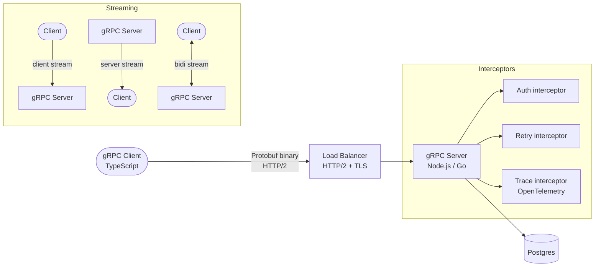

# gRPC & Protobuf

## Category

API Design — RPC & Streaming

## Context

gRPC is a high-performance, contract-first RPC framework that uses Protocol Buffers (Protobuf) as its IDL and binary wire format. It excels in service-to-service communication where low latency, strong typing, and streaming are priorities.

### gRPC vs REST vs GraphQL

| Criterion | gRPC | REST | GraphQL |
|-----------|------|------|---------|
| **Wire format** | Binary (Protobuf) | JSON (text) | JSON (text) |
| **Type safety** | Strict schema (IDL) | Weak (OpenAPI optional) | Strict schema |
| **Streaming** | Bidirectional | SSE / WebSocket add-on | Subscriptions |
| **Browser support** | Via grpc-web proxy | Native | Native |
| **Code generation** | First-class | Optional | Optional |
| **Schema evolution** | Field numbers / reserved | Versioning required | Deprecation |
| **Latency** | Very low | Low | Low |
| **Human-readable** | No (use grpcurl) | Yes | Yes |

### Streaming Modes

| Mode | Description | Use Case |
|------|-------------|---------|
| **Unary** | Single request → single response | Standard RPC call |
| **Server streaming** | Single request → stream of responses | Live feeds, large results |
| **Client streaming** | Stream of requests → single response | Bulk upload |
| **Bidirectional streaming** | Stream ↔ stream | Chat, real-time collaboration |

### Protobuf Field Number Rules

- Field numbers 1–15 use 1-byte encoding — use for frequently populated fields
- Never reuse or change field numbers — break existing serialised data
- Use `reserved` to tombstone deleted fields and names
- `optional` fields default to zero-value if absent (proto3)

## Pros

- Binary encoding is 3–10× smaller than JSON and 5–7× faster to serialise
- Bidirectional streaming enables real-time push without polling
- Strong IDL generates type-safe client and server stubs in any language
- HTTP/2 multiplexing eliminates head-of-line blocking for concurrent RPCs
- Built-in deadlines, cancellation, and header metadata propagation

## Cons

- Not human-readable — requires tooling (grpcurl, Postman gRPC) for debugging
- Browser clients need grpc-web + Envoy proxy; no native browser gRPC
- Schema changes require careful backward-compatibility management
- Steeper learning curve vs REST for new developers
- Load balancers must support HTTP/2 (ALB, NGINX, Envoy)

## Design Diagram



## Code Sample

### Protobuf — Payment service definition

```protobuf
syntax = "proto3";

package payments.v1;

option go_package = "github.com/example/payments/gen/go;payments";
option java_package = "com.example.payments.v1";

import "google/protobuf/timestamp.proto";

// ── Enums ─────────────────────────────────────────────────────────────────────
enum PaymentStatus {
  PAYMENT_STATUS_UNSPECIFIED = 0;
  PAYMENT_STATUS_PENDING     = 1;
  PAYMENT_STATUS_COMPLETED   = 2;
  PAYMENT_STATUS_FAILED      = 3;
  PAYMENT_STATUS_REFUNDED    = 4;
}

// ── Messages ──────────────────────────────────────────────────────────────────
message Payment {
  string id          = 1;
  int64  amount      = 2;  // Minor currency units (e.g., cents)
  string currency    = 3;  // ISO 4217 (EUR, USD)
  PaymentStatus status = 4;
  string description = 5;
  google.protobuf.Timestamp created_at = 6;

  // Reserved to prevent reuse of deleted fields
  reserved 7, 8;
  reserved "internal_notes";
}

message CreatePaymentRequest {
  int64  amount      = 1;
  string currency    = 2;
  string description = 3;
  string idempotency_key = 4;
}

message CreatePaymentResponse {
  Payment payment = 1;
}

message GetPaymentRequest {
  string id = 1;
}

message ListPaymentsRequest {
  string   cursor    = 1;
  int32    page_size = 2;
  PaymentStatus status_filter = 3;
}

message ListPaymentsResponse {
  repeated Payment payments   = 1;
  string           next_cursor = 2;
  int32            total_count = 3;
}

// Server-streaming: push payment status updates to subscribed clients
message WatchPaymentRequest {
  string payment_id = 1;
}

// ── Service ───────────────────────────────────────────────────────────────────
service PaymentService {
  rpc CreatePayment  (CreatePaymentRequest)  returns (CreatePaymentResponse);
  rpc GetPayment     (GetPaymentRequest)     returns (Payment);
  rpc ListPayments   (ListPaymentsRequest)   returns (ListPaymentsResponse);
  rpc WatchPayment   (WatchPaymentRequest)   returns (stream Payment); // server streaming
}
```

### TypeScript — gRPC server with @grpc/grpc-js

```typescript
import * as grpc from '@grpc/grpc-js';
import * as protoLoader from '@grpc/proto-loader';
import * as path from 'path';

// Load proto definition
const packageDef = protoLoader.loadSync(
  path.join(__dirname, '../proto/payments.v1.proto'),
  { keepCase: true, longs: String, enums: String, defaults: true, oneofs: true },
);
const { payments: { v1: proto } } = grpc.loadPackageDefinition(packageDef) as Record<string, Record<string, grpc.GrpcObject>>;

// ── Service implementation ────────────────────────────────────────────────────
const paymentService = {
  async CreatePayment(
    call: grpc.ServerUnaryCall<grpc.UntypedServiceImplementation, unknown>,
    callback: grpc.sendUnaryData<unknown>,
  ) {
    const req = call.request as { amount: string; currency: string; description?: string; idempotency_key?: string };

    if (!req.amount || !req.currency) {
      return callback({
        code: grpc.status.INVALID_ARGUMENT,
        message: 'amount and currency are required',
      });
    }

    const payment = {
      id: crypto.randomUUID(),
      amount: req.amount,
      currency: req.currency,
      description: req.description ?? '',
      status: 'PAYMENT_STATUS_PENDING',
      created_at: { seconds: Math.floor(Date.now() / 1000), nanos: 0 },
    };

    callback(null, { payment });
  },

  WatchPayment(
    call: grpc.ServerWritableStream<grpc.UntypedServiceImplementation, unknown>,
  ) {
    const req = call.request as { payment_id: string };

    // Simulate streaming status updates
    let step = 0;
    const statuses = ['PAYMENT_STATUS_PENDING', 'PAYMENT_STATUS_COMPLETED'];
    const interval = setInterval(() => {
      if (step >= statuses.length || call.cancelled) {
        clearInterval(interval);
        call.end();
        return;
      }
      call.write({
        id: req.payment_id,
        status: statuses[step],
        created_at: { seconds: Math.floor(Date.now() / 1000), nanos: 0 },
      });
      step++;
    }, 1000);

    call.on('cancelled', () => clearInterval(interval));
  },
};

// ── Auth interceptor ───────────────────────────────────────────────────────────
function authInterceptor(
  options: grpc.InterceptorOptions,
  nextCall: (options: grpc.InterceptorOptions) => grpc.InterceptingCall,
): grpc.InterceptingCall {
  return new grpc.InterceptingCall(nextCall(options), {
    start(metadata, _listener, next) {
      const token = metadata.get('authorization')[0];
      if (!token || !String(token).startsWith('Bearer ')) {
        // For server interceptors, throw on the call
        throw Object.assign(new Error('Missing auth token'), {
          code: grpc.status.UNAUTHENTICATED,
        });
      }
      next(metadata, _listener);
    },
  });
}

// ── Server bootstrap ───────────────────────────────────────────────────────────
export function startGrpcServer(port = 50051): grpc.Server {
  const server = new grpc.Server({
    interceptors: [authInterceptor],
  });

  server.addService(
    (proto['PaymentService'] as grpc.ServiceClientConstructor).service,
    paymentService,
  );

  const creds = grpc.ServerCredentials.createInsecure(); // use TLS in production
  server.bindAsync(`0.0.0.0:${port}`, creds, (err) => {
    if (err) throw err;
    console.log(`[grpc] Server listening on :${port}`);
  });

  return server;
}
```

### TypeScript — gRPC client with deadline and retry

```typescript
import * as grpc from '@grpc/grpc-js';
import * as protoLoader from '@grpc/proto-loader';
import * as path from 'path';

const packageDef = protoLoader.loadSync(
  path.join(__dirname, '../proto/payments.v1.proto'),
  { keepCase: true, longs: String, enums: String, defaults: true, oneofs: true },
);
const { payments: { v1: proto } } = grpc.loadPackageDefinition(packageDef) as Record<string, Record<string, grpc.GrpcObject>>;

const PaymentServiceClient = proto['PaymentService'] as grpc.ServiceClientConstructor;

export const client = new PaymentServiceClient(
  process.env.PAYMENT_SERVICE_ADDR ?? 'localhost:50051',
  grpc.credentials.createInsecure(), // use createSsl() in production
  {
    'grpc.service_config': JSON.stringify({
      methodConfig: [
        {
          name: [{ service: 'payments.v1.PaymentService' }],
          retryPolicy: {
            maxAttempts: 3,
            initialBackoff: '0.1s',
            maxBackoff: '1s',
            backoffMultiplier: 2,
            retryableStatusCodes: ['UNAVAILABLE', 'DEADLINE_EXCEEDED'],
          },
        },
      ],
    }),
  },
);

export function createPayment(
  amount: number,
  currency: string,
): Promise<Record<string, unknown>> {
  return new Promise((resolve, reject) => {
    const deadline = new Date(Date.now() + 5000); // 5s deadline
    client.CreatePayment(
      { amount: String(amount), currency },
      new grpc.Metadata(),
      { deadline },
      (err: grpc.ServiceError | null, response: Record<string, unknown>) => {
        if (err) return reject(err);
        resolve(response);
      },
    );
  });
}
```
