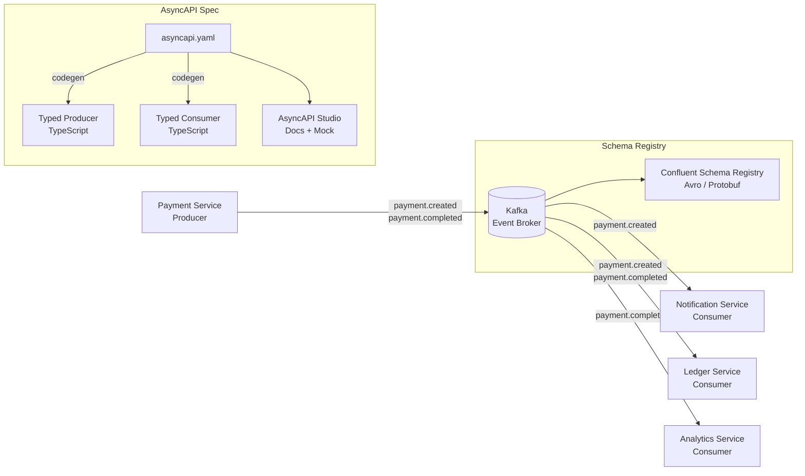

# AsyncAPI & Event-Driven APIs

## Category

API Design — Asynchronous & Event-Driven

## Context

AsyncAPI is to event-driven architectures what OpenAPI is to REST — a specification standard for describing message-driven APIs. It supports Kafka, AMQP, MQTT, WebSocket, and other messaging protocols, enabling contract-driven development for producers and consumers.

### AsyncAPI vs OpenAPI

| Aspect | OpenAPI | AsyncAPI |
|--------|---------|----------|
| Communication | Synchronous (request-reply) | Asynchronous (publish-subscribe) |
| Protocol | HTTP | Kafka, AMQP, WebSocket, SNS, MQTT |
| Trigger | Client initiates | Publisher initiates (or event loop) |
| Response coupling | Tight (wait for response) | Loose (consumer processes independently) |
| Use case | REST APIs | Event buses, message queues, streaming |

### Channel Patterns

| Pattern | Description | Example |
|---------|-------------|---------|
| **Publish** | Service produces events | `payment.created` → Kafka |
| **Subscribe** | Service consumes events | Notification service ← `payment.completed` |
| **Request-reply** | Async RPC over messaging | `transfer.request` → reply channel |
| **Broadcast** | Fan-out to all consumers | `config.updated` → all services |

## Pros

- Decouples producer and consumer — teams deploy independently
- Enables replay and reprocessing of historical events
- Reduces synchronous latency chains in complex workflows
- AsyncAPI spec generates documentation, mock consumers, and type-safe producers
- Works across multiple messaging technologies with one unified specification

## Cons

- Harder to debug than synchronous HTTP — requires distributed tracing
- Event ordering guarantees depend on the broker (Kafka partitions, SQS FIFO)
- Schema evolution requires backward-compatible changes (Avro / Protobuf)
- Testing requires a running message broker (or in-process TestContainers)
- Eventual consistency — consumer lag means downstream sees stale data temporarily

## Design Diagram



## Code Sample

### YAML — AsyncAPI 3.0 specification (payment events)

```yaml
asyncapi: "3.0.0"

info:
  title: Payments Event API
  version: "2.0.0"
  description: |
    Defines the events published by the Payments service.
    Consumers must register their schemas in the Schema Registry before consuming.
  contact:
    name: Payments Platform Team
    email: payments-platform@example.com

servers:
  production:
    host: kafka.example.com:9093
    protocol: kafka-secure
    description: Production Kafka cluster
    security:
      - saslScram: []

  development:
    host: localhost:9092
    protocol: kafka
    description: Local development broker

channels:
  payment.created:
    address: payments.v1.payment.created
    description: Published when a new payment is initiated
    messages:
      paymentCreated:
        $ref: '#/components/messages/PaymentCreated'

  payment.completed:
    address: payments.v1.payment.completed
    description: Published when a payment reaches terminal success state
    messages:
      paymentCompleted:
        $ref: '#/components/messages/PaymentCompleted'

  payment.failed:
    address: payments.v1.payment.failed
    description: Published when a payment reaches terminal failure state
    messages:
      paymentFailed:
        $ref: '#/components/messages/PaymentFailed'

operations:
  publishPaymentCreated:
    action: send
    channel:
      $ref: '#/channels/payment.created'
    summary: Publish a payment created event

  consumePaymentCompleted:
    action: receive
    channel:
      $ref: '#/channels/payment.completed'
    summary: Consume payment completed events

components:
  messages:
    PaymentCreated:
      name: PaymentCreated
      contentType: application/json
      headers:
        type: object
        properties:
          correlationId: { type: string, format: uuid }
          schemaVersion: { type: string }
      payload:
        $ref: '#/components/schemas/PaymentCreated'

    PaymentCompleted:
      name: PaymentCompleted
      contentType: application/json
      payload:
        $ref: '#/components/schemas/PaymentCompleted'

    PaymentFailed:
      name: PaymentFailed
      contentType: application/json
      payload:
        $ref: '#/components/schemas/PaymentFailed'

  schemas:
    PaymentCreated:
      type: object
      required: [eventId, eventType, eventTime, payment]
      properties:
        eventId:    { type: string, format: uuid }
        eventType:  { type: string, const: payment.created }
        eventTime:  { type: string, format: date-time }
        schemaVersion: { type: string, const: "2.0" }
        payment:
          type: object
          required: [id, amount, currency, userId]
          properties:
            id:       { type: string, format: uuid }
            amount:   { type: integer, description: "Amount in minor units (cents)" }
            currency: { type: string, pattern: '^[A-Z]{3}$' }
            userId:   { type: string, format: uuid }
            description: { type: string }

    PaymentCompleted:
      type: object
      required: [eventId, eventType, eventTime, paymentId, settledAmount]
      properties:
        eventId:       { type: string, format: uuid }
        eventType:     { type: string, const: payment.completed }
        eventTime:     { type: string, format: date-time }
        paymentId:     { type: string, format: uuid }
        settledAmount: { type: integer }
        settledAt:     { type: string, format: date-time }

    PaymentFailed:
      type: object
      required: [eventId, eventType, eventTime, paymentId, failureReason]
      properties:
        eventId:       { type: string, format: uuid }
        eventType:     { type: string, const: payment.failed }
        eventTime:     { type: string, format: date-time }
        paymentId:     { type: string, format: uuid }
        failureReason: { type: string, enum: [INSUFFICIENT_FUNDS, FRAUD_BLOCKED, TIMEOUT, REJECTED] }
        retryable:     { type: boolean }

  securitySchemes:
    saslScram:
      type: scramSha512
      description: SASL/SCRAM-SHA-512 authentication
```

### TypeScript — Type-safe Kafka producer (KafkaJS)

```typescript
import { Kafka, Partitioners, Producer } from 'kafkajs';
import { randomUUID } from 'crypto';

const kafka = new Kafka({
  clientId: 'payments-service',
  brokers: (process.env.KAFKA_BROKERS ?? 'localhost:9092').split(','),
  ssl: process.env.NODE_ENV === 'production',
  sasl: process.env.KAFKA_USERNAME
    ? {
        mechanism: 'scram-sha-512',
        username: process.env.KAFKA_USERNAME,
        password: process.env.KAFKA_PASSWORD ?? '',
      }
    : undefined,
});

// ── Typed event interfaces (generated from AsyncAPI spec or manual) ───────────
interface PaymentCreatedEvent {
  eventId: string;
  eventType: 'payment.created';
  eventTime: string;
  schemaVersion: '2.0';
  payment: {
    id: string;
    amount: number;
    currency: string;
    userId: string;
    description?: string;
  };
}

interface PaymentCompletedEvent {
  eventId: string;
  eventType: 'payment.completed';
  eventTime: string;
  paymentId: string;
  settledAmount: number;
  settledAt: string;
}

// ── Producer ──────────────────────────────────────────────────────────────────
let producer: Producer | null = null;

async function getProducer(): Promise<Producer> {
  if (!producer) {
    producer = kafka.producer({ createPartitioner: Partitioners.DefaultPartitioner });
    await producer.connect();
  }
  return producer;
}

export async function publishPaymentCreated(
  payment: PaymentCreatedEvent['payment'],
): Promise<void> {
  const event: PaymentCreatedEvent = {
    eventId: randomUUID(),
    eventType: 'payment.created',
    eventTime: new Date().toISOString(),
    schemaVersion: '2.0',
    payment,
  };

  const p = await getProducer();
  await p.send({
    topic: 'payments.v1.payment.created',
    messages: [
      {
        key: payment.userId, // Partition by userId for ordering per user
        value: JSON.stringify(event),
        headers: {
          correlationId: event.eventId,
          schemaVersion: event.schemaVersion,
          contentType: 'application/json',
        },
      },
    ],
  });
}
```

### TypeScript — Idempotent Kafka consumer with dead-letter queue

```typescript
import { Kafka, Consumer, EachMessagePayload } from 'kafkajs';
import { Pool } from 'pg';

const kafka = new Kafka({ clientId: 'notification-service', brokers: ['localhost:9092'] });
const pool = new Pool({ connectionString: process.env.DATABASE_URL });

interface PaymentCreatedEvent {
  eventId: string;
  eventType: string;
  payment: { id: string; amount: number; currency: string; userId: string };
}

async function isProcessed(eventId: string): Promise<boolean> {
  const { rows } = await pool.query(
    'SELECT 1 FROM processed_events WHERE event_id = $1',
    [eventId],
  );
  return rows.length > 0;
}

async function markProcessed(eventId: string): Promise<void> {
  await pool.query(
    'INSERT INTO processed_events (event_id, processed_at) VALUES ($1, NOW()) ON CONFLICT DO NOTHING',
    [eventId],
  );
}

async function sendToDLQ(topic: string, payload: EachMessagePayload, error: Error): Promise<void> {
  const dlqProducer = kafka.producer();
  await dlqProducer.connect();
  await dlqProducer.send({
    topic: `${topic}.dlq`,
    messages: [
      {
        key: payload.message.key,
        value: payload.message.value,
        headers: {
          ...payload.message.headers,
          'dlq-error': error.message,
          'dlq-topic': topic,
          'dlq-partition': String(payload.partition),
          'dlq-offset': payload.message.offset,
        },
      },
    ],
  });
  await dlqProducer.disconnect();
}

export async function startConsumer(): Promise<void> {
  const consumer: Consumer = kafka.consumer({ groupId: 'notification-service-v1' });
  await consumer.connect();
  await consumer.subscribe({ topic: 'payments.v1.payment.created', fromBeginning: false });

  await consumer.run({
    eachMessage: async (payload) => {
      const raw = payload.message.value?.toString();
      if (!raw) return;

      let event: PaymentCreatedEvent;
      try {
        event = JSON.parse(raw) as PaymentCreatedEvent;
      } catch (err) {
        console.error('[consumer] Unparseable message — sending to DLQ');
        await sendToDLQ('payments.v1.payment.created', payload, err as Error);
        return; // Commit offset — don't retry unparseable messages
      }

      // Idempotency check
      if (await isProcessed(event.eventId)) {
        console.log(`[consumer] Duplicate event ${event.eventId} — skipping`);
        return;
      }

      try {
        // Process the event
        await sendPaymentNotification(event.payment);
        await markProcessed(event.eventId);
      } catch (err) {
        console.error(`[consumer] Processing failed for ${event.eventId}:`, err);
        await sendToDLQ('payments.v1.payment.created', payload, err as Error);
        // Commit offset — let DLQ handle retries
      }
    },
  });
}

async function sendPaymentNotification(payment: PaymentCreatedEvent['payment']): Promise<void> {
  console.log(`[notify] Payment ${payment.id} created for user ${payment.userId}`);
  // Replace with real notification logic (email, push, etc.)
}
```
