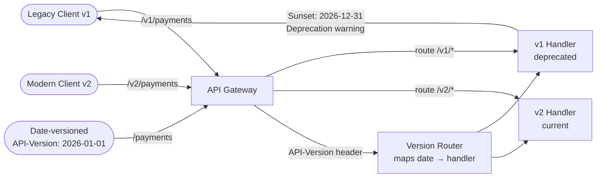

# API Versioning Strategies

## Category

API Design — Evolvability & Backward Compatibility

## Context

API versioning balances the need to evolve an API with the need to protect existing consumers from breaking changes. The right strategy depends on the consumer relationship: public third-party APIs demand strict compatibility guarantees; internal microservices can adopt contract-first consumer-driven testing as a lighter alternative.

### Breaking vs Non-Breaking Changes

| Change | Breaking? | Notes |
|--------|-----------|-------|
| Add optional request field | ❌ | Existing clients unaffected |
| Add response field | ❌ | Clients should ignore unknown fields |
| Remove request field | ✅ | Clients sending it break |
| Remove response field | ✅ | Clients reading it break |
| Change field type | ✅ | Always breaking |
| Add new enum value | ✅ | Existing switch exhausts |
| Change HTTP method | ✅ | Always breaking |
| Change URL path | ✅ | Always breaking |
| Strengthen validation | ✅ | Previously valid requests rejected |
| Relax validation | ❌ | Permissive change |

### Versioning Strategies Compared

| Strategy | Example | Pros | Cons |
|----------|---------|------|------|
| **URL path** | `/v2/payments` | Visible, easy routing | URL bloat, cache pollution |
| **Header** | `API-Version: 2026-01-01` | Clean URLs, cacheable | Less discoverable |
| **Query param** | `?version=2` | Easy to test in browser | Cache pollution |
| **Content-Type** | `Accept: application/vnd.payments.v2+json` | True media type | Verbose, unfamiliar |
| **No versioning** | Expand-only schema | Simplest | Requires strict discipline |

## Pros

- URL versioning is visually obvious and trivially routable at the load balancer
- Date-based header versioning (Stripe-style) communicates exact API snapshot
- Parallel version hosting extends the migration window for slow-moving consumers
- Semantic versioning in specs (`1.2.0` → `2.0.0`) signals breaking-change intent
- Consumer-driven contract tests (Pact) can replace versioning for internal APIs

## Cons

- Multiple active versions multiply maintenance burden and test surface
- SDK consumers may pin to an old version indefinitely
- URL versioning breaks REST resource addressability semantics
- Negotiation-based versioning adds complexity to client code
- "Forever backward compatible" imposes design constraints on API evolution

## Design Diagram



## Code Sample

### TypeScript — URL-based versioning router (Express)

```typescript
import express, { Router, Request, Response } from 'express';

const app = express();
app.use(express.json());

// ── v1 payments handler (deprecated) ─────────────────────────────────────────
const v1Router: Router = Router();

v1Router.use((_req, res, next) => {
  // Add deprecation headers to every v1 response
  res.setHeader('Deprecation', 'true');
  res.setHeader('Sunset', 'Sat, 31 Dec 2026 23:59:59 GMT');
  res.setHeader('Link', '</v2/payments>; rel="successor-version"');
  next();
});

v1Router.get('/payments', (_req: Request, res: Response) => {
  // v1 returns flat array
  res.json([{ id: '123', amount: 100, currency: 'EUR' }]);
});

// ── v2 payments handler (current) ────────────────────────────────────────────
const v2Router: Router = Router();

v2Router.get('/payments', (_req: Request, res: Response) => {
  // v2 returns paginated object
  res.json({
    data: [{ id: '123', amount: 100, currency: 'EUR', status: 'completed' }],
    meta: { total: 1, cursor: null },
  });
});

app.use('/v1', v1Router);
app.use('/v2', v2Router);

export default app;
```

### TypeScript — Date-based API versioning middleware (Stripe-style)

```typescript
import { Request, Response, NextFunction } from 'express';

type ApiVersion = '2025-01-01' | '2026-01-01';

const CURRENT_VERSION: ApiVersion = '2026-01-01';
const SUPPORTED_VERSIONS: ApiVersion[] = ['2025-01-01', '2026-01-01'];

// Version-dispatch table: maps version → handler for a given operation
type VersionHandlers = Record<ApiVersion, (req: Request, res: Response) => void>;

export function versionMiddleware(req: Request, res: Response, next: NextFunction): void {
  const requested = req.headers['api-version'] as string | undefined;
  const version: ApiVersion = SUPPORTED_VERSIONS.includes(requested as ApiVersion)
    ? (requested as ApiVersion)
    : CURRENT_VERSION;

  req.apiVersion = version;

  // Tell clients which version they are actually using
  res.setHeader('API-Version', version);

  if (version !== CURRENT_VERSION) {
    res.setHeader('Deprecation', `version=${version}`);
    res.setHeader('Sunset', 'Sat, 31 Dec 2026 23:59:59 GMT');
  }

  next();
}

// Express augmentation for apiVersion property
declare global {
  // eslint-disable-next-line @typescript-eslint/no-namespace
  namespace Express {
    interface Request { apiVersion: ApiVersion }
  }
}

// ── Dispatch helper ───────────────────────────────────────────────────────────
export function dispatch(handlers: VersionHandlers): (req: Request, res: Response) => void {
  return (req, res) => {
    const handler = handlers[req.apiVersion] ?? handlers[CURRENT_VERSION];
    handler(req, res);
  };
}
```

### TypeScript — Expand-only schema evolution (no versioning needed)

```typescript
// Strategy: only ever ADD optional fields, never remove or change semantics.
// Consumers MUST ignore unknown fields (follow Postel's Law).

// v1 — original response (2024)
interface PaymentV1 {
  id: string;
  amount: number;
  currency: string;
}

// v2 — expanded (2025): adds status + description fields (optional, backward-compatible)
interface PaymentV2 extends PaymentV1 {
  status?: 'pending' | 'completed' | 'failed';
  description?: string;
}

// v3 — expanded (2026): adds createdAt + metadata (optional, backward-compatible)
interface PaymentV3 extends PaymentV2 {
  createdAt?: string;
  metadata?: Record<string, string>;
}

// Current API always returns V3 — v1 and v2 consumers simply ignore unknown fields
// This is only valid if the client deserialiser ignores unknown fields (JSON does by default)
type CurrentPayment = PaymentV3;

export function formatPayment(dbRow: Record<string, unknown>): CurrentPayment {
  return {
    id: String(dbRow.id),
    amount: Number(dbRow.amount),
    currency: String(dbRow.currency),
    status: dbRow.status as CurrentPayment['status'],
    description: dbRow.description ? String(dbRow.description) : undefined,
    createdAt: dbRow.created_at ? String(dbRow.created_at) : undefined,
    metadata: dbRow.metadata as Record<string, string> | undefined,
  };
}
```

### YAML — OpenAPI Sunset extension for deprecation signalling

```yaml
# Use x-sunset to signal API version retirement in your OpenAPI spec
paths:
  /v1/payments:
    get:
      deprecated: true
      x-sunset: "2026-12-31"
      x-deprecation-notice: |
        This endpoint is deprecated. Please migrate to /v2/payments.
        See migration guide: https://docs.example.com/api/migration/v1-to-v2
      summary: "[DEPRECATED] List payments (v1)"
      responses:
        "200":
          description: OK
          headers:
            Deprecation:
              schema: { type: string }
              description: "RFC 8594 deprecation header"
            Sunset:
              schema: { type: string }
              description: "RFC 8594 sunset date"
            Link:
              schema: { type: string }
              description: "Successor version link"
```
