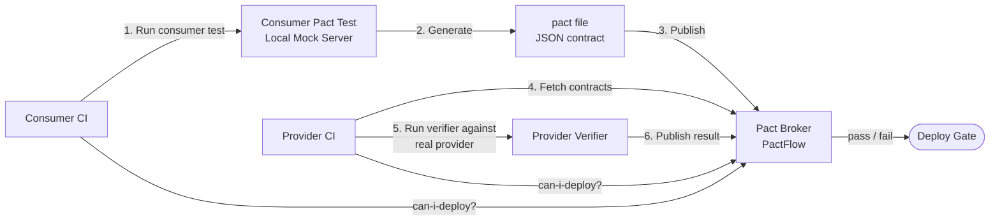

# API Contracts & Consumer-Driven Contract Testing (Pact)

## Category

API Design — Testing & Quality

## Context

Consumer-Driven Contract Testing (CDCT) with Pact inverts the traditional provider-test paradigm. Each consumer records the exact interactions it needs from a provider into a "pact" (contract file). The provider's CI pipeline then verifies it can fulfil all consumer contracts — without requiring a running consumer service.

### Contract Testing vs Integration Testing

| Aspect | Integration Test | Contract Test (Pact) |
|--------|-----------------|---------------------|
| Services required | Both running | Each side independently |
| Test environment | Staging / shared | CI (both isolated) |
| Failure localisation | Hard | Immediate — which consumer broke |
| Speed | Slow (network, DB) | Fast (in-process mock) |
| Brittle to unrelated changes | Yes | No |
| Covers real protocol | Yes | HTTP/message-level |

### Pact Workflow

| Step | Who | Tool |
|------|-----|------|
| 1. Write consumer test | Consumer team | Pact consumer DSL |
| 2. Generate pact file | Consumer CI | Pact library |
| 3. Publish pact | Consumer CI | Pact Broker |
| 4. Provider verifies pact | Provider CI | Pact provider verifier |
| 5. Publish verification result | Provider CI | Pact Broker |
| 6. Can-I-Deploy gate | Both CI pipelines | `pact-broker can-i-deploy` |

## Pros

- Catches breaking API changes before deployment — not after production incidents
- Consumer teams own the contract — provider changes must be backward compatible
- Eliminates need for expensive end-to-end staging environments for contract verification
- Pact Broker provides a central registry of all service contracts and verification states
- Works for REST, GraphQL, and message-based (Kafka, SNS) contracts

## Cons

- Every consumer team must write and maintain their pact tests
- Pact DSL has a learning curve; teams may write contracts that are too strict or too loose
- Cannot replace integration tests for testing network timeouts, retries, or data volumes
- Provider verifier runs consumer contracts on real provider code — needs test DB setup
- Pact Broker adds infrastructure dependency (self-hosted or PactFlow SaaS)

## Design Diagram



## Code Sample

### TypeScript — Pact consumer test (payment service client)

```typescript
import { PactV3, MatchersV3 } from '@pact-foundation/pact';
import * as path from 'path';
import axios from 'axios';

const { like, eachLike, regex, string, number, boolean, datetime } = MatchersV3;

const provider = new PactV3({
  consumer: 'NotificationService',
  provider: 'PaymentService',
  dir: path.resolve(process.cwd(), 'pacts'),
  logLevel: 'error',
});

// ── Consumer client (the code under test) ────────────────────────────────────
async function getPayment(baseUrl: string, id: string) {
  const response = await axios.get(`${baseUrl}/v2/payments/${id}`, {
    headers: { Authorization: 'Bearer test-token' },
  });
  return response.data as unknown;
}

describe('PaymentService contract', () => {
  describe('GET /v2/payments/:id', () => {
    beforeEach(() =>
      provider
        .given('payment 123 exists')
        .uponReceiving('a request to get payment 123')
        .withRequest({
          method: 'GET',
          path: '/v2/payments/123',
          headers: { Authorization: regex(/^Bearer .+$/, 'Bearer test-token') },
        })
        .willRespondWith({
          status: 200,
          headers: { 'Content-Type': 'application/json' },
          body: {
            id: string('123'),
            amount: number(10000),
            currency: string('EUR'),
            status: string('completed'),
            description: like('Payment for invoice #456'),
            createdAt: datetime("yyyy-MM-dd'T'HH:mm:ss.SSS'Z'", '2026-03-24T12:00:00.000Z'),
          },
        })
        .executeTest(async (mockServer) => {
          const result = await getPayment(mockServer.url, '123') as Record<string, unknown>;
          expect(result).toMatchObject({
            id: '123',
            currency: 'EUR',
            status: 'completed',
          });
        }),
    );

    it('generates a pact for GET payment', () => {
      // Test body handled in beforeEach with executeTest
    });
  });

  describe('POST /v2/payments', () => {
    beforeEach(() =>
      provider
        .given('a valid payment account exists')
        .uponReceiving('a request to create a payment')
        .withRequest({
          method: 'POST',
          path: '/v2/payments',
          headers: {
            Authorization: regex(/^Bearer .+$/, 'Bearer test-token'),
            'Content-Type': 'application/json',
          },
          body: {
            amount: number(10000),
            currency: string('EUR'),
            description: like('Test payment'),
          },
        })
        .willRespondWith({
          status: 201,
          headers: {
            'Content-Type': 'application/json',
            Location: regex(/^\/v2\/payments\/[0-9a-f-]+$/, '/v2/payments/123'),
          },
          body: {
            id: string('123'),
            amount: number(10000),
            currency: string('EUR'),
            status: string('pending'),
          },
        })
        .executeTest(async (mockServer) => {
          const res = await axios.post(
            `${mockServer.url}/v2/payments`,
            { amount: 10000, currency: 'EUR', description: 'Test payment' },
            { headers: { Authorization: 'Bearer test-token' } },
          );
          expect(res.status).toBe(201);
          expect(res.data).toHaveProperty('id');
        }),
    );

    it('generates a pact for POST payment', () => {});
  });
});
```

### TypeScript — Pact provider verifier (Express server)

```typescript
import { Verifier, VerifierOptions } from '@pact-foundation/pact';
import * as path from 'path';
import app from '../src/app'; // your Express app
import { Server } from 'http';

describe('Pact Provider Verification', () => {
  let server: Server;
  let port: number;

  beforeAll((done) => {
    server = app.listen(0, () => {
      port = (server.address() as { port: number }).port;
      done();
    });
  });

  afterAll((done) => server.close(done));

  it('validates all consumer pacts from Pact Broker', async () => {
    const options: VerifierOptions = {
      provider: 'PaymentService',
      providerBaseUrl: `http://localhost:${port}`,

      // Fetch pacts from Pact Broker
      pactBrokerUrl: process.env.PACT_BROKER_URL ?? 'http://localhost:9292',
      pactBrokerToken: process.env.PACT_BROKER_TOKEN,
      publishVerificationResult: process.env.CI === 'true',
      providerVersion: process.env.GIT_COMMIT ?? 'local',
      providerVersionBranch: process.env.GIT_BRANCH ?? 'main',

      // State handlers: set up test data for each provider state
      stateHandlers: {
        'payment 123 exists': async () => {
          // Insert test payment into DB or in-memory store
          await seedPayment({ id: '123', amount: 10000, currency: 'EUR', status: 'completed' });
        },
        'a valid payment account exists': async () => {
          // Ensure the test account exists
          await seedAccount({ id: 'test-account', balance: 100000 });
        },
      },

      // Token provider for authenticated endpoints
      requestFilter: (req, _res, next) => {
        if (req.headers.authorization?.startsWith('Bearer ')) {
          req.headers['x-user-id'] = 'test-user-id'; // inject test identity
        }
        next();
      },

      logLevel: 'error',
    };

    const verifier = new Verifier(options);
    await verifier.verifyProvider();
  });
});

// Stubs
async function seedPayment(_data: Record<string, unknown>): Promise<void> {}
async function seedAccount(_data: Record<string, unknown>): Promise<void> {}
```

### YAML — GitHub Actions — Pact can-i-deploy gate

```yaml
# .github/workflows/deploy.yml
name: Deploy with Pact Gate

on:
  push:
    branches: [main]

jobs:
  test:
    runs-on: ubuntu-latest
    steps:
      - uses: actions/checkout@v4
      - uses: actions/setup-node@v4
        with: { node-version: "22", cache: npm }
      - run: npm ci
      - run: npm test
        env:
          PACT_BROKER_URL: ${{ secrets.PACT_BROKER_URL }}
          PACT_BROKER_TOKEN: ${{ secrets.PACT_BROKER_TOKEN }}
          GIT_COMMIT: ${{ github.sha }}
          GIT_BRANCH: ${{ github.ref_name }}
          CI: "true"

  can-i-deploy:
    needs: test
    runs-on: ubuntu-latest
    steps:
      - uses: pact-foundation/pact-ruby-standalone@v2
      - name: Can I Deploy?
        run: |
          pact-broker can-i-deploy \
            --broker-base-url=${{ secrets.PACT_BROKER_URL }} \
            --broker-token=${{ secrets.PACT_BROKER_TOKEN }} \
            --pacticipant=PaymentService \
            --version=${{ github.sha }} \
            --to-environment=production

  deploy:
    needs: can-i-deploy
    runs-on: ubuntu-latest
    steps:
      - name: Deploy to production
        run: echo "Deploying..."
```
