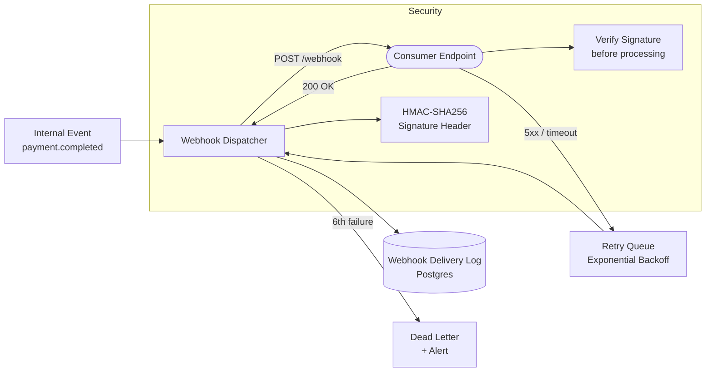

# Webhook Design & Reliability

## Category

API Design — Event Delivery

## Context

Webhooks are HTTP callbacks that push events from a provider to a consumer's endpoint when something notable happens. They are the de facto standard for real-time event notification in B2B and fintech integrations. Reliable webhook delivery requires idempotency, signature verification, retry logic, and delivery tracking.

### Webhook vs Polling vs SSE

| Aspect | Polling | SSE | Webhook |
|--------|---------|-----|---------|
| Direction | Consumer pulls | Server pushes | Server calls consumer |
| Latency | Configurable | Real-time | Near real-time |
| Consumer availability | Optional | Required | Required |
| Infrastructure | Consumer-only | Server egress | Both |
| Batching | Natural | No | Optional |
| Firewall friendliness | ✅ | ✅ | ❌ (port required) |
| Best for | Infrequent updates | UI dashboards | B2B integrations |

### Reliability Requirements

| Requirement | Implementation |
|-------------|---------------|
| **Idempotency** | Include `webhook-id` header; consumer deduplicates by ID |
| **Signature verification** | HMAC-SHA256 of payload with shared secret |
| **Delivery guarantees** | At-least-once — retry on non-2xx responses |
| **Retry policy** | Exponential backoff: 5s, 30s, 5m, 30m, 2h, 24h |
| **Dead links** | Disable endpoint after N consecutive failures |
| **Ordering** | Not guaranteed across retries — use `sequence_number` |
| **Fan-out** | Deliver to multiple endpoints per event type |

## Pros

- Real-time event notification without consumer infrastructure overhead
- Decoupled integration — provider does not need to know consumer's data model
- Easy to test with tools like webhook.site and Svix CLI tunnel
- Audit trail of every delivery attempt and response
- Consumers can evolve their handling logic without provider changes

## Cons

- Consumer endpoint must be publicly reachable — complicates local development
- Delivery failure visibility requires provider-side retry dashboards and alerting
- Consumers must handle duplicate delivery (at-least-once semantics)
- No built-in back-pressure — a slow consumer endpoint receives full event rate
- Secret rotation requires coordinated update between provider and consumer

## Design Diagram



## Code Sample

### TypeScript — Webhook dispatcher with HMAC signature and retry queue

```typescript
import { createHmac } from 'crypto';
import { Pool } from 'pg';

const pool = new Pool({ connectionString: process.env.DATABASE_URL });

interface WebhookEndpoint {
  id: string;
  url: string;
  secret: string;
  eventTypes: string[];
  enabled: boolean;
}

interface WebhookPayload {
  webhookId: string;
  eventType: string;
  eventTime: string;
  sequenceNumber: number;
  data: Record<string, unknown>;
}

// ── Signature generation ──────────────────────────────────────────────────────
function signPayload(secret: string, payload: string, timestamp: string): string {
  const message = `${timestamp}.${payload}`;
  return createHmac('sha256', secret).update(message).digest('hex');
}

// ── Deliver a single webhook ──────────────────────────────────────────────────
async function deliverWebhook(
  endpoint: WebhookEndpoint,
  payload: WebhookPayload,
  attempt: number,
): Promise<{ success: boolean; statusCode?: number; error?: string }> {
  const payloadJson = JSON.stringify(payload);
  const timestamp = String(Math.floor(Date.now() / 1000));
  const signature = signPayload(endpoint.secret, payloadJson, timestamp);

  const controller = new AbortController();
  const timeout = setTimeout(() => controller.abort(), 30_000); // 30s timeout

  try {
    const response = await fetch(endpoint.url, {
      method: 'POST',
      headers: {
        'Content-Type': 'application/json',
        'Webhook-Id': payload.webhookId,
        'Webhook-Timestamp': timestamp,
        'Webhook-Signature': `v1=${signature}`,
        'Webhook-Attempt': String(attempt),
      },
      body: payloadJson,
      signal: controller.signal,
    });

    return { success: response.ok, statusCode: response.status };
  } catch (err) {
    return {
      success: false,
      error: err instanceof Error ? err.message : 'Unknown error',
    };
  } finally {
    clearTimeout(timeout);
  }
}

// ── Retry schedule: 5s, 30s, 5m, 30m, 2h, 24h ────────────────────────────────
const RETRY_DELAYS_SECONDS = [5, 30, 300, 1800, 7200, 86400];

async function scheduleRetry(deliveryId: string, attempt: number): Promise<void> {
  if (attempt >= RETRY_DELAYS_SECONDS.length) {
    // Mark as permanently failed
    await pool.query(
      `UPDATE webhook_deliveries SET status = 'dead_lettered' WHERE id = $1`,
      [deliveryId],
    );
    console.error(`[webhook] Delivery ${deliveryId} dead-lettered after ${attempt} attempts`);
    return;
  }

  const delayMs = RETRY_DELAYS_SECONDS[attempt] * 1000;
  const nextAttemptAt = new Date(Date.now() + delayMs);

  await pool.query(
    `UPDATE webhook_deliveries
     SET status = 'pending', next_attempt_at = $1, attempts = $2
     WHERE id = $3`,
    [nextAttemptAt, attempt, deliveryId],
  );
}

// ── Main fan-out dispatcher ────────────────────────────────────────────────────
export async function dispatchWebhook(
  eventType: string,
  data: Record<string, unknown>,
): Promise<void> {
  const { rows: endpoints } = await pool.query<WebhookEndpoint>(
    `SELECT * FROM webhook_endpoints
     WHERE enabled = true AND $1 = ANY(event_types)`,
    [eventType],
  );

  for (const endpoint of endpoints) {
    const payload: WebhookPayload = {
      webhookId: crypto.randomUUID(),
      eventType,
      eventTime: new Date().toISOString(),
      sequenceNumber: Date.now(),
      data,
    };

    // Log delivery attempt
    const { rows } = await pool.query<{ id: string }>(
      `INSERT INTO webhook_deliveries
         (webhook_id, endpoint_id, event_type, payload, status, attempts)
       VALUES ($1, $2, $3, $4, 'pending', 0)
       RETURNING id`,
      [payload.webhookId, endpoint.id, eventType, JSON.stringify(payload)],
    );
    const deliveryId = rows[0].id;

    const result = await deliverWebhook(endpoint, payload, 1);

    if (result.success) {
      await pool.query(
        `UPDATE webhook_deliveries SET status = 'delivered', attempts = 1 WHERE id = $1`,
        [deliveryId],
      );
    } else {
      await scheduleRetry(deliveryId, 1);
    }
  }
}
```

### TypeScript — Consumer webhook receiver with signature verification

```typescript
import { createHmac, timingSafeEqual } from 'crypto';
import { Request, Response, Router } from 'express';
import { Pool } from 'pg';

const router = Router();
const pool = new Pool({ connectionString: process.env.DATABASE_URL });

const WEBHOOK_SECRET = process.env.WEBHOOK_SECRET ?? '';
const TOLERANCE_SECONDS = 300; // 5-minute timestamp tolerance

// ── Signature verification ────────────────────────────────────────────────────
function verifyWebhookSignature(req: Request): boolean {
  const id = req.headers['webhook-id'] as string;
  const timestamp = req.headers['webhook-timestamp'] as string;
  const signature = req.headers['webhook-signature'] as string;

  if (!id || !timestamp || !signature) return false;

  // Reject replays older than tolerance window
  const ts = parseInt(timestamp, 10);
  if (Math.abs(Date.now() / 1000 - ts) > TOLERANCE_SECONDS) {
    console.warn('[webhook] Replay attack — timestamp out of tolerance window');
    return false;
  }

  const payload = JSON.stringify(req.body);
  const expected = createHmac('sha256', WEBHOOK_SECRET)
    .update(`${timestamp}.${payload}`)
    .digest('hex');

  const received = signature.replace(/^v1=/, '');

  // Use timing-safe comparison to prevent timing attacks
  try {
    return timingSafeEqual(Buffer.from(expected), Buffer.from(received));
  } catch {
    return false;
  }
}

// ── Idempotency check ─────────────────────────────────────────────────────────
async function isAlreadyProcessed(webhookId: string): Promise<boolean> {
  const { rows } = await pool.query(
    'SELECT 1 FROM processed_webhooks WHERE webhook_id = $1',
    [webhookId],
  );
  return rows.length > 0;
}

async function markProcessed(webhookId: string, eventType: string): Promise<void> {
  await pool.query(
    `INSERT INTO processed_webhooks (webhook_id, event_type, processed_at)
     VALUES ($1, $2, NOW())
     ON CONFLICT DO NOTHING`,
    [webhookId, eventType],
  );
}

// ── POST /webhooks ─────────────────────────────────────────────────────────────
router.post('/', async (req: Request, res: Response) => {
  // Always return 2xx quickly — process async to avoid provider timeout
  if (!verifyWebhookSignature(req)) {
    return res.status(401).json({ error: 'Invalid webhook signature' });
  }

  const webhookId = req.headers['webhook-id'] as string;

  if (await isAlreadyProcessed(webhookId)) {
    return res.status(200).json({ status: 'duplicate — ignored' });
  }

  // Acknowledge immediately
  res.status(200).json({ status: 'accepted' });

  // Process asynchronously
  const { eventType, data } = req.body as { eventType: string; data: Record<string, unknown> };
  setImmediate(async () => {
    try {
      await handleEvent(eventType, data);
      await markProcessed(webhookId, eventType);
    } catch (err) {
      console.error('[webhook] Processing error:', err);
      // Provider will retry — mark as processed only after success
    }
  });
});

async function handleEvent(eventType: string, data: Record<string, unknown>): Promise<void> {
  switch (eventType) {
    case 'payment.completed':
      console.log('[webhook] Payment completed:', data.paymentId);
      break;
    case 'payment.failed':
      console.log('[webhook] Payment failed:', data.paymentId);
      break;
    default:
      console.log(`[webhook] Unknown event type: ${eventType}`);
  }
}

export default router;
```
