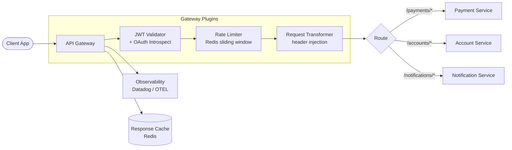

# API Gateway Patterns

## Category

API Design — Infrastructure

## Context

An API Gateway is the single entry point for all client requests. It handles cross-cutting concerns — authentication, rate limiting, request transformation, routing, and observability — so upstream services stay lean. Modern gateways range from managed cloud services (AWS API Gateway, Azure API Management) to open-source platforms (Kong, Traefik, NGINX).

### Gateway Comparison

| Gateway | Hosting | Config | Plugin model | Best for |
|---------|---------|--------|-------------|----------|
| **AWS API Gateway** | Managed | Console / Terraform | Lambda authorizer | AWS-native |
| **Azure APIM** | Managed | Azure Portal / Bicep | Policy XML | Azure enterprise |
| **Kong (OSS)** | Self-hosted / Konnect | Declarative YAML | Lua + Go plugins | Multi-cloud |
| **Traefik** | Self-hosted | Kubernetes CRD | Middleware plugins | Kubernetes |
| **NGINX** | Self-hosted | nginx.conf | Lua / njs | High-throughput |

### Core Responsibilities

| Concern | Mechanism |
|---------|-----------|
| **Authentication** | JWT validation, OAuth 2.0 introspection, mTLS |
| **Authorisation** | Scope / role enforcement at the gateway tier |
| **Rate limiting** | Per user, per client, per route |
| **Request transformation** | Header injection, body mapping, path rewriting |
| **SSL termination** | TLS handshake at gateway, plain HTTP upstream |
| **Load balancing** | Round-robin, least-conn, weighted |
| **Observability** | Access logs, distributed trace header propagation |
| **Caching** | Response caching with Vary and TTL |

## Pros

- Centralises cross-cutting concerns — zero duplication across services
- Services can evolve their internal API surface without client disruption
- Single place to add security policies across all routes
- Traffic shaping (canary, blue/green) without service changes
- Built-in observability when connected to APM tooling

## Cons

- Additional network hop increases latency (typically 1–5 ms)
- Gateway becomes a potential single point of failure — requires HA setup
- Declarative config can grow unwieldy for hundreds of routes
- Complex transformation logic at the gateway layer makes debugging harder
- Vendor lock-in risk with managed gateways (AWS API Gateway policy language)

## Design Diagram



## Code Sample

### YAML — Kong declarative configuration (deck format)

```yaml
# kong.yaml — deploy with: deck sync -s kong.yaml
_format_version: "3.0"

services:
  - name: payment-service
    url: http://payment-svc:3000
    routes:
      - name: payments-route
        paths:
          - /payments
        methods: [GET, POST, PUT, DELETE]
        strip_path: false
    plugins:
      - name: jwt
        config:
          secret_is_base64: false
          claims_to_verify: [exp]
      - name: rate-limiting
        config:
          minute: 200
          policy: redis
          redis_host: redis
          redis_port: 6379
      - name: request-transformer
        config:
          add:
            headers:
              - "X-Gateway-Version: 2"
              - "X-Consumer-Id: $(consumer.id)"

  - name: account-service
    url: http://account-svc:3000
    routes:
      - name: accounts-route
        paths:
          - /accounts
        methods: [GET]
        strip_path: false
    plugins:
      - name: jwt
        config:
          claims_to_verify: [exp]
      - name: rate-limiting
        config:
          minute: 500
          policy: redis
          redis_host: redis
          redis_port: 6379
      - name: response-ratelimiting
        config:
          limits:
            video:
              minute: 100

consumers:
  - username: mobile-app
    custom_id: mobile-app-v2
    jwt_secrets:
      - key: mobile-app-key
        algorithm: RS256
        # RS256 public key from env — never commit private keys
        rsa_public_key: |
          -----BEGIN PUBLIC KEY-----
          ${RSA_PUBLIC_KEY}
          -----END PUBLIC KEY-----
```

### YAML — AWS API Gateway (HTTP API) with Terraform

```hcl
# api_gateway.tf
resource "aws_apigatewayv2_api" "main" {
  name          = "fintech-api"
  protocol_type = "HTTP"

  cors_configuration {
    allow_origins = ["https://app.example.com"]
    allow_methods = ["GET", "POST", "PUT", "DELETE", "OPTIONS"]
    allow_headers = ["Authorization", "Content-Type", "Idempotency-Key"]
    max_age       = 300
  }
}

resource "aws_apigatewayv2_authorizer" "jwt" {
  api_id           = aws_apigatewayv2_api.main.id
  authorizer_type  = "JWT"
  identity_sources = ["$request.header.Authorization"]
  name             = "cognito-authorizer"

  jwt_configuration {
    audience = [var.cognito_client_id]
    issuer   = "https://cognito-idp.${var.aws_region}.amazonaws.com/${var.cognito_pool_id}"
  }
}

resource "aws_apigatewayv2_integration" "payment_service" {
  api_id             = aws_apigatewayv2_api.main.id
  integration_type   = "HTTP_PROXY"
  integration_uri    = var.payment_service_url
  integration_method = "ANY"
  payload_format_version = "2.0"
}

resource "aws_apigatewayv2_route" "payments" {
  api_id             = aws_apigatewayv2_api.main.id
  route_key          = "ANY /payments/{proxy+}"
  target             = "integrations/${aws_apigatewayv2_integration.payment_service.id}"
  authorization_type = "JWT"
  authorizer_id      = aws_apigatewayv2_authorizer.jwt.id
}

resource "aws_apigatewayv2_stage" "prod" {
  api_id      = aws_apigatewayv2_api.main.id
  name        = "prod"
  auto_deploy = true

  access_log_settings {
    destination_arn = aws_cloudwatch_log_group.api_gw.arn
    format = jsonencode({
      requestId      = "$context.requestId"
      ip             = "$context.identity.sourceIp"
      httpMethod     = "$context.httpMethod"
      routeKey       = "$context.routeKey"
      status         = "$context.status"
      responseLength = "$context.responseLength"
      latency        = "$context.responseLatency"
      userAgent      = "$context.identity.userAgent"
    })
  }
}
```

### TypeScript — Custom Kong plugin (JavaScript/Node) via Kong Gateway JS PDK

```typescript
// plugins/x-request-id/handler.ts
// Deploy as a Kong JS plugin — set KONG_PLUGINS=x-request-id in ENV
import { KongPlugin, KongAccess } from '@kong/js-pdk';
import { randomUUID } from 'crypto';

interface Config {
  header_name: string;
  override_existing: boolean;
}

const Plugin: KongPlugin<Config> = {
  Phase: ['access'],

  async access(kong: KongAccess, config: Config): Promise<void> {
    const headerName = config.header_name ?? 'X-Request-Id';

    const existing = await kong.request.getHeader(headerName);

    if (!existing || config.override_existing) {
      const requestId = randomUUID();
      await kong.service.request.setHeader(headerName, requestId);
      await kong.response.setHeader(headerName, requestId); // echo back
    }
  },
};

module.exports = Plugin;
```

### TypeScript — Gateway health check + route warm-up probe

```typescript
import { Injectable, OnModuleInit } from '@nestjs/common';

interface HealthStatus {
  gateway: 'up' | 'down';
  upstreamServices: Record<string, 'up' | 'down' | 'degraded'>;
  checkedAt: string;
}

@Injectable()
export class GatewayHealthService implements OnModuleInit {
  private readonly upstreams: Record<string, string> = {
    'payment-service': process.env.PAYMENT_SERVICE_URL ?? '',
    'account-service': process.env.ACCOUNT_SERVICE_URL ?? '',
    'notification-service': process.env.NOTIFICATION_SERVICE_URL ?? '',
  };

  async onModuleInit(): Promise<void> {
    await this.warmUp();
  }

  async checkHealth(): Promise<HealthStatus> {
    const results = await Promise.allSettled(
      Object.entries(this.upstreams).map(async ([name, url]) => ({
        name,
        ok: await this.probe(url),
      })),
    );

    const upstreamServices: Record<string, 'up' | 'down' | 'degraded'> = {};

    for (const result of results) {
      if (result.status === 'fulfilled') {
        upstreamServices[result.value.name] = result.value.ok ? 'up' : 'down';
      }
    }

    const allUp = Object.values(upstreamServices).every((s) => s === 'up');
    const anyUp = Object.values(upstreamServices).some((s) => s === 'up');

    return {
      gateway: allUp ? 'up' : anyUp ? 'up' : 'down',
      upstreamServices,
      checkedAt: new Date().toISOString(),
    };
  }

  private async probe(url: string): Promise<boolean> {
    try {
      const response = await fetch(`${url}/health`, { signal: AbortSignal.timeout(3000) });
      return response.ok;
    } catch {
      return false;
    }
  }

  private async warmUp(): Promise<void> {
    console.log('[gateway] Warming up upstream connections...');
    await this.checkHealth();
  }
}
```
