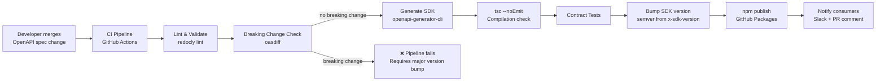

# SDK Generation

## Category

API Design — Developer Experience

## Context

SDK generation automates the creation of idiomatic client libraries directly from an API specification (OpenAPI, GraphQL SDL, Protobuf). Rather than hand-writing clients that drift from the spec, teams generate type-safe SDKs on every spec change and publish them to package registries.

### SDK Generation Strategies

| Strategy | Tool | Input | Output Languages | Best for |
|----------|------|-------|-----------------|----------|
| **OpenAPI codegen** | `openapi-generator-cli` | OpenAPI 3.x YAML/JSON | TS, Java, Python, Go, … | REST APIs |
| **GraphQL codegen** | `@graphql-codegen/cli` | GraphQL SDL + ops | TS hooks, React Query, … | GraphQL |
| **Protobuf** | `protoc` + `buf` | `.proto` files | TS, Java, Go, Rust, … | gRPC |
| **Custom template** | Mustache / Handlebars | Any spec | Any | Niche requirements |
| **Smithy** | AWS Smithy | `.smithy` model | Multi-language | AWS-style services |

### Version Lifecycle

| Phase | Action | Tooling |
|-------|--------|---------|
| Spec change merged | Trigger CI pipeline | GitHub Actions |
| Validate spec | Lint + diff breaking changes | `redocly lint`, `oasdiff` |
| Generate SDK | Run `openapi-generator-cli` | Docker image |
| Run contract tests | Validate generated types compile | `tsc --noEmit` |
| Bump version | Semantic versioning from spec version | Custom script |
| Publish | Push to npm / GitHub Packages | `npm publish` |
| Notify consumers | Post changelog to Slack / PR comment | GitHub Script |

## Pros

- SDK always reflects the latest API spec — no documentation drift
- Type-safe clients reduce integration errors at compile time
- Standardised error types and retry wrappers built into generated code
- Consumers can upgrade SDK versions to adopt new API versions safely
- Reduces time-to-first-call for new consumers from days to minutes

## Cons

- Generated code can be verbose or unidiomatic — requires custom templates
- SDK publishing pipeline adds CI complexity
- Breaking changes in the spec generate breaking changes in all SDKs simultaneously
- Custom templates must be maintained alongside generator version upgrades
- Consumers who pin SDK versions may lag behind spec fixes

## Design Diagram



## Code Sample

### YAML — OpenAPI spec with SDK generation hints

```yaml
# openapi.yaml — includes x-sdk extensions for codegen
openapi: "3.1.0"
info:
  title: Payments API
  version: "2.3.0"
  x-sdk-version: "2.3.0"           # drives SDK package version
  x-sdk-package-name: "@acme/payments-sdk"
  x-api-stability: stable          # stable | beta | experimental

paths:
  /payments:
    post:
      operationId: createPayment   # becomes sdk.payments.createPayment()
      summary: Initiate a payment
      x-sdk-group: payments        # groups operations in the SDK class
      requestBody:
        required: true
        content:
          application/json:
            schema:
              $ref: '#/components/schemas/CreatePaymentRequest'
      responses:
        '201':
          description: Payment created
          content:
            application/json:
              schema:
                $ref: '#/components/schemas/Payment'
        '422':
          $ref: '#/components/responses/ValidationError'

components:
  schemas:
    CreatePaymentRequest:
      type: object
      required: [amount, currency, debtorIban, creditorIban]
      properties:
        amount:
          type: number
          format: decimal
          minimum: 0.01
          x-sdk-type: string   # preserve precision — use string in SDK
        currency:
          type: string
          pattern: '^[A-Z]{3}$'
        debtorIban:
          type: string
        creditorIban:
          type: string
        reference:
          type: string
          maxLength: 140
```

### YAML — openapi-generator-cli config (typescript-fetch template)

```yaml
# openapitools.json at project root
{
  "$schema": "node_modules/@openapitools/openapi-generator-cli/config.schema.json",
  "spaces": 2,
  "generator-cli": {
    "version": "7.3.0"
  },
  "typescript-fetch": {
    "inputSpec": "./openapi.yaml",
    "outputDir": "./sdk/src/generated",
    "generatorName": "typescript-fetch",
    "configOptions": {
      "npmName": "@acme/payments-sdk",
      "npmVersion": "2.3.0",
      "supportsES6": true,
      "withInterfaces": true,
      "useSingleRequestParameter": true,
      "prefixParameterInterfaces": false,
      "modelPropertyNaming": "camelCase",
      "enumPropertyNaming": "SCREAMING_SNAKE_CASE",
      "typescriptThreePlus": true
    }
  }
}
```

### TypeScript — SDK wrapper with retry + auth + base URL config

```typescript
// sdk/src/client.ts — hand-written wrapper around generated client
import {
  Configuration,
  PaymentsApi,
  CreatePaymentRequest,
  Payment,
} from './generated';

export interface SdkConfig {
  baseUrl: string;
  accessToken: string | (() => Promise<string>);
  retries?: number;
  timeoutMs?: number;
}

async function resolveToken(
  token: string | (() => Promise<string>),
): Promise<string> {
  return typeof token === 'function' ? token() : token;
}

export class PaymentsClient {
  private readonly api: PaymentsApi;
  private readonly retries: number;
  private readonly timeoutMs: number;

  constructor(private readonly config: SdkConfig) {
    this.retries = config.retries ?? 3;
    this.timeoutMs = config.timeoutMs ?? 30_000;

    const apiConfig = new Configuration({
      basePath: config.baseUrl,
      accessToken: () => resolveToken(config.accessToken),
    });

    this.api = new PaymentsApi(apiConfig);
  }

  async createPayment(request: CreatePaymentRequest): Promise<Payment> {
    return this.withRetry(() =>
      this.api.createPayment({ createPaymentRequest: request }),
    );
  }

  async getPayment(paymentId: string): Promise<Payment> {
    return this.withRetry(() => this.api.getPayment({ paymentId }));
  }

  private async withRetry<T>(fn: () => Promise<T>, attempt = 1): Promise<T> {
    const controller = new AbortController();
    const timer = setTimeout(() => controller.abort(), this.timeoutMs);

    try {
      return await fn();
    } catch (err) {
      clearTimeout(timer);

      if (attempt >= this.retries) throw err;

      const retryable = this.isRetryable(err);
      if (!retryable) throw err;

      const delay = Math.min(1000 * 2 ** (attempt - 1), 30_000); // exp backoff, max 30s
      await new Promise((resolve) => setTimeout(resolve, delay));

      return this.withRetry(fn, attempt + 1);
    } finally {
      clearTimeout(timer);
    }
  }

  private isRetryable(err: unknown): boolean {
    if (err instanceof Response) {
      return err.status === 429 || err.status >= 500;
    }
    // Network errors (AbortError, TypeError: fetch failed)
    return err instanceof Error && (err.name === 'AbortError' || 'code' in err);
  }
}
```

### YAML — GitHub Actions pipeline for automated SDK publish

```yaml
# .github/workflows/sdk-publish.yml
name: SDK Publish

on:
  push:
    branches: [main]
    paths:
      - 'openapi.yaml'

permissions:
  contents: read
  packages: write

jobs:
  publish-sdk:
    runs-on: ubuntu-latest
    steps:
      - uses: actions/checkout@v4

      - name: Setup Node.js
        uses: actions/setup-node@v4
        with:
          node-version: '20'
          registry-url: 'https://npm.pkg.github.com'
          scope: '@acme'

      - name: Install openapi-generator-cli
        run: npm install -g @openapitools/openapi-generator-cli

      - name: Lint OpenAPI spec
        run: npx @redocly/cli lint openapi.yaml

      - name: Check for breaking changes
        run: |
          npx oasdiff breaking \
            https://raw.githubusercontent.com/${{ github.repository }}/HEAD~1/openapi.yaml \
            openapi.yaml \
            --fail-on ERR

      - name: Generate TypeScript SDK
        run: openapi-generator-cli generate -c openapitools.json

      - name: Compile generated types
        run: cd sdk && npm ci && npx tsc --noEmit

      - name: Bump SDK version from spec
        run: |
          VERSION=$(grep 'x-sdk-version' openapi.yaml | awk '{print $2}' | tr -d '"')
          cd sdk && npm version "$VERSION" --no-git-tag-version

      - name: Publish to GitHub Packages
        run: cd sdk && npm publish
        env:
          NODE_AUTH_TOKEN: ${{ secrets.GITHUB_TOKEN }}

      - name: Post changelog comment
        uses: actions/github-script@v7
        with:
          script: |
            github.rest.repos.createCommitComment({
              owner: context.repo.owner,
              repo: context.repo.repo,
              commit_sha: context.sha,
              body: '✅ SDK published: @acme/payments-sdk@' + process.env.SDK_VERSION,
            });
```
