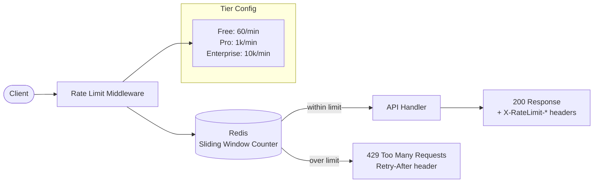

# API Rate Limiting

## Category

API Design — Resilience & Fairness

## Context

Rate limiting controls how many requests a client can make within a given time window. Without it, a single misbehaving client can degrade service for all others. Rate limiting can apply per consumer, per IP, per route, or per tier, and must return standard `429 Too Many Requests` responses with headers that allow clients to back off gracefully.

### Algorithm Comparison

| Algorithm | Accuracy | Burstiness | Memory | Distributed | Best for |
|-----------|----------|------------|--------|-------------|----------|
| **Fixed window** | Low | Allows 2× burst at boundary | O(1) | Easy | Simple quotas |
| **Sliding window log** | High | Exact | O(N) | Hard | Strict limits |
| **Sliding window counter** | High | Low burst | O(1) | Easy | Most APIs |
| **Token bucket** | High | Configurable | O(1) | Medium | Bursty traffic |
| **Leaky bucket** | High | None | O(1) | Medium | Smooth output |

### Standard Rate Limit Response Headers

| Header | Description | Example |
|--------|-------------|---------|
| `X-RateLimit-Limit` | Max requests in window | `200` |
| `X-RateLimit-Remaining` | Remaining in current window | `47` |
| `X-RateLimit-Reset` | Unix timestamp when window resets | `1712000000` |
| `Retry-After` | Seconds until client may retry (429 only) | `30` |
| `X-RateLimit-Policy` | IETF draft — machine-readable policy | `200;w=60` |

### Per-Tier Limits

| Tier | Requests/min | Burst | Scope |
|------|-------------|-------|-------|
| Free | 60 | 10 | Per API key |
| Pro | 1,000 | 200 | Per API key |
| Enterprise | 10,000 | 2,000 | Per account |

## Pros

- Protects services from DoS and runaway clients
- Enables fair usage across all consumer tiers
- Provides predictable cost for metered billing
- Forces consumers to implement exponential backoff — better overall resilience
- Sliding window counters in Redis scale to multi-instance deployments

## Cons

- Redis becomes a synchronous dependency in every request path
- Fixed window boundary bursts require careful window sizing
- Distributed rate limiting adds ~1 ms per request for Redis roundtrip
- Per-user limits require identifying users early in the pipeline, before auth failures
- Consumer confusion when shared IPs (e.g. NAT gateways) share a limit

## Design Diagram



## Code Sample

### TypeScript — Sliding window counter rate limiter (Redis)

```typescript
import { Redis } from 'ioredis';

export interface RateLimitConfig {
  windowMs: number;   // window duration in milliseconds
  maxRequests: number;
}

export interface RateLimitResult {
  allowed: boolean;
  remaining: number;
  resetAt: number;    // Unix timestamp (seconds)
  retryAfter?: number; // seconds
}

export class SlidingWindowRateLimiter {
  private readonly redis: Redis;

  constructor() {
    this.redis = new Redis({
      host: process.env.REDIS_HOST ?? 'localhost',
      port: parseInt(process.env.REDIS_PORT ?? '6379', 10),
      tls: process.env.REDIS_TLS === 'true' ? {} : undefined,
    });
  }

  /**
   * Sliding window counter using Redis INCR + EXPIRE.
   * Key format: rl:{identifier}:{window_start_seconds}
   */
  async check(identifier: string, config: RateLimitConfig): Promise<RateLimitResult> {
    const windowSeconds = Math.floor(config.windowMs / 1000);
    const nowSeconds = Math.floor(Date.now() / 1000);
    const windowStart = nowSeconds - (nowSeconds % windowSeconds);
    const key = `rl:${identifier}:${windowStart}`;

    const pipeline = this.redis.pipeline();
    pipeline.incr(key);
    pipeline.expire(key, windowSeconds * 2); // double TTL as buffer
    const results = await pipeline.exec();

    // results[0] = [err, count]
    const count = (results?.[0]?.[1] as number) ?? 0;
    const resetAt = windowStart + windowSeconds;
    const remaining = Math.max(0, config.maxRequests - count);

    if (count > config.maxRequests) {
      return {
        allowed: false,
        remaining: 0,
        resetAt,
        retryAfter: resetAt - nowSeconds,
      };
    }

    return { allowed: true, remaining, resetAt };
  }
}
```

### TypeScript — Express rate limit middleware with per-tier config

```typescript
import { Request, Response, NextFunction } from 'express';
import { SlidingWindowRateLimiter, RateLimitConfig } from './rate-limiter';

const limiter = new SlidingWindowRateLimiter();

const TIER_LIMITS: Record<string, RateLimitConfig> = {
  free:       { windowMs: 60_000, maxRequests: 60 },
  pro:        { windowMs: 60_000, maxRequests: 1_000 },
  enterprise: { windowMs: 60_000, maxRequests: 10_000 },
};

function resolveIdentifier(req: Request): string {
  // Prefer authenticated user ID; fall back to IP
  const userId = (req as Request & { userId?: string }).userId;
  return userId ? `user:${userId}` : `ip:${req.ip}`;
}

function resolveTier(req: Request): string {
  return (req as Request & { tier?: string }).tier ?? 'free';
}

export function rateLimitMiddleware() {
  return async (req: Request, res: Response, next: NextFunction): Promise<void> => {
    const identifier = resolveIdentifier(req);
    const tier = resolveTier(req);
    const config = TIER_LIMITS[tier] ?? TIER_LIMITS['free'];

    const result = await limiter.check(identifier, config);

    // Always send rate limit headers
    res.setHeader('X-RateLimit-Limit', config.maxRequests);
    res.setHeader('X-RateLimit-Remaining', result.remaining);
    res.setHeader('X-RateLimit-Reset', result.resetAt);
    res.setHeader('X-RateLimit-Policy', `${config.maxRequests};w=${config.windowMs / 1000}`);

    if (!result.allowed) {
      res.setHeader('Retry-After', result.retryAfter ?? 60);
      res.status(429).json({
        type: 'https://problems.example.com/rate-limit-exceeded',
        title: 'Too Many Requests',
        status: 429,
        detail: `Rate limit of ${config.maxRequests} requests per ${config.windowMs / 1000}s exceeded.`,
        retryAfter: result.retryAfter,
      });
      return;
    }

    next();
  };
}
```

### TypeScript — Token bucket for burst-tolerant rate limiting

```typescript
import { Redis } from 'ioredis';

export interface TokenBucketConfig {
  capacity: number;       // max tokens (burst ceiling)
  refillRatePerSec: number; // tokens added per second
}

export class TokenBucketLimiter {
  private readonly redis: Redis;

  constructor() {
    this.redis = new Redis({
      host: process.env.REDIS_HOST ?? 'localhost',
      port: parseInt(process.env.REDIS_PORT ?? '6379', 10),
    });
  }

  /**
   * Lua script ensures atomic read-modify-write on bucket state.
   * Returns 1 (allowed) or 0 (rejected).
   */
  private static readonly LUA_SCRIPT = `
    local key = KEYS[1]
    local capacity = tonumber(ARGV[1])
    local refill_rate = tonumber(ARGV[2])
    local now = tonumber(ARGV[3])
    local cost = tonumber(ARGV[4])

    local bucket = redis.call('HMGET', key, 'tokens', 'last_refill')
    local tokens = tonumber(bucket[1]) or capacity
    local last_refill = tonumber(bucket[2]) or now

    local elapsed = now - last_refill
    tokens = math.min(capacity, tokens + elapsed * refill_rate)

    if tokens < cost then
      redis.call('HMSET', key, 'tokens', tokens, 'last_refill', now)
      redis.call('EXPIRE', key, math.ceil(capacity / refill_rate) * 2)
      return 0
    end

    tokens = tokens - cost
    redis.call('HMSET', key, 'tokens', tokens, 'last_refill', now)
    redis.call('EXPIRE', key, math.ceil(capacity / refill_rate) * 2)
    return 1
  `;

  async consume(identifier: string, config: TokenBucketConfig, cost = 1): Promise<boolean> {
    const key = `tb:${identifier}`;
    const now = Date.now() / 1000; // fractional seconds

    const result = await this.redis.eval(
      TokenBucketLimiter.LUA_SCRIPT,
      1,
      key,
      String(config.capacity),
      String(config.refillRatePerSec),
      String(now),
      String(cost),
    );

    return result === 1;
  }
}
```
