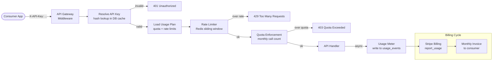

# API Monetisation

## Category

API Design — Business Model

## Context

API monetisation turns an API into a product with measurable consumption and revenue. The core primitives are: API keys (identity), usage plans (entitlements), quota enforcement (fairness), and metered billing (revenue). The pattern applies to internal SaaS platforms billing business units as well as external developer APIs.

### Monetisation Model Comparison

| Model | How Billing Works | Best for |
|-------|-----------------|---------|
| **Flat-rate / freemium** | Fixed monthly fee per tier | SaaS products, simple APIs |
| **Pay-per-call** | Billed per API call | AI APIs, enrichment services |
| **Pay-per-unit** | Billed per record/byte/event | Data APIs, bulk processing |
| **Hybrid** | Flat base + overage cost | Enterprise with predictability |
| **Revenue share** | % of transaction value | Payment, marketplace APIs |

### API Key Lifecycle

| Phase | Action | Security requirement |
|-------|--------|---------------------|
| **Generation** | Cryptographically random, 32+ bytes | `crypto.randomBytes(32)` |
| **Storage** | Hash (SHA-256) with salt; store hash only | Never store plaintext key |
| **Transmission** | Single display at creation only | HTTPS only; never in URLs |
| **Rotation** | Overlap period: old key valid for N days | Notify consumer by email |
| **Revocation** | Immediate blacklist via cache invalidation | Audit log entry required |

## Pros

- Provides clear revenue attribution per consumer and per feature
- Usage plans create natural upgrade funnels (free → pro → enterprise)
- Metered billing aligns cost with value — consumers pay for what they use
- API keys authenticate machine-to-machine without OAuth complexity
- Quota enforcement prevents a single consumer from impacting all others

## Cons

- API key management adds identity layer complexity (rotation, revocation)
- Usage metering data must be durable — loss means billing gaps
- Stripe or billing integration adds a critical external dependency
- Free tiers are abused without CAPTCHA or email verification gates
- Granular per-unit billing increases per-request latency for usage tracking

## Design Diagram



## Code Sample

### TypeScript — Secure API key generation and storage

```typescript
import { createHash, randomBytes } from 'crypto';
import { Pool } from 'pg';

const pool = new Pool({ connectionString: process.env.DATABASE_URL });

export interface ApiKey {
  id: string;
  key: string;           // returned once to consumer — never stored
  keyHash: string;       // stored in database
  prefix: string;        // first 8 chars — helps support identify key
  consumerId: string;
  planId: string;
  createdAt: Date;
  expiresAt?: Date;
}

export interface StoredApiKey {
  id: string;
  keyHash: string;
  prefix: string;
  consumerId: string;
  planId: string;
  enabled: boolean;
}

const API_KEY_PREFIX = 'sk_live_';

function hashKey(rawKey: string): string {
  return createHash('sha256').update(rawKey).digest('hex');
}

export async function generateApiKey(
  consumerId: string,
  planId: string,
): Promise<ApiKey> {
  const randomPart = randomBytes(32).toString('base64url');
  const rawKey = `${API_KEY_PREFIX}${randomPart}`;
  const keyHash = hashKey(rawKey);
  const prefix = rawKey.substring(0, 8 + API_KEY_PREFIX.length);
  const id = crypto.randomUUID();

  await pool.query(
    `INSERT INTO api_keys (id, key_hash, prefix, consumer_id, plan_id, enabled, created_at)
     VALUES ($1, $2, $3, $4, $5, true, NOW())`,
    [id, keyHash, prefix, consumerId, planId],
  );

  return {
    id,
    key: rawKey,      // shown to consumer ONCE; not stored in DB
    keyHash,
    prefix,
    consumerId,
    planId,
    createdAt: new Date(),
  };
}

export async function resolveApiKey(rawKey: string): Promise<StoredApiKey | null> {
  const keyHash = hashKey(rawKey);

  const { rows } = await pool.query<StoredApiKey>(
    `SELECT id, key_hash, prefix, consumer_id as "consumerId", plan_id as "planId", enabled
     FROM api_keys WHERE key_hash = $1`,
    [keyHash],
  );

  return rows[0] ?? null;
}

export async function revokeApiKey(keyId: string): Promise<void> {
  await pool.query(
    `UPDATE api_keys SET enabled = false, revoked_at = NOW() WHERE id = $1`,
    [keyId],
  );
}
```

### TypeScript — Quota enforcement middleware with per-plan limits

```typescript
import { Request, Response, NextFunction } from 'express';
import { Redis } from 'ioredis';
import { Pool } from 'pg';

const redis = new Redis({ host: process.env.REDIS_HOST ?? 'localhost' });
const pool = new Pool({ connectionString: process.env.DATABASE_URL });

interface UsagePlan {
  id: string;
  name: string;
  monthlyQuota: number;    // max calls per calendar month; -1 = unlimited
  rateLimitPerMin: number;
}

const PLAN_CACHE_TTL_SECONDS = 300; // cache plans for 5 minutes

async function getPlan(planId: string): Promise<UsagePlan | null> {
  const cacheKey = `plan:${planId}`;
  const cached = await redis.get(cacheKey);

  if (cached !== null) return JSON.parse(cached) as UsagePlan;

  const { rows } = await pool.query<UsagePlan>(
    `SELECT id, name, monthly_quota as "monthlyQuota", rate_limit_per_min as "rateLimitPerMin"
     FROM usage_plans WHERE id = $1`,
    [planId],
  );

  if (!rows[0]) return null;

  await redis.setex(cacheKey, PLAN_CACHE_TTL_SECONDS, JSON.stringify(rows[0]));
  return rows[0];
}

async function getMonthlyUsage(consumerId: string): Promise<number> {
  const month = new Date().toISOString().slice(0, 7); // "2024-04"
  const count = await redis.get(`quota:${consumerId}:${month}`);
  return count !== null ? parseInt(count, 10) : 0;
}

async function incrementUsage(consumerId: string): Promise<number> {
  const month = new Date().toISOString().slice(0, 7);
  const key = `quota:${consumerId}:${month}`;
  const daysInMonth = new Date(
    new Date().getFullYear(),
    new Date().getMonth() + 1,
    0,
  ).getDate();

  const pipeline = redis.pipeline();
  pipeline.incr(key);
  pipeline.expire(key, daysInMonth * 86400);
  const results = await pipeline.exec();

  return (results?.[0]?.[1] as number) ?? 0;
}

export function quotaMiddleware() {
  return async (
    req: Request & { consumerId?: string; planId?: string },
    res: Response,
    next: NextFunction,
  ): Promise<void> => {
    const { consumerId, planId } = req;

    if (!consumerId || !planId) {
      res.status(401).json({ error: 'Unauthenticated' });
      return;
    }

    const plan = await getPlan(planId);
    if (!plan) {
      res.status(403).json({ error: 'Unknown usage plan' });
      return;
    }

    if (plan.monthlyQuota !== -1) {
      const usage = await getMonthlyUsage(consumerId);
      if (usage >= plan.monthlyQuota) {
        res.status(403).json({
          type: 'https://problems.example.com/quota-exceeded',
          title: 'Monthly Quota Exceeded',
          status: 403,
          detail: `Your plan allows ${plan.monthlyQuota} calls per month. Upgrade to continue.`,
          usage,
          quota: plan.monthlyQuota,
        });
        return;
      }
    }

    // Increment in background — don't block the response
    res.on('finish', () => {
      if (res.statusCode < 500) {
        incrementUsage(consumerId).catch(console.error);
        reportToStripe(consumerId, planId).catch(console.error);
      }
    });

    next();
  };
}

// ── Stripe metered billing ────────────────────────────────────────────────────
async function reportToStripe(consumerId: string, planId: string): Promise<void> {
  // Batch reporting recommended in production — queue usage events
  // and flush to Stripe every 60s to reduce API calls
  const stripeSubscriptionItemId = await resolveStripeItemId(consumerId, planId);
  if (!stripeSubscriptionItemId) return;

  await fetch('https://api.stripe.com/v1/subscription_items/' +
    `${stripeSubscriptionItemId}/usage_records`, {
    method: 'POST',
    headers: {
      Authorization: `Bearer ${process.env.STRIPE_SECRET_KEY}`,
      'Content-Type': 'application/x-www-form-urlencoded',
    },
    body: new URLSearchParams({
      quantity: '1',
      timestamp: String(Math.floor(Date.now() / 1000)),
      action: 'increment',
    }),
  });
}

async function resolveStripeItemId(
  _consumerId: string,
  _planId: string,
): Promise<string | null> {
  // Implementation: lookup from DB join of consumers + stripe_subscriptions
  return null;
}
```
