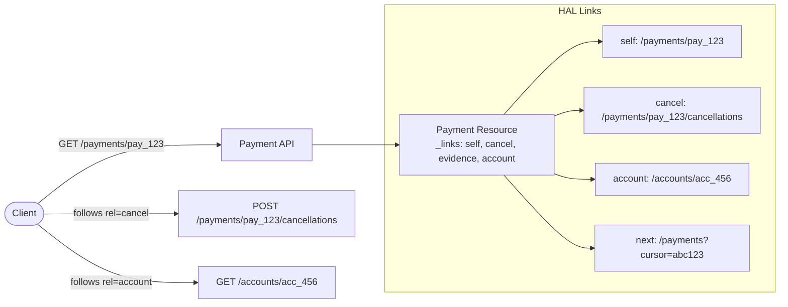

# Hypermedia & HATEOAS

## Category

API Design — Discoverability

## Context

HATEOAS (Hypermedia as the Engine of Application State) is the REST constraint that makes APIs self-describing. Responses include `_links` that tell clients what actions are available on the current resource and how to navigate to related resources — eliminating hard-coded URLs in clients and enabling server-driven state machines.

### Hypermedia Format Comparison

| Format | Media Type | Links Key | Relations | Embedded | Standard |
|--------|-----------|-----------|-----------|----------|----------|
| **HAL** | `application/hal+json` | `_links` | IANA / curie | `_embedded` | Informal |
| **JSON:API** | `application/vnd.api+json` | `links` | Keyword-based | `included` | Formal spec |
| **Siren** | `application/vnd.siren+json` | `links`, `actions` | Typed actions | `entities` | Informal |
| **Collection+JSON** | `application/vnd.collection+json` | `links` | Typed | `items` | Informal |
| **JSON-LD** | `application/ld+json` | `@context` | Full semantic | Nested | W3C Rec |

### When to Use HATEOAS

| Scenario | Recommendation |
|----------|---------------|
| Public API with many external consumers | ✅ HAL — widely supported |
| API tooling ecosystem (OpenAPI exists) | ⚠️ Minimal — OpenAPI handles discoverability |
| Complex state machine (payments, orders) | ✅ Links drive lifecycle transitions |
| Mobile clients with pre-compiled URLs | ⚠️ Adds overhead without client support |
| B2B integration with SDK | ❌ SDK handles URL construction |

## Pros

- Clients are decoupled from URL structure — server can evolve routes freely
- Links communicate available operations without a separate state machine spec
- Enables API browsing without consulting documentation
- Reduces client breakage when resource URLs change
- Self-describing APIs improve discoverability in API portals

## Cons

- Response payloads larger — `_links` on every object
- Most REST clients (Axios, Fetch) ignore links — HATEOAS benefit goes unused
- Requires discipline to keep links consistent with server-side state
- Client developers must understand link traversal — not intuitive to all
- Hypermedia format fragmentation (HAL vs JSON:API vs Siren) complicates tooling

## Design Diagram



## Code Sample

### TypeScript — HAL builder utility

```typescript
// hal.ts — lightweight HAL builder
export interface HalLink {
  href: string;
  templated?: boolean;
  type?: string;
  title?: string;
  deprecation?: string;
}

export interface HalResource<T extends Record<string, unknown>> {
  _links: Record<string, HalLink | HalLink[]>;
  _embedded?: Record<string, HalResource<Record<string, unknown>>[]>;
  _curies?: Array<{ name: string; href: string; templated: boolean }>;
}

type ResourceWithHal<T extends Record<string, unknown>> = T & HalResource<T>;

export class HalBuilder<T extends Record<string, unknown>> {
  private readonly links: Record<string, HalLink | HalLink[]> = {};
  private embedded: Record<string, HalResource<Record<string, unknown>>[]> = {};

  constructor(private readonly data: T) {}

  link(rel: string, href: string, options?: Omit<HalLink, 'href'>): this {
    this.links[rel] = { href, ...options };
    return this;
  }

  links(rel: string, items: HalLink[]): this {
    this.links[rel] = items;
    return this;
  }

  embed(
    rel: string,
    resources: HalResource<Record<string, unknown>>[],
  ): this {
    this.embedded[rel] = resources;
    return this;
  }

  build(): ResourceWithHal<T> {
    const resource: ResourceWithHal<T> = {
      ...this.data,
      _links: this.links,
    };

    if (Object.keys(this.embedded).length > 0) {
      resource._embedded = this.embedded;
    }

    return resource;
  }
}
```

### TypeScript — Express route returning HAL payment resource

```typescript
import { Request, Response, Router } from 'express';
import { HalBuilder } from './hal';

const router = Router();

interface Payment {
  id: string;
  amount: number;
  currency: string;
  status: 'pending' | 'completed' | 'cancelled' | 'failed';
  debtorIban: string;
  creditorIban: string;
  createdAt: string;
}

router.get('/:paymentId', async (req: Request, res: Response) => {
  const payment = await fetchPayment(req.params.paymentId);
  if (!payment) return res.status(404).json({ title: 'Payment not found' });

  const baseUrl = `${req.protocol}://${req.get('host')}`;

  const resource = new HalBuilder(payment)
    .link('self', `${baseUrl}/payments/${payment.id}`)
    .link('collection', `${baseUrl}/payments`)
    .link('account', `${baseUrl}/accounts?iban=${payment.debtorIban}`);

  // Conditionally expose lifecycle transition links based on state
  if (payment.status === 'pending') {
    resource
      .link('cancel', `${baseUrl}/payments/${payment.id}/cancellations`, {
        title: 'Cancel this payment',
        type: 'application/json',
      })
      .link('evidence', `${baseUrl}/payments/${payment.id}/evidence`, {
        title: 'Upload supporting evidence',
      });
  }

  if (payment.status === 'completed') {
    resource.link('receipt', `${baseUrl}/payments/${payment.id}/receipt`, {
      title: 'Download PDF receipt',
      type: 'application/pdf',
    });
  }

  res.setHeader('Content-Type', 'application/hal+json');
  res.json(resource.build());
});

// ── Collection with pagination links ─────────────────────────────────────────
router.get('/', async (req: Request, res: Response) => {
  const cursor = req.query['cursor'] as string | undefined;
  const limit = Math.min(parseInt((req.query['limit'] as string) ?? '20', 10), 100);

  const { items, nextCursor, totalCount } = await listPayments({ cursor, limit });
  const baseUrl = `${req.protocol}://${req.get('host')}`;

  const embeddedPayments = items.map((payment) =>
    new HalBuilder(payment)
      .link('self', `${baseUrl}/payments/${payment.id}`)
      .build(),
  );

  const collection = new HalBuilder({
    totalCount,
    count: items.length,
    limit,
  })
    .link('self', `${baseUrl}/payments${cursor ? `?cursor=${cursor}&limit=${limit}` : `?limit=${limit}`}`)
    .link('first', `${baseUrl}/payments?limit=${limit}`)
    .embed('payments', embeddedPayments);

  if (nextCursor) {
    collection.link('next', `${baseUrl}/payments?cursor=${nextCursor}&limit=${limit}`);
  }

  res.setHeader('Content-Type', 'application/hal+json');
  res.json(collection.build());
});

async function fetchPayment(_id: string): Promise<Payment | null> {
  return null; // replaced by real DB call
}

async function listPayments(_opts: { cursor?: string; limit: number }): Promise<{
  items: Payment[];
  nextCursor?: string;
  totalCount: number;
}> {
  return { items: [], totalCount: 0 }; // replaced by real DB call
}

export default router;
```

### TypeScript — JSON:API formatted response

```typescript
import { Request, Response } from 'express';

interface JsonApiResource<T extends Record<string, unknown>> {
  type: string;
  id: string;
  attributes: T;
  relationships?: Record<string, {
    data?: { type: string; id: string } | Array<{ type: string; id: string }>;
    links?: { self?: string; related?: string };
  }>;
  links?: { self?: string };
}

interface JsonApiDocument<T extends Record<string, unknown>> {
  data: JsonApiResource<T> | JsonApiResource<T>[];
  included?: JsonApiResource<Record<string, unknown>>[];
  links?: { self?: string; first?: string; next?: string; prev?: string; last?: string };
  meta?: Record<string, unknown>;
}

interface PaymentAttributes {
  amount: number;
  currency: string;
  status: string;
  createdAt: string;
}

export function paymentToJsonApi(
  payment: { id: string; amount: number; currency: string; status: string; createdAt: string; accountId: string },
  baseUrl: string,
): JsonApiDocument<PaymentAttributes> {
  return {
    data: {
      type: 'payments',
      id: payment.id,
      attributes: {
        amount: payment.amount,
        currency: payment.currency,
        status: payment.status,
        createdAt: payment.createdAt,
      },
      relationships: {
        account: {
          data: { type: 'accounts', id: payment.accountId },
          links: { related: `${baseUrl}/accounts/${payment.accountId}` },
        },
      },
      links: { self: `${baseUrl}/payments/${payment.id}` },
    },
    links: {
      self: `${baseUrl}/payments/${payment.id}`,
    },
  };
}
```
