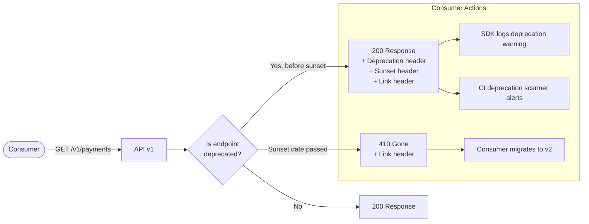

# API Deprecation Lifecycle

## Category

API Design — Lifecycle Management

## Context

API deprecation is the formal process of retiring API versions, endpoints, or fields in a way that gives consumers time to migrate. Poorly managed deprecation breaks integrations; a structured lifecycle with headers, notifications, and documented migration paths enables smooth transitions at scale.

### Deprecation Lifecycle Stages

| Stage | Duration | Action | Consumer Signal |
|-------|---------|--------|----------------|
| **Announce** | Day 0 | Publish deprecation notice | `Deprecation` header + changelog |
| **Warn** | 0 → Sunset - 60d | Return warnings on calls | `Deprecation` + `Sunset` headers every response |
| **Alert** | Last 30 days | Escalate notifications | Email + Slack + dashboard alert |
| **Sunset** | Sunset date | Endpoint returns 410 Gone | `Link` header pointing to replacement |
| **Remove** | Post-sunset | Remove code + infra | None — endpoint gone |

### RFC Standards

| RFC / Draft | Header | Format | Example |
|------------|--------|--------|---------|
| **RFC 8594** | `Sunset` | HTTP date | `Sat, 01 Jun 2025 00:00:00 GMT` |
| **IETF Draft** | `Deprecation` | HTTP date or `true` | `Sun, 01 Jan 2023 00:00:00 GMT` |
| **RFC 5988** | `Link` | URL + rel | `<https://api.example.com/v2/payments>; rel="successor-version"` |

### Minimum Notice Periods

| Consumer Type | Minimum Notice |
|--------------|---------------|
| Internal services | 30 days |
| External beta consumers | 60 days |
| Generally available API | 180 days |
| Enterprise SLA | 365 days |

## Pros

- Clear headers allow tooling (linters, SDK generators) to auto-detect deprecations
- Staggered timeline gives consumers predictable migration windows
- RFC-standard headers work with API management portals and monitoring tools
- 410 Gone (vs 404) tells clients definitively that the resource has moved
- Migration guide in `Link` header provides immediate actionable next step

## Cons

- Supporting deprecated endpoints in parallel increases maintenance burden
- Consumers often ignore headers — active notification channels are still required
- Long notice periods extend the tail of deprecated code in production
- Breaking changes (new auth, changed schema) are indistinguishable from non-breaking deprecation without versioning
- 410 responses still break integrations that don't handle HTTP errors gracefully

## Design Diagram



## Code Sample

### TypeScript — Deprecation header middleware (Express)

```typescript
import { Request, Response, NextFunction, Router } from 'express';

interface DeprecationConfig {
  deprecatedSince: Date;   // when the deprecation was announced
  sunsetDate: Date;         // when the endpoint will be removed
  successorUrl: string;     // URL of the replacement
  reason?: string;
}

const DEPRECATED_ROUTES: Map<string, DeprecationConfig> = new Map([
  [
    'GET /v1/payments',
    {
      deprecatedSince: new Date('2024-01-01T00:00:00Z'),
      sunsetDate: new Date('2025-06-01T00:00:00Z'),
      successorUrl: 'https://api.example.com/v2/payments',
      reason: 'v2 introduces cursor-based pagination and RFC 7807 error format',
    },
  ],
  [
    'POST /v1/transfers',
    {
      deprecatedSince: new Date('2024-03-01T00:00:00Z'),
      sunsetDate: new Date('2025-09-01T00:00:00Z'),
      successorUrl: 'https://api.example.com/v2/payments',
      reason: 'Merged into unified payments resource',
    },
  ],
]);

function toHttpDate(date: Date): string {
  return date.toUTCString();
}

/**
 * Attach deprecation headers on every response for deprecated routes.
 * Returns 410 Gone after the sunset date has passed.
 */
export function deprecationMiddleware(router: Router): void {
  router.use((req: Request, res: Response, next: NextFunction): void => {
    const routeKey = `${req.method} ${req.path.replace(/\/[0-9a-f-]{36}/gi, '/:id')}`;
    const config = DEPRECATED_ROUTES.get(routeKey);

    if (!config) {
      return next();
    }

    const now = new Date();

    if (now >= config.sunsetDate) {
      // Endpoint has been sunset — return 410 Gone
      res.set({
        'Sunset': toHttpDate(config.sunsetDate),
        'Link': `<${config.successorUrl}>; rel="successor-version"`,
      });
      res.status(410).json({
        type: 'https://problems.example.com/endpoint-removed',
        title: 'Gone',
        status: 410,
        detail: `This endpoint was removed on ${toHttpDate(config.sunsetDate)}. ` +
          `Please migrate to: ${config.successorUrl}`,
        successorUrl: config.successorUrl,
      });
      return;
    }

    // Endpoint is deprecated but still active — set warning headers
    res.set({
      'Deprecation': toHttpDate(config.deprecatedSince),
      'Sunset': toHttpDate(config.sunsetDate),
      'Link': `<${config.successorUrl}>; rel="successor-version"`,
    });

    next();
  });
}
```

### TypeScript — Sunset notification service (consumer registry)

```typescript
import { Pool } from 'pg';

const pool = new Pool({ connectionString: process.env.DATABASE_URL });

interface Consumer {
  id: string;
  name: string;
  email: string;
  endpoints: string[]; // which deprecated endpoints they actively call
}

interface DeprecationAlert {
  consumerId: string;
  endpoint: string;
  sunsetDate: Date;
  daysRemaining: number;
  successorUrl: string;
}

export async function sendSunsetAlerts(): Promise<void> {
  const now = new Date();

  // Find consumers who called deprecated endpoints in the last 7 days
  const { rows } = await pool.query<{
    consumerId: string;
    name: string;
    email: string;
    endpoint: string;
    sunsetDate: Date;
    successorUrl: string;
  }>(
    `SELECT
       c.id as "consumerId", c.name, c.email,
       ul.endpoint,
       de.sunset_date as "sunsetDate",
       de.successor_url as "successorUrl"
     FROM usage_logs ul
     JOIN consumers c ON c.id = ul.consumer_id
     JOIN deprecated_endpoints de ON de.route = ul.endpoint
     WHERE ul.created_at > NOW() - INTERVAL '7 days'
       AND de.sunset_date > NOW()
     GROUP BY c.id, c.name, c.email, ul.endpoint, de.sunset_date, de.successor_url`,
  );

  const alerts: DeprecationAlert[] = rows.map((row) => ({
    consumerId: row.consumerId,
    endpoint: row.endpoint,
    sunsetDate: row.sunsetDate,
    daysRemaining: Math.ceil(
      (row.sunsetDate.getTime() - now.getTime()) / (1000 * 86400)
    ),
    successorUrl: row.successorUrl,
  }));

  // Group alerts by email threshold (180d, 90d, 30d, 7d)
  for (const alert of alerts) {
    const thresholds = [180, 90, 30, 7];
    const shouldAlert = thresholds.some((t) => Math.abs(alert.daysRemaining - t) <= 1);

    if (shouldAlert) {
      await sendDeprecationEmail(alert, rows.find((r) => r.consumerId === alert.consumerId)!);
    }
  }
}

async function sendDeprecationEmail(
  alert: DeprecationAlert,
  consumer: { name: string; email: string },
): Promise<void> {
  // Integrate with email provider (SES, SendGrid, etc.)
  console.log(`[deprecation] Sending alert to ${consumer.email}:`, {
    endpoint: alert.endpoint,
    daysRemaining: alert.daysRemaining,
    sunsetDate: alert.sunsetDate.toISOString(),
    successorUrl: alert.successorUrl,
  });
}
```

### YAML — OpenAPI deprecation annotations

```yaml
# openapi.yaml — mark deprecated fields and operations
openapi: "3.1.0"

paths:
  /v1/payments:
    get:
      operationId: listPaymentsV1
      deprecated: true                   # marks operation as deprecated in tooling
      summary: "[DEPRECATED] List payments"
      description: |
        ⚠️ **Deprecated since 2024-01-01. Sunset: 2025-06-01.**

        Use [GET /v2/payments](/v2/payments) instead.

        Migration guide: https://docs.example.com/migrations/v1-to-v2
      x-sunset: "2025-06-01"
      x-deprecation-reason: "v2 introduces cursor pagination and RFC 7807 error format"
      x-successor: "/v2/payments"

components:
  schemas:
    Payment:
      type: object
      properties:
        id:
          type: string
        amount:
          type: number
        currencyCode:
          type: string
          deprecated: true              # deprecated field — use 'currency' instead
          description: "Deprecated: use 'currency'. Removed in v3."
          x-deprecation-sunset: "2025-09-01"
        currency:
          type: string
          pattern: '^[A-Z]{3}$'
          description: "ISO 4217 currency code. Replaces 'currencyCode'."
```
