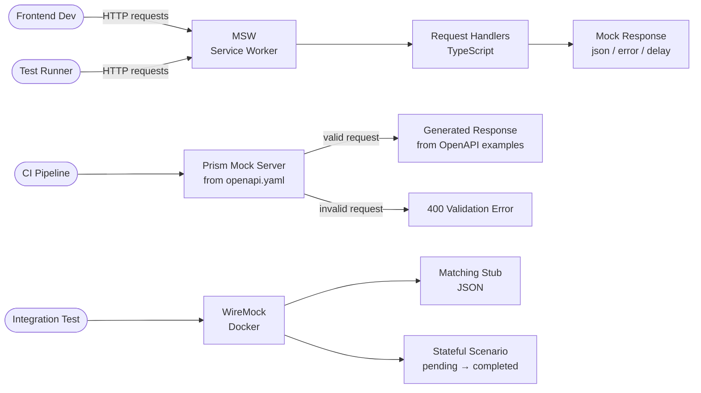

# API Mocking & Service Virtualisation

## Category

API Design — Testing & Development

## Context

API mocking allows frontend teams, mobile teams, and integration testers to work against a realistic API surface before the real backend is ready — or to isolate tests from third-party dependencies. Mocking strategies range from contract-first spec mocking (Prism) to stateful request matching (WireMock) to in-process interception (MSW for browser/Node).

### Mocking Tool Comparison

| Tool | Approach | Stateful | Best for | Spec input |
|------|----------|----------|---------|-----------|
| **Prism** | Spec-driven | Limited | Contract-first dev | OpenAPI 3.x |
| **WireMock** | Request matching | ✅ Scenarios | Integration tests | JSON stubs |
| **MSW** | Service Worker / Node | ✅ | Frontend / unit tests | TypeScript handlers |
| **Mockoon** | GUI + CLI | ✅ | Local dev, demos | OpenAPI import |
| **Postman Mock** | Cloud hosted | Limited | Quick API exploration | Postman collection |
| **json-server** | REST from JSON | Limited | Rapid prototyping | JSON file |

### When to Use Each

| Context | Tool |
|---------|------|
| Frontend development against unfinished backend | MSW |
| Integration test isolation from third-party APIs | WireMock |
| Validate requests conform to OpenAPI spec | Prism (validation proxy) |
| Shared mock for entire team / CI | WireMock (Docker) or Prism (Docker) |
| Contract testing + mocking combined | Pact |
| Demo environment | Mockoon → export → Docker |

## Pros

- Teams work in parallel — frontend, mobile, and backend decouple
- Tests run without network calls — fast, deterministic, no rate limits
- Spec-driven mocking (Prism) surfaces implementation drift early
- Stateful mocking (WireMock scenarios) enables end-to-end flow testing without a real backend
- MSW works identically in browser (Service Worker) and Node (test runner)

## Cons

- Mocks drift from reality if not kept in sync with the spec
- Stateful WireMock scenarios are complex to maintain for deep workflows
- Prism does not support dynamic computation (calculated totals, conditional logic)
- Mock latency and error behaviour requires explicit configuration — often missing
- Mock-only testing gives false confidence; contract tests with real provider needed

## Design Diagram



## Code Sample

### TypeScript — MSW handlers for payments API

```typescript
// src/mocks/handlers.ts
import { http, HttpResponse, delay } from 'msw';

interface Payment {
  id: string;
  amount: number;
  currency: string;
  status: 'pending' | 'completed' | 'failed';
  debtorIban: string;
  creditorIban: string;
  createdAt: string;
}

const payments = new Map<string, Payment>([
  [
    'pay_001',
    {
      id: 'pay_001',
      amount: 1500.00,
      currency: 'EUR',
      status: 'completed',
      debtorIban: 'DE89370400440532013000',
      creditorIban: 'GB29NWBK60161331926819',
      createdAt: '2024-04-01T10:00:00Z',
    },
  ],
]);

export const handlers = [
  // GET /payments — list
  http.get('/payments', async ({ request }) => {
    await delay(50); // realistic latency

    const url = new URL(request.url);
    const status = url.searchParams.get('status');

    const items = Array.from(payments.values()).filter(
      (p) => !status || p.status === status,
    );

    return HttpResponse.json(
      { items, totalCount: items.length },
      { headers: { 'X-RateLimit-Remaining': '199' } },
    );
  }),

  // GET /payments/:id
  http.get('/payments/:paymentId', async ({ params }) => {
    await delay(30);

    const payment = payments.get(params.paymentId as string);

    if (!payment) {
      return HttpResponse.json(
        {
          type: 'https://problems.example.com/not-found',
          title: 'Not Found',
          status: 404,
          detail: `Payment ${params.paymentId} not found`,
        },
        { status: 404 },
      );
    }

    return HttpResponse.json(payment);
  }),

  // POST /payments — create
  http.post('/payments', async ({ request }) => {
    await delay(100);

    const body = await request.json() as {
      amount: number;
      currency: string;
      debtorIban: string;
      creditorIban: string;
    };

    if (!body.amount || body.amount <= 0) {
      return HttpResponse.json(
        {
          type: 'https://problems.example.com/validation-error',
          title: 'Validation Error',
          status: 422,
          errors: [{ field: 'amount', message: 'Must be greater than 0' }],
        },
        { status: 422 },
      );
    }

    const payment: Payment = {
      id: `pay_${Math.random().toString(36).slice(2, 9)}`,
      amount: body.amount,
      currency: body.currency,
      status: 'pending',
      debtorIban: body.debtorIban,
      creditorIban: body.creditorIban,
      createdAt: new Date().toISOString(),
    };

    payments.set(payment.id, payment);

    return HttpResponse.json(payment, { status: 201 });
  }),
];
```

### TypeScript — MSW setup for browser and Vitest

```typescript
// src/mocks/browser.ts — used in development
import { setupWorker } from 'msw/browser';
import { handlers } from './handlers';

export const worker = setupWorker(...handlers);

// src/main.ts — conditional mock startup
async function enableMocking(): Promise<void> {
  if (process.env.NODE_ENV !== 'development') return;
  const { worker } = await import('./mocks/browser');
  return worker.start({ onUnhandledRequest: 'warn' });
}

await enableMocking();

// src/mocks/server.ts — used in Vitest / Jest
import { setupServer } from 'msw/node';
import { handlers } from './handlers';

export const server = setupServer(...handlers);

// vitest.setup.ts
import { beforeAll, afterAll, afterEach } from 'vitest';
import { server } from './src/mocks/server';

beforeAll(() => server.listen({ onUnhandledRequest: 'error' }));
afterEach(() => server.resetHandlers());
afterAll(() => server.close());
```

### JSON — WireMock stub with stateful scenario

```json
// wiremock/mappings/payment-created.json
{
  "scenarioName": "Payment Lifecycle",
  "requiredScenarioState": "Started",
  "newScenarioState": "PaymentPending",
  "request": {
    "method": "POST",
    "url": "/payments",
    "headers": {
      "Content-Type": { "contains": "application/json" },
      "Authorization": { "matches": "^Bearer .+" }
    },
    "bodyPatterns": [
      { "matchesJsonPath": "$.amount" },
      { "matchesJsonPath": "$.currency" }
    ]
  },
  "response": {
    "status": 201,
    "headers": {
      "Content-Type": "application/json"
    },
    "jsonBody": {
      "id": "pay_wiremock_001",
      "status": "pending",
      "amount": 1500.00,
      "currency": "EUR"
    }
  }
}
```

```json
// wiremock/mappings/payment-completed.json
{
  "scenarioName": "Payment Lifecycle",
  "requiredScenarioState": "PaymentPending",
  "request": {
    "method": "GET",
    "url": "/payments/pay_wiremock_001"
  },
  "response": {
    "status": 200,
    "headers": {
      "Content-Type": "application/json"
    },
    "jsonBody": {
      "id": "pay_wiremock_001",
      "status": "completed",
      "amount": 1500.00,
      "currency": "EUR"
    },
    "fixedDelayMilliseconds": 50
  }
}
```

### YAML — Docker Compose with Prism + WireMock for CI

```yaml
# docker-compose.mocks.yml
version: "3.9"

services:
  prism:
    image: stoplight/prism:5
    command: mock /specs/openapi.yaml --host 0.0.0.0 --port 4010 --validate-request
    ports:
      - "4010:4010"
    volumes:
      - ./openapi.yaml:/specs/openapi.yaml:ro
    healthcheck:
      test: ["CMD", "wget", "-qO-", "http://localhost:4010/__admin/health"]
      interval: 5s
      timeout: 3s
      retries: 5

  wiremock:
    image: wiremock/wiremock:3.5.2-alpine
    ports:
      - "8080:8080"
    volumes:
      - ./wiremock:/home/wiremock:ro
    command: --verbose --global-response-templating
    healthcheck:
      test: ["CMD", "wget", "-qO-", "http://localhost:8080/__admin/health"]
      interval: 5s
      timeout: 3s
      retries: 5
```
