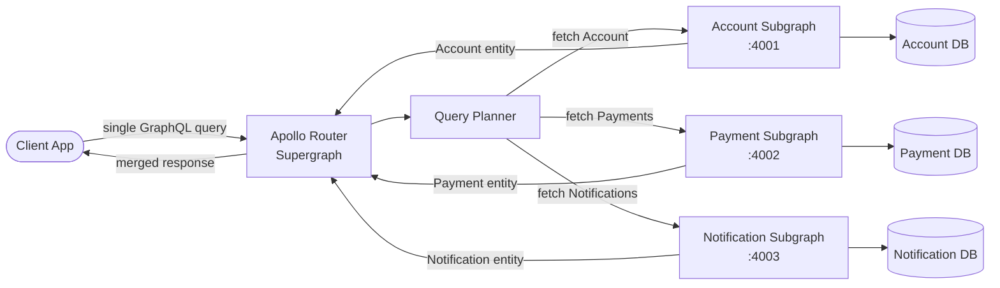

# GraphQL Federation

## Category

API Design — Distributed GraphQL

## Context

GraphQL Federation lets multiple teams own independent GraphQL subgraph services that compose into a single unified supergraph. The Apollo Router (or Apollo Gateway) stitches subgraphs together, allowing a single schema to span many microservices without a monolithic GraphQL server.

### Federation vs Schema Stitching vs Monolith

| Approach | Team autonomy | Schema consistency | Runtime | Recommended |
|----------|-------------|-------------------|---------|-------------|
| **Monolith GraphQL** | Low — single schema | ✅ | In-process | Small team |
| **Schema stitching** | Medium | ⚠️ Manual merge | Gateway | Legacy |
| **Apollo Federation v2** | ✅ High | ✅ Composition rules | Apollo Router | Multi-team |
| **Hive Gateway** | ✅ High | ✅ | Hive Router | OSS alternative |

### Key Federation Concepts

| Directive | Purpose |
|-----------|---------|
| `@key(fields: "id")` | Declares entity primary key for cross-subgraph resolution |
| `@shareable` | Allows multiple subgraphs to define the same field |
| `@external` | Marks a field owned by another subgraph but used locally |
| `@requires` | Declares fields needed from another subgraph before resolving |
| `@provides` | Declares fields that this subgraph can resolve without extra fetch |
| `@override` | Migrates a field ownership from one subgraph to another |
| `@interfaceObject` | Resolves interface types across subgraph boundaries |

## Pros

- Each team owns and deploys their subgraph independently — no gate-keeping
- Consumers query a single API endpoint with joins across many services
- Schema validation at composition time — catch cross-subgraph type conflicts in CI
- Apollo Router handles query planning and parallel subgraph fetch
- Subgraph schemas are valid standalone GraphQL — can be developed and tested in isolation

## Cons

- Apollo Router is an additional infrastructure component — adds latency and operational complexity
- Entity resolution introduces extra subgraph calls (N+1 at the federation layer)
- `@requires` / `@provides` directives must be carefully coordinated across teams
- Debugging distributed query plans is harder than monolith GraphQL
- Breaking changes in a shared entity type can ripple across all subgraphs

## Design Diagram



## Code Sample

### TypeScript — Account subgraph (entity owner)

```typescript
// subgraphs/account/index.ts
import { ApolloServer } from '@apollo/server';
import { startStandaloneServer } from '@apollo/server/standalone';
import { buildSubgraphSchema } from '@apollo/subgraph';
import { gql } from 'graphql-tag';
import { Pool } from 'pg';

const pool = new Pool({ connectionString: process.env.DATABASE_URL });

// Account is the entity owner — it defines the @key
const typeDefs = gql`
  extend schema
    @link(url: "https://specs.apollo.dev/federation/v2.3"
          import: ["@key", "@shareable"])

  type Account @key(fields: "id") {
    id: ID!
    iban: String!
    name: String!
    balance: Float!
    currency: String!
  }

  type Query {
    account(id: ID!): Account
    accounts: [Account!]!
  }
`;

interface AccountRecord {
  id: string;
  iban: string;
  name: string;
  balance: number;
  currency: string;
}

const resolvers = {
  Account: {
    // __resolveReference is called by the Router to hydrate Account entities
    // referenced from other subgraphs
    async __resolveReference(
      reference: { id: string },
    ): Promise<AccountRecord | null> {
      const { rows } = await pool.query<AccountRecord>(
        'SELECT id, iban, name, balance, currency FROM accounts WHERE id = $1',
        [reference.id],
      );
      return rows[0] ?? null;
    },
  },

  Query: {
    async account(_: unknown, args: { id: string }): Promise<AccountRecord | null> {
      const { rows } = await pool.query<AccountRecord>(
        'SELECT id, iban, name, balance, currency FROM accounts WHERE id = $1',
        [args.id],
      );
      return rows[0] ?? null;
    },

    async accounts(): Promise<AccountRecord[]> {
      const { rows } = await pool.query<AccountRecord>(
        'SELECT id, iban, name, balance, currency FROM accounts',
      );
      return rows;
    },
  },
};

const server = new ApolloServer({
  schema: buildSubgraphSchema({ typeDefs, resolvers }),
});

const { url } = await startStandaloneServer(server, {
  listen: { port: 4001 },
});

console.log(`[account-subgraph] Ready at ${url}`);
```

### TypeScript — Payment subgraph (entity that references Account)

```typescript
// subgraphs/payment/index.ts
import { ApolloServer } from '@apollo/server';
import { startStandaloneServer } from '@apollo/server/standalone';
import { buildSubgraphSchema } from '@apollo/subgraph';
import { gql } from 'graphql-tag';
import { Pool } from 'pg';

const pool = new Pool({ connectionString: process.env.DATABASE_URL });

const typeDefs = gql`
  extend schema
    @link(url: "https://specs.apollo.dev/federation/v2.3"
          import: ["@key", "@external", "@requires"])

  # Reference Account from the Account subgraph — we do NOT own it
  type Account @key(fields: "id", resolvable: false) {
    id: ID!
  }

  type Payment @key(fields: "id") {
    id: ID!
    amount: Float!
    currency: String!
    status: PaymentStatus!
    createdAt: String!
    debtorAccount: Account!
    creditorAccount: Account!
  }

  enum PaymentStatus {
    PENDING
    COMPLETED
    FAILED
    CANCELLED
  }

  input CreatePaymentInput {
    amount: Float!
    currency: String!
    debtorAccountId: ID!
    creditorAccountId: ID!
    reference: String
  }

  type Query {
    payment(id: ID!): Payment
    payments(status: PaymentStatus, limit: Int, cursor: String): PaymentConnection!
  }

  type PaymentConnection {
    edges: [PaymentEdge!]!
    pageInfo: PageInfo!
  }

  type PaymentEdge {
    node: Payment!
    cursor: String!
  }

  type PageInfo {
    hasNextPage: Boolean!
    endCursor: String
  }

  type Mutation {
    createPayment(input: CreatePaymentInput!): Payment!
  }
`;

interface PaymentRecord {
  id: string;
  amount: number;
  currency: string;
  status: string;
  created_at: string;
  debtor_account_id: string;
  creditor_account_id: string;
}

const resolvers = {
  Payment: {
    async __resolveReference(reference: { id: string }): Promise<PaymentRecord | null> {
      const { rows } = await pool.query<PaymentRecord>(
        'SELECT * FROM payments WHERE id = $1',
        [reference.id],
      );
      return rows[0] ?? null;
    },

    debtorAccount(payment: PaymentRecord) {
      return { __typename: 'Account', id: payment.debtor_account_id };
    },

    creditorAccount(payment: PaymentRecord) {
      return { __typename: 'Account', id: payment.creditor_account_id };
    },

    createdAt(payment: PaymentRecord) {
      return payment.created_at;
    },
  },

  Query: {
    async payment(_: unknown, args: { id: string }): Promise<PaymentRecord | null> {
      const { rows } = await pool.query<PaymentRecord>(
        'SELECT * FROM payments WHERE id = $1',
        [args.id],
      );
      return rows[0] ?? null;
    },

    async payments(
      _: unknown,
      args: { status?: string; limit?: number; cursor?: string },
    ) {
      const limit = Math.min(args.limit ?? 20, 100);
      const { rows } = await pool.query<PaymentRecord>(
        `SELECT * FROM payments
         WHERE ($1::text IS NULL OR status = $1)
           AND ($2::text IS NULL OR id > $2)
         ORDER BY id
         LIMIT $3`,
        [args.status ?? null, args.cursor ?? null, limit + 1],
      );

      const hasNextPage = rows.length > limit;
      const edges = rows.slice(0, limit).map((row) => ({
        node: row,
        cursor: row.id,
      }));

      return {
        edges,
        pageInfo: {
          hasNextPage,
          endCursor: edges[edges.length - 1]?.cursor ?? null,
        },
      };
    },
  },

  Mutation: {
    async createPayment(
      _: unknown,
      args: {
        input: {
          amount: number;
          currency: string;
          debtorAccountId: string;
          creditorAccountId: string;
          reference?: string;
        };
      },
    ): Promise<PaymentRecord> {
      const { input } = args;
      const { rows } = await pool.query<PaymentRecord>(
        `INSERT INTO payments (id, amount, currency, status, debtor_account_id, creditor_account_id, created_at)
         VALUES (gen_random_uuid(), $1, $2, 'PENDING', $3, $4, NOW())
         RETURNING *`,
        [input.amount, input.currency, input.debtorAccountId, input.creditorAccountId],
      );
      return rows[0];
    },
  },
};

const server = new ApolloServer({
  schema: buildSubgraphSchema({ typeDefs, resolvers }),
});

const { url } = await startStandaloneServer(server, {
  listen: { port: 4002 },
});

console.log(`[payment-subgraph] Ready at ${url}`);
```

### YAML — Apollo Router supergraph configuration

```yaml
# router.yaml — Apollo Router config
supergraph:
  # Supergraph SDL is generated via: rover supergraph compose --config supergraph.yaml
  path: ./supergraph.graphql

server:
  listen: 0.0.0.0:4000

cors:
  allow_credentials: true
  origins:
    - https://app.example.com

headers:
  all:
    request:
      - propagate:
          matching: ^(Authorization|X-Correlation-ID|X-Request-ID)$

traffic_shaping:
  all:
    timeout: 30s
  router:
    timeout: 60s

telemetry:
  tracing:
    propagation:
      trace_context: true
    exporters:
      otlp:
        enabled: true
        endpoint: http://otel-collector:4317
        protocol: grpc

# supergraph.yaml — compose config (used with rover)
# subgraphs:
#   account:
#     routing_url: http://account-svc:4001/graphql
#     schema:
#       subgraph_url: http://account-svc:4001/graphql
#   payment:
#     routing_url: http://payment-svc:4002/graphql
#     schema:
#       subgraph_url: http://payment-svc:4002/graphql
```
