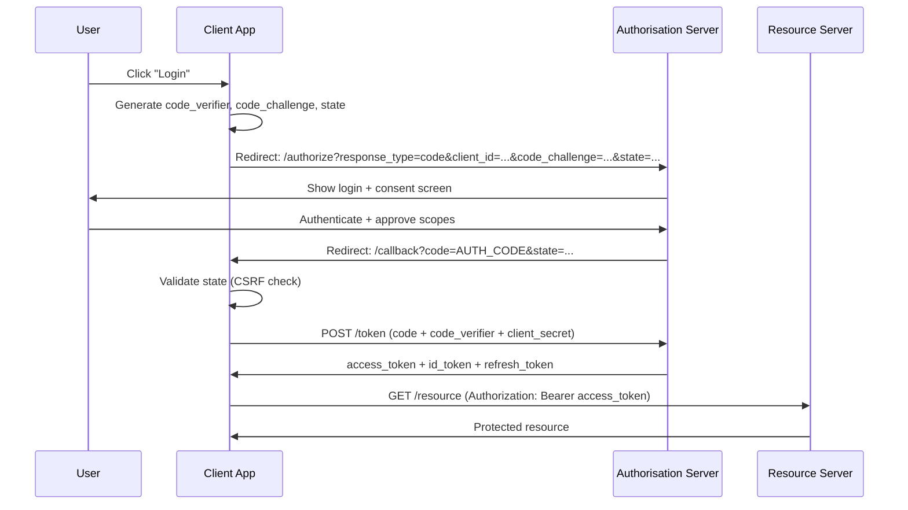

# OAuth 2.0 & OpenID Connect

## Category

CIAM / IAM — Protocols, OAuth 2.0, OpenID Connect, Delegated Authorisation, Authentication

## Context

**OAuth 2.0** is the industry-standard protocol for delegated authorisation — it lets a user grant an application access to their resources on another service without sharing credentials. **OpenID Connect (OIDC)** is an identity layer on top of OAuth 2.0 that adds authentication: the `id_token` (a JWT) carries verified claims about the authenticated user.

### OAuth 2.0 Grant Types

| Grant Type | Use Case | When to Use |
|------------|---------|-------------|
| **Authorization Code + PKCE** | Web apps, mobile apps | Almost always — the secure default |
| **Client Credentials** | Machine-to-machine (M2M) | Service-to-service, background jobs |
| **Device Authorization** | TV/CLI devices with no browser | Smart TVs, IoT, CLI tools |
| **Refresh Token** | Long-lived sessions | All user-facing apps |
| ~~Implicit~~ | ~~SPAs (deprecated)~~ | ❌ Do not use — replaced by Code + PKCE |
| ~~Resource Owner Password~~ | ~~Direct credential exchange~~ | ❌ Do not use — anti-pattern |

### Key Concepts

| Concept | Description |
|---------|-------------|
| **Authorization Code** | Short-lived one-use code exchanged for tokens at the token endpoint |
| **PKCE** | `code_verifier` / `code_challenge` — prevents auth code interception (mandatory for public clients) |
| **Access Token** | Short-lived credential (15 min) for calling APIs |
| **Refresh Token** | Long-lived credential for obtaining new access tokens without re-authentication |
| **ID Token** | OIDC JWT containing authenticated user claims (`sub`, `email`, `name`) |
| **Scope** | Space-separated list of permissions requested (`openid profile email`) |
| **State** | CSRF protection parameter — random value validated on callback |

---

## Pros

- Authorization Code + PKCE is phishing-resistant — credentials never leave the authorisation server.
- Delegated model means apps never see user passwords — reduced breach surface.
- Access tokens are short-lived — compromised tokens self-expire quickly.
- Standardised flows — any OIDC-compliant library works with any compliant IdP.
- Scopes enable least-privilege access — apps request only what they need.

---

## Cons

- OAuth 2.0 is an authorisation framework, not a complete authentication protocol — OIDC is required for identity.
- PKCE + state parameters must be correctly implemented; libraries handle this but bugs exist.
- Token management complexity: access token refresh, rotation, revocation must all be implemented.
- Multiple redirect URIs across environments require careful registration management.
- Implicit grant was widely used historically — legacy apps may need migration.

---

## Design Diagram



---

## Code Sample

### TypeScript — Authorization Code + PKCE (Express callback handler)

```typescript
import crypto from 'crypto';
import { Router } from 'express';

const router = Router();

const ISSUER = process.env.OIDC_ISSUER!;       // e.g. https://auth.example.com
const CLIENT_ID = process.env.OIDC_CLIENT_ID!;
const CLIENT_SECRET = process.env.OIDC_CLIENT_SECRET!;
const REDIRECT_URI = process.env.OIDC_REDIRECT_URI!;

// Step 1: Initiate login — generate PKCE pair and redirect
router.get('/auth/login', (req, res) => {
  const codeVerifier = crypto.randomBytes(32).toString('base64url');
  const codeChallenge = crypto
    .createHash('sha256')
    .update(codeVerifier)
    .digest('base64url');
  const state = crypto.randomBytes(16).toString('base64url');

  // Store in session — verified on callback
  req.session.codeVerifier = codeVerifier;
  req.session.oauthState = state;

  const params = new URLSearchParams({
    response_type: 'code',
    client_id: CLIENT_ID,
    redirect_uri: REDIRECT_URI,
    scope: 'openid profile email',
    state,
    code_challenge: codeChallenge,
    code_challenge_method: 'S256',
  });

  res.redirect(`${ISSUER}/authorize?${params}`);
});

// Step 2: Handle callback — exchange code for tokens
router.get('/auth/callback', async (req, res) => {
  const { code, state, error } = req.query as Record<string, string>;

  if (error) {
    return res.status(400).json({ error: `Auth error: ${error}` });
  }

  // Validate CSRF state
  if (state !== req.session.oauthState) {
    return res.status(400).json({ error: 'State mismatch — possible CSRF attack' });
  }

  const tokenResponse = await fetch(`${ISSUER}/token`, {
    method: 'POST',
    headers: { 'Content-Type': 'application/x-www-form-urlencoded' },
    body: new URLSearchParams({
      grant_type: 'authorization_code',
      code,
      redirect_uri: REDIRECT_URI,
      client_id: CLIENT_ID,
      client_secret: CLIENT_SECRET,
      code_verifier: req.session.codeVerifier!,
    }),
  });

  if (!tokenResponse.ok) {
    return res.status(400).json({ error: 'Token exchange failed' });
  }

  const tokens = await tokenResponse.json();

  // Validate and decode id_token (use a library like jose in production)
  const idTokenPayload = parseJwt(tokens.id_token);

  req.session.user = {
    sub: idTokenPayload.sub,
    email: idTokenPayload.email,
    name: idTokenPayload.name,
  };
  req.session.accessToken = tokens.access_token;
  req.session.refreshToken = tokens.refresh_token;

  delete req.session.codeVerifier;
  delete req.session.oauthState;

  res.redirect('/dashboard');
});

function parseJwt(token: string): Record<string, unknown> {
  return JSON.parse(Buffer.from(token.split('.')[1], 'base64url').toString());
}
```

### TypeScript — Client Credentials (M2M service token)

```typescript
import { Cache } from 'node-cache';

const tokenCache = new Cache({ stdTTL: 0 }); // TTL set per token

async function getServiceToken(scope: string): Promise<string> {
  const cacheKey = `service_token:${scope}`;
  const cached = tokenCache.get<string>(cacheKey);
  if (cached) return cached;

  const response = await fetch(`${process.env.OIDC_ISSUER}/token`, {
    method: 'POST',
    headers: { 'Content-Type': 'application/x-www-form-urlencoded' },
    body: new URLSearchParams({
      grant_type: 'client_credentials',
      client_id: process.env.SERVICE_CLIENT_ID!,
      client_secret: process.env.SERVICE_CLIENT_SECRET!,
      scope,
    }),
  });

  const { access_token, expires_in } = await response.json();

  // Cache with 30s early expiry buffer
  tokenCache.set(cacheKey, access_token, expires_in - 30);
  return access_token;
}

// Usage — attach token to outgoing API calls
async function callDownstreamService(endpoint: string) {
  const token = await getServiceToken('orders:read payments:write');
  return fetch(endpoint, {
    headers: { Authorization: `Bearer ${token}` },
  });
}
```

### TypeScript — Token refresh

```typescript
async function refreshAccessToken(refreshToken: string): Promise<{
  accessToken: string;
  refreshToken: string;
  expiresIn: number;
}> {
  const response = await fetch(`${process.env.OIDC_ISSUER}/token`, {
    method: 'POST',
    headers: { 'Content-Type': 'application/x-www-form-urlencoded' },
    body: new URLSearchParams({
      grant_type: 'refresh_token',
      refresh_token: refreshToken,
      client_id: process.env.OIDC_CLIENT_ID!,
      client_secret: process.env.OIDC_CLIENT_SECRET!,
    }),
  });

  if (!response.ok) {
    // Refresh token expired or revoked — force re-login
    throw new Error('REFRESH_TOKEN_INVALID');
  }

  const data = await response.json();
  return {
    accessToken: data.access_token,
    refreshToken: data.refresh_token ?? refreshToken, // some IdPs rotate refresh tokens
    expiresIn: data.expires_in,
  };
}
```

### TypeScript — OIDC token validation with `jose`

```typescript
import { createRemoteJWKSet, jwtVerify } from 'jose';

const JWKS = createRemoteJWKSet(
  new URL(`${process.env.OIDC_ISSUER}/.well-known/jwks.json`)
);

interface TokenClaims {
  sub: string;
  email?: string;
  roles?: string[];
  [key: string]: unknown;
}

async function validateAccessToken(token: string): Promise<TokenClaims> {
  const { payload } = await jwtVerify(token, JWKS, {
    issuer: process.env.OIDC_ISSUER,
    audience: process.env.OIDC_AUDIENCE,
    algorithms: ['RS256'],  // explicit algorithm allow-list
  });
  return payload as TokenClaims;
}

// Express middleware
export async function requireAuth(req: any, res: any, next: any) {
  const authHeader = req.headers.authorization;
  if (!authHeader?.startsWith('Bearer ')) {
    return res.status(401).json({ error: 'Missing Bearer token' });
  }

  try {
    req.user = await validateAccessToken(authHeader.slice(7));
    next();
  } catch {
    res.status(401).json({ error: 'Invalid or expired token' });
  }
}
```

---

## Related

- [02 — JWT & Token Management](./02-jwt-token-management.md) — deep dive on token validation, rotation, and revocation
- [05 — MFA & Step-Up Auth](./05-mfa-step-up-auth.md) — adding MFA to OIDC authentication flows
- [12 — Session Management](./12-session-management.md) — storing and refreshing tokens server-side
- [14 — API Security with OAuth](./14-api-security-oauth.md) — protecting resource servers with access tokens
