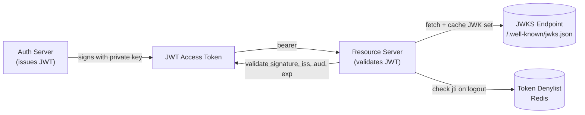

# JWT & Token Management

## Category

CIAM / IAM — Token Security, JWT, JWK, Token Rotation, Revocation, DPoP

## Context

**JSON Web Tokens (JWT)** are the dominant format for OAuth 2.0 access tokens and OIDC ID tokens. They are self-contained: the bearer presents a signed JWT and any service can validate it without a database lookup — but this creates unique security challenges around rotation, revocation, and algorithm confusion attacks.

### JWT Structure

```
header.payload.signature

Header:  {"alg": "RS256", "kid": "key-id-1", "typ": "JWT"}
Payload: {"sub": "user-123", "iss": "https://auth.example.com", "aud": "api.example.com", "exp": 1744000000, "iat": 1743996400, "roles": ["admin"]}
Signature: RSASSA-PKCS1-v1_5(base64url(header) + "." + base64url(payload), private_key)
```

### Critical Validation Checks

| Check | Why It Matters |
|-------|---------------|
| Verify `alg` against an explicit allow-list | Prevents alg:none and RS256→HS256 confusion attacks |
| Validate `iss` (issuer) | Tokens from other issuers must be rejected |
| Validate `aud` (audience) | Prevents token replay across services |
| Check `exp` (expiration) | Expired tokens must be rejected |
| Validate `nbf` (not before) | Prevents future-dated tokens |
| Verify signature with JWKS | Prevent forged tokens |
| Check `kid` (key ID) | Route to correct key for verification |

### Token Lifetime Guidelines

| Token Type | Recommended Lifetime | Notes |
|------------|---------------------|-------|
| Access token | 5–15 minutes | Short — minimises breach window |
| ID token | 1 hour | Used once for session establishment |
| Refresh token | 24 hours – 30 days | Long-lived; rotate on each use |
| M2M client credentials token | 1 hour | Cached, refreshed automatically |

---

## Pros

- Self-contained validation — resource servers verify tokens locally without network calls to the auth server.
- `kid` (key ID) in header enables zero-downtime key rotation — old tokens verify with old key.
- Short-lived access tokens limit the blast radius of a token leak.
- Claims carry authorisation data (roles, scopes, tenant ID) — reduces downstream DB lookups.
- JWKS endpoint is cacheable — validation is fast and doesn't add latency.

---

## Cons

- JWTs cannot be revoked before `exp` without a token denylist — stateless revocation requires opaque tokens or reference tokens.
- Large claims payloads inflate token size — cookies and headers have size limits.
- Algorithm confusion attacks (RS256/HS256, alg:none) require explicit allow-list enforcement.
- Embedding sensitive data in claims leaks information — JWTs are base64-encoded, not encrypted (use JWE or keep claims minimal).
- JWKS key rotation requires careful timing — newly rotated keys must be in JWKS before old access tokens expire.

---

## Design Diagram



---

## Code Sample

### TypeScript — robust JWT validation with `jose`

```typescript
import { createRemoteJWKSet, jwtVerify, type JWTPayload } from 'jose';
import { Redis } from 'ioredis';

const redis = new Redis(process.env.REDIS_URL!);

// JWKS is fetched lazily and cached internally by jose
const JWKS = createRemoteJWKSet(
  new URL(`${process.env.OIDC_ISSUER}/.well-known/jwks.json`),
  {
    cacheMaxAge: 10 * 60 * 1000,  // cache JWK set for 10 minutes
    cooldownDuration: 30 * 1000,  // wait 30s before re-fetching on miss
  }
);

export interface AuthClaims extends JWTPayload {
  sub: string;
  email?: string;
  roles?: string[];
  scope?: string;
  tenant_id?: string;
  jti?: string;  // JWT ID — used for denylist
}

export async function validateToken(rawToken: string): Promise<AuthClaims> {
  const { payload } = await jwtVerify(rawToken, JWKS, {
    issuer: process.env.OIDC_ISSUER!,
    audience: process.env.API_AUDIENCE!,
    algorithms: ['RS256'],   // ← CRITICAL: explicit allow-list prevents alg confusion
    clockTolerance: 30,      // seconds of clock skew tolerance
  });

  // Check denylist (for revoked tokens / logouts)
  if (payload.jti) {
    const denied = await redis.get(`token:denied:${payload.jti}`);
    if (denied) throw new Error('TOKEN_REVOKED');
  }

  return payload as AuthClaims;
}
```

### TypeScript — token denylist (logout / revocation)

```typescript
async function revokeToken(jti: string, exp: number): Promise<void> {
  const ttl = exp - Math.floor(Date.now() / 1000);
  if (ttl > 0) {
    // Store in Redis until the token would have naturally expired
    await redis.setex(`token:denied:${jti}`, ttl, '1');
  }
}

// Logout handler
router.post('/auth/logout', requireAuth, async (req, res) => {
  const { jti, exp } = req.user as AuthClaims;

  // Revoke current access token
  if (jti && exp) {
    await revokeToken(jti, exp);
  }

  // Revoke refresh token at IdP
  if (req.session.refreshToken) {
    await fetch(`${process.env.OIDC_ISSUER}/revoke`, {
      method: 'POST',
      headers: { 'Content-Type': 'application/x-www-form-urlencoded' },
      body: new URLSearchParams({
        token: req.session.refreshToken,
        token_type_hint: 'refresh_token',
        client_id: process.env.OIDC_CLIENT_ID!,
        client_secret: process.env.OIDC_CLIENT_SECRET!,
      }),
    });
  }

  req.session.destroy(() => res.json({ message: 'Logged out' }));
});
```

### TypeScript — DPoP (Demonstrating Proof of Possession)

DPoP binds access tokens to a key pair — stolen tokens cannot be used without the private key.

```typescript
import { generateKeyPair, exportJWK, SignJWT } from 'jose';

// Generate an ephemeral key pair per session (or per request)
const { privateKey, publicKey } = await generateKeyPair('ES256');
const publicJwk = await exportJWK(publicKey);

async function createDPoPProof(method: string, url: string, accessToken?: string): Promise<string> {
  const builder = new SignJWT({
    jti: crypto.randomUUID(),
    htm: method.toUpperCase(),
    htu: url,
    iat: Math.floor(Date.now() / 1000),
  }).setProtectedHeader({ alg: 'ES256', typ: 'dpop+jwt', jwk: publicJwk });

  // If we have an access token, bind it (ath claim = hash of access token)
  if (accessToken) {
    const ath = Buffer.from(
      await crypto.subtle.digest('SHA-256', new TextEncoder().encode(accessToken))
    ).toString('base64url');
    builder.setPayload({ ...builder['_payload'], ath });
  }

  return builder.sign(privateKey);
}

// Make a DPoP-bound request
async function dpopFetch(url: string, accessToken: string, options: RequestInit = {}) {
  const dpopProof = await createDPoPProof(options.method ?? 'GET', url, accessToken);

  return fetch(url, {
    ...options,
    headers: {
      ...options.headers,
      Authorization: `DPoP ${accessToken}`,
      DPoP: dpopProof,
    },
  });
}
```

### Key rotation — zero-downtime JWKS rotation

```typescript
// Strategy: publish new key in JWKS _before_ using it to sign tokens
// Keep old key in JWKS until all tokens signed with it have expired

interface JwkKey {
  kid: string;
  validFrom: Date;
  validUntil?: Date;
  key: CryptoKeyPair;
}

class JwksManager {
  private keys: JwkKey[] = [];

  async rotateKey(): Promise<void> {
    const newKey = await generateKeyPair('RS256', { extractable: true });
    const kid = `key-${Date.now()}`;

    // Mark old keys with expiry (allow existing tokens to expire naturally)
    const accessTokenMaxAge = 15 * 60; // 15 minutes
    for (const key of this.keys) {
      if (!key.validUntil) {
        key.validUntil = new Date(Date.now() + accessTokenMaxAge * 1000);
      }
    }

    this.keys.push({ kid, validFrom: new Date(), key: newKey });
    console.log(`Rotated to new signing key: ${kid}`);
  }

  currentSigningKey(): JwkKey {
    return this.keys.at(-1)!;
  }

  async getJwks(): Promise<{ keys: object[] }> {
    const now = new Date();
    const activeKeys = this.keys.filter(k => !k.validUntil || k.validUntil > now);
    const publicKeys = await Promise.all(
      activeKeys.map(async k => ({
        ...(await exportJWK(k.key.publicKey)),
        kid: k.kid,
        use: 'sig',
        alg: 'RS256',
      }))
    );
    return { keys: publicKeys };
  }
}
```

---

## Related

- [01 — OAuth 2.0 & OIDC](./01-oauth2-oidc.md) — JWT is the access token format in OAuth/OIDC
- [12 — Session Management](./12-session-management.md) — storing tokens server-side vs client-side
- [14 — API Security with OAuth](./14-api-security-oauth.md) — DPoP, mTLS, and token binding at the API layer
- [15 — Identity Threat Detection](./15-identity-threat-detection.md) — detecting stolen token use via anomaly detection
