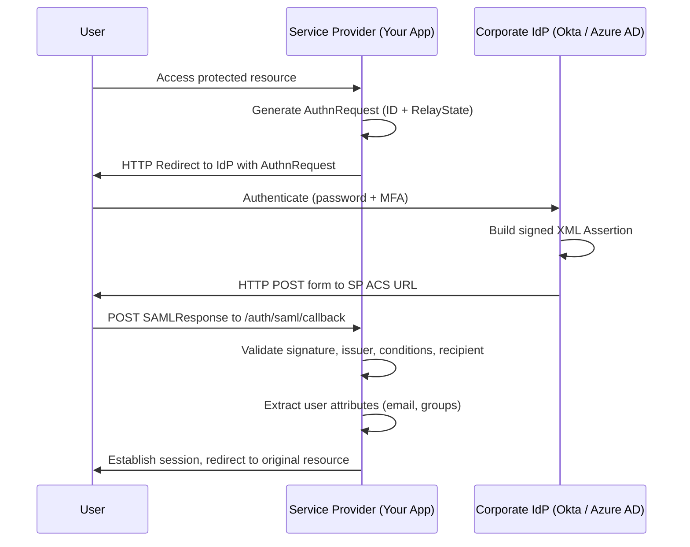

# SAML & Enterprise SSO

## Category

CIAM / IAM — Enterprise Federation, SAML 2.0, Single Sign-On, B2B Integration

## Context

**SAML 2.0** (Security Assertion Markup Language) is the dominant enterprise SSO standard, enabling employees to authenticate once against a corporate Identity Provider (IdP) and access many Service Providers (SPs) without re-entering credentials. Despite being older than OAuth/OIDC, SAML remains mandatory in enterprise B2B integrations and government systems.

### SAML vs OIDC

| Dimension | SAML 2.0 | OIDC / OAuth 2.0 |
|-----------|---------|-----------------|
| Token format | XML assertions | JSON JWTs |
| Primary use case | Enterprise SSO | Consumer apps, APIs, mobile |
| Transport | HTTP POST, Redirect bindings | HTTP redirects + JSON |
| Assertion size | Large (XML + signature) | Compact |
| SLO (Single Logout) | Supported natively | Non-standard, IdP-specific |
| Adoption | Legacy enterprise, HR, ERP | Modern apps, cloud-native |

### SAML Flow Types

| Flow | Initiated By | Steps |
|------|-------------|-------|
| **SP-Initiated** | User accesses SP first | SP → IdP redirect → user authenticates → IdP POST to SP ACS |
| **IdP-Initiated** | User starts at IdP portal | IdP → POST assertion directly to SP ACS |

**SP-Initiated is preferred** — it includes a `RelayState` and `AuthnRequest ID` that prevent IdP-initiated attacks.

### Key SAML Concepts

| Term | Description |
|------|-------------|
| **IdP** | Identity Provider — authenticates the user (Okta, Azure AD, ADFS) |
| **SP** | Service Provider — your application consuming the assertion |
| **Assertion** | XML document containing authenticated user attributes |
| **ACS URL** | Assertion Consumer Service URL — SP endpoint that receives the assertion |
| **Entity ID** | Unique identifier for IdP and SP in metadata |
| **Metadata** | XML document publishing SAML configuration and certificates |

---

## Pros

- Ubiquitous in enterprise — virtually all HR, ERP, and enterprise SaaS products support SAML.
- Single Logout (SLO) is standardised — sign out of one app, session terminated everywhere.
- Rich attribute statements — carry employee ID, department, groups, manager chain in the assertion.
- Certificate-based signature verification — assertion tampering is cryptographically detectable.
- No token storage needed on SP — assertions are consumed once and discarded.

---

## Cons

- XML parsing is complex and XML signature attacks (wrapping, canonicalisation) are subtle.
- SP-Initiated flow has a redirect overhead — not suitable for API or mobile clients.
- SAML metadata management (certificate rotation) is operationally burdensome.
- IdP-Initiated flow is inherently CSRF-susceptible without custom mitigations.
- Libraries vary in security maturity — always use well-maintained libs (passport-saml, node-saml).

---

## Design Diagram



---

## Code Sample

### TypeScript — SAML SP with `node-saml` (Express)

```typescript
import { SAML } from '@node-saml/node-saml';
import { Router } from 'express';

const router = Router();

const saml = new SAML({
  // SP configuration
  callbackUrl: process.env.SAML_ACS_URL!,             // e.g. https://app.example.com/auth/saml/callback
  issuer: process.env.SAML_SP_ENTITY_ID!,             // e.g. https://app.example.com

  // IdP configuration (from IdP metadata)
  entryPoint: process.env.SAML_IDP_SSO_URL!,          // IdP SSO URL
  idpCert: process.env.SAML_IDP_CERT!,                // IdP signing certificate (PEM, no headers)

  // SP private key for signed AuthnRequests (recommended)
  privateKey: process.env.SAML_SP_PRIVATE_KEY,
  signingCert: process.env.SAML_SP_CERT,

  wantAssertionsSigned: true,
  wantAuthnResponseSigned: true,
  signatureAlgorithm: 'sha256',

  // Attribute mapping from assertion
  attributeConsumingServiceIndex: '1',
});

// Step 1: Initiate SP-Initiated login
router.get('/auth/saml/login', async (req, res) => {
  const relayState = req.query.returnTo as string ?? '/dashboard';
  const { context: url } = await saml.getAuthorizeUrlAsync(relayState, req.headers.host, {});
  res.redirect(url);
});

// Step 2: Assertion Consumer Service — receive SAML response
router.post('/auth/saml/callback', async (req, res) => {
  try {
    const { profile, loggedOut } = await saml.validatePostResponseAsync(req.body);

    if (loggedOut || !profile) {
      return res.redirect('/login');
    }

    // profile contains validated user attributes
    const user = {
      nameId: profile.nameID,
      email: profile.email ?? profile['http://schemas.xmlsoap.org/ws/2005/05/identity/claims/emailaddress'],
      displayName: profile.displayName,
      groups: profile['http://schemas.microsoft.com/ws/2008/06/identity/claims/groups'] as string[] ?? [],
    };

    req.session.user = user;
    const returnTo = req.body.RelayState ?? '/dashboard';

    // Security: prevent open redirect — only allow relative paths
    const safePath = returnTo.startsWith('/') ? returnTo : '/dashboard';
    res.redirect(safePath);
  } catch (err) {
    console.error('SAML validation failed:', err);
    res.status(401).json({ error: 'SAML authentication failed' });
  }
});

// SP Metadata — share with IdP administrators
router.get('/auth/saml/metadata', async (req, res) => {
  const cert = process.env.SAML_SP_CERT!;
  const metadata = saml.generateServiceProviderMetadata(cert, cert);
  res.type('application/xml').send(metadata);
});

// Single Logout — initiate SLO
router.get('/auth/saml/logout', async (req, res) => {
  if (!req.session.user) return res.redirect('/');

  const { context: logoutUrl } = await saml.getLogoutUrlAsync(
    { nameID: req.session.user.nameId, nameIDFormat: 'urn:oasis:names:tc:SAML:1.1:nameid-format:emailAddress' },
    req.headers.host!,
    {}
  );

  req.session.destroy(() => res.redirect(logoutUrl));
});
```

### Keycloak — SAML SP configuration (realm import)

```json
{
  "protocol": "saml",
  "clientId": "https://app.example.com",
  "name": "My Enterprise App",
  "attributes": {
    "saml.authnstatement": "true",
    "saml.server.signature": "true",
    "saml.signature.algorithm": "RSA_SHA256",
    "saml.assertion.signature": "true",
    "saml.encrypt": "false",
    "saml_assertion_consumer_url_post": "https://app.example.com/auth/saml/callback",
    "saml_single_logout_service_url_post": "https://app.example.com/auth/saml/logout/callback"
  },
  "protocolMappers": [
    {
      "name": "email",
      "protocol": "saml",
      "protocolMapper": "saml-user-property-mapper",
      "config": {
        "user.attribute": "email",
        "attribute.name": "email",
        "attribute.nameformat": "Basic"
      }
    },
    {
      "name": "groups",
      "protocol": "saml",
      "protocolMapper": "saml-group-membership-mapper",
      "config": {
        "attribute.name": "groups",
        "full.path": "false"
      }
    }
  ]
}
```

### TypeScript — multi-tenant SAML (different IdP per customer)

```typescript
import { SAML } from '@node-saml/node-saml';

interface TenantSamlConfig {
  entryPoint: string;
  idpCert: string;
  entityId: string;
}

// Load per-tenant SAML config from DB
async function getTenantSamlConfig(tenantId: string): Promise<TenantSamlConfig | null> {
  return db.samlConfig.findUnique({ where: { tenantId } });
}

router.get('/auth/saml/:tenantId/login', async (req, res) => {
  const config = await getTenantSamlConfig(req.params.tenantId);
  if (!config) return res.status(404).json({ error: 'SAML not configured for this tenant' });

  const saml = new SAML({
    callbackUrl: `${process.env.BASE_URL}/auth/saml/${req.params.tenantId}/callback`,
    issuer: `${process.env.BASE_URL}/auth/saml/${req.params.tenantId}`,
    entryPoint: config.entryPoint,
    idpCert: config.idpCert,
    wantAssertionsSigned: true,
    signatureAlgorithm: 'sha256',
  });

  const { context: url } = await saml.getAuthorizeUrlAsync('/', req.headers.host!, {});
  res.redirect(url);
});
```

---

## Related

- [01 — OAuth 2.0 & OIDC](./01-oauth2-oidc.md) — OIDC is the modern alternative; many IdPs support both
- [10 — Identity Federation](./10-identity-federation.md) — SAML is the primary B2B federation protocol
- [13 — Identity Providers](./13-identity-providers.md) — Okta, Azure AD, ADFS as SAML IdPs
- [04 — SCIM User Provisioning](./04-scim-user-provisioning.md) — JIT provisioning via SAML attributes + SCIM for lifecycle
