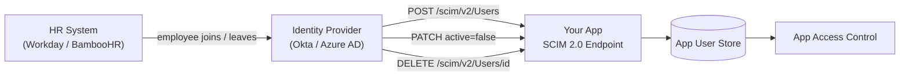

# SCIM — User Provisioning

## Category

CIAM / IAM — Identity Lifecycle, SCIM 2.0, User Provisioning, De-provisioning, HR Sync

## Context

**SCIM 2.0** (System for Cross-domain Identity Management) is a REST+JSON standard for automating user and group lifecycle management across systems. When an employee joins, their account is automatically created in all connected applications. When they leave (offboarding), their access is revoked everywhere — instantly and reliably.

Without SCIM, organisations rely on manual provisioning scripts or IT tickets, leading to orphaned accounts (a major security risk) and slow onboarding.

### SCIM Concepts

| Concept | Description |
|---------|-------------|
| **SCIM Provider** | The authoritative identity source (Okta, Azure AD, HR system) |
| **SCIM Consumer** | Your application that receives provisioning events |
| **User resource** | `/Users` — `userName`, `emails`, `name`, `active`, custom attributes |
| **Group resource** | `/Groups` — group name and `members` list |
| **Just-In-Time (JIT)** | Alternative: provision user on first SAML/OIDC login |
| **Soft delete** | Set `active: false` (disable) vs deleting the SCIM resource |

### SCIM vs JIT Provisioning

| Dimension | SCIM | Just-In-Time (JIT) |
|-----------|------|-------------------|
| Provisioning trigger | IdP push (proactive) | First login (reactive) |
| De-provisioning | Immediate via PATCH/DELETE | Requires separate revocation |
| User attributes | Full lifecycle management | Only at login time |
| Orphaned accounts | Prevented | Possible if offboarding not handled |
| Complexity | Higher (SCIM endpoint required) | Lower |

### SCIM Endpoints

| Method | Path | Action |
|--------|------|--------|
| `GET` | `/scim/v2/Users` | List/filter users |
| `GET` | `/scim/v2/Users/{id}` | Get user |
| `POST` | `/scim/v2/Users` | Create user |
| `PUT` | `/scim/v2/Users/{id}` | Replace user |
| `PATCH` | `/scim/v2/Users/{id}` | Partial update (activate/deactivate) |
| `DELETE` | `/scim/v2/Users/{id}` | Delete user |
| `GET/POST` | `/scim/v2/Groups` | Group management |

---

## Pros

- Instant de-provisioning — critical for offboarding security; eliminates orphaned accounts.
- Standardised across all major IdPs (Okta, Azure AD, OneLogin) — one implementation serves all.
- Group sync automates role assignment — salespeople get CRM access, devs get repo access automatically.
- Reduces IT ops overhead — no manual account creation tickets.
- SCIM `active: false` is a soft delete — preserves audit history while disabling access.

---

## Cons

- Implementing a SCIM endpoint requires handling idempotency, pagination, and filtering correctly.
- SCIM `externalId` / `id` mapping must be managed consistently — mismatches cause duplicate users.
- IdP-specific extensions vary — Okta and Azure AD send different attribute names.
- PATCH operations use a complex JSONPatch-like syntax (`Operations` array) that is easy to mis-implement.
- No standard for sync status — you can't tell from SCIM alone whether an IdP sync is healthy.

---

## Design Diagram



---

## Code Sample

### TypeScript — SCIM 2.0 endpoint (Express)

```typescript
import { Router, Request, Response } from 'express';

const router = Router();

// SCIM responses must use this content type
const SCIM_TYPE = 'application/scim+json';
const SCIM_SCHEMAS_USER = ['urn:ietf:params:scim:schemas:core:2.0:User'];

function scimUser(user: any) {
  return {
    schemas: SCIM_SCHEMAS_USER,
    id: user.id,
    externalId: user.externalId,
    userName: user.email,
    active: user.active,
    name: {
      givenName: user.firstName,
      familyName: user.lastName,
      formatted: `${user.firstName} ${user.lastName}`,
    },
    emails: [{ value: user.email, primary: true, type: 'work' }],
    groups: user.groups?.map((g: any) => ({ value: g.id, display: g.name })) ?? [],
    meta: {
      resourceType: 'User',
      location: `/scim/v2/Users/${user.id}`,
      created: user.createdAt,
      lastModified: user.updatedAt,
    },
  };
}

// GET /scim/v2/Users — list with filter support
router.get('/scim/v2/Users', async (req: Request, res: Response) => {
  const filter = req.query.filter as string | undefined;
  const startIndex = Number(req.query.startIndex ?? 1);
  const count = Math.min(Number(req.query.count ?? 100), 200);

  let where: any = {};

  // Parse basic SCIM filter: userName eq "user@example.com"
  if (filter) {
    const match = filter.match(/userName eq "([^"]+)"/i);
    if (match) where.email = match[1];
  }

  const [users, total] = await Promise.all([
    db.user.findMany({ where, skip: startIndex - 1, take: count }),
    db.user.count({ where }),
  ]);

  res.type(SCIM_TYPE).json({
    schemas: ['urn:ietf:params:scim:api:messages:2.0:ListResponse'],
    totalResults: total,
    startIndex,
    itemsPerPage: count,
    Resources: users.map(scimUser),
  });
});

// POST /scim/v2/Users — create user
router.post('/scim/v2/Users', async (req: Request, res: Response) => {
  const { userName, name, emails, externalId, active = true } = req.body;
  const email = emails?.[0]?.value ?? userName;

  // Idempotency — check if user already exists (externalId from IdP)
  const existing = await db.user.findFirst({ where: { OR: [{ email }, { externalId }] } });
  if (existing) {
    return res.status(409).type(SCIM_TYPE).json({
      schemas: ['urn:ietf:params:scim:api:messages:2.0:Error'],
      status: '409',
      detail: 'User already exists',
    });
  }

  const user = await db.user.create({
    data: {
      email,
      externalId,
      firstName: name?.givenName ?? '',
      lastName: name?.familyName ?? '',
      active,
    },
  });

  res.status(201).type(SCIM_TYPE).json(scimUser(user));
});

// PATCH /scim/v2/Users/:id — partial update (activate/deactivate, attribute changes)
router.patch('/scim/v2/Users/:id', async (req: Request, res: Response) => {
  const { Operations } = req.body;
  const updates: Record<string, any> = {};

  for (const op of Operations ?? []) {
    if (op.op.toLowerCase() === 'replace') {
      if (op.path === 'active')        updates.active = op.value;
      if (op.path === 'name.givenName') updates.firstName = op.value;
      if (op.path === 'name.familyName') updates.lastName = op.value;
      // Handle object-style patch (no path, value is an object)
      if (!op.path && typeof op.value === 'object') {
        if ('active' in op.value) updates.active = op.value.active;
      }
    }
  }

  const user = await db.user.update({
    where: { id: req.params.id },
    data: updates,
  });

  // Revoke active sessions if deactivated
  if (updates.active === false) {
    await redis.del(`sessions:${req.params.id}`);
  }

  res.type(SCIM_TYPE).json(scimUser(user));
});

// DELETE /scim/v2/Users/:id — hard delete (or use soft delete)
router.delete('/scim/v2/Users/:id', async (req: Request, res: Response) => {
  await db.user.update({
    where: { id: req.params.id },
    data: { active: false, deletedAt: new Date() },
  });
  res.status(204).send();
});
```

### TypeScript — authenticate SCIM requests (Bearer token)

```typescript
// SCIM endpoints must be authenticated — typically via a long-lived bearer token
// scoped to the provisioning integration only
function requireScimAuth(req: Request, res: Response, next: Function) {
  const authHeader = req.headers.authorization;
  const expectedToken = process.env.SCIM_BEARER_TOKEN!;

  if (!authHeader || authHeader !== `Bearer ${expectedToken}`) {
    return res.status(401).type(SCIM_TYPE).json({
      schemas: ['urn:ietf:params:scim:api:messages:2.0:Error'],
      status: '401',
      detail: 'Unauthorized',
    });
  }
  next();
}

router.use('/scim/v2', requireScimAuth);
```

### SCIM schema discovery endpoint

```typescript
router.get('/scim/v2/ServiceProviderConfig', (req, res) => {
  res.type(SCIM_TYPE).json({
    schemas: ['urn:ietf:params:scim:schemas:core:2.0:ServiceProviderConfig'],
    patch: { supported: true },
    bulk: { supported: false, maxOperations: 0, maxPayloadSize: 0 },
    filter: { supported: true, maxResults: 200 },
    changePassword: { supported: false },
    sort: { supported: false },
    etag: { supported: false },
    authenticationSchemes: [{
      name: 'OAuth Bearer Token',
      description: 'Authentication scheme using the OAuth Bearer Token Standard',
      specUri: 'http://www.rfc-editor.org/info/rfc6750',
      type: 'oauthbearertoken',
      primary: true,
    }],
  });
});
```

---

## Related

- [03 — SAML & Enterprise SSO](./03-saml-enterprise-sso.md) — JIT provisioning as a SCIM alternative for SAML-federated users
- [07 — RBAC](./07-rbac.md) — SCIM group sync drives role assignment
- [10 — Identity Federation](./10-identity-federation.md) — SCIM with B2B partners for cross-org provisioning
- [13 — Identity Providers](./13-identity-providers.md) — Okta and Azure AD as SCIM providers
