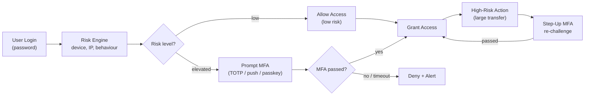

# MFA & Step-Up Authentication

## Category

CIAM / IAM — Authentication, Multi-Factor Authentication, Step-Up, Risk-Based Auth, TOTP, OTP

## Context

**Multi-Factor Authentication (MFA)** requires users to present two or more verification factors: something they know (password), something they have (TOTP app, hardware key), or something they are (biometric). **Step-Up Authentication** re-challenges with MFA only when a high-risk action is detected — balancing security with user experience.

### MFA Factor Types

| Factor | Type | Phishing Resistant | UX |
|--------|------|-------------------|-----|
| **TOTP (Authenticator app)** | Something you have | ❌ (OTP can be phished) | Good |
| **SMS / Email OTP** | Something you have | ❌ (SIM swap, interception) | Easy |
| **Push notification** | Something you have | ❌ (fatigue attacks possible) | Great |
| **Hardware key (FIDO2)** | Something you have | ✅ | Excellent |
| **Passkey** | Something you have + are | ✅ | Excellent |
| **Biometric (on-device)** | Something you are | ✅ | Excellent |

### Risk-Based / Adaptive MFA

Challenge only when risk signals are elevated — reduces friction for normal behaviour:

| Risk Signal | Action |
|-------------|--------|
| New device / browser | Require MFA |
| New country / IP geolocation | Require MFA |
| Impossible travel | Block + alert |
| Unusual hour | Require MFA |
| Sensitive action (transfer >$10k) | Step-up MFA |
| Familiar device + normal time | Allow with password only |

---

## Pros

- MFA reduces account takeover success by 99%+ even if passwords are compromised.
- Risk-based MFA preserves UX for 95% of normal logins while challenging anomalies.
- Step-up authentication scopes strong auth to sensitive operations — not every page load.
- TOTP is free, works offline, and requires no server-side storage beyond a secret per user.
- FIDO2/passkeys are fully phishing-resistant and require no OTP entry.

---

## Cons

- SMS OTP is weak — SIM swapping and SS7 attacks are real; only use when nothing better is available.
- TOTP enrollment UX adds friction — users need to install an authenticator app.
- Push notification MFA fatigue attacks: spam approvals until user accidentally accepts.
- Risk engine must be tuned per user population — too strict = support tickets, too loose = attacks.
- Step-up sessions must be time-limited and scoped — re-elevation required after timeout.

---

## Design Diagram



---

## Code Sample

### TypeScript — TOTP enrollment and verification

```typescript
import { authenticator } from 'otplib';
import QRCode from 'qrcode';
import { createCipheriv, createDecipheriv, randomBytes } from 'crypto';

// Encrypt TOTP secret at rest
function encryptSecret(secret: string): string {
  const key = Buffer.from(process.env.TOTP_ENCRYPTION_KEY!, 'hex'); // 32 bytes
  const iv = randomBytes(16);
  const cipher = createCipheriv('aes-256-cbc', key, iv);
  const encrypted = Buffer.concat([cipher.update(secret, 'utf8'), cipher.final()]);
  return `${iv.toString('hex')}:${encrypted.toString('hex')}`;
}

function decryptSecret(encrypted: string): string {
  const [ivHex, encHex] = encrypted.split(':');
  const key = Buffer.from(process.env.TOTP_ENCRYPTION_KEY!, 'hex');
  const decipher = createDecipheriv('aes-256-cbc', key, Buffer.from(ivHex, 'hex'));
  return Buffer.concat([decipher.update(Buffer.from(encHex, 'hex')), decipher.final()]).toString('utf8');
}

// Step 1: Generate secret and QR code
router.post('/mfa/totp/enroll', requireAuth, async (req, res) => {
  const secret = authenticator.generateSecret(20);
  const otpauth = authenticator.keyuri(req.user.email, 'MyApp', secret);
  const qrDataUrl = await QRCode.toDataURL(otpauth);

  // Store secret temporarily (not yet verified)
  await redis.setex(`totp:pending:${req.user.sub}`, 300, encryptSecret(secret));

  res.json({ qrCode: qrDataUrl, secret }); // Show secret as backup code
});

// Step 2: Verify enrollment OTP
router.post('/mfa/totp/verify-enrollment', requireAuth, async (req, res) => {
  const { otp } = req.body as { otp: string };
  const encryptedSecret = await redis.get(`totp:pending:${req.user.sub}`);

  if (!encryptedSecret) {
    return res.status(400).json({ error: 'No pending TOTP enrollment' });
  }

  const secret = decryptSecret(encryptedSecret);

  // Verify with window=1 (allow 30s clock drift)
  const valid = authenticator.verify({ token: otp, secret });
  if (!valid) {
    return res.status(400).json({ error: 'Invalid OTP' });
  }

  // Move to permanent storage
  await db.user.update({
    where: { id: req.user.sub },
    data: { totpSecret: encryptSecret(secret), mfaEnabled: true },
  });
  await redis.del(`totp:pending:${req.user.sub}`);

  res.json({ message: 'MFA enabled successfully' });
});

// Step 3: Verify OTP during login
async function verifyTotp(userId: string, otp: string): Promise<boolean> {
  const user = await db.user.findUnique({ where: { id: userId } });
  if (!user?.totpSecret) return false;

  const secret = decryptSecret(user.totpSecret);
  return authenticator.verify({ token: otp, secret });
}
```

### TypeScript — Email OTP (magic code)

```typescript
import crypto from 'crypto';

async function sendEmailOtp(userId: string, email: string): Promise<void> {
  // Generate 6-digit OTP
  const otp = String(crypto.randomInt(100000, 999999));
  const ttl = 600; // 10 minutes

  // Store hashed OTP — never store plaintext
  const hash = crypto.createHash('sha256').update(otp).digest('hex');
  await redis.setex(`otp:${userId}`, ttl, hash);

  await emailService.send({
    to: email,
    subject: 'Your verification code',
    text: `Your code is ${otp}. It expires in 10 minutes.`,
  });
}

async function verifyEmailOtp(userId: string, otp: string): Promise<boolean> {
  const storedHash = await redis.get(`otp:${userId}`);
  if (!storedHash) return false;

  const hash = crypto.createHash('sha256').update(otp).digest('hex');

  // Constant-time comparison to prevent timing attacks
  const match = crypto.timingSafeEqual(
    Buffer.from(hash, 'hex'),
    Buffer.from(storedHash, 'hex')
  );

  if (match) {
    await redis.del(`otp:${userId}`); // Single-use
  }

  return match;
}
```

### TypeScript — Step-up authentication middleware

```typescript
interface StepUpClaim {
  elevated: boolean;
  elevatedAt: number;
  elevationTtl: number;
}

// Check if user has current step-up auth for a sensitive operation
function requireStepUp(ttlSeconds = 300) {
  return async (req: any, res: any, next: any) => {
    const stepUp = req.session.stepUp as StepUpClaim | undefined;
    const now = Math.floor(Date.now() / 1000);

    if (stepUp?.elevated && now - stepUp.elevatedAt < ttlSeconds) {
      return next(); // Still within step-up window
    }

    // Store where the user was trying to go
    req.session.stepUpReturnTo = req.originalUrl;
    res.status(403).json({
      error: 'STEP_UP_REQUIRED',
      message: 'This action requires re-authentication',
      redirectTo: '/auth/step-up',
    });
  };
}

// Step-up challenge endpoint
router.post('/auth/step-up/verify', requireAuth, async (req, res) => {
  const { otp, method } = req.body;

  let verified = false;
  if (method === 'totp') {
    verified = await verifyTotp(req.user.sub, otp);
  } else if (method === 'email') {
    verified = await verifyEmailOtp(req.user.sub, otp);
  }

  if (!verified) {
    return res.status(401).json({ error: 'Invalid OTP' });
  }

  req.session.stepUp = {
    elevated: true,
    elevatedAt: Math.floor(Date.now() / 1000),
    elevationTtl: 300, // 5 minutes
  };

  const returnTo = req.session.stepUpReturnTo ?? '/dashboard';
  delete req.session.stepUpReturnTo;
  res.json({ message: 'Step-up successful', redirectTo: returnTo });
});

// Use on sensitive routes
router.post(
  '/payments/transfer',
  requireAuth,
  requireStepUp(300),  // 5-minute step-up window
  transferHandler
);
```

### TypeScript — risk-based MFA decision

```typescript
interface RiskContext {
  userId: string;
  ip: string;
  userAgent: string;
  country?: string;
}

async function computeRiskScore(ctx: RiskContext): Promise<'low' | 'medium' | 'high'> {
  const [knownDevice, lastKnownCountry, recentFailures] = await Promise.all([
    redis.get(`device:${ctx.userId}:${hashDevice(ctx.userAgent)}`),
    redis.get(`last_country:${ctx.userId}`),
    redis.get(`failed_logins:${ctx.ip}`),
  ]);

  let score = 0;
  if (!knownDevice) score += 30;
  if (lastKnownCountry && ctx.country && lastKnownCountry !== ctx.country) score += 40;
  if (Number(recentFailures ?? 0) > 3) score += 30;

  if (score >= 60) return 'high';
  if (score >= 30) return 'medium';
  return 'low';
}

function hashDevice(userAgent: string): string {
  return crypto.createHash('sha256').update(userAgent).digest('hex').slice(0, 16);
}
```

---

## Related

- [01 — OAuth 2.0 & OIDC](./01-oauth2-oidc.md) — MFA is typically triggered in the OIDC auth flow
- [06 — Passkeys & WebAuthn](./06-passkeys-webauthn.md) — phishing-resistant alternative to TOTP
- [09 — Customer Identity (CIAM)](./09-ciam-customer-identity.md) — progressive MFA enrollment in CIAM flows
- [15 — Identity Threat Detection](./15-identity-threat-detection.md) — risk signals that drive adaptive MFA decisions
