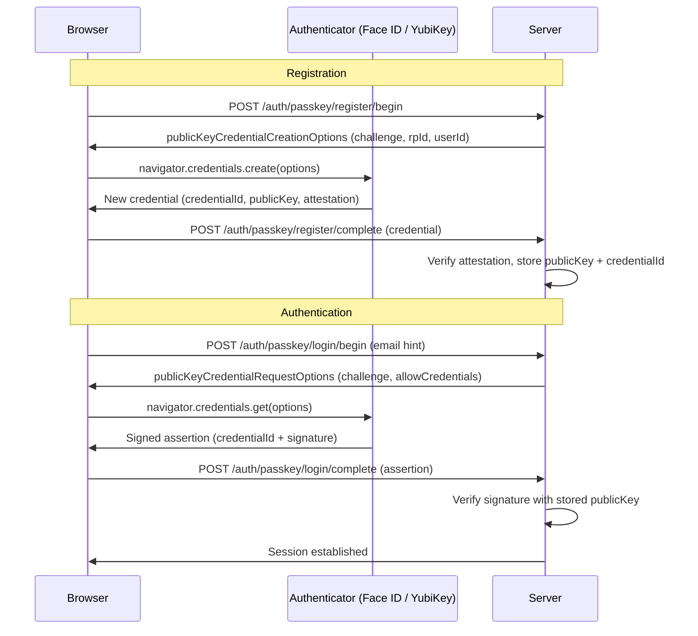

# Passkeys & WebAuthn

## Category

CIAM / IAM — Passwordless Authentication, FIDO2, WebAuthn, Passkeys, Biometrics

## Context

**WebAuthn** (Web Authentication API) is a W3C standard enabling strong, phishing-resistant authentication using public key cryptography. **Passkeys** are the consumer-friendly implementation of WebAuthn — credentials synced across devices via the platform (iCloud Keychain, Google Password Manager) or stored in a hardware security key (YubiKey).

Unlike passwords or TOTP codes, passkeys are **bound to the origin** — a fake phishing site cannot intercept them because the cryptographic challenge is scoped to `rpId` (relying party ID / domain).

### Key Concepts

| Term | Description |
|------|-------------|
| **Relying Party (RP)** | Your application (server + browser origin) |
| **Authenticator** | Device storing the private key (platform: Face ID, Touch ID; roaming: YubiKey) |
| **Credential ID** | Unique identifier for a passkey, returned by the authenticator |
| **rpId** | Domain that owns the passkey (e.g., `example.com`) — phishing prevention |
| **Challenge** | Random server-generated nonce signed by the authenticator |
| **User Verification (UV)** | Biometric / PIN confirmation by the user |
| **Attestation** | Authenticator proof of device type (optional, for high-assurance scenarios) |

### Platform vs Roaming Authenticators

| Type | Examples | Sync | Portability |
|------|---------|------|------------|
| **Platform** | Face ID, Touch ID, Windows Hello, Android | ✅ Cloud sync (iCloud/Google) | Per-platform |
| **Roaming** | YubiKey 5, Feitian | ❌ Hardware-bound | Any device via USB/NFC |

---

## Pros

- Fully phishing-resistant — the rpId binding means credentials cannot be stolen via fake sites.
- Passwordless UX — users authenticate with Face ID or Touch ID in 1–2 seconds.
- No shared secrets — private key never leaves the authenticator; server stores only a public key.
- Platform passkeys sync across devices (iCloud Keychain) — users don't lose access when changing phones.
- Eliminates password reset flows — the #1 support ticket category.

---

## Cons

- Cross-platform UX is still imperfect (2025) — Android passkeys on a Mac requires QR code scan.
- Users must have a device that supports WebAuthn — older devices / browsers require fallback.
- Account recovery is complex — if a user loses all devices, key recovery requires alternative verification.
- Enterprise environments may restrict platform authenticator sync via MDM policies.
- Attestation verification adds complexity and isn't always available on consumer devices.

---

## Design Diagram



---

## Code Sample

### TypeScript — WebAuthn registration and authentication with `@simplewebauthn/server`

```typescript
import {
  generateRegistrationOptions,
  verifyRegistrationResponse,
  generateAuthenticationOptions,
  verifyAuthenticationResponse,
} from '@simplewebauthn/server';
import { Router } from 'express';

const router = Router();

const RP_ID = process.env.RP_ID!;        // e.g. "example.com"
const RP_NAME = process.env.RP_NAME!;    // e.g. "My App"
const ORIGIN = process.env.ORIGIN!;       // e.g. "https://example.com"

// ── Registration ──────────────────────────────────────────────────────────

router.post('/auth/passkey/register/begin', requireAuth, async (req, res) => {
  const user = await db.user.findUniqueOrThrow({ where: { id: req.user.sub } });

  // Fetch existing credentials to exclude (prevent duplicate registrations)
  const existingCredentials = await db.passkey.findMany({
    where: { userId: user.id },
    select: { credentialId: true, transports: true },
  });

  const options = await generateRegistrationOptions({
    rpName: RP_NAME,
    rpID: RP_ID,
    userName: user.email,
    userDisplayName: user.name ?? user.email,
    userID: Buffer.from(user.id),
    // Exclude already-registered credentials to avoid duplicates
    excludeCredentials: existingCredentials.map(c => ({
      id: c.credentialId,
      transports: c.transports as any[],
    })),
    authenticatorSelection: {
      residentKey: 'preferred',          // synced passkey
      userVerification: 'preferred',     // require biometric/PIN
    },
    attestationType: 'none',             // 'direct' for high-assurance enterprise
  });

  // Store challenge for verification
  await redis.setex(`webauthn:reg:${user.id}`, 300, JSON.stringify(options.challenge));

  res.json(options);
});

router.post('/auth/passkey/register/complete', requireAuth, async (req, res) => {
  const user = await db.user.findUniqueOrThrow({ where: { id: req.user.sub } });
  const expectedChallenge = await redis.get(`webauthn:reg:${user.id}`);

  if (!expectedChallenge) {
    return res.status(400).json({ error: 'Registration session expired' });
  }

  const verification = await verifyRegistrationResponse({
    response: req.body,
    expectedChallenge: JSON.parse(expectedChallenge),
    expectedOrigin: ORIGIN,
    expectedRPID: RP_ID,
    requireUserVerification: true,
  });

  if (!verification.verified || !verification.registrationInfo) {
    return res.status(400).json({ error: 'Registration verification failed' });
  }

  const { credential } = verification.registrationInfo;

  await db.passkey.create({
    data: {
      userId: user.id,
      credentialId: credential.id,
      publicKey: Buffer.from(credential.publicKey),
      counter: credential.counter,
      deviceType: verification.registrationInfo.credentialDeviceType,
      backedUp: verification.registrationInfo.credentialBackedUp,
      transports: req.body.response.transports ?? [],
    },
  });

  await redis.del(`webauthn:reg:${user.id}`);
  res.json({ message: 'Passkey registered successfully' });
});

// ── Authentication ─────────────────────────────────────────────────────────

router.post('/auth/passkey/login/begin', async (req, res) => {
  const { email } = req.body;

  // Support discoverable credentials (no email needed if passkey is resident)
  let allowCredentials: any[] = [];
  if (email) {
    const user = await db.user.findUnique({ where: { email } });
    if (user) {
      const passkeys = await db.passkey.findMany({ where: { userId: user.id } });
      allowCredentials = passkeys.map(p => ({
        id: p.credentialId,
        transports: p.transports,
      }));
    }
  }

  const sessionId = crypto.randomUUID();

  const options = await generateAuthenticationOptions({
    rpID: RP_ID,
    allowCredentials,
    userVerification: 'preferred',
  });

  await redis.setex(`webauthn:auth:${sessionId}`, 300, JSON.stringify(options.challenge));
  res.json({ ...options, sessionId });
});

router.post('/auth/passkey/login/complete', async (req, res) => {
  const { sessionId, ...assertion } = req.body;
  const expectedChallenge = await redis.get(`webauthn:auth:${sessionId}`);

  if (!expectedChallenge) {
    return res.status(400).json({ error: 'Authentication session expired' });
  }

  // Look up credential
  const passkey = await db.passkey.findUnique({
    where: { credentialId: assertion.id },
    include: { user: true },
  });

  if (!passkey) {
    return res.status(401).json({ error: 'Unknown credential' });
  }

  const verification = await verifyAuthenticationResponse({
    response: assertion,
    expectedChallenge: JSON.parse(expectedChallenge),
    expectedOrigin: ORIGIN,
    expectedRPID: RP_ID,
    credential: {
      id: passkey.credentialId,
      publicKey: new Uint8Array(passkey.publicKey),
      counter: passkey.counter,
      transports: passkey.transports as any[],
    },
    requireUserVerification: true,
  });

  if (!verification.verified) {
    return res.status(401).json({ error: 'Authentication failed' });
  }

  // Update signature counter (prevents cloned authenticator attacks)
  await db.passkey.update({
    where: { id: passkey.id },
    data: { counter: verification.authenticationInfo.newCounter },
  });

  await redis.del(`webauthn:auth:${sessionId}`);

  req.session.user = { sub: passkey.user.id, email: passkey.user.email };
  res.json({ message: 'Authenticated', user: { id: passkey.user.id } });
});
```

### Browser — WebAuthn client (vanilla JS)

```javascript
// Registration
async function registerPasskey() {
  const beginRes = await fetch('/auth/passkey/register/begin', { method: 'POST' });
  const options = await beginRes.json();

  // Convert base64url strings to ArrayBuffer
  options.user.id = base64urlToBuffer(options.user.id);
  options.challenge = base64urlToBuffer(options.challenge);
  options.excludeCredentials?.forEach(c => c.id = base64urlToBuffer(c.id));

  const credential = await navigator.credentials.create({ publicKey: options });

  const response = {
    id: credential.id,
    rawId: bufferToBase64url(credential.rawId),
    type: credential.type,
    response: {
      clientDataJSON: bufferToBase64url(credential.response.clientDataJSON),
      attestationObject: bufferToBase64url(credential.response.attestationObject),
      transports: credential.response.getTransports?.() ?? [],
    },
  };

  await fetch('/auth/passkey/register/complete', {
    method: 'POST',
    headers: { 'Content-Type': 'application/json' },
    body: JSON.stringify(response),
  });
}

// Authentication
async function loginWithPasskey(email) {
  const beginRes = await fetch('/auth/passkey/login/begin', {
    method: 'POST', headers: { 'Content-Type': 'application/json' },
    body: JSON.stringify({ email }),
  });
  const { sessionId, ...options } = await beginRes.json();

  options.challenge = base64urlToBuffer(options.challenge);
  options.allowCredentials?.forEach(c => c.id = base64urlToBuffer(c.id));

  const assertion = await navigator.credentials.get({ publicKey: options });

  await fetch('/auth/passkey/login/complete', {
    method: 'POST', headers: { 'Content-Type': 'application/json' },
    body: JSON.stringify({
      sessionId,
      id: assertion.id,
      rawId: bufferToBase64url(assertion.rawId),
      type: assertion.type,
      response: {
        clientDataJSON: bufferToBase64url(assertion.response.clientDataJSON),
        authenticatorData: bufferToBase64url(assertion.response.authenticatorData),
        signature: bufferToBase64url(assertion.response.signature),
        userHandle: assertion.response.userHandle ? bufferToBase64url(assertion.response.userHandle) : null,
      },
    }),
  });
}

function base64urlToBuffer(base64url) {
  return Uint8Array.from(atob(base64url.replace(/-/g, '+').replace(/_/g, '/')), c => c.charCodeAt(0));
}
function bufferToBase64url(buffer) {
  return btoa(String.fromCharCode(...new Uint8Array(buffer))).replace(/\+/g, '-').replace(/\//g, '_').replace(/=/g, '');
}
```

---

## Related

- [05 — MFA & Step-Up Auth](./05-mfa-step-up-auth.md) — passkeys are the strongest MFA factor; can replace TOTP
- [01 — OAuth 2.0 & OIDC](./01-oauth2-oidc.md) — WebAuthn integrated into OIDC login flows via IdP
- [09 — Customer Identity (CIAM)](./09-ciam-customer-identity.md) — passkey enrollment as part of progressive authentication
- [13 — Identity Providers](./13-identity-providers.md) — Keycloak, Auth0, Okta support WebAuthn natively
