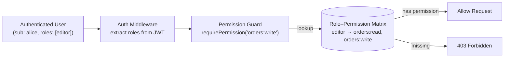

# Role-Based Access Control (RBAC)

## Category

CIAM / IAM — Authorisation, RBAC, Permissions, Role Hierarchy, Policy Enforcement

## Context

**RBAC** assigns permissions to roles, then assigns roles to users. It is the most widely implemented authorisation model — straightforward to reason about, easy to audit, and sufficient for most application permission requirements.

### RBAC Variants

| Variant | Description | Example |
|---------|-------------|---------|
| **Flat RBAC** | Users → Roles → Permissions | `admin`, `editor`, `viewer` |
| **Hierarchical RBAC** | Roles inherit from parent roles | `admin` inherits all `editor` permissions |
| **Constrained RBAC** | Separation of Duty (SoD) constraints | A user cannot hold both `payment_creator` and `payment_approver` |
| **RBAC with tenancy** | Per-tenant role assignment | User is `admin` in TenantA, `viewer` in TenantB |

### Permission Model

```
User ──── UserRole ──── Role ──── RolePermission ──── Permission
Alice      admin        admin       *                 orders:read
Bob        editor       editor      orders:read       orders:write
                                    orders:write      users:read
```

### JWT Claims vs Database Check

| Approach | Use When |
|----------|---------|
| **Roles in JWT** (`roles: ["admin"]`) | Roles change infrequently; short token TTL acceptable |
| **DB check per request** | Roles change frequently; immediate revocation needed |
| **Hybrid** | Roles in JWT + revocation check for sensitive ops | Best practice |

---

## Pros

- Simple mental model — developers and auditors instantly understand role assignments.
- Works natively with SCIM and SAML group sync — IdP groups map to application roles.
- Roles in JWT access tokens enable stateless enforcement at any service.
- Easy compliance reporting — "who has admin access?" is a simple DB query.
- Hierarchical RBAC reduces permission maintenance — add to parent role, all children inherit.

---

## Cons

- Permission explosion: many distinct roles with slight variations grow unmanageable.
- Insufficient for row-level access control ("user can only see their own orders") — ABAC or ReBAC needed.
- JWT role claims are stale if roles change between token issuance and expiry.
- Separation of Duty (SoD) constraints require careful enforcement logic not built into basic RBAC.
- Context-insensitive: cannot express "allow this action only during business hours" — use ABAC for that.

---

## Design Diagram



---

## Code Sample

### TypeScript — role and permission model (Prisma schema)

```prisma
model User {
  id          String       @id @default(uuid())
  email       String       @unique
  userRoles   UserRole[]
}

model Role {
  id              String           @id @default(uuid())
  name            String           @unique  // "admin", "editor", "viewer"
  parentRoleId    String?
  parentRole      Role?            @relation("RoleHierarchy", fields: [parentRoleId], references: [id])
  childRoles      Role[]           @relation("RoleHierarchy")
  rolePermissions RolePermission[]
  userRoles       UserRole[]
}

model Permission {
  id              String           @id @default(uuid())
  name            String           @unique  // "orders:read", "orders:write", "users:admin"
  rolePermissions RolePermission[]
}

model RolePermission {
  roleId       String
  permissionId String
  role         Role       @relation(fields: [roleId], references: [id])
  permission   Permission @relation(fields: [permissionId], references: [id])
  @@id([roleId, permissionId])
}

model UserRole {
  userId   String
  roleId   String
  tenantId String?                  // null = global; set for multi-tenant
  user     User   @relation(fields: [userId], references: [id])
  role     Role   @relation(fields: [roleId], references: [id])
  @@id([userId, roleId, tenantId])
}
```

### TypeScript — permission resolution with role hierarchy

```typescript
// Cache resolved permissions per user (short TTL)
async function getUserPermissions(userId: string, tenantId?: string): Promise<Set<string>> {
  const cacheKey = `perms:${userId}:${tenantId ?? 'global'}`;
  const cached = await redis.get(cacheKey);
  if (cached) return new Set(JSON.parse(cached));

  // Get user's direct roles
  const userRoles = await db.userRole.findMany({
    where: { userId, OR: [{ tenantId }, { tenantId: null }] },
    include: { role: { include: { rolePermissions: { include: { permission: true } } } } },
  });

  const permissions = new Set<string>();
  const rolesToResolve = userRoles.map(ur => ur.role);

  // Walk role hierarchy
  while (rolesToResolve.length > 0) {
    const role = rolesToResolve.pop()!;
    for (const rp of role.rolePermissions) {
      permissions.add(rp.permission.name);
    }
    if (role.parentRoleId) {
      const parent = await db.role.findUnique({
        where: { id: role.parentRoleId },
        include: { rolePermissions: { include: { permission: true } } },
      });
      if (parent) rolesToResolve.push(parent);
    }
  }

  // Cache for 60 seconds
  await redis.setex(cacheKey, 60, JSON.stringify([...permissions]));
  return permissions;
}

async function hasPermission(userId: string, permission: string, tenantId?: string): Promise<boolean> {
  const perms = await getUserPermissions(userId, tenantId);
  return perms.has(permission) || perms.has('*'); // '*' = superadmin
}
```

### TypeScript — Express middleware

```typescript
function requirePermission(permission: string) {
  return async (req: any, res: any, next: any) => {
    const tenantId = req.headers['x-tenant-id'] as string | undefined;

    // Fast path: check roles in JWT first (avoid DB on every request)
    const roles = req.user?.roles as string[] ?? [];
    if (roles.includes('admin') || roles.includes('superadmin')) {
      return next();
    }

    const allowed = await hasPermission(req.user.sub, permission, tenantId);
    if (!allowed) {
      return res.status(403).json({
        error: 'FORBIDDEN',
        message: `Permission required: ${permission}`,
      });
    }
    next();
  };
}

// Usage
router.get('/orders', requireAuth, requirePermission('orders:read'), listOrdersHandler);
router.post('/orders', requireAuth, requirePermission('orders:write'), createOrderHandler);
router.delete('/users/:id', requireAuth, requirePermission('users:admin'), deleteUserHandler);
```

### TypeScript — Separation of Duty constraint

```typescript
const SOD_CONFLICTS: [string, string][] = [
  ['payment_creator', 'payment_approver'],
  ['order_creator', 'order_approver'],
];

async function assignRole(userId: string, roleId: string, tenantId?: string): Promise<void> {
  const role = await db.role.findUniqueOrThrow({ where: { id: roleId } });

  // Check SoD: user must not have conflicting role
  const existingRoles = await db.userRole.findMany({
    where: { userId, tenantId: tenantId ?? null },
    include: { role: true },
  });
  const existingRoleNames = existingRoles.map(ur => ur.role.name);

  for (const [roleA, roleB] of SOD_CONFLICTS) {
    if (role.name === roleA && existingRoleNames.includes(roleB)) {
      throw new Error(`SoD violation: cannot assign ${roleA} — user already has ${roleB}`);
    }
    if (role.name === roleB && existingRoleNames.includes(roleA)) {
      throw new Error(`SoD violation: cannot assign ${roleB} — user already has ${roleA}`);
    }
  }

  await db.userRole.create({ data: { userId, roleId, tenantId } });
}
```

---

## Related

- [08 — ABAC & Policy Engines](./08-abac-policy-engines.md) — extend RBAC with attribute-based context and OPA
- [11 — Fine-Grained Authorisation (ReBAC)](./11-fine-grained-authorization.md) — row-level access control beyond what RBAC can express
- [04 — SCIM User Provisioning](./04-scim-user-provisioning.md) — IdP group sync drives role assignment
- [02 — JWT & Token Management](./02-jwt-token-management.md) — roles embedded in JWT claims for stateless enforcement
