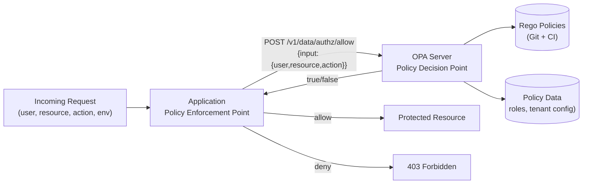

# Attribute-Based Access Control (ABAC) & Policy Engines

## Category

CIAM / IAM — Authorisation, ABAC, OPA, Cedar, Policy-as-Code, Fine-Grained Access Control

## Context

**ABAC** grants or denies access based on attributes of the **subject** (user), **resource**, **action**, and **environment** (time, IP, risk level). This enables rich, context-sensitive policies that RBAC alone cannot express:

- "Doctors can read patient records *only* for patients in their department"
- "Transfers over $10,000 require approval *unless* the user is a treasurer"
- "This API is accessible from internal IPs *only* between 08:00 and 18:00"

### Policy Engines

| Engine | Language | Ecosystem | Best For |
|--------|---------|----------|---------|
| **OPA** (Open Policy Agent) | Rego | CNCF, Kubernetes, API gateways | General-purpose, microservices |
| **Cedar** | Cedar lang | AWS (Verified Permissions) | AWS-native, formal verification |
| **Casbin** | PERM model | Multi-language libraries | Embedded, lightweight |
| **Topaz** | Rego + ReBAC | Aserto | Combined ABAC + ReBAC |

### ABAC Policy Structure

```
ALLOW if:
  subject.role == "doctor"
  AND resource.type == "patient_record"
  AND resource.department == subject.department
  AND action == "read"
  AND environment.time BETWEEN 07:00 AND 20:00
```

---

## Pros

- Expresses policies that RBAC cannot — resource attributes, environmental conditions, multi-dimensional constraints.
- Policy-as-code: stored in version control, reviewed in PRs, tested like code.
- OPA decouples policy from application logic — change rules without redeploying services.
- OPA can enforce policies across microservices, API gateways, and Kubernetes via one configuration pane.
- Cedar provides formal verification guarantees — policies can be mathematically proven correct.

---

## Cons

- Rego syntax has a steep learning curve — developers must learn a new query language.
- Policy evaluation adds latency (typically 1–5 ms with OPA sidecar; negligible with in-process bundles).
- Complex policies are hard to debug — OPA's `opa eval` and `explain` flags help but require practice.
- Policy explosion: without good organisation, hundreds of policies become unmaintainable.
- Attribute availability: policies can only use attributes that are passed in the input document — data fetching must be planned.

---

## Design Diagram



---

## Code Sample

### OPA Rego policy — multi-attribute authorisation

```rego
# policies/authz.rego
package authz

import future.keywords.if
import future.keywords.in

# Default deny
default allow := false

# Allow if all conditions pass
allow if {
    valid_user
    valid_action
    resource_accessible
    within_business_hours
}

valid_user if {
    # User must be active
    input.user.active == true
    # User must have at least one relevant role
    count([r | r := input.user.roles[_]; r in allowed_roles_for_action]) > 0
}

allowed_roles_for_action := {"admin", "editor"}  if input.action in {"create", "update", "delete"}
allowed_roles_for_action := {"admin", "editor", "viewer"} if input.action == "read"

valid_action if {
    input.action in {"read", "create", "update", "delete"}
}

resource_accessible if {
    # Admin can access everything
    "admin" in input.user.roles
}

resource_accessible if {
    # Non-admin: user's tenant must match resource's tenant
    input.resource.tenantId == input.user.tenantId
}

within_business_hours if {
    # Skip time restriction for admins
    "admin" in input.user.roles
}

within_business_hours if {
    # Parse hour from ISO timestamp
    hour := time.clock([time.parse_rfc3339_ns(input.environment.currentTime), "UTC"])[0]
    hour >= 7
    hour < 20
}

# Sensitive actions require MFA
allow_sensitive if {
    allow
    input.user.mfaVerified == true
    input.action in {"delete", "export"}
}
```

```bash
# Test policy locally
opa eval \
  --input '{"user":{"roles":["editor"],"tenantId":"t1","active":true,"mfaVerified":false},"resource":{"tenantId":"t1"},"action":"read","environment":{"currentTime":"2026-04-12T10:00:00Z"}}' \
  --data policies/ \
  'data.authz.allow'
```

### TypeScript — call OPA from Express middleware

```typescript
import fetch from 'node-fetch';

interface OpaInput {
  user: {
    sub: string;
    roles: string[];
    tenantId: string;
    active: boolean;
    mfaVerified: boolean;
  };
  resource: {
    type: string;
    id?: string;
    tenantId?: string;
    [key: string]: unknown;
  };
  action: string;
  environment: {
    currentTime: string;
    ipAddress: string;
  };
}

async function isAllowed(input: OpaInput): Promise<boolean> {
  const response = await fetch(`${process.env.OPA_URL}/v1/data/authz/allow`, {
    method: 'POST',
    headers: { 'Content-Type': 'application/json' },
    body: JSON.stringify({ input }),
  });

  const { result } = await response.json() as { result: boolean };
  return result;
}

function requirePolicy(resourceType: string, action: string) {
  return async (req: any, res: any, next: any) => {
    const allowed = await isAllowed({
      user: {
        sub: req.user.sub,
        roles: req.user.roles ?? [],
        tenantId: req.user.tenant_id ?? '',
        active: true,
        mfaVerified: req.session.stepUp?.elevated ?? false,
      },
      resource: {
        type: resourceType,
        id: req.params.id,
        tenantId: req.headers['x-tenant-id'] as string,
      },
      action,
      environment: {
        currentTime: new Date().toISOString(),
        ipAddress: req.ip,
      },
    });

    if (!allowed) {
      return res.status(403).json({ error: 'Access denied by policy' });
    }
    next();
  };
}

// Route-level enforcement
router.get('/orders', requireAuth, requirePolicy('order', 'read'), listOrders);
router.delete('/orders/:id', requireAuth, requirePolicy('order', 'delete'), deleteOrder);
```

### OPA — unit testing policies

```rego
# policies/authz_test.rego
package authz_test

import data.authz

test_admin_can_delete if {
    authz.allow with input as {
        "user": {"roles": ["admin"], "tenantId": "t1", "active": true, "mfaVerified": true},
        "resource": {"tenantId": "t1"},
        "action": "delete",
        "environment": {"currentTime": "2026-04-12T10:00:00Z"},
    }
}

test_viewer_cannot_delete if {
    not authz.allow with input as {
        "user": {"roles": ["viewer"], "tenantId": "t1", "active": true, "mfaVerified": false},
        "resource": {"tenantId": "t1"},
        "action": "delete",
        "environment": {"currentTime": "2026-04-12T10:00:00Z"},
    }
}

test_cross_tenant_denied if {
    not authz.allow with input as {
        "user": {"roles": ["editor"], "tenantId": "t1", "active": true, "mfaVerified": false},
        "resource": {"tenantId": "t2"},
        "action": "read",
        "environment": {"currentTime": "2026-04-12T10:00:00Z"},
    }
}
```

```bash
# Run tests
opa test policies/
```

### AWS Cedar — typed policy for Verified Permissions

```cedar
// Cedar policy — type-checked at compile time
permit (
    principal is User,
    action in [Action::"ReadOrder", Action::"ListOrders"],
    resource is Order
)
when {
    principal.department == resource.department &&
    principal.isActive &&
    context.hour >= 7 && context.hour < 20
};

forbid (
    principal is User,
    action == Action::"DeleteOrder",
    resource is Order
)
unless {
    principal.roles.contains("admin")
};
```

---

## Related

- [07 — RBAC](./07-rbac.md) — RBAC covers most cases; add ABAC when resource/context attributes are needed
- [11 — Fine-Grained Authorisation (ReBAC)](./11-fine-grained-authorization.md) — relationship-based; complementary to ABAC
- [05 — MFA & Step-Up Auth](./05-mfa-step-up-auth.md) — `mfaVerified` attribute feeds into ABAC policy
- [14 — API Security with OAuth](./14-api-security-oauth.md) — OPA at API gateway layer for centralised enforcement
