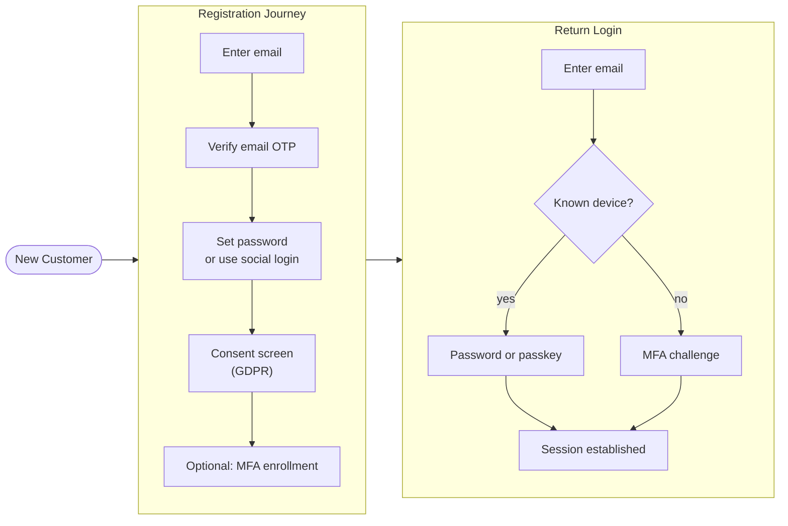

# Customer Identity (CIAM)

## Category

CIAM / IAM — Customer Identity, Social Login, Progressive Profiling, Consent, Self-Service

## Context

**CIAM** handles identity for external customers — not employees. The priorities shift: UX and conversion rate matter as much as security. Customers should be able to sign up, log in, and recover accounts with minimal friction, while the platform maintains compliance (GDPR, CCPA) and fraud prevention.

### CIAM vs Workforce IAM

| Dimension | CIAM | Workforce IAM |
|-----------|------|--------------|
| Users | Millions of consumers | Thousands of employees |
| Registration | Self-service, social login | Admin-provisioned |
| Password policy | Gentle guidance | Enforced complexity |
| MFA | Risk-based, optional then progressive | Mandatory |
| Session length | Days–weeks | 8-hour work day |
| Compliance | GDPR, CCPA consent management | SOX, HIPAA |
| Branding | Customer-facing UI | Internal tooling |
| Scale | High concurrency | Moderate |

### CIAM Journey Patterns

| Pattern | Description |
|---------|-------------|
| **Registration** | Sign up via email/password, social, or passwordless |
| **Social login** | OAuth with Google, Apple, Facebook, Microsoft |
| **Progressive profiling** | Collect only required data upfront; ask for more over time |
| **Email verification** | Verify email ownership before granting full access |
| **Account linking** | Link multiple social + email identities to one user |
| **Consent management** | GDPR-compliant collection and storage of marketing/data consent |
| **Self-service** | Password reset, profile update, MFA enrollment, account deletion |

---

## Pros

- Social login reduces registration friction dramatically — one click vs 10-field form.
- Progressive profiling improves conversion — collect only email at signup, gather rest when needed.
- Consent management built in — audit trails of what was consented and when.
- Self-service reduces support tickets for password resets and profile changes.
- Dedicated CIAM platforms (Auth0, Cognito) handle scale, compliance, and attack detection out of the box.

---

## Cons

- Social login requires careful account-linking logic — same email across Google and Facebook must map to one user.
- Email enumeration attack: "email already registered" error reveals user existence — use generic messaging.
- Consent data must be stored and retrievable for GDPR subject access requests.
- Self-service password reset via email is only as secure as the user's email account.
- CIAM at scale (millions of users) requires careful capacity planning for token endpoints and sessions.

---

## Design Diagram



---

## Code Sample

### TypeScript — self-service registration with email verification

```typescript
import { Router } from 'express';
import bcrypt from 'bcrypt';
import crypto from 'crypto';

const router = Router();

// POST /auth/register
router.post('/auth/register', async (req, res) => {
  const { email, password } = req.body;

  // Normalise email — prevent duplicate @example.com vs @EXAMPLE.COM
  const normEmail = email.toLowerCase().trim();

  // Generic error — never reveal whether email is already registered
  const existing = await db.user.findUnique({ where: { email: normEmail } });
  if (existing) {
    // Send verification email anyway so legitimate users can see they already have an account
    // This avoids email enumeration while providing a helpful UX
    return res.json({ message: 'If this email is new, a verification link has been sent.' });
  }

  // Password strength validation (server-side)
  if (password.length < 12) {
    return res.status(400).json({ error: 'Password must be at least 12 characters' });
  }

  const hash = await bcrypt.hash(password, 12);
  const verificationToken = crypto.randomBytes(32).toString('hex');

  const user = await db.user.create({
    data: {
      email: normEmail,
      passwordHash: hash,
      emailVerified: false,
      emailVerificationToken: verificationToken,
      consentGivenAt: null,
    },
  });

  await emailService.send({
    to: normEmail,
    subject: 'Verify your email',
    html: `<a href="${process.env.BASE_URL}/auth/verify-email?token=${verificationToken}">Verify email</a>`,
  });

  res.json({ message: 'If this email is new, a verification link has been sent.' });
});

// GET /auth/verify-email
router.get('/auth/verify-email', async (req, res) => {
  const { token } = req.query as { token: string };

  const user = await db.user.findFirst({ where: { emailVerificationToken: token } });
  if (!user) {
    return res.status(400).json({ error: 'Invalid or expired verification link' });
  }

  await db.user.update({
    where: { id: user.id },
    data: { emailVerified: true, emailVerificationToken: null },
  });

  res.redirect('/auth/welcome'); // Show consent/profile completion
});
```

### TypeScript — social login with Google (OIDC)

```typescript
import { createRemoteJWKSet, jwtVerify } from 'jose';

const GOOGLE_JWKS = createRemoteJWKSet(
  new URL('https://www.googleapis.com/oauth2/v3/certs')
);

// POST /auth/social/google — receive id_token from Google One Tap or OAuth
router.post('/auth/social/google', async (req, res) => {
  const { idToken } = req.body;

  // Verify the Google ID token
  const { payload } = await jwtVerify(idToken, GOOGLE_JWKS, {
    issuer: ['https://accounts.google.com', 'accounts.google.com'],
    audience: process.env.GOOGLE_CLIENT_ID,
    algorithms: ['RS256'],
  });

  const googleSub = payload.sub as string;
  const email = payload.email as string;
  const name = payload.name as string;
  const picture = payload.picture as string;

  // Account linking: find by social provider OR email
  let user = await db.user.findFirst({
    where: {
      OR: [
        { socialAccounts: { some: { provider: 'google', providerSub: googleSub } } },
        { email: email.toLowerCase() },
      ],
    },
    include: { socialAccounts: true },
  });

  if (!user) {
    // New user — auto-register
    user = await db.user.create({
      data: {
        email: email.toLowerCase(),
        emailVerified: true, // Google already verified the email
        name,
        avatarUrl: picture,
        socialAccounts: {
          create: { provider: 'google', providerSub: googleSub },
        },
      },
      include: { socialAccounts: true },
    });
  } else if (!user.socialAccounts.find(s => s.provider === 'google')) {
    // Link Google to existing email-password account
    await db.socialAccount.create({
      data: { userId: user.id, provider: 'google', providerSub: googleSub },
    });
  }

  req.session.user = { sub: user.id, email: user.email };
  res.json({ message: 'Authenticated', userId: user.id });
});
```

### TypeScript — GDPR consent collection

```typescript
interface ConsentRecord {
  userId: string;
  type: 'marketing' | 'analytics' | 'thirdParty';
  granted: boolean;
  ipAddress: string;
  userAgent: string;
  timestamp: Date;
  version: string; // consent text version
}

router.post('/auth/consent', requireAuth, async (req, res) => {
  const { consents } = req.body as { consents: Array<{ type: string; granted: boolean }> };

  // Store immutable consent audit log — never overwrite, append only
  await db.consentRecord.createMany({
    data: consents.map(c => ({
      userId: req.user.sub,
      type: c.type,
      granted: c.granted,
      ipAddress: req.ip,
      userAgent: req.headers['user-agent'] ?? '',
      timestamp: new Date(),
      version: process.env.CONSENT_VERSION ?? '1.0',
    })),
  });

  // Update current consent summary for query efficiency
  await db.user.update({
    where: { id: req.user.sub },
    data: {
      consentGivenAt: new Date(),
      marketingConsent: consents.find(c => c.type === 'marketing')?.granted ?? false,
    },
  });

  res.json({ message: 'Consent recorded' });
});

// GDPR: return all consent history for a user
router.get('/account/consent-history', requireAuth, async (req, res) => {
  const history = await db.consentRecord.findMany({
    where: { userId: req.user.sub },
    orderBy: { timestamp: 'desc' },
  });
  res.json(history);
});
```

### TypeScript — progressive profiling (collect data on second interaction)

```typescript
// Track profile completeness and prompt for missing data contextually
function profileCompletenessMiddleware(req: any, res: any, next: any) {
  const user = req.user;
  const missingFields = [];

  if (!user.phoneNumber) missingFields.push('phone');
  if (!user.dateOfBirth) missingFields.push('dateOfBirth');
  if (!user.address) missingFields.push('address');

  // Attach to response headers — frontend can show profile completion prompt
  if (missingFields.length > 0) {
    res.setHeader('X-Profile-Completion', missingFields.join(','));
  }
  next();
}
```

---

## Related

- [01 — OAuth 2.0 & OIDC](./01-oauth2-oidc.md) — social login flows use OIDC Authorization Code + PKCE
- [05 — MFA & Step-Up Auth](./05-mfa-step-up-auth.md) — progressive MFA enrollment post-registration
- [06 — Passkeys & WebAuthn](./06-passkeys-webauthn.md) — passkey as the premium passwordless CIAM option
- [12 — Session Management](./12-session-management.md) — CIAM sessions are long-lived; refresh and revocation patterns
