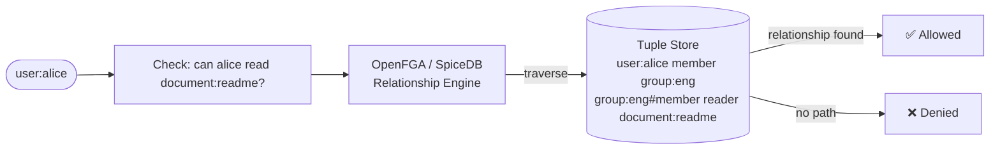

# Fine-Grained Authorisation (ReBAC)

## Category

CIAM / IAM — Authorisation, ReBAC, Zanzibar, OpenFGA, SpiceDB, Relationship-Based Access Control

## Context

**ReBAC** (Relationship-Based Access Control) bases authorisation decisions on **relationships between subjects and resources**, not just roles. It is Google's Zanzibar model — the system that powers Google Drive's sharing: "Alice can edit Document X because Alice is a member of Team Y which has editor access to Document X."

ReBAC models are required when you need:
- **Row-level security** at scale: "user can only see their own orders"
- **Hierarchical resource sharing**: folder permissions propagate to files within it
- **Delegated sharing**: "user A granted user B access to their document"
- **Multi-tenant fine-grained**: each tenant configures their own permission rules

### Zanzibar Tuple Model

```
user:{userId} reader  document:{docId}
user:{userId} member  group:{groupId}
group:{groupId}#member editor  document:{docId}
```

A **check** resolves: "can `user:alice` perform `read` on `document:readme`?" by following the relationship graph.

### ReBAC Implementations

| System | Language | Deployment | Notes |
|--------|---------|-----------|-------|
| **OpenFGA** | Go | Self-hosted / Auth0 cloud | CNCF, Okta-backed, well-documented |
| **SpiceDB** | Go | Self-hosted | Authzed.com, strong Zanzibar fidelity |
| **AWS Verified Permissions** | Managed | AWS | Cedar policy language, managed |
| **Permify** | Go | Self-hosted | Postgres-native schema |
| **Oso Cloud** | Managed | Cloud | Polar language |

---

## Pros

- Expresses "user can see resource X because of relationship chain Y" — impossible in flat RBAC.
- Users can delegate their own permissions (share a document with another user) without admin involvement.
- Hierarchical propagation: grant access to a folder → automatically applies to all contained files.
- Consistent low-latency checks — OpenFGA/SpiceDB resolve even complex relationship chains in <10 ms.
- Schema (type system) prevents invalid relationship tuples from being stored.

---

## Cons

- Relationship tuple store grows with every sharing action — requires a purpose-built database.
- Schema design is the hardest part — incorrect type system design causes correctness issues that are hard to fix post-launch.
- Eventual consistency: some implementations have short propagation delays after tuple writes.
- Application code must write tuples when resources are created/shared/deleted — tight coupling.
- Reasoning about permission checks across complex relationship chains requires careful testing.

---

## Design Diagram



---

## Code Sample

### OpenFGA — schema definition (DSL)

```
# authorization_model.fga
model
  schema 1.1

type user

type group
  relations
    define member: [user, group#member]

type folder
  relations
    define owner: [user]
    define editor: [user, group#member] or owner
    define viewer: [user, group#member] or editor

type document
  relations
    define parent: [folder]
    define owner: [user]
    define editor: [user, group#member] or owner or viewer from parent
    define viewer: [user, group#member] or editor or viewer from parent
```

### TypeScript — OpenFGA client: write tuples and check permissions

```typescript
import { OpenFgaClient } from '@openfga/sdk';

const fga = new OpenFgaClient({
  apiUrl: process.env.FGA_API_URL!,           // e.g. http://localhost:8080
  storeId: process.env.FGA_STORE_ID!,
  authorizationModelId: process.env.FGA_MODEL_ID!,
});

// Write relationship tuples when resources are created/shared
async function onDocumentCreated(docId: string, ownerId: string): Promise<void> {
  await fga.write({
    writes: {
      tuple_keys: [
        { user: `user:${ownerId}`, relation: 'owner', object: `document:${docId}` },
      ],
    },
  });
}

async function onDocumentShared(
  docId: string,
  sharedWithUserId: string,
  permission: 'viewer' | 'editor'
): Promise<void> {
  await fga.write({
    writes: {
      tuple_keys: [
        { user: `user:${sharedWithUserId}`, relation: permission, object: `document:${docId}` },
      ],
    },
  });
}

async function onDocumentUnshared(docId: string, userId: string): Promise<void> {
  await fga.write({
    deletes: {
      tuple_keys: [
        { user: `user:${userId}`, relation: 'viewer', object: `document:${docId}` },
        { user: `user:${userId}`, relation: 'editor', object: `document:${docId}` },
      ],
    },
  });
}

// Add user to a group (group membership is a tuple)
async function addUserToGroup(userId: string, groupId: string): Promise<void> {
  await fga.write({
    writes: {
      tuple_keys: [
        { user: `user:${userId}`, relation: 'member', object: `group:${groupId}` },
      ],
    },
  });
}

// Check: can this user perform this action on this resource?
async function canUserAccess(
  userId: string,
  relation: string,
  resourceType: string,
  resourceId: string
): Promise<boolean> {
  const { allowed } = await fga.check({
    user: `user:${userId}`,
    relation,
    object: `${resourceType}:${resourceId}`,
  });
  return allowed ?? false;
}

// Express middleware
function requireFgaPermission(resourceType: string, relation: string, idParam = 'id') {
  return async (req: any, res: any, next: any) => {
    const resourceId = req.params[idParam];
    const allowed = await canUserAccess(req.user.sub, relation, resourceType, resourceId);

    if (!allowed) {
      return res.status(403).json({ error: `No ${relation} access to ${resourceType}:${resourceId}` });
    }
    next();
  };
}

// Route protection
router.get('/documents/:id',
  requireAuth,
  requireFgaPermission('document', 'viewer'),
  getDocumentHandler
);

router.put('/documents/:id',
  requireAuth,
  requireFgaPermission('document', 'editor'),
  updateDocumentHandler
);
```

### TypeScript — batch permission check (list objects)

```typescript
// What documents can this user view? (for listing endpoints)
async function listAccessibleDocuments(userId: string): Promise<string[]> {
  const response = await fga.listObjects({
    user: `user:${userId}`,
    relation: 'viewer',
    type: 'document',
  });

  // Returns: {objects: ["document:doc1", "document:doc2", ...]}
  return response.objects.map(o => o.replace('document:', ''));
}

// Check multiple permissions at once (batched)
async function checkMultiple(userId: string, checks: Array<{ object: string; relation: string }>) {
  const results = await fga.batchCheck(
    checks.map(c => ({
      user: `user:${userId}`,
      relation: c.relation,
      object: c.object,
    }))
  );
  return results;
}
```

### TypeScript — sync RBAC roles to FGA tuples

```typescript
// When a user is assigned the "admin" role in a tenant, write tuples for all tenant resources
async function onRoleAssigned(userId: string, roleId: string, tenantId: string): Promise<void> {
  const role = await db.role.findUniqueOrThrow({ where: { id: roleId } });

  if (role.name === 'admin') {
    // Admin gets access to the entire tenant — folder contains all documents
    await fga.write({
      writes: {
        tuple_keys: [
          { user: `user:${userId}`, relation: 'editor', object: `folder:tenant-${tenantId}` },
        ],
      },
    });
  }
}
```

---

## Related

- [07 — RBAC](./07-rbac.md) — start with RBAC; add ReBAC when resource-level sharing is needed
- [08 — ABAC & Policy Engines](./08-abac-policy-engines.md) — ABAC for attribute/context rules; ReBAC for relationship rules
- [09 — Customer Identity (CIAM)](./09-ciam-customer-identity.md) — user-driven sharing in CIAM apps maps directly to tuple writes
- [04 — SCIM User Provisioning](./04-scim-user-provisioning.md) — SCIM group membership changes must trigger FGA tuple updates
