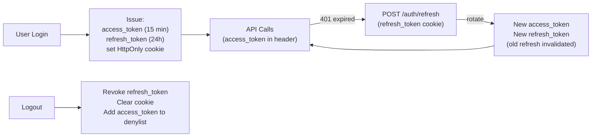

# Session Management

## Category

CIAM / IAM — Sessions, Token Storage, Refresh, Revocation, Concurrent Sessions, Cookie Security

## Context

**Session management** covers how authenticated state is maintained between the login event and eventual logout. Modern applications have two primary session models: **server-side sessions** (session ID in cookie → server looks up session data) and **client-side tokens** (JWT access + refresh token stored client-side). Each has distinct security trade-offs.

### Session Storage Comparison

| Approach | Storage | Revocation | Scale |
|----------|---------|-----------|-------|
| **Server-side session** | Redis / DB | Immediate — delete the record | Requires shared store |
| **JWT access token** | Memory / cookie | Not until expiry (denylist needed) | Stateless — scales easily |
| **Refresh token rotation** | HttpOnly cookie | Delete refresh token in DB | Best of both |
| **Browser session** | sessionStorage | Tab-scoped, no cross-tab | Simplest, most limited |

### Token Storage Security

| Location | XSS Risk | CSRF Risk | Notes |
|----------|---------|----------|-------|
| `localStorage` | High | Low | Never store tokens in localStorage |
| `sessionStorage` | High | Low | Still vulnerable to XSS, erased on tab close |
| `HttpOnly cookie` | ❌ Not accessible | Medium (mitigate with SameSite) | Best for access tokens |
| `SameSite=Strict cookie` | ❌ Not accessible | ❌ Not sent cross-site | Secure but breaks some OAuth redirects |
| `SameSite=Lax cookie` | ❌ Not accessible | Low | Good default |
| In-memory (React state) | Low | Low | Lost on refresh; requires silent re-auth |

**Recommendation**: Store access tokens in memory; store refresh tokens in `HttpOnly; SameSite=Lax` cookies. Never `localStorage`.

---

## Pros

- `HttpOnly` cookies prevent XSS from stealing tokens — JavaScript cannot read them.
- Refresh token rotation gives near-stateless scalability while enabling session revocation.
- Server-side sessions allow immediate revocation — critical for admin-forced logout and account compromise.
- Sliding sessions improve UX — active users stay logged in without re-authentication.
- Concurrent session limits prevent credential sharing.

---

## Cons

- Server-side sessions require a shared store (Redis) — horizontal scaling complexity.
- Cookie-based sessions are CSRF-vulnerable without CSRF tokens or `SameSite` policy.
- Refresh token rotation means a stolen refresh token invalidates the legitimate user's session.
- Silent re-authentication (iframe or background call) adds complexity to SPAs.
- Session fixation attacks require generating a new session ID on login.

---

## Design Diagram



---

## Code Sample

### TypeScript — secure session + refresh token rotation

```typescript
import { Router, Request, Response } from 'express';
import crypto from 'crypto';

const router = Router();

const ACCESS_TOKEN_TTL = 900;     // 15 minutes
const REFRESH_TOKEN_TTL = 86400;  // 24 hours

function setRefreshCookie(res: Response, token: string): void {
  res.cookie('refresh_token', token, {
    httpOnly: true,                       // inaccessible to JS
    secure: process.env.NODE_ENV === 'production',  // HTTPS only in prod
    sameSite: 'lax',                      // sent on top-level navigations
    maxAge: REFRESH_TOKEN_TTL * 1000,
    path: '/auth/refresh',                // scope cookie to refresh endpoint only
  });
}

router.post('/auth/login', async (req, res) => {
  // ... validate credentials (not shown)
  const userId = 'user-123';

  const accessToken = await issueAccessToken(userId, ACCESS_TOKEN_TTL);
  const refreshToken = crypto.randomBytes(40).toString('hex');

  // Store refresh token hash in DB
  await db.refreshToken.create({
    data: {
      tokenHash: crypto.createHash('sha256').update(refreshToken).digest('hex'),
      userId,
      expiresAt: new Date(Date.now() + REFRESH_TOKEN_TTL * 1000),
      family: crypto.randomUUID(), // rotation family — detect token reuse
    },
  });

  setRefreshCookie(res, refreshToken);

  // Access token returned in response body — app stores in memory
  res.json({ accessToken, expiresIn: ACCESS_TOKEN_TTL });
});

// Token refresh with rotation
router.post('/auth/refresh', async (req, res) => {
  const rawRefreshToken = req.cookies.refresh_token;
  if (!rawRefreshToken) {
    return res.status(401).json({ error: 'No refresh token' });
  }

  const tokenHash = crypto.createHash('sha256').update(rawRefreshToken).digest('hex');

  const stored = await db.refreshToken.findUnique({ where: { tokenHash } });

  if (!stored) {
    // Token not found — possible replay attack: invalidate the entire family
    const hash = crypto.createHash('sha256').update(rawRefreshToken).digest('hex');
    const anyFamily = await db.refreshToken.findFirst({
      where: { tokenHash: hash },
    });
    if (anyFamily) {
      await db.refreshToken.deleteMany({ where: { family: anyFamily.family } });
    }
    res.clearCookie('refresh_token');
    return res.status(401).json({ error: 'Refresh token reuse detected' });
  }

  if (stored.expiresAt < new Date()) {
    await db.refreshToken.delete({ where: { tokenHash } });
    res.clearCookie('refresh_token');
    return res.status(401).json({ error: 'Refresh token expired' });
  }

  // Rotate: invalidate old, issue new
  const newRefreshToken = crypto.randomBytes(40).toString('hex');

  await db.$transaction([
    db.refreshToken.delete({ where: { tokenHash } }),
    db.refreshToken.create({
      data: {
        tokenHash: crypto.createHash('sha256').update(newRefreshToken).digest('hex'),
        userId: stored.userId,
        expiresAt: new Date(Date.now() + REFRESH_TOKEN_TTL * 1000),
        family: stored.family,  // same family for reuse detection
      },
    }),
  ]);

  const newAccessToken = await issueAccessToken(stored.userId, ACCESS_TOKEN_TTL);
  setRefreshCookie(res, newRefreshToken);

  res.json({ accessToken: newAccessToken, expiresIn: ACCESS_TOKEN_TTL });
});

// Logout — revoke all sessions for user
router.post('/auth/logout', async (req, res) => {
  const rawToken = req.cookies.refresh_token;

  if (rawToken) {
    const tokenHash = crypto.createHash('sha256').update(rawToken).digest('hex');
    const stored = await db.refreshToken.findUnique({ where: { tokenHash } });

    if (stored) {
      // Revoke all sessions for this user, or just this one
      const revokeAll = req.query.all === 'true';
      if (revokeAll) {
        await db.refreshToken.deleteMany({ where: { userId: stored.userId } });
      } else {
        await db.refreshToken.delete({ where: { tokenHash } });
      }
    }
  }

  res.clearCookie('refresh_token', { path: '/auth/refresh' });
  res.json({ message: 'Logged out' });
});
```

### TypeScript — concurrent session limit

```typescript
const MAX_SESSIONS = 5;

async function enforceSessionLimit(userId: string): Promise<void> {
  const sessions = await db.refreshToken.findMany({
    where: { userId },
    orderBy: { createdAt: 'asc' },
  });

  if (sessions.length >= MAX_SESSIONS) {
    // Evict oldest sessions
    const toDelete = sessions.slice(0, sessions.length - MAX_SESSIONS + 1);
    await db.refreshToken.deleteMany({
      where: { tokenHash: { in: toDelete.map(s => s.tokenHash) } },
    });
  }
}
```

### TypeScript — SPA silent refresh (access token in memory)

```typescript
// spa/auth.ts
class AuthService {
  private accessToken: string | null = null;
  private refreshTimer: ReturnType<typeof setTimeout> | null = null;

  async getAccessToken(): Promise<string | null> {
    if (this.accessToken && !this.isExpired(this.accessToken)) {
      return this.accessToken;
    }
    return this.refresh();
  }

  async refresh(): Promise<string | null> {
    try {
      const res = await fetch('/auth/refresh', {
        method: 'POST',
        credentials: 'include', // send HttpOnly refresh cookie
      });

      if (!res.ok) {
        this.accessToken = null;
        this.scheduleRedirectToLogin();
        return null;
      }

      const { accessToken, expiresIn } = await res.json();
      this.accessToken = accessToken;

      // Schedule next refresh 1 minute before expiry
      this.scheduleRefresh(expiresIn - 60);
      return accessToken;
    } catch {
      return null;
    }
  }

  private scheduleRefresh(inSeconds: number): void {
    if (this.refreshTimer) clearTimeout(this.refreshTimer);
    this.refreshTimer = setTimeout(() => this.refresh(), inSeconds * 1000);
  }

  private isExpired(token: string): boolean {
    const payload = JSON.parse(atob(token.split('.')[1]));
    return payload.exp < Math.floor(Date.now() / 1000) + 30; // 30s buffer
  }

  private scheduleRedirectToLogin(): void {
    window.location.href = '/login?reason=session_expired';
  }
}

export const auth = new AuthService();
```

---

## Related

- [01 — OAuth 2.0 & OIDC](./01-oauth2-oidc.md) — access and refresh tokens issued during OAuth flows
- [02 — JWT & Token Management](./02-jwt-token-management.md) — JWT validation and denylist for access token revocation
- [09 — Customer Identity (CIAM)](./09-ciam-customer-identity.md) — CIAM sessions are long-lived; sliding expiry patterns
- [15 — Identity Threat Detection](./15-identity-threat-detection.md) — session anomaly detection (impossible travel, device change)
